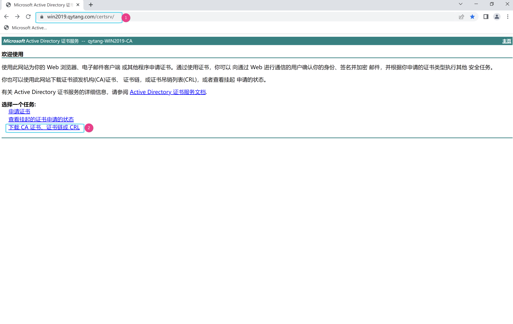
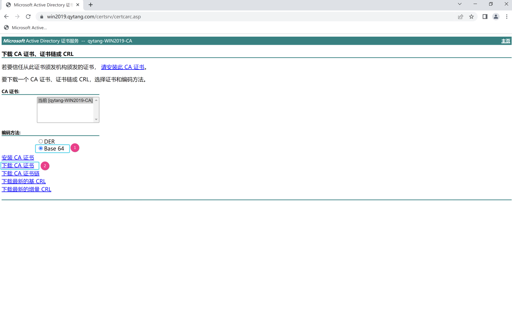
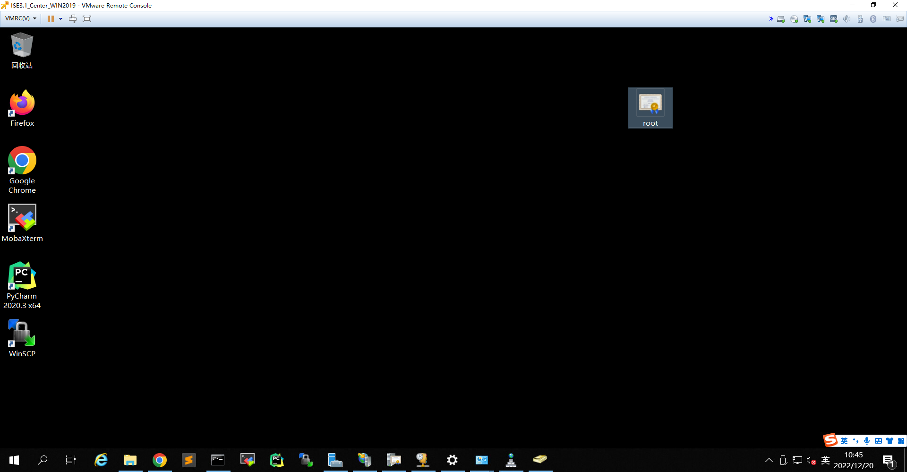

# 下载根证书

---------------------------------------------------------------------------------------------------

> ## 登陆WIN2019 --- 打开chrome浏览器 --- 输入 https://win2019.qytang.com/certsrv
>> ### username: administrator
>> ### password: Cisc0123

>  ### 选择一个任务 --- 下载CA证书，证书链或CRL --- 编码方式 --- Base64 --- 下载CA证书
>  ### 下载文件夹 --- certnew.cer --- 右键 --- 重命名 --- root --- 剪切 --- 放在桌面

---
## 下载根证书

## base64编码下载根证书

## 根证书放到桌面

