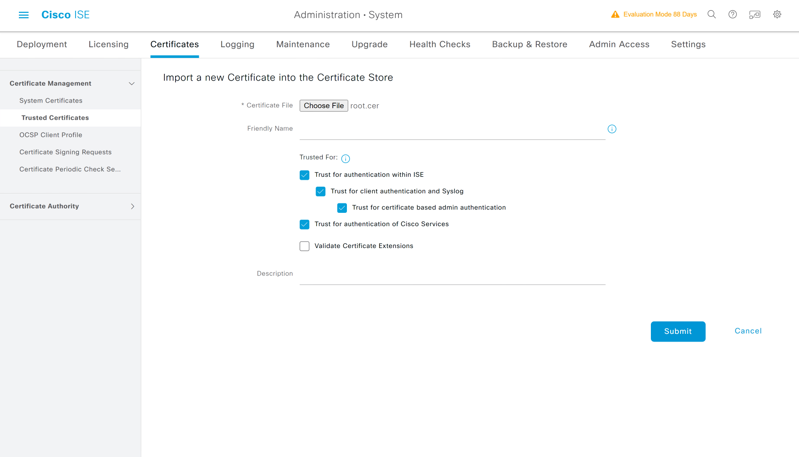

# ISE加载根证书

## PAN-P加载根证书

---

> ### 登陆WIN2019 --- 打开chrome浏览器 --- 输入 https://pan-p.qytang.com
>>> ### username: admin
>>> ### password: Cisc0123
>> ### login

> ###  [三] --- Administration --- System --- Certificates
>> ### Certificate Management --- Trusted Certificates --- Import --- * Certificate File [Choose File] --- root.cer [桌面root证书]
>> ### Trusted For:
>>> ### [勾选] Trust for authentication within ISE
>>> ### [勾选] Trust for client authentication and Syslog
>>> ### [勾选] Trust for certificate based admin authentication
>>> ### [勾选] Trust for authentication of Cisco Services
>>> ### [    ] Validate Certificate Extensions
>> ### Submit

---

## pan-p加载根证书

---

## PAN-S加载根证书

---

> ### 登陆WIN2019 --- 打开chrome浏览器 --- 输入 https://pan-s.qytang.com
>>> ### username: admin
>>> ### password: Cisc0123
>> ### login

> ###  [三] --- Administration --- System --- Certificates
>> ### Certificate Management --- Trusted Certificates --- Import --- * Certificate File [Choose File] --- root.cer [桌面root证书]
>> ### Trusted For:
>>> ### [勾选] Trust for authentication within ISE
>>> ### [勾选] Trust for client authentication and Syslog
>>> ### [勾选] Trust for certificate based admin authentication
>>> ### [勾选] Trust for authentication of Cisco Services
>>> ### [    ] Validate Certificate Extensions
>> ### Submit

---

## PSN-1加载根证书

---

> ### 登陆WIN2019 --- 打开chrome浏览器 --- 输入 https://psn-1.qytang.com
>>> ### username: admin
>>> ### password: Cisc0123
>> ### login

> ###  [三] --- Administration --- System --- Certificates
>> ### Certificate Management --- Trusted Certificates --- Import --- * Certificate File [Choose File] --- root.cer [桌面root证书]
>> ### Trusted For:
>>> ### [勾选] Trust for authentication within ISE
>>> ### [勾选] Trust for client authentication and Syslog
>>> ### [勾选] Trust for certificate based admin authentication
>>> ### [勾选] Trust for authentication of Cisco Services
>>> ### [    ] Validate Certificate Extensions
>> ### Submit

---

## PSN-2加载根证书

---

> ### 登陆WIN2019 --- 打开chrome浏览器 --- 输入 https://psn-2.qytang.com
>>> ### username: admin
>>> ### password: Cisc0123
>> ### login

> ###  [三] --- Administration --- System --- Certificates
>> ### Certificate Management --- Trusted Certificates --- Import --- * Certificate File [Choose File] --- root.cer [桌面root证书]
>> ### Trusted For:
>>> ### [勾选] Trust for authentication within ISE
>>> ### [勾选] Trust for client authentication and Syslog
>>> ### [勾选] Trust for certificate based admin authentication
>>> ### [勾选] Trust for authentication of Cisco Services
>>> ### [    ] Validate Certificate Extensions
>> ### Submit

---