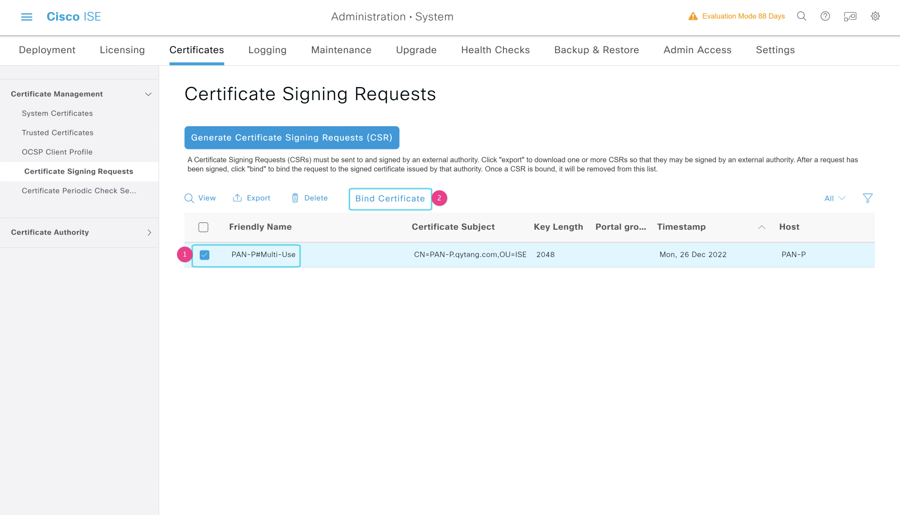
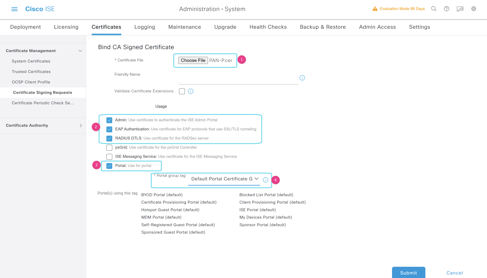

# ISE加载个人证书

## PAN-P加载个人证书

---

> ### 登陆WIN2019 --- 打开chrome浏览器 --- 输入 https://pan-p.qytang.com
>>> ### username: admin
>>> ### password: Cisc0123
>> ### login

>  ###  [三] --- Administration --- System --- Certificates
>>  ### Certificate Management --- Certificate Signing Requests --- Generate Certificate Signing Requests(CSR)
>>> ### [勾选] PAN-P#Multi-Use --- Bind Certificate --- * Certificate File [Choose File] --- PAN-P.cer[桌面PAN-P证书]
>>>> ### Usage:
>>>> ### [勾选] Admin: Use certificate to authenticate the ISE Admin Portal
>>>> ### [勾选] EAP Authentication: Use certificate for EAP protocols that use SSL/TLS tunneling
>>>> ### [勾选] RADIUS DTLS: Use certificate for the RADSec server
>>>> ### [   ] pxGrid: Use certificate for the pxGrid Controller 
>>>> ### [   ] ISE Messaging Service: Use certificate for the ISE Messaging Service
>>>> ### [勾选] Portal: Use for portal
>>>> ### * Portal group tag: Default Portal Certificate Group
>>  ### Submit
> ### 后续告警选择Yes,系统会自动重启
 
---

## 绑定证书请求

## 选择证书用途

---

## PAN-S加载个人证书

---------------------------------------------------------------------------------------------------

> ### 登陆WIN2019 --- 打开chrome浏览器 --- 输入 https://pan-s.qytang.com
>>> ### username: admin
>>> ### password: Cisc0123
>> ### login

>  ###  [三] --- Administration --- System --- Certificates
>> ### Certificate Management --- Certificate Signing Requests --- Generate Certificate Signing Requests(CSR)
>>> ### [勾选] PAN-P#Multi-Use --- Bind Certificate --- * Certificate File [Choose File] --- PAN-S.cer[桌面PAN-S证书]
>>>> ### Usage:
>>>> ### [勾选] Admin: Use certificate to authenticate the ISE Admin Portal
>>>> ### [勾选] EAP Authentication: Use certificate for EAP protocols that use SSL/TLS tunneling
>>>> ### [勾选] RADIUS DTLS: Use certificate for the RADSec server
>>>> ### [   ] pxGrid: Use certificate for the pxGrid Controller 
>>>> ### [   ] ISE Messaging Service: Use certificate for the ISE Messaging Service
>>>> ### [勾选] Portal: Use for portal
>>>>  ### * Portal group tag: Default Portal Certificate Group
>> ### Submit
> ### 后续告警选择Yes,系统会自动重启
---------------------------------------------------------------------------------------------------

## PSN-1加载个人证书

---------------------------------------------------------------------------------------------------

> ### 登陆WIN2019 --- 打开chrome浏览器 --- 输入 https://psn-1.qytang.com
>>> ### username: admin
>>> ### password: Cisc0123
>> ### login

>  ###  [三] --- Administration --- System --- Certificates
>> ### Certificate Management --- Certificate Signing Requests --- Generate Certificate Signing Requests(CSR)
>>> ### [勾选] PAN-P#Multi-Use --- Bind Certificate --- * Certificate File [Choose File] --- PSN-1.cer[桌面PSN-1证书]
>>>> ### Usage:
>>>> ### [勾选] Admin: Use certificate to authenticate the ISE Admin Portal
>>>> ### [勾选] EAP Authentication: Use certificate for EAP protocols that use SSL/TLS tunneling
>>>> ### [勾选] RADIUS DTLS: Use certificate for the RADSec server
>>>> ### [   ] pxGrid: Use certificate for the pxGrid Controller 
>>>> ### [   ] ISE Messaging Service: Use certificate for the ISE Messaging Service
>>>> ### [勾选] Portal: Use for portal
>>>> ### * Portal group tag: Default Portal Certificate Group
>>  ### Submit
> ### 后续告警选择Yes,系统会自动重启
---------------------------------------------------------------------------------------------------

## PSN-2加载个人证书

---------------------------------------------------------------------------------------------------

> ### 登陆WIN2019 --- 打开chrome浏览器 --- 输入 https://psn-2.qytang.com
>>> ### username: admin
>>> ### password: Cisc0123
>> ### login

>  ###  [三] --- Administration --- System --- Certificates
>> ### Certificate Management --- Certificate Signing Requests --- Generate Certificate Signing Requests(CSR)
>>> ### [勾选] PAN-P#Multi-Use --- Bind Certificate --- * Certificate File [Choose File] --- PSN-2.cer[桌面PSN-2证书]
>>>> ### Usage:
>>>> ### [勾选] Admin: Use certificate to authenticate the ISE Admin Portal
>>>> ### [勾选] EAP Authentication: Use certificate for EAP protocols that use SSL/TLS tunneling
>>>> ### [勾选] RADIUS DTLS: Use certificate for the RADSec server
>>>> ### [   ] pxGrid: Use certificate for the pxGrid Controller 
>>>> ### [   ] ISE Messaging Service: Use certificate for the ISE Messaging Service
>>>> ### [勾选] Portal: Use for portal
>>>> ### * Portal group tag: Default Portal Certificate Group
>>  ### Submit
> ### 后续告警选择Yes,系统会自动重启
---------------------------------------------------------------------------------------------------