# ISE分布式部署

## PAN-P部署Primary Role [PAN,PSN,Mnt]

---

> ### 登陆WIN2019 --- 打开chrome浏览器 --- 输入 https://pan-p.qytang.com
>>> ### username: admin
>>> ### password: Cisc0123
>> ### login

>  ###  [三] --- Administration --- System --- Deployment
>>  ### Deployment --- PAN-P --- General Settings
>>> ### Role STANDALONE [Make Primary] (点击) ----> Role PRIMARY [Make Standalone]
>>> ### [勾选] Administration
>>> ### [勾选] Monitoring
>>>> #### Role: PRIMARY
>>>> #### Other Monitoring Node:__________
>>>> #### [   ] Dedicated Mnt
>>> ### [勾选] Policy Service
>>>> #### [勾选] Enable Session Services
>>>> #### [勾选] Enable Profiling Service
>>>> #### [   ] Eanble Threat Centric NAC Service
>>>> #### [   ] Enable SXP Service
>>>> #### [   ] Enable Device Admin Service
>>>> #### [   ] Enable Passive Identity Service
>>> ### [   ] pxGrid
>> ### Save

---

## PAN-P选择功能.1
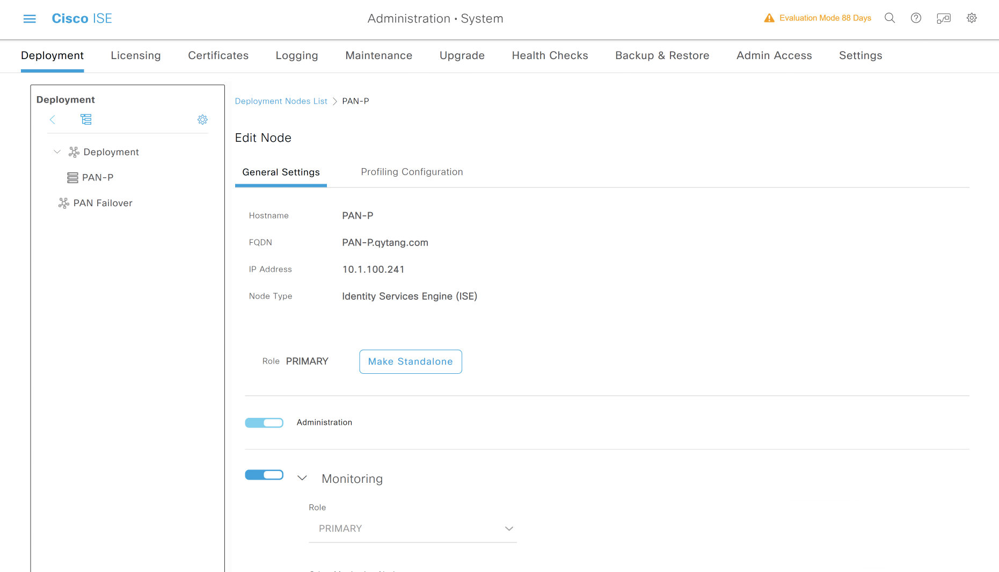

## PAN-P选择功能.2

---

## PAN-S注册部署Secondary Role [PAN,PSN,Mnt]

---

> ### 登陆WIN2019 --- 打开chrome浏览器 --- 输入 https://pan-p.qytang.com
>>> ### username: admin
>>> ### password: Cisc0123
>> ### login

>  ###  [三] --- Administration --- System --- Deployment
>> ### Deployment --- Register
>>> ### Register ISE Node - Step 1: Specify Node Host FQDN (hostname.domain-name) and Credentials
>>>>> ### Host FQDN: PAN-S.qytang.com
>>>>> ### User name: admin
>>>>> ### Password: Cisc0123
>>>> ### Next
>>> ### Register ISE Node - Step 2: Configure Node
>>>> ### Role SECONDARY
>>>>> ### [勾选] Administration
>>>>> ### [勾选] Monitoring
>>>>>> #### Role: SECONDARY
>>>>>> #### Other Monitoring Node: PAN-P
>>>>>> #### [   ] Dedicated Mnt
>>>>> ### [勾选] Policy Service
>>>>>> #### [勾选] Enable Session Services
>>>>>> #### [勾选] Enable Profiling Service
>>>>>> #### [   ] Eanble Threat Centric NAC Service
>>>>>> #### [   ] Enable SXP Service
>>>>>> #### [   ] Enable Device Admin Service
>>>>>> #### [   ] Enable Passive Identity Service
>>>>> ### [   ] pxGrid
>>>> ### Submit

---

## 注册PAN-S.1
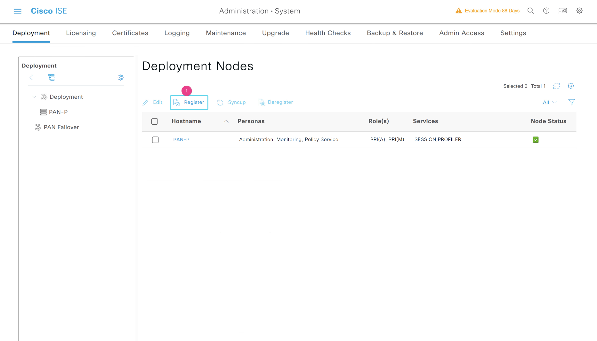

## 注册PAN-S.2
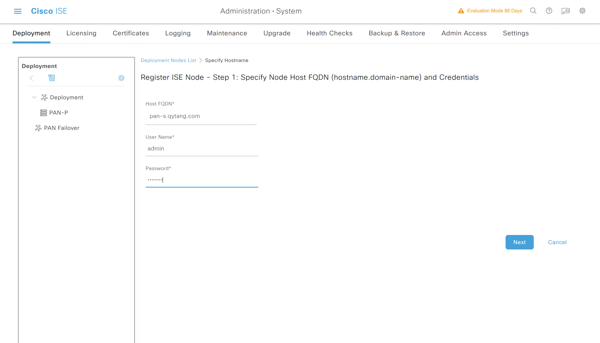

## 注册PAN-S.3
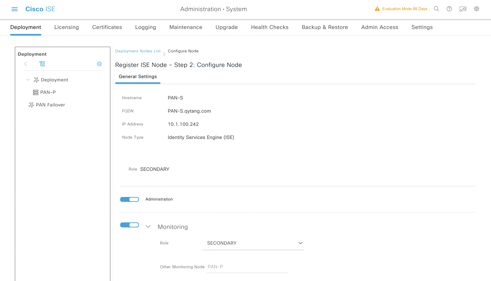

## 注册PAN-S.4
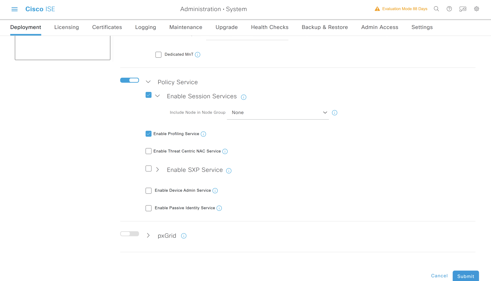

---

## PSN-1注册部署PSN Node

---

> ### 登陆WIN2019 --- 打开chrome浏览器 --- 输入 https://pan-p.qytang.com
>>> ### username: admin
>>> ### password: Cisc0123
>> ### login

>  ###  [三] --- Administration --- System --- Deployment
>> ### Deployment --- Register
>>> ### Register ISE Node - Step 1: Specify Node Host FQDN (hostname.domain-name) and Credentials
>>>>> ### Host FQDN: PSN-1.qytang.com
>>>>> ### User name: admin
>>>>> ### Password: Cisc0123
>>>> ### Next
>>> ### Register ISE Node - Step 2: Configure Node
>>>> ### [  ] Administration
>>>> ### [  ] Monitoring
>>>> ### [勾选] Policy Service
>>>>> #### [勾选] Enable Session Services
>>>>> #### [勾选] Enable Profiling Service
>>>>> #### [   ] Eanble Threat Centric NAC Service
>>>>> #### [   ] Enable SXP Service
>>>>> #### [   ] Enable Device Admin Service
>>>>> #### [   ] Enable Passive Identity Service
>>>> ### [   ] pxGrid
>>> ### Submit
---

## 注册PSN-1.1
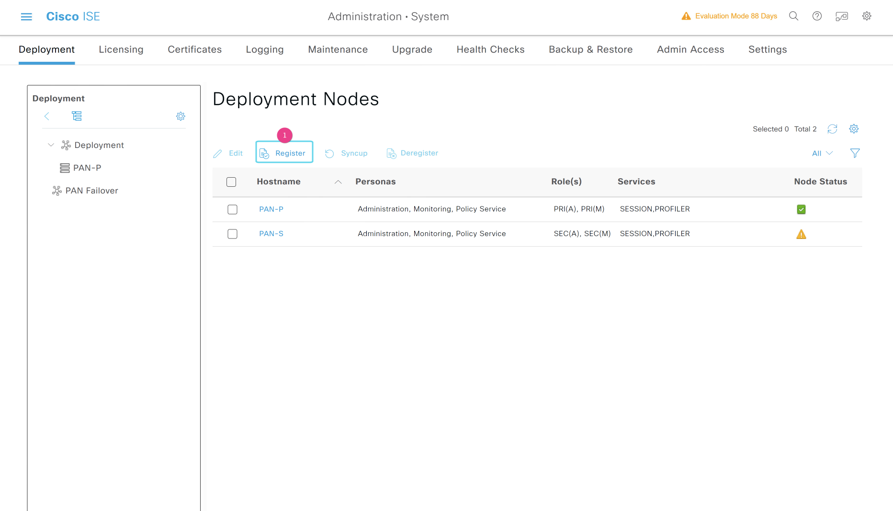

## 注册PSN-1.2
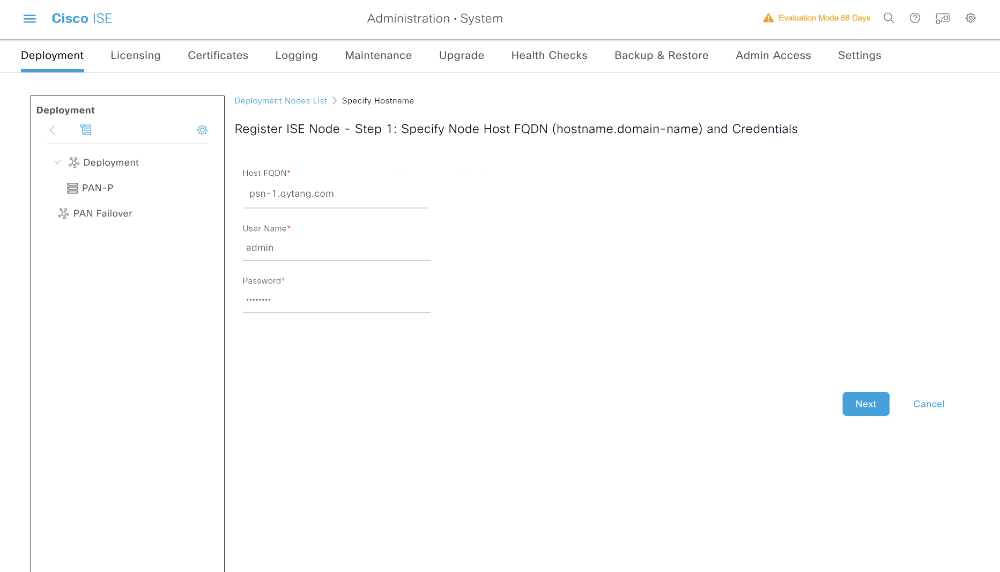

## 注册PSN-1.3
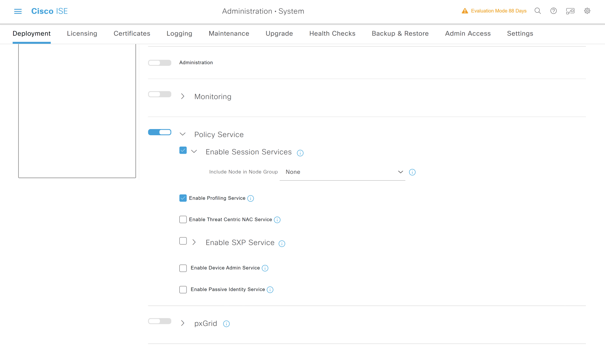

---

## PSN-2注册部署PSN Node

---

> ### 登陆WIN2019 --- 打开chrome浏览器 --- 输入 https://pan-p.qytang.com
>>> ### username: admin
>>> ### password: Cisc0123
>> ### login

>  ###  [三] --- Administration --- System --- Deployment
>> ### Deployment --- Register
>>> ### Register ISE Node - Step 1: Specify Node Host FQDN (hostname.domain-name) and Credentials
>>>>> ### Host FQDN: PSN-2.qytang.com
>>>>> ### User name: admin
>>>>> ### Password: Cisc0123
>>>> ### Next
>>> ### Register ISE Node - Step 2: Configure Node
>>>> ### [  ] Administration
>>>> ### [  ] Monitoring
>>>> ### [勾选] Policy Service
>>>>> #### [勾选] Enable Session Services
>>>>> #### [勾选] Enable Profiling Service
>>>>> #### [   ] Eanble Threat Centric NAC Service
>>>>> #### [   ] Enable SXP Service
>>>>> #### [   ] Enable Device Admin Service
>>>>> #### [   ] Enable Passive Identity Service
>>>> ### [   ] pxGrid
>>> ### Submit

---

## 注册PSN-2.1
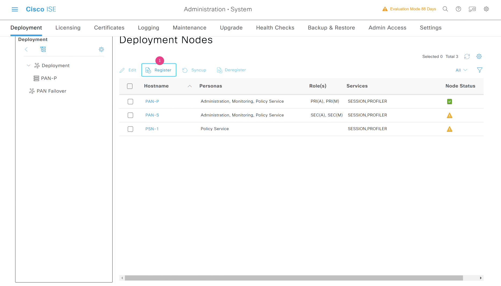

## 注册PSN-2.2
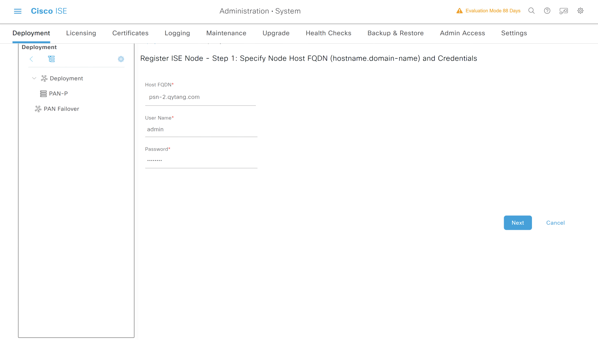

## 注册PSN-2.3

---

## 最终同步效果

## ISE分布式部署结果

## 等待30分钟左右自动同步
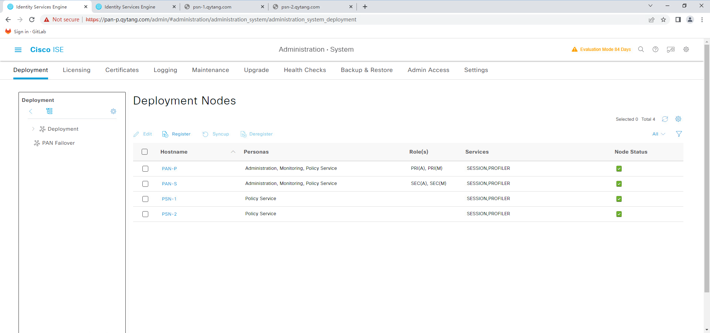

