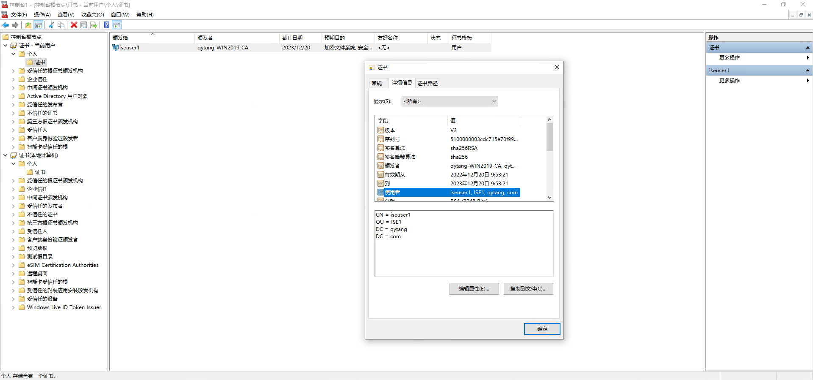
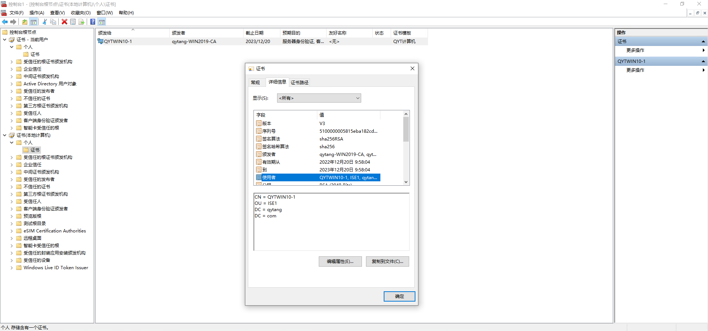
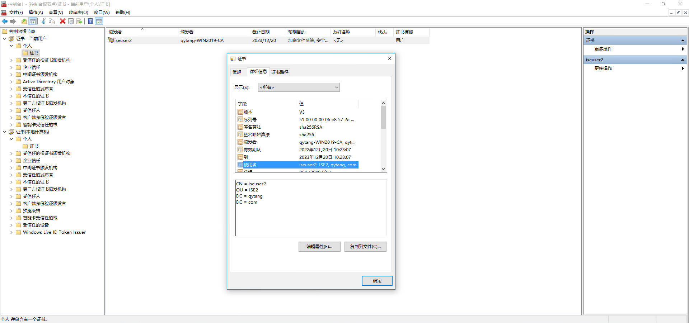
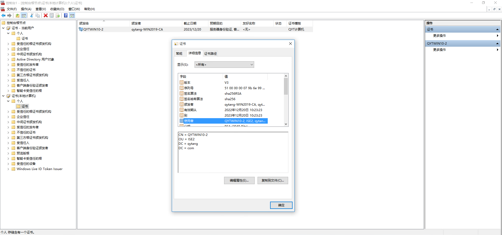

# Site1和Site2的WIN10计算机申请证书

## Site1区域WIN10计算机申请证书

----

### 步骤一：添加证书

> ### cmd --- mmc --- 控制台 --- 文件 --- 添加/删除管理单元(M)
>> ### 可用的管理单元 --- 证书 --- 添加 --- (勾选)我的用户账户(M) --- 完成
>> ### 可用的管理单元 --- 证书 --- 添加 --- (勾选)计算机账户(C) --- 下一步 --- (勾选)本地计算/(运行此控制台的计算机)(L) --- 完成
>> ### 确定

### 步骤二：申请用户证书
> ### 控制台 --- 控制台根节点 --- 证书 --- 当前用户 --- 个人 --- 右键 --- 所有任务(K) --- 申请新证书(R)...
>> ### 证书注册
>>> ### 在你开始前 --- 下一步
>>> ### 选择证书注册策略 --- 下一步
>>> ### 请求证书 --- [勾选] 用户 --- 注册
>>> ### 证书安装结果 --- 成功 --- 完成

## 查看申请个人证书

### 步骤三：申请计算机证书
> ### 控制台 --- 控制台根节点 --- 证书(本地计算机) --- 个人 --- 右键 --- 所有任务(K) --- 申请新证书(R)...
>> ### 证书注册
>>> ### 在你开始前 --- 下一步
>>> ### 选择证书注册策略 --- 下一步
>>> ### 请求证书 --- [勾选] QYT计算机 --- 注册
>>> ### 证书安装结果 --- 成功 --- 完成

## 查看申请计算机证书

---

## Site2区域WIN10计算机申请证书

---

### 步骤一：添加证书

> ### cmd --- mmc --- 控制台 --- 文件 --- 添加/删除管理单元(M)
>> ### 可用的管理单元 --- 证书 --- 添加 --- (勾选)我的用户账户(M) --- 完成
>> ### 可用的管理单元 --- 证书 --- 添加 --- (勾选)计算机账户(C) --- 下一步 --- (勾选)本地计算/(运行此控制台的计算机)(L) --- 完成
>> ### 确定

### 步骤二：申请用户证书
> ### 控制台 --- 控制台根节点 --- 证书 -当前用户 --- 个人 --- 右键 --- 所有任务(K) --- 申请新证书(R)...
>> ### 证书注册
>>> ### 在你开始前 --- 下一步
>>> ### 选择证书注册策略 --- 下一步
>>> ### 请求证书 --- [勾选] 用户 --- 注册
>>> ### 证书安装结果 --- 成功 --- 完成

## 查看申请个人证书

### 步骤三：申请计算机证书
> ### 控制台 --- 控制台根节点 --- 证书(本地计算机) --- 个人 --- 右键 --- 所有任务(K) --- 申请新证书(R)...
>> ### 证书注册
>>> ### 在你开始前 --- 下一步
>>> ### 选择证书注册策略 --- 下一步
>>> ### 请求证书 --- [勾选] QYT计算机 --- 注册
>>> ### 证书安装结果 --- 成功 --- 完成

## 查看申请计算机证书

