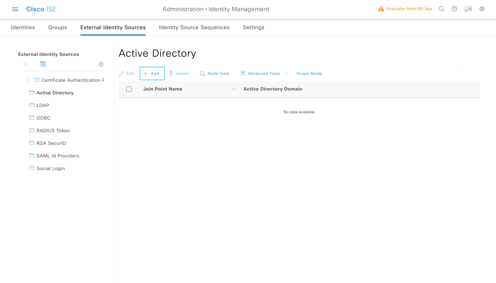
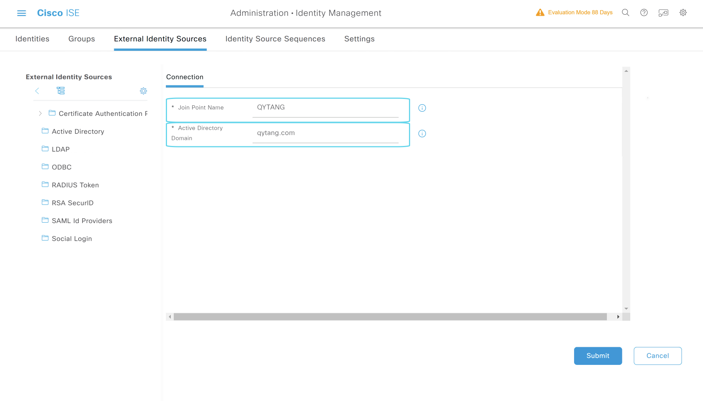
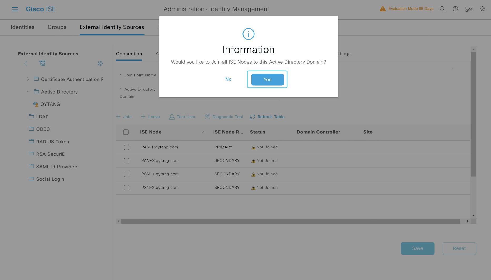
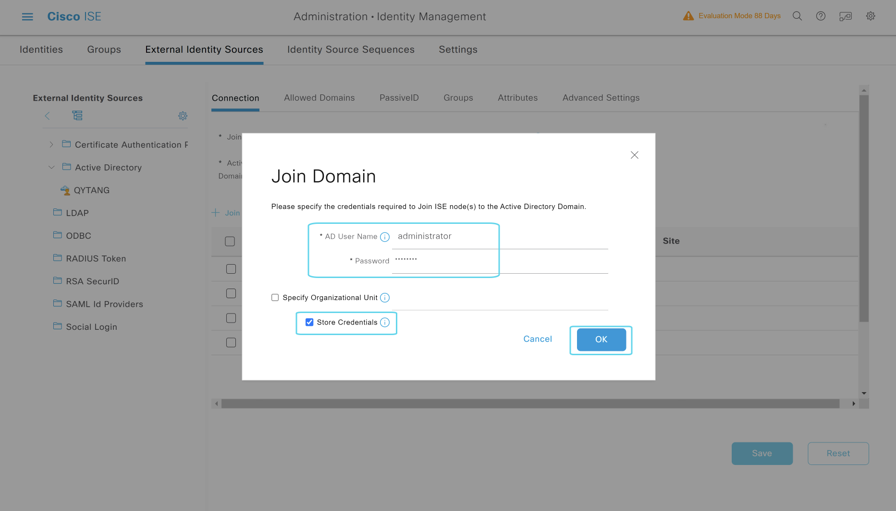
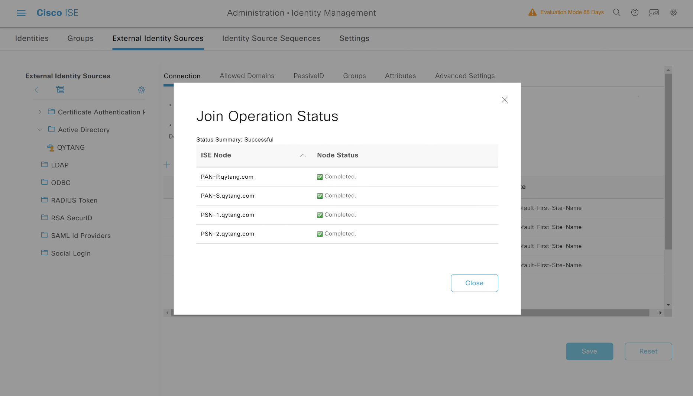
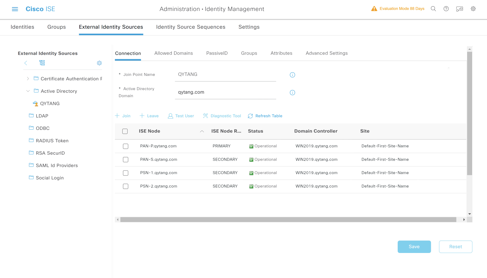
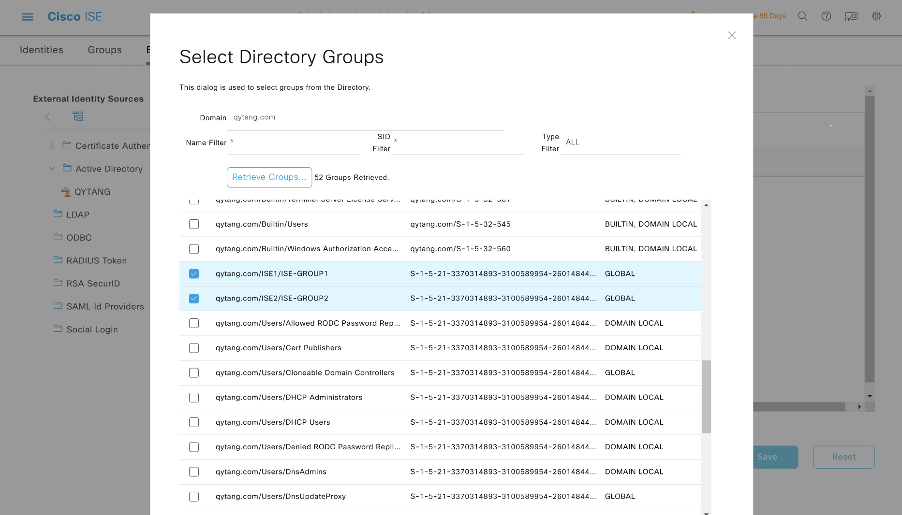
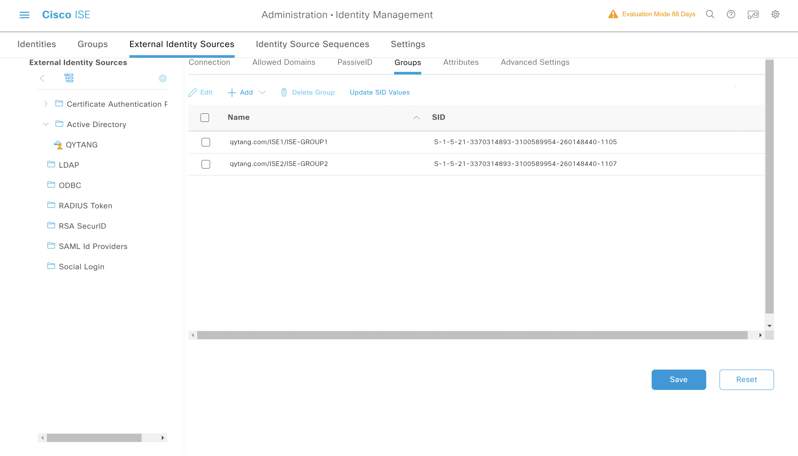

# ISE加入WIN2019 AD域

---

> ### 登陆WIN2019 --- 打开chrome浏览器 --- 输入 https://pan-p.qytang.com
>>> ### username: admin
>>> ### password: Cisc0123
>> ### login
> 
---

> ###  [三] --- Administration --- Identity Management --- External Identity Sources
>> ### Active Directory --- Add
>>> ### *  Join Point Name  : QYTANG
>>> ### *  Join Point Name  : qytang.com
>> ### Submit

>> ### Join Domain
>>> ### Please specify the credentials required to Join ISE node(s) to the Active Directory Domain.
>>>> ### * AD User Name  : administrator
>>>> ### * Password      : Cisc0123
>>>> ### [勾] Store Credentials
>>### OK

## 加入域

## 名称与域名

## 把所有节点都加入域

## 输入管理员账户

## 所有域都已经加入

## 最终状态

---

## ISE提取WIN2019 AD域的组和用户

---------------------------------------------------------------------------------------------------
> ###  [三] --- Administration --- Identity Management --- External Identity Sources
>> ### Active Directory --- QYTANG 
>>> ### Groups --- Add --- Select Groups From Directory --- Select Directory Groups --- Retrieve Groups... 
>>>>### Name: [勾选] qytang.com/ISE1/ISE-GROUP1
>>>>### Name: [勾选] qytang.com/ISE2/ISE-GROUP2
>>> ### OK
>> ### Save

## 选择组

## 组最终状态

