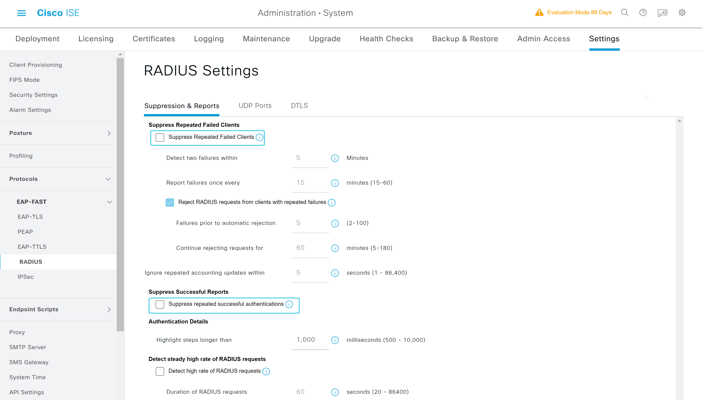
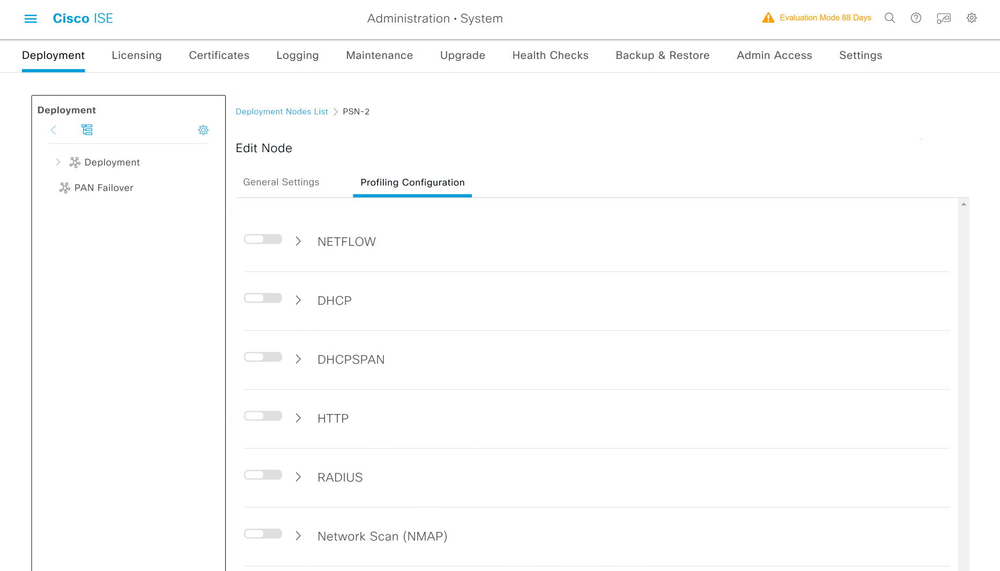

# ISE PAN-P Node节点关闭异常挂起功能

---

> ### 登陆WIN2019 --- 打开chrome浏览器 --- 输入 https://pan-p.qytang.com
>>> ### username: admin
>>> ### password: Cisc0123
>> ### login
---
> ###  [三] --- Administration --- System --- Settings
>> ### Protocols --- RADIUS --- Suppression & Reports
>>> ### Suppress Repeated Failed Clients
>>>> ### [  ] Suppress Repeated Failed Clients
>>> ### Suppress Successful Reports 
>>>> ### [  ] Suppress repeated successful authentications
>> ### Save

---

## 关闭抑制选项

## ISE PSN-2 关闭设备识别

---

> ### 登陆WIN2019 --- 打开chrome浏览器 --- 输入 https://pan-p.qytang.com
>>> ### username: admin
>>> ### password: Cisc0123
>> ### login
 
---

> ###  [三] --- Administration --- System --- Deployment
>> ### Deployment --- PSN-2 --- Profiling Configuration(全部点掉)
>>> ### [  ] NETFLOW
>>> ### [  ] DHCP
>>> ### [  ] DHCPSPAN
>>> ### [  ] HTTP
>>> ### [  ] RADIUS
>>> ### [  ] Network Scan (NMAP)
>>> ### [  ] DNS
>>> ### [  ] SNMPQUERY
>>> ### [  ] SNMPTRAP
>>> ### [  ] Active Directory
>>> ### [  ] pxGrid
>> ### Save

---

## 关闭抑制选项

