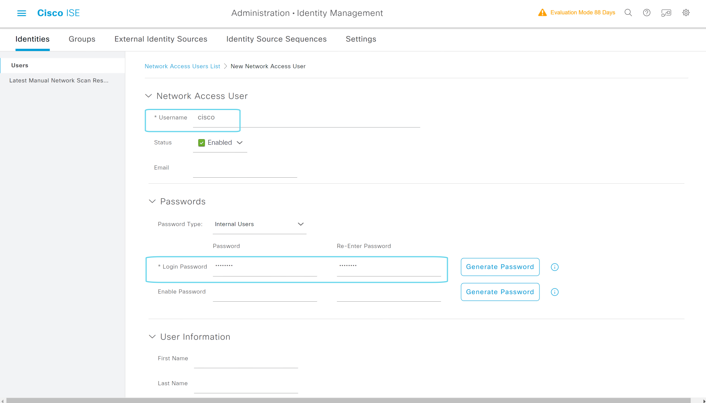

# 创建ISE本地用户cisco

---

> ### 登陆WIN2019 --- 打开chrome浏览器 --- 输入 https://pan-p.qytang.com
>>> ### username: admin
>>> ### password: Cisc0123
>> ### login

---

> ##  [三] --- Administration --- Identity Management --- Identities
>> ### Users --- Network Access User --- Add
>>> ### Network Access User
>>>> ### * Username: cisco
>>> ### Passwords
>>>> ### Login Password
>>>>> ### Password: Cisc0123 
>>>>> ### Re-Enter Password: Cisc0123
>>> ### Submit

---

### 创建用户
