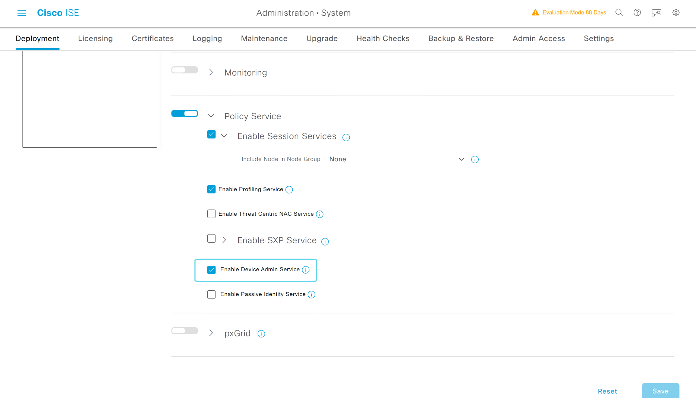

# ISE PSN-2 Node节点启用Tacacs+服务

---

> ### 登陆WIN2019 --- 打开chrome浏览器 --- 输入 https://pan-p.qytang.com
>>> ### username: admin
>>> ### password: Cisc0123
>> ### login

>  ##  [三] --- Administration --- System --- Deployment
>> ### Deployment --- PSN-2 --- General Settings
>>>### [勾选] Policy Service
>>>> ### [勾选] Enable Device Admin Service  (开启设备管理服务)
>> ### Save

---

## 激活Device Admin Service

