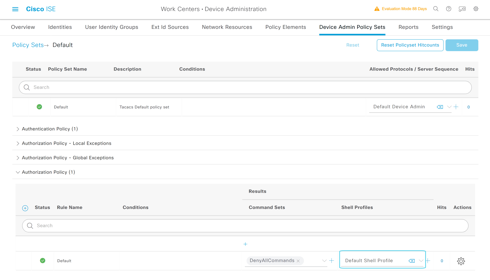
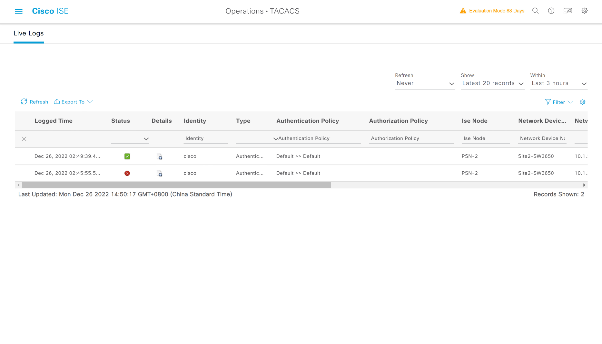

# ISE修改Tacacs+ Authorization Policy

---

> ### 登陆WIN2019 --- 打开chrome浏览器 --- 输入 https://pan-p.qytang.com
>>> ### username: admin
>>> ### password: Cisc0123
>> ### login

>  ##  [三] --- Work Centers --- Device Administration --- Device Admin Policy Sets
>> ### Policy Sets --- Default  --- 最右边的 ">" 展开策略 --- Authorization Policy(1)
>>> ### Default --- DenyAllCommands + [修改为]Default shell Profile
>> ### Save

---

## 修改默认授权策略


---

## Site2-SW测试Tacacs+

---------------------------------------------------------------------------------------------------
```
Site2-SW#test aaa group qyt-tac-group cisco Cisc0123 new-code 
Sending password
User successfully authenticated

USER ATTRIBUTES

username             0   "cisco"
reply-message        0   "Password:"
```
---------------------------------------------------------------------------------------------------

### 提示：
#### ISE PSN-2节点开启设备管理并修改Tacacs Authorization Policy， Tacacs的测试成功，说明tacacs服务正常


## ISE查看Tacacs Live Logs
> ###  [三] --- Operations --- TACACS --- Live Logs



