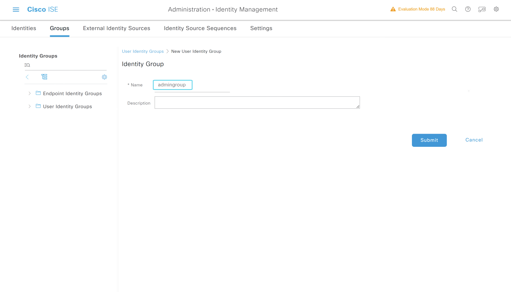
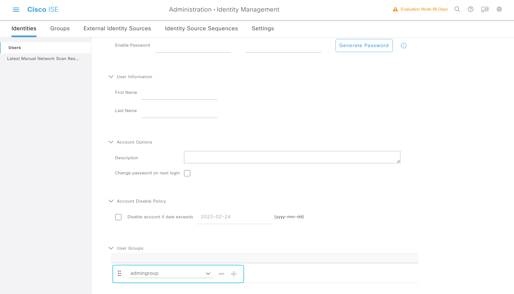

# 创建ISE本地用户和用户组

## 创建用户组

---

> ### 登陆WIN2019 --- 打开chrome浏览器 --- 输入 https://pan-p.qytang.com
>>> ### username: admin
>>> ### password: Cisc0123
>> ### login

> ##  [三] --- Administration --- Identity Management --- Groups
>> ###  User Identity Groups --- Add
>>>> ### *Name: admingroup
>>> ###  Submit

---

## 创建组

---

## 创建用户

---

> ##  [三] --- Administration --- Identity Management --- Identities
>> ###  User --- Add
>>>> ### *Name: adminuser
>>>> ### *Login Password --- Password: Cisc0123
>>>> ### *Login Password  --- Re-Enter Password: Cisc0123
>>>> ### User Groups --- admingroup
>>> ### Submit

---

## 用户选择组

