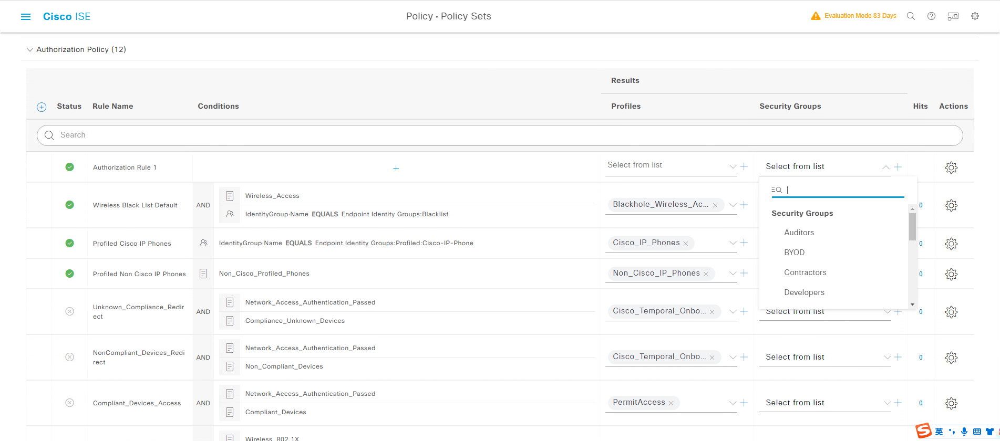

## ISE策略集(Policy Set)包含认证和授权策略

## ISE策略集内包含认证和授权策略

## 系统默认策略（1）

## 系统默认认证策略（2）

## 系统默认认证策略（3）

## 系统默认认证策略（4）

## 系统默认授权策略（5）

## Policy Set组成部分
### ISE Policy Set由三大部分组成:
> + ### 1.名字Policy Set Name（1）
> + ### 2.条件Conditions（2）
> + ### 3.Allowed Protocol（3）

## Library Conditions
>  一些ISE提前准备好的匹配条件

## Smart Conditions
> 用于不同厂商设备匹配Wired_802.1X

## Time and Data
> 匹配日期和时间条件

## 默认Default Network Access允许协议

## 配置Allowed Protocols（1）

## 配置Allowed Protocols（2）

## 认证策略的组成部分
### ISE认证策略由三大部分组成:
> + ### 1.名字Rule Name（1）
> + ### 2.条件Conditions（2）
> + ### 3.认证数据库Use（Identity Source）（3）

## Use（Identity Source）决定了认证数据库

## 三种Failed行为
> + ### Reject--- A “reject”response is sent
> + ### Drop   --- No response is sent
> + ### Continue --- Cisco ISE continues with the authorization policy

## 配置Identity Source Sequences（1）
> + ### [三] --- Administration --- Identity Management --- Identity Source Sequences -- Add

## 配置Identity Source Sequences（2）
> + ### 按照顺序查找，直到第一个认证成功
> + ### 如果身份存储出现故障,1(报错并结束),2(视为没找到用户,继续往下查)

## 系统默认授权策略

## 授权策略策略的组成部分
### ISE授权策略由四大部分组成:
> + ### 1.名字Rule Name（1）
> + ### 2.条件Conditions（2）
> + ### 3.Profiles（3）
> + ### 4.Security Groups（4）

## 条件:终端组

## 条件:用户组

## Conditions中选择组
> + ### IdentityGroup: Name 既能寻找终端在也能选择用户组

## 时间与日期

## 创建的Time and Date条件会出现在Library

## Profiles
> Profiles决定了用户或者设备最终的权限

## Authorization Profiles

## 创建Authorization Profiles

## Security Groups

## 创建Security Groups

