##  EasyConnect & Passive ID
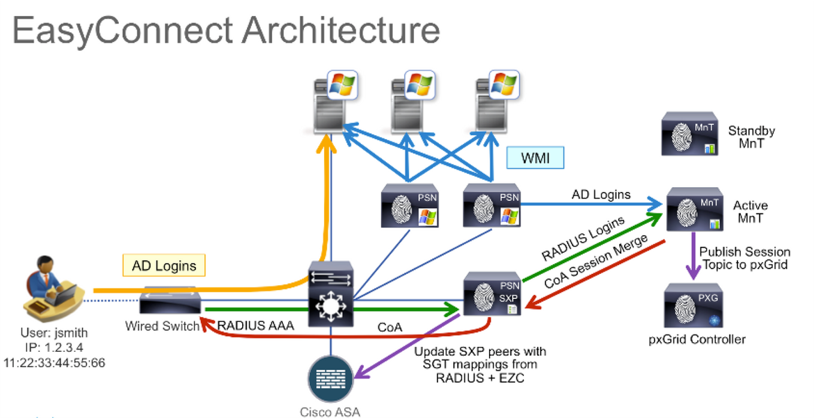

## Active VS Passive Identity
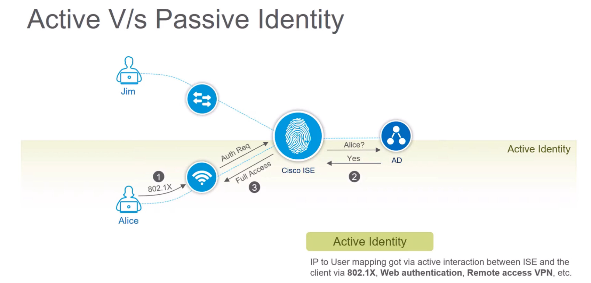
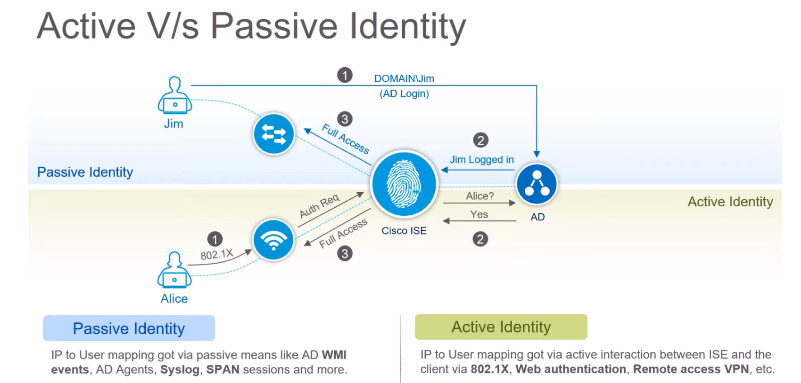

## Easy Connect
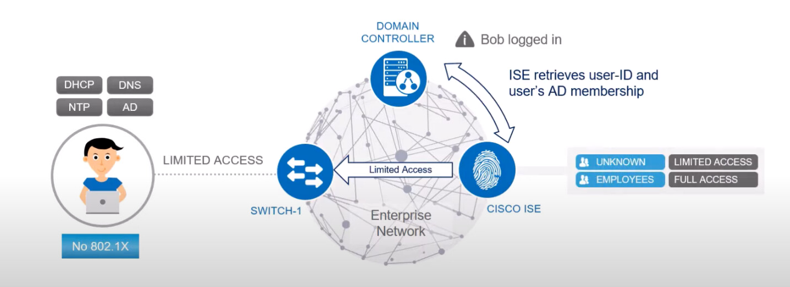
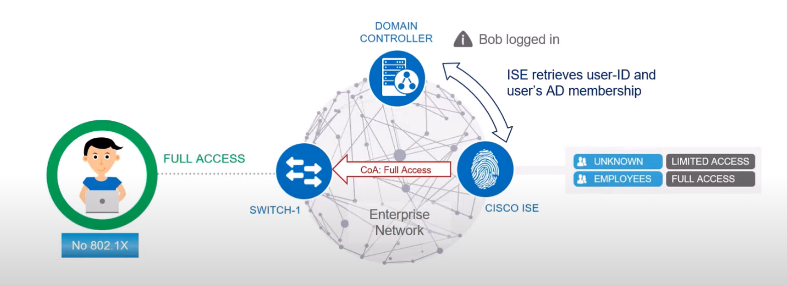


## 开启PSN-2 Passive ID
>  ###  [三] --- Administration --- System --- Deployment
>  ### Deployment --- PSN-2 --- General Settings --- Policy Service
>>  ### [勾选] Enable Passive Identity Service

## 截图
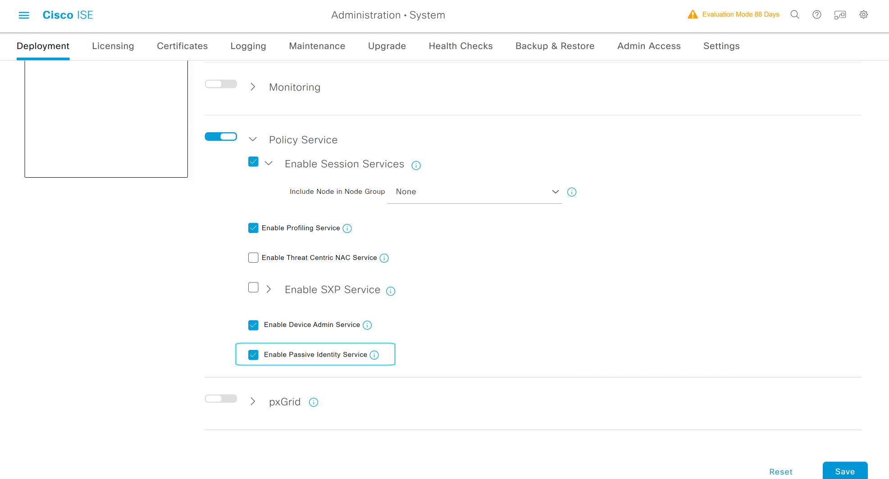

## 创建DC
> ###  [三] --- Administration --- Identity Management --- External Identity Sources
> ###  Active Directory --- QYTANG --- PassiveID -- Add DCs
> ###  Add Domain Controllers --- Domain --- [勾选] qytang.com --- OK

## 截图
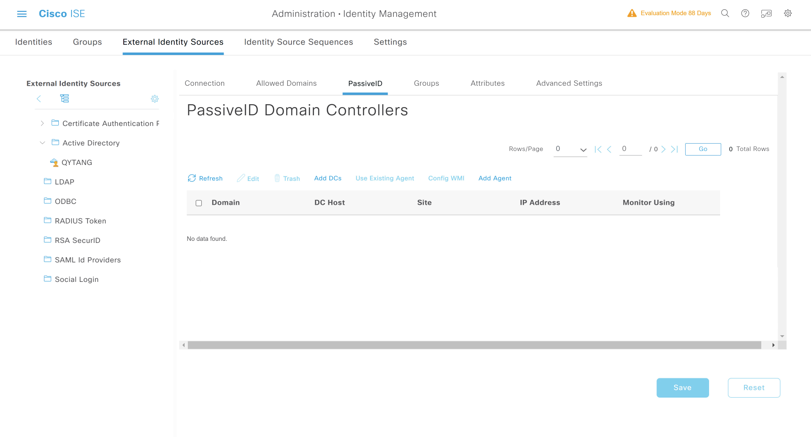
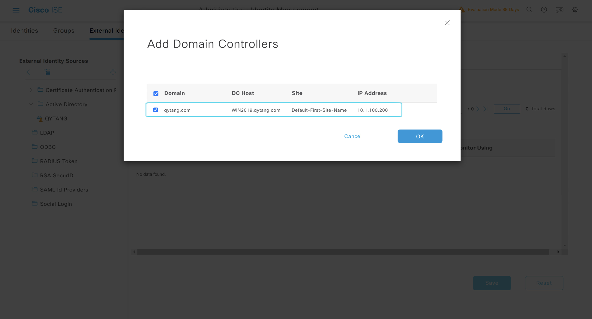

## 编辑DC
>  ###  Active Directory --- QYTANG --- PassiveID --- Domain --- [勾选] qytang.com --- Edit
>>  ### Password: Cisc0123
>> ### Protocol: WMI --- Configure(点击) --- 提示 Successfully configured Domain Controller
>> ### Protocol: WMI --- Test --- 提示 The connection was tested.....QYTANG Query for history events Succeeded
>> ### Save

## 截图
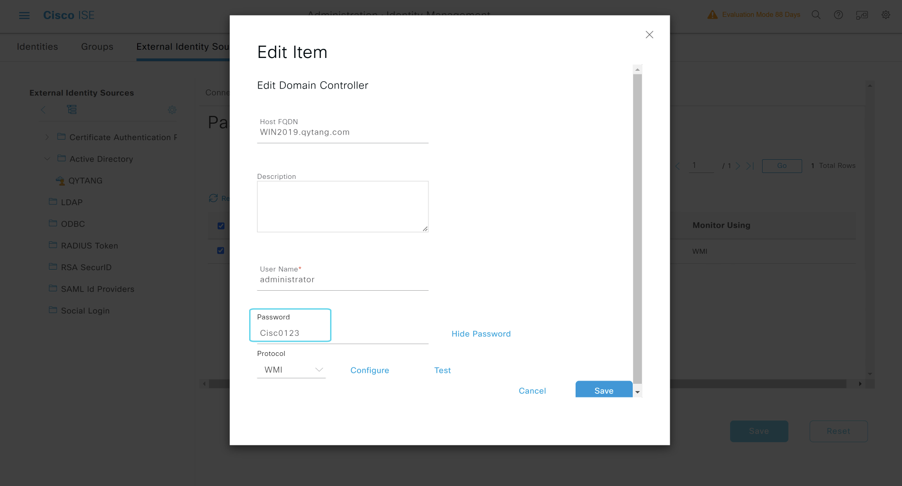
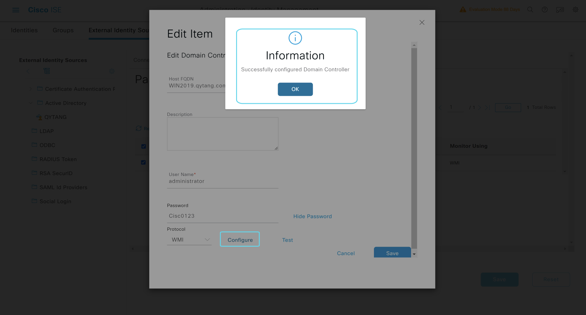


## 查看Providers状态 (如果状态一直故障, 尝试删除DC重新再配置一遍)
> ### [三] --- Work Centers --- PassiveID --- Overview
> ### Dashboard --- Main --- PROVIDERS
>> ### Status: UP
>> ### Name  : WIN2019.qytang.com
>> ### Domain: qytang.com
>> ### Type: DC
>> ### IP/Host: WIN2019.qytang.com
>> ### Agent: WMI

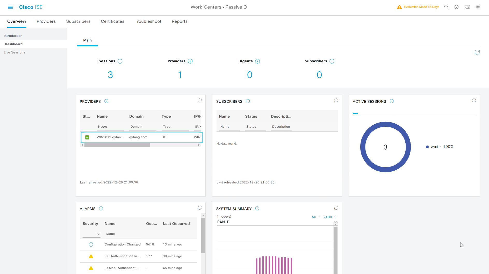

## 创建Endpoint Group并且WIN10-2 Mac Address加入EndPoint Group
> ### [三] --- Administration --- Identity Management --- Groups
> ### Identity Groups --- EndPoint Identity Groups --- Add
>> ### *Name: QYT-WIN10-2-Group
>> ### Add: 00:50:56:A1:BC:C5 (WIN10-2的MAC Address) 
>> ### Save

## 截图
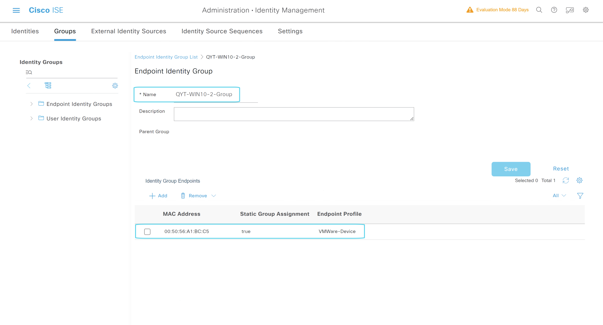

## 创建Limit Access Authorization Profile
### 创建DACL
> ### [三] --- Policy --- Policy Elements --- Results
> ### Authorization --- Downloadable ACLs --- Add
>> ### *Name: Limit_Access
>> ### IP version: IPV4
>> ### * DACL Content：

```shell
permit icmp any any
permit udp any any eq 53
permit udp any any eq bootps
permit ip any host 10.1.100.200
```

>  #### Submit

## 截图
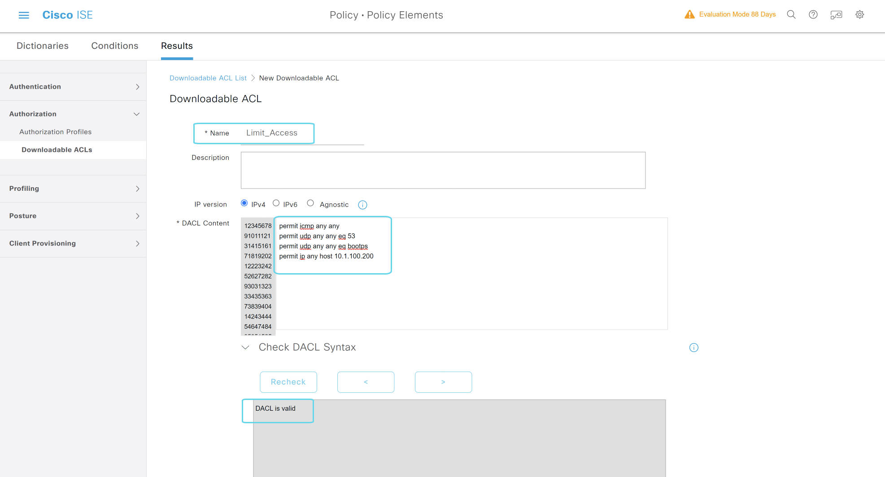

## 创建Authorization Profile
> ### [三] --- Policy --- Policy Elements --- Results
> ### Authorization --- Authorization Profiles --- Add
>> ### * Name: Limit_Access_Profile
>> ### * Access Type: ACCESS_ACCEPT
>> ### Passive Identity Tracking [勾选]
>> ### Common Tasks
>>> ### [勾选] DACL Name: Limit_Access
>>> ### [勾选] VLAN  Tag ID: 1 --- ID/Name: 102
>> ### Submit

## 截图
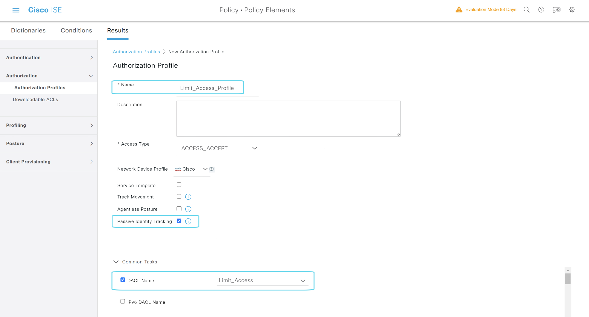
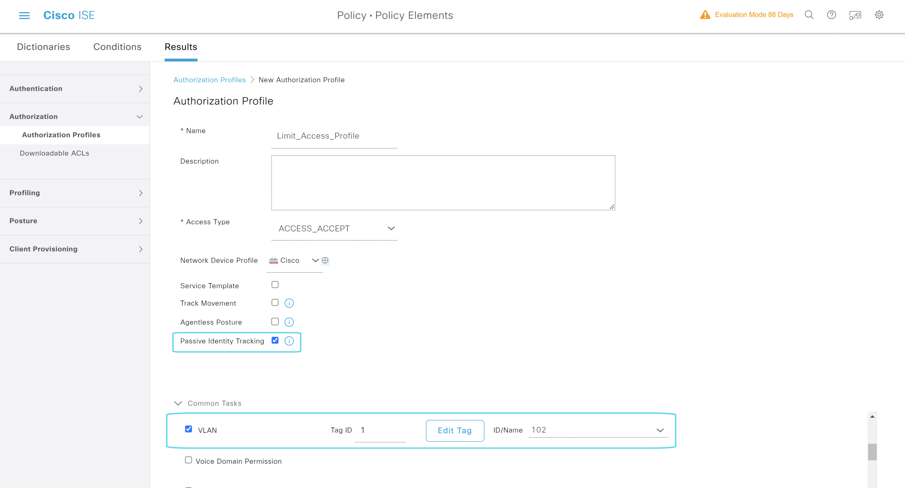

## 创建Passive ID Authorization Profile
> ### [三] --- Policy --- Policy Elements --- Results
> ### Authorization --- Authorization Profiles --- Add
>> ### * Name: Passive_ID_Profile
>> ### * Access Type: ACCESS_ACCEPT
>> ### Passive Identity Tracking [勾选]
>> ### Common Tasks
>>> ### [勾选] DACL Name: PERMIT_ALL_IPV4_TRAFFIC
>>> ### [勾选] VLAN  Tag ID: 1 --- ID/Name: 102
>> ### Submit

## 截图
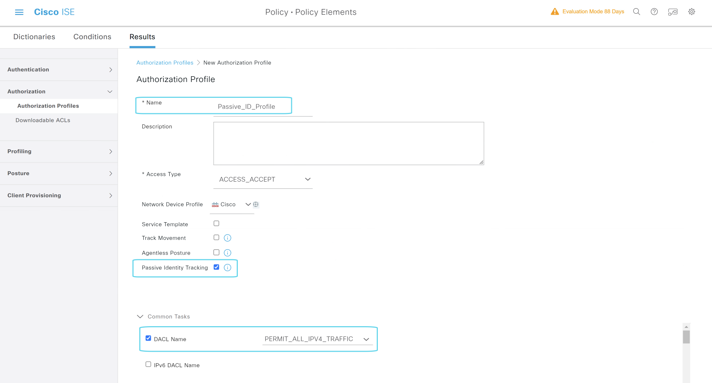
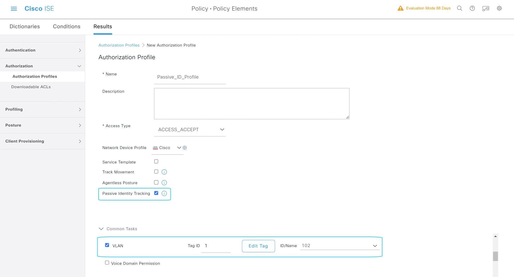

## 查看MAB认证匹配的系统默认认证策略
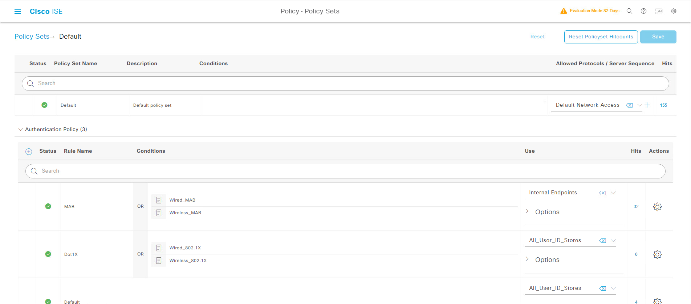

## 创建WIN10-2计算机的MAB Authorization Policy
> ### [三] --- Policy --- Policy Sets --- default --- > --- Authorization Policy(13) --- +
>>> ### Rule name: QYT-MAB-WIN10-2
>>> ### Conditions: 
>>>> + ### WiredMAB
>>>> + ### IdentityGroup-Name EQUALS Endpoint Identity Group: WIN10-2-Group
>>> ### Results Profiles: Limit_Access_Profile
>> ### Save


## 创建Passive ID的用户Authorization Policy
> ### [三] --- Policy --- Policy Sets --- default --- > --- Authorization Policy(14) --- +
>>> ### Rule name: QYT-MAB-PassiveID
>>> ### Conditions:
>>>> + ### WiredMAB
>>>> + ### Network Access-UseCase EQUALS EasyConnect
>>>> + ### PassiveID-PassiveID_Groups EQUALS QYTANG:qytang.com/ISE2/ISE-GROUP2
>>> ### Results Profiles: Passive_ID_Profile
>> ### Save

## 查看Authorization Policy
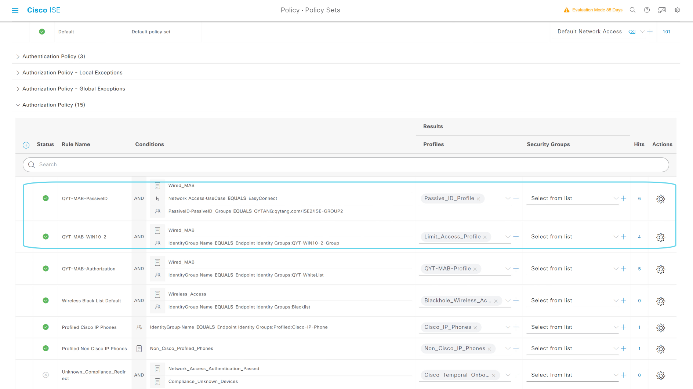


## 测试
> ### 第1步: 注销用户iseuser2

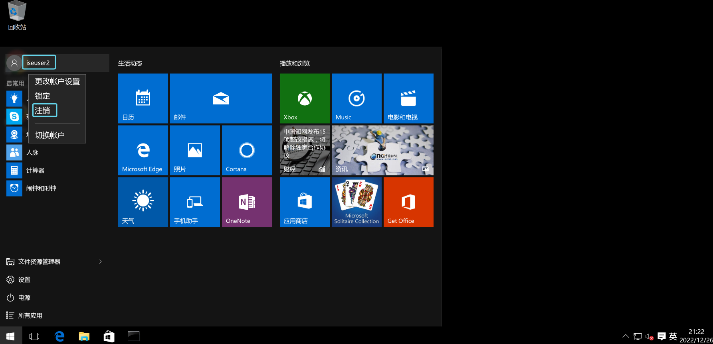

> ### 第2步: Shutdown 接口
```shell
Site2-SW(config)#interface gigabitEthernet 1/0/6
Site2-SW(config-if)#shutdown 

```

> ### 第3步: 清除会话状态(都处于Terminated状态)
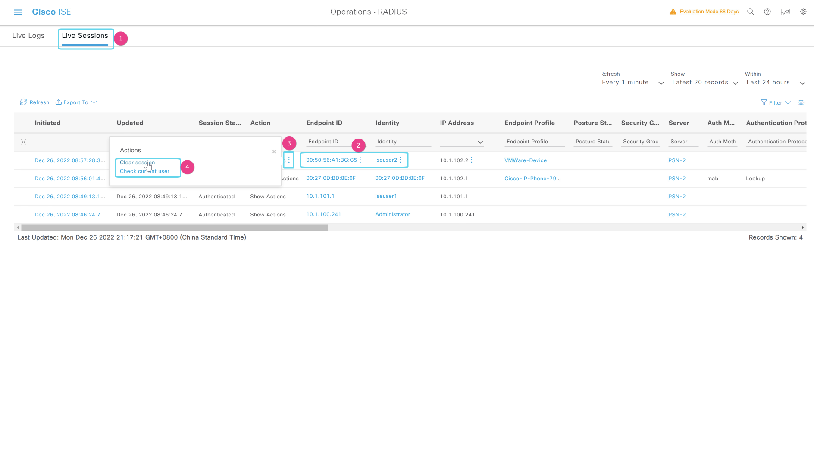
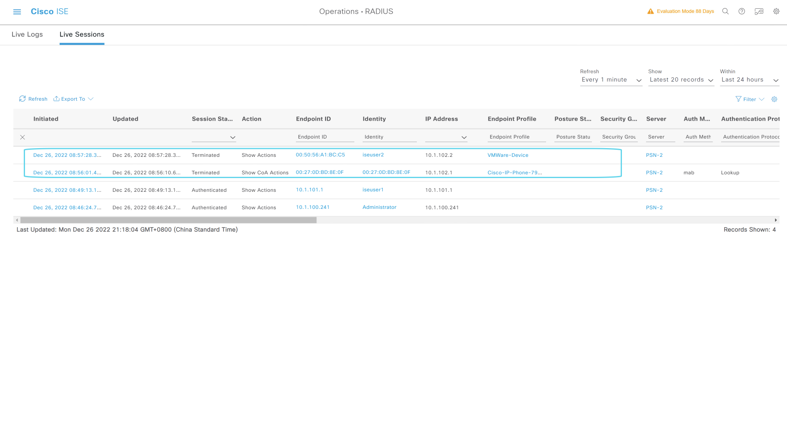

> ### 第4步: 打开接口
```shell
Site2-SW(config)#interface gigabitEthernet 1/0/6
Site2-SW(config-if)#no shutdown 
```

> ### 第5步: 查看交换机认证状态 (看到PC获取的ACL为"Limit_Access")
```
Site2-SW#show authentication sessions interface gigabitEthernet 1/0/6 details 
            Interface:  GigabitEthernet1/0/6
               IIF-ID:  0x18D02A2F
          MAC Address:  0050.56a1.bcc5
         IPv6 Address:  fe80::406b:c074:bd8a:113f
         IPv4 Address:  10.1.102.2
            User-Name:  00-50-56-A1-BC-C5
               Status:  Authorized
               Domain:  DATA
       Oper host mode:  multi-auth
     Oper control dir:  both
      Session timeout:  N/A
    Common Session ID:  0A0114FE000000224E8F6AFD
      Acct Session ID:  0x00000016
               Handle:  0x48000018
       Current Policy:  POLICY_Gi1/0/6


Server Policies:
           Vlan Group:  Vlan: 102
              ACS ACL: xACSACLx-IP-Limit_Access-63a99069


Method status list:
       Method           State
          mab           Authc Success
```


> ### 第6步: 登录iseuser2
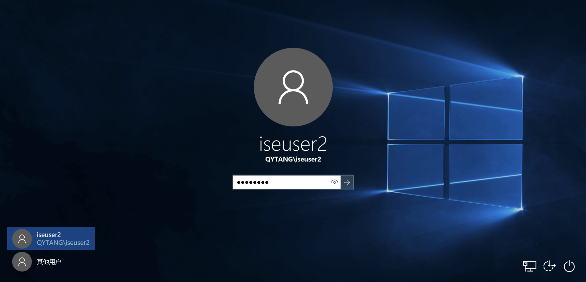

> ### 第7步: 查看交换机认证状态 (看到PC获取的ACL为"PERMIT_ALL_IPV4_TRAFFIC")
```
Site2-SW#show authentication sessions interface gigabitEthernet 1/0/6 details 
            Interface:  GigabitEthernet1/0/6
               IIF-ID:  0x18D02A2F
          MAC Address:  0050.56a1.bcc5
         IPv6 Address:  fe80::406b:c074:bd8a:113f
         IPv4 Address:  10.1.102.2
            User-Name:  00-50-56-A1-BC-C5
               Status:  Authorized
               Domain:  DATA
       Oper host mode:  multi-auth
     Oper control dir:  both
      Session timeout:  N/A
    Common Session ID:  0A0114FE000000224E8F6AFD
      Acct Session ID:  0x00000016
               Handle:  0x48000018
       Current Policy:  POLICY_Gi1/0/6


Server Policies:
           Vlan Group:  Vlan: 102
              ACS ACL: xACSACLx-IP-PERMIT_ALL_IPV4_TRAFFIC-57f6b0d3


Method status list:
       Method           State
          mab           Authc Success
```

> ### 第8步: 查看session状态
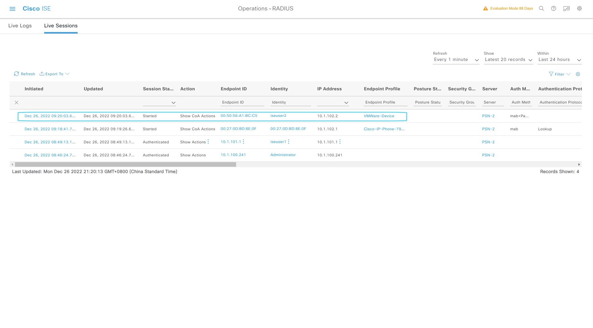


> ### 第9步: 查看Log (关注从Limit_Access_Profile到Passive_ID_Profile)
