# 无线控制器上创建VLAN
> ### 登陆WIN2019 --- 打开chrome浏览器 --- 输入 https://10.1.11.241
>> ### username: admin
>> ### password: Cisc0123
>> ### login

> ### Configuration --- Layer2 --- VLAN
> ### VLAN --- Add
> ### Create a single VLAN --- VLAN ID* : 101 --- Apply to Device

# 无线控制器上创建WLAN
> ### Configuration --- Tags & Profiles --- WLANs --- Add
> ### General
>> ### Profile Nmae* : ISE31-PSK
>> ### SSID* : ISE31-PSK
>> ### WLAN ID* : 1
>> ### Status: ENABLED
> ### Security
>> ### Layer2 --- WPA Parameters --- Auth Key Mgmt --- [   ]802.1x
>> ### Layer2 --- WPA Parameters --- Auth Key Mgmt --- [勾选]PSK
>> ### Layer2 --- WPA Parameters --- Pre-Shared Key* ： qytangccies
>> ### Apply to Device

# Wireless Setup
> ### Configuration --- Wireless Setup --- Basic -- Add
> ### General
>> ### Location Name* : ISE31-Wireless
> ### Wireless Networks --- Add
>> ### Wireless Network Details --- WLAN* --- ISE31-PSK
>> ### Policy Details --- VLAN/VLAN Group* : 101
> ### AP Provisioning
>> ### Available AP list ---- Number of selected APs : 1 --- [勾选] 0c75.bdb5.fcd0 --- => (选择到右边)
>> ### APs on this Location --- Associated AP list 
>> ###  AP MAC： 0c75.bdb5.fcd0
>> ###  AP Name: ISE31_AP
>> ###  Status: Joined
>> ### Apply

# AP Operational Configuration Viewer
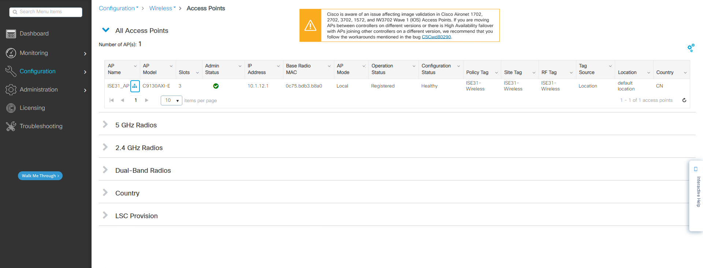
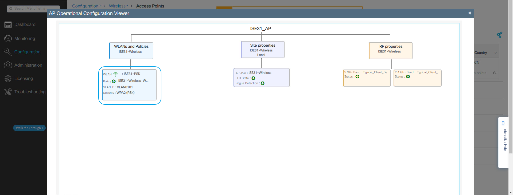

# WIN10-1计算机测试
> ### WIN10-1计算机测试PSK认证
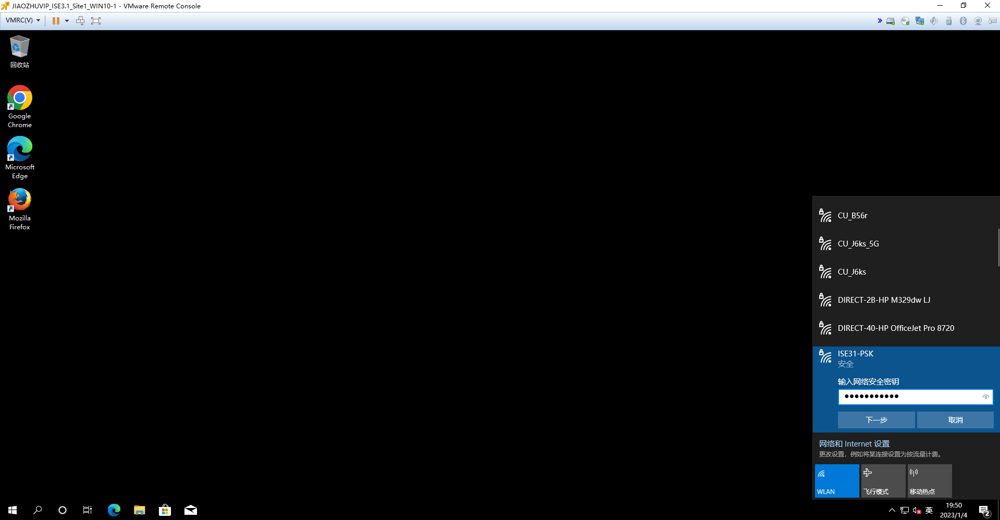
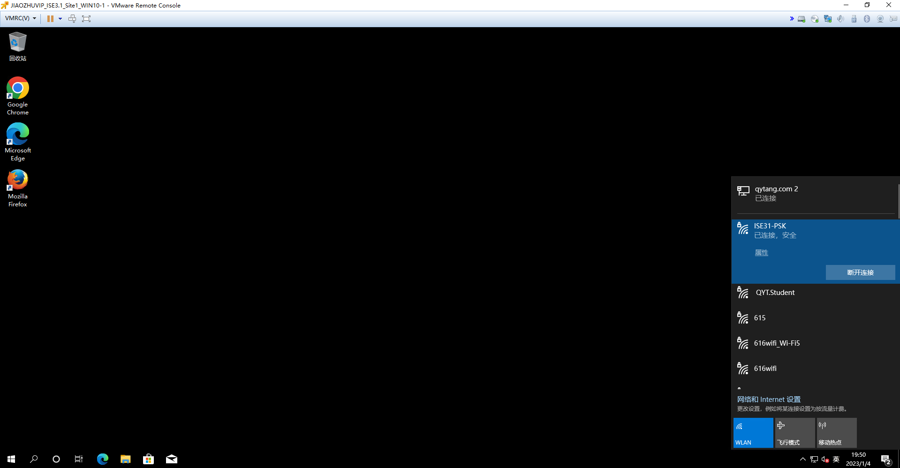
> ### WIN10-1计算机网络访问测试
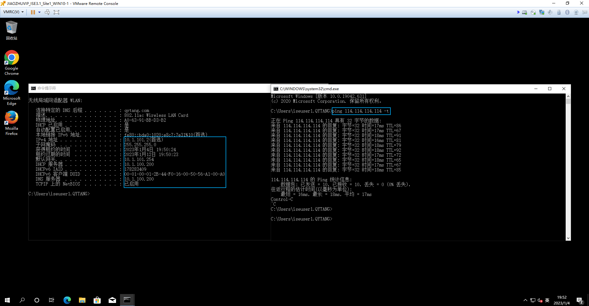
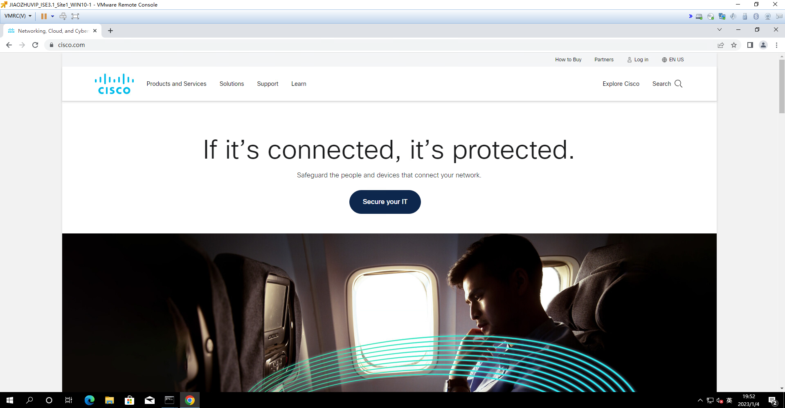

# 无线控制器上查看无线客户端信息
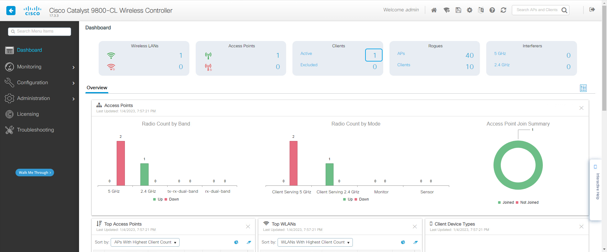
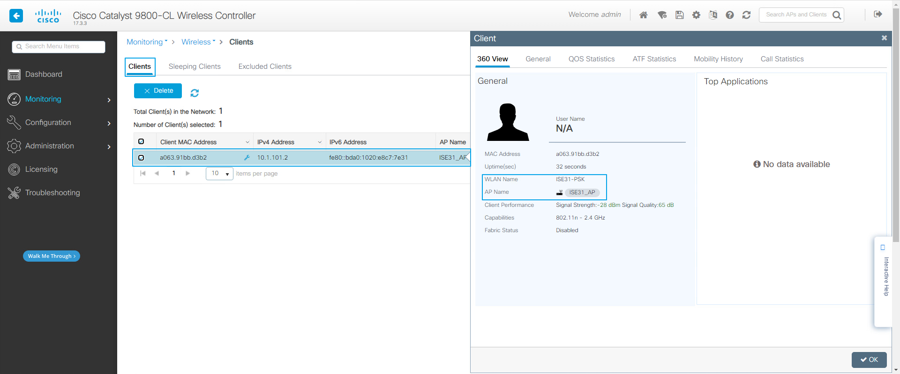
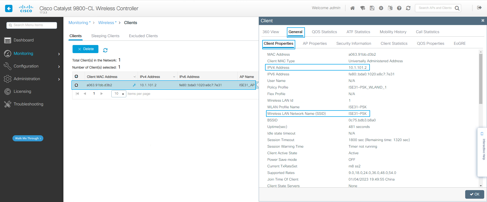
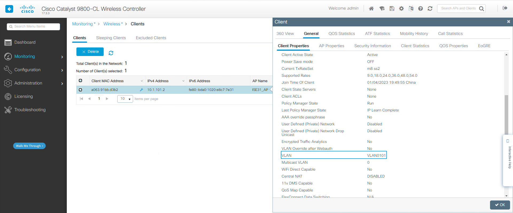
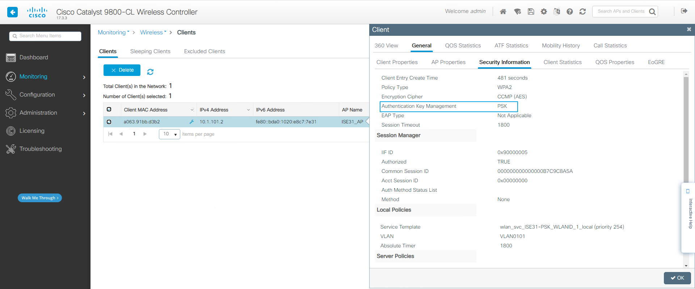

