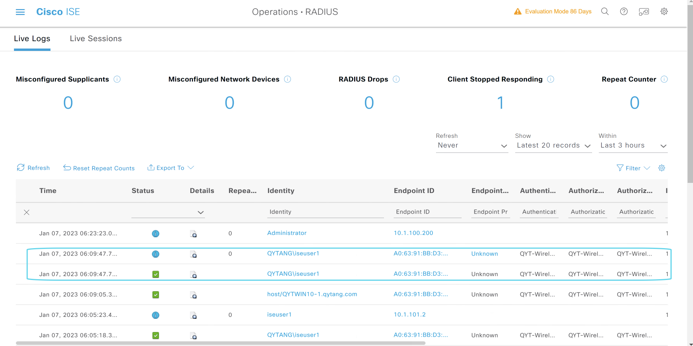
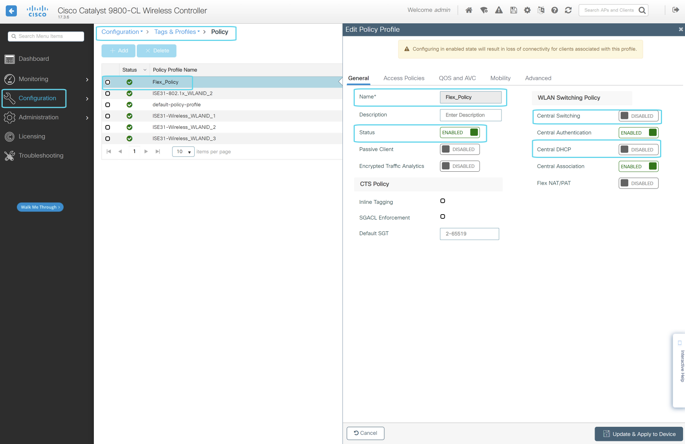

# WIN10-1计算检查用户证书和计算机证书

# 无线控制器上配置AAA
> ### Configuration --- Security --- AAA
> ### Servers/Groups --- RADIUS --- Servers --- + Add
>> ### Name* : ISE31-AAA
>> ### Server Address* : 10.1.10.241
>> ### Key* : cisco
>> ### Confirm Key* : cisco
>> ### Apply to Device
> ### Servers/Groups --- RADIUS --- Server Groups--- + Add
>> ### Name* : ISE31-AAA-GROUP
>> ### Available Servers : ISE31-AAA --- > Assigned Servers : ISE31-AAA
>> ### Apply to Device
> ### AAA Method List --- Authentication --- + Add
>> ### Method List Name* : ISE31-AAA-List
>> ### Type* : dot1x
>> ### Group Ype : group
>> ### Available Server Groups : ISE31-AAA-GROUP --- > --- Assigned Server Groups : ISE31-AAA-GROUP
>> ### Apply to Device

# 无线控制器上创建WLAN
> ### Configuration --- Tags & Profiles --- WLANs --- Add
> ### General
>> ### Profile Nmae* : ISE31-802.1x
>> ### SSID* : ISE31-802.1x
>> ### WLAN ID* : 2
>> ### Status: ENABLED
> ### Security
>> ### AAA --- Authentication List : ISE31-AAA-List

# 无线控制器上Wireless Setup
> ### Configuration --- Wireless Setup --- Basic -- 点击修改 "ISE31-Wireless"
>> ### General
>>> ### Location Name* : ISE31-Wireless
>> ### Wireless Network --- Add
>>> ### Wireless Network Details --- WLAN* --- ISE31-802.1x
>>> ### Policy Details --- VLAN/VLAN Group* : defaut
>>> ### Add
> ### Apply

# 无线控制器上修改policy
> ### Configuration --- Tags & Profiles --- Policy 
> ### [勾选] ISE31-Wireless_WLANID_2(点击即修改) --- Edit Policy Profile --- Advanced --- AAA Policy
>> ### Allow AAA Override [勾选]
>> ### NAC State [勾选]
>> ### Update & Apply to Device

# 无线控制器上创建ACL
> ### Configuration --- Security --- ACL
> ### + Add
>> ### ACL Name* : PERMIT_ALL
>> ### ACL Type : IPv4 Extended
>> ### Sequence* : 1   
>> ### Action : permit
>> ### Source Type: any
>> ### Destination Type : any
>> ### Protocol : ip
>> ### Log : [勾选]
>> ### + Add
>> ### Apply to Device

# AP Operational Configuration Viewer
> ### Configuration --- Wireless --- Access Points

# ISE上创建NDG
> ### 登陆WIN2019 --- 打开chrome浏览器 --- 输入 https://pan-p.qytang.com
>>> ### username: admin
>>> ### password: Cisc0123
>> ### login

> ###  [三] --- Administration --- Network Resources --- Network Device Groups
> ### + Add
>> ### Name* : WLC
>> ### Parent Group* : All Device Types
>> ### Save
> ### + Add
>> ### Name* : Site1-C9800
>> ### Parent Groups* : All Device Types > WLC
>> ### Save

# ISE上添加Network Device
> ###  [三] --- Administration --- Network Resources --- Network Devices
> ### + Add
>> ### Nmae: Site1-C9800
>> ### IP Address *IP: 10.1.11.241/32
>> ### Network Device Group --- Device Type: Site1-C9800
>> ### Network Device Group --- Location: YCGJ516
>> ### [勾选] RADIUS Authentication Settings
>>> ### Shared Secret: cisco
>> ### Submit

# ISE上配置Authorization Profile
## 配置QYT-Wireless-Dot1x-Porfile
> ###  [三] --- Policy --- Policy Elements --- Results
>> ### Authorization --- Authorization Profiles --- Add
>>> ### *Name: QYT-Wireless-Dot1x-Profile
>>> ### Common Tasks
>>>> ### [勾选] VLAN  Tag ID: 1 --- ID/Name: 101
>>>> ### [勾选] Airespace ACL Name: PERMIT_ALL
>>> ### Submit

# ISE上配置Policy Sets
> ###  [三] --- Policy --- Policy Sets --- +
>> ### Policy Set Name: QYT-Wireless-Dot1x-Policy
>> ### Conditions: Wireless_802.1X
>> ### Allowed Protocols: Default Network Access
>> ### Save

# ISE上配置Authentication Policy
> ###  [三] --- Policy --- Policy Sets --- QYT-Wireless-Dot1x-Policy --- > 展开
> ### Authentication Policy(1) --- +
>> ### Rule: QYT-Wireless-Authentication
>> ### Conditions: DEVICE-Device Type EQUALS All Device Types#WLC#Site1-C9800
>> ### Conditions: Device-Location EQUALS All Location#BeiJing#YCGJ516
>> ### Use: QYTANG
>> ### Save

# ISE上配置Authorization Policy
> ###  [三] --- Policy --- Policy Sets --- QYT-Wireless-Dot1x-Policy --- > 展开
> ### Authorization Policy(1) --- +
>> ### Rule: QYT-Wireless-Authorization
>> ### Conditions: DEVICE-Device Type EQUALS All Device Types#WLC#Site1-C9800
>> ### Conditions: Device-Location EQUALS All Location#BeiJing#YCGJ516
>> ### Conditions: QYTANG-ExternalGroups EQUALS qytang.com/ISE1/ISE-GROUP1
>> ### Results Profiles: QYT-Wireless-Dot1x-Profile
>> ### Save

# WIN10-1计算机无线网络连接测试

# 无线控制器上查看无线客户端信息

# ISE上查看RADIUS Logs

# WIN10-1计算机注销，不登陆，测试无线网络机器认证

# 无线控制器上查看无线客户端信息

# ISE上查看RADIUS Logs

# 配置FlexConnect
> ### 创建WLAN Profile "ISE31-Flex"

> ### 创建Policy Profile "Flex_Policy" 
>> 禁用中心转发和中心DHCP

>> VLAN/VLAN Group是填写的[不是选择的] "1"

>> 激活AAA override

> ### 为Policy Tag "ISE31-Wireless" 添加新的WLAN Profile和Policy Profile

> ### 创建Flex Profile "Flex_Profile" (主要任务是配置Native VLAN)

> ### 修改Site Tag "ISE31-Wireless"

# 由于FlexConnect现在还不支持授权ACL, 所有取消"QYT-Wireless-Dot1x-Profile"的ACL授权

# 连接FlexConnect, 查看Client

# AP最终策略
