# 无线控制器上配置AAA 认证策略
> ### Configuration --- Security --- AAA
> ### AAA Method List --- Authentication --- + Add
>> ### Method List Name* : C9800_Local_Auth
>> ### Type* : login
>> ### Group Type: local
>> ### Apply to Device

# 无线控制器上配置AAA 授权
> ### Configuration --- Security --- AAA
> ### AAA Method List --- Authorization --- + Add
>> ### Method List Name* : default
>> ### Type* : network
>> ### Group Type: local
>> ### Apply to Device

# 无线控制器上配置WLAN
> ### Configuration --- Tags & Profiles --- WLANs --- Add
> ### General
>> ### Profile Nmae* : ISE31-WebAuth
>> ### SSID* : ISE31-WebAuth
>> ### WLAN ID* : 3
>> ### Status: ENABLED
> ### Security
>> ### Layer2 --- Layer 2 Security Mode: None
>> ### Layer2 --- OWE Transaction Mode [ ] 禁用
>> ### Layer3 --- Web Policy [勾选]
>> ### Layer3 --- Web Auth Parameter Map： global
>> ### Layer3 --- Authentication List: C9800_Local_Auth
>> ### Apply to Device

# 无线控制器上Wireless Setup
> ### Configuration --- Wireless Setup --- Basic -- ISE31-Wireless --- 点击编辑
> ### Wireless Network --- Add
>> ### Wireless Network Details --- WLAN* --- ISE31-WebAuth
>> ### Policy Details --- VLAN/VLAN Group* : 101
>> ### Add
> ### Apply

# 无线控制器上创建本地账号
> ### Administrator --- User Administrator
> ### + Add
>> ### User Name*: wlcuser
>> ### Privilege: No Access
>> ### Password*: Cisc0123
>> ### Confirm Password*: Cisc0123
>> ### Apply to Device

# AP Operational Configuration Viewer
> ### Configuration --- Wireless --- Access Points
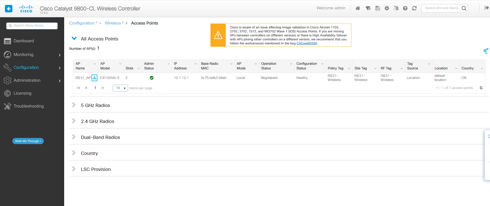
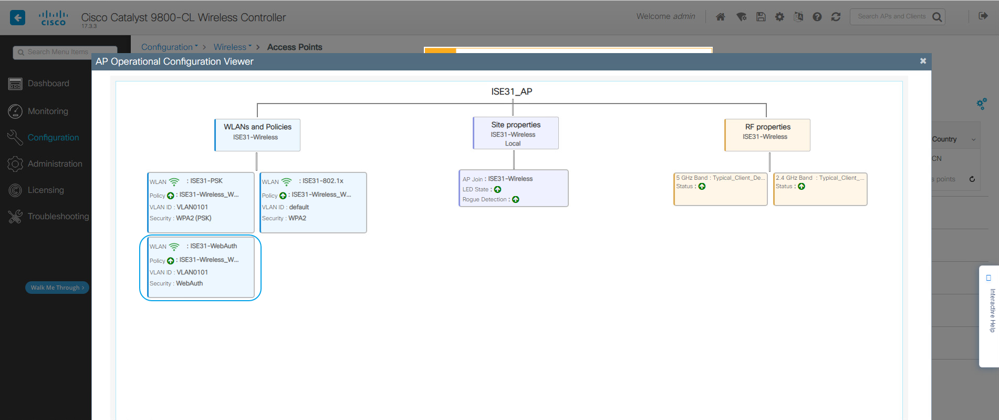

# WIN10-1计算机测试无线网络Web Authentication
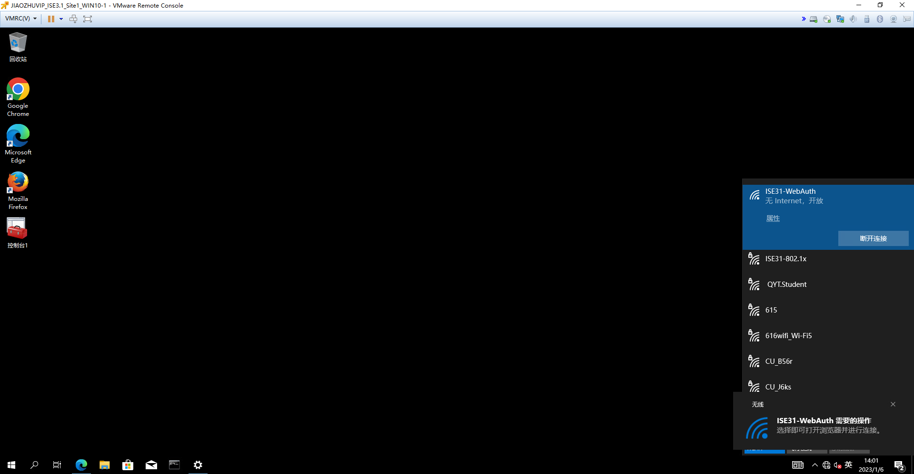
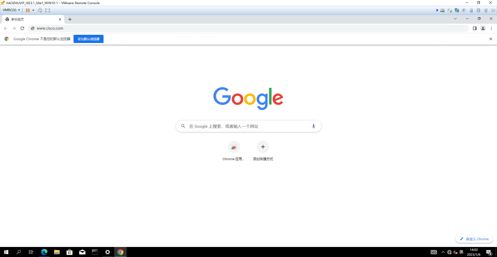
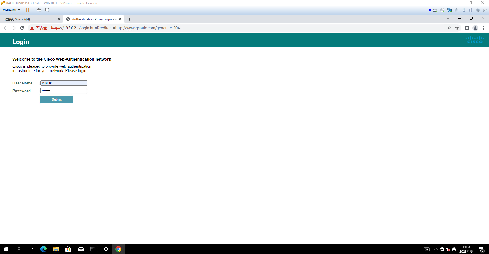
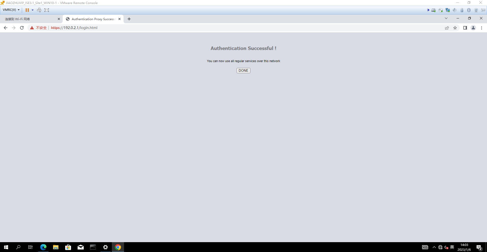
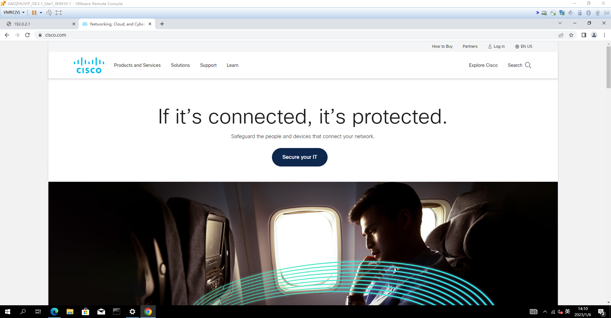

# 无线控制器上查看无线客户端信息
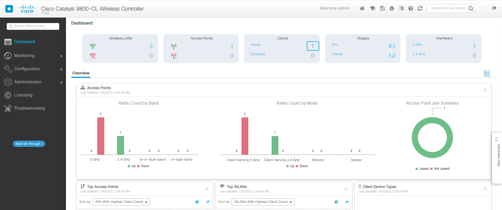
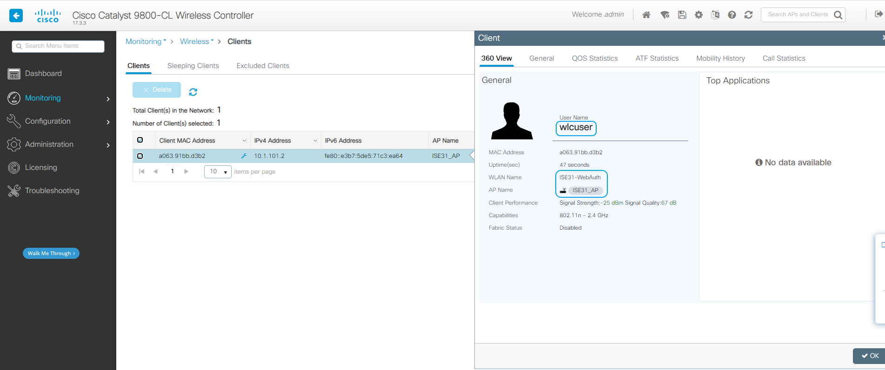
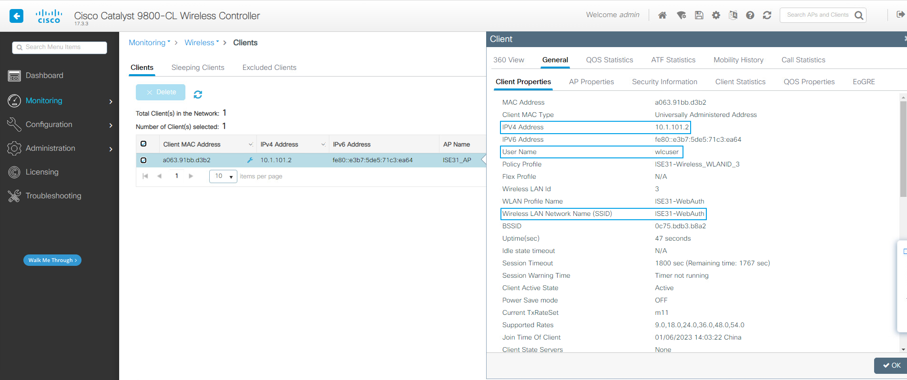
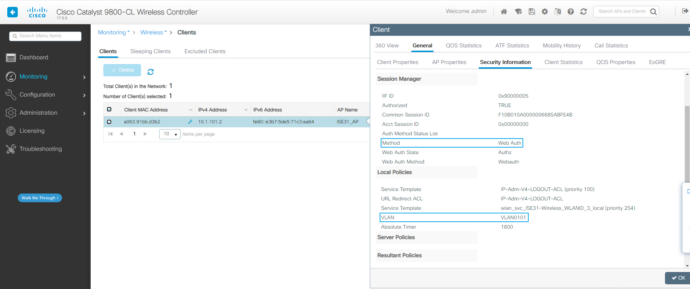

