## Guest Service有线测试 
> ### 1.找到sponsorportal链接
> ###  [三] --- Work Centers --- Guest Access --- Portals & Components
> ### Sponsor Portals --- Sponsor Portal(default)
>> ### Portal Settings --- Full qualified domain names(FQDN) and host names: sponsor.qytang.com
>> ### 注意需要做DNS A记录, 映射 sponsor.qytang.com到10.1.100.241 
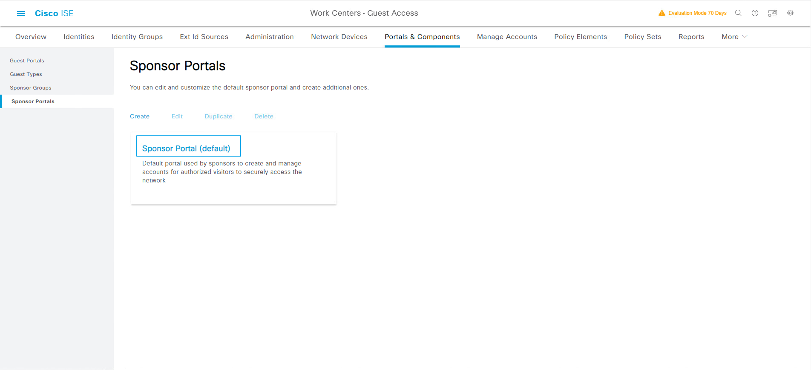
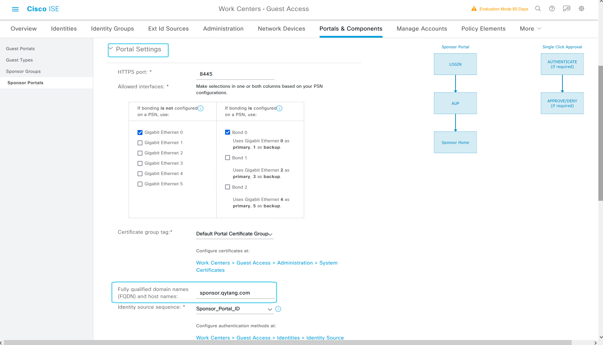
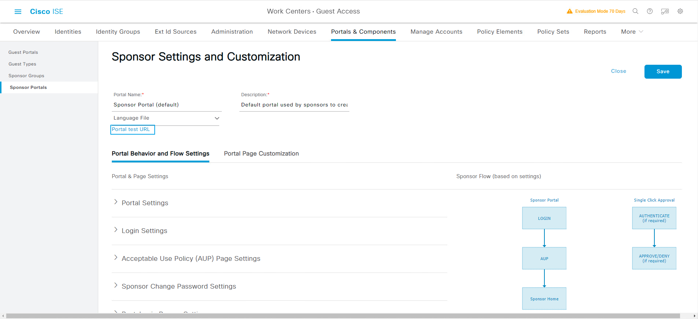

> ### 2.登录SponsorPortal页面
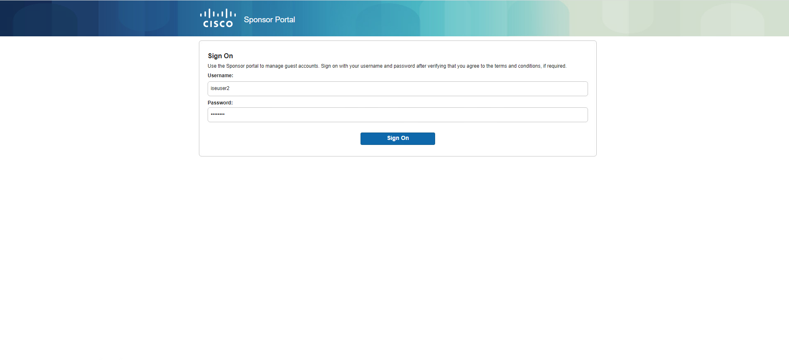

> ### 3.创建guest账户
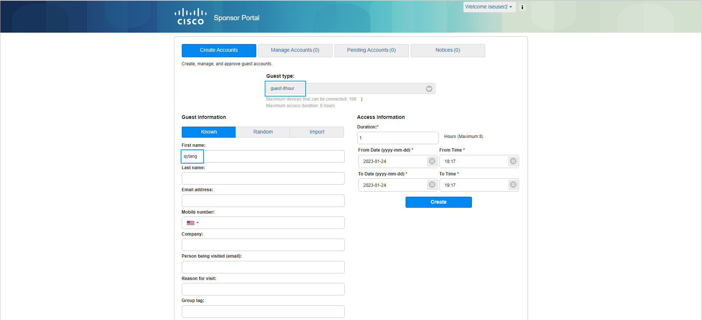

> ### 4.创建成功
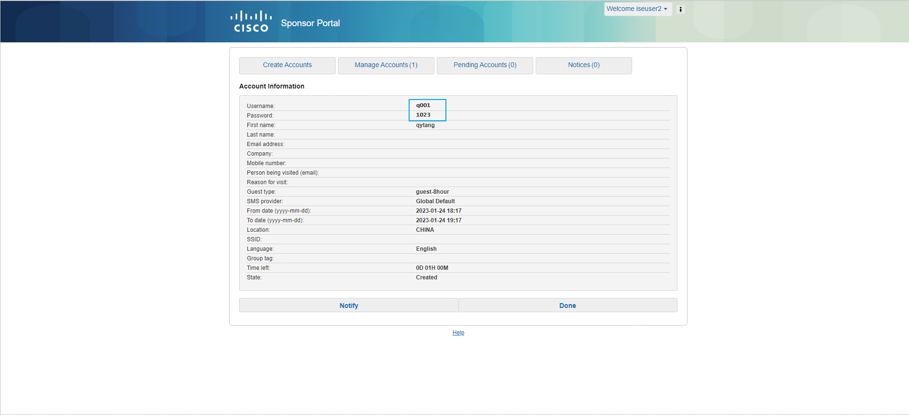

> ### 5.Site2-WIN10微软有线测试连接
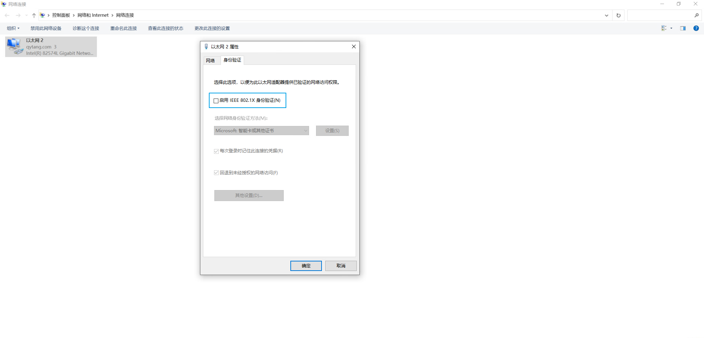

> ### 6.Guest认证之前接口的授权状态
```shell
Site2-SW#show authentication sessions int g1/0/6 details 
            Interface:  GigabitEthernet1/0/6
               IIF-ID:  0x18C779B4
          MAC Address:  0050.56a1.bcc5
         IPv6 Address:  fe80::6513:6c1d:f6a9:79ea
         IPv4 Address:  10.1.102.1
            User-Name:  00-50-56-A1-BC-C5
               Status:  Authorized
               Domain:  DATA
       Oper host mode:  multi-auth
     Oper control dir:  both
      Session timeout:  N/A
    Common Session ID:  0A0114FE0000009CE34791FF
      Acct Session ID:  0x000000c9
               Handle:  0x2b000076
       Current Policy:  POLICY_Gi1/0/6


Server Policies:
     URL Redirect ACL: WEB-REDIRECT
         URL Redirect: https://PSN-2.qytang.com:8443/portal/gateway?sessionId=0A0114FE0000009CE34791FF&portal=d06bc251-f644-4fc3-b09f-dae9bd8a86d5&action=cwa&token=f1683f71bff1b7a09c117cc56d00a457
              ACS ACL: xACSACLx-IP-Wired_POSTURE_REMEDIATION-63ba9863
          

Method status list:
       Method           State
          mab           Authc Success
```

> ### 7.Site2-WIN10上测试：输入有线Guest账号进行认证
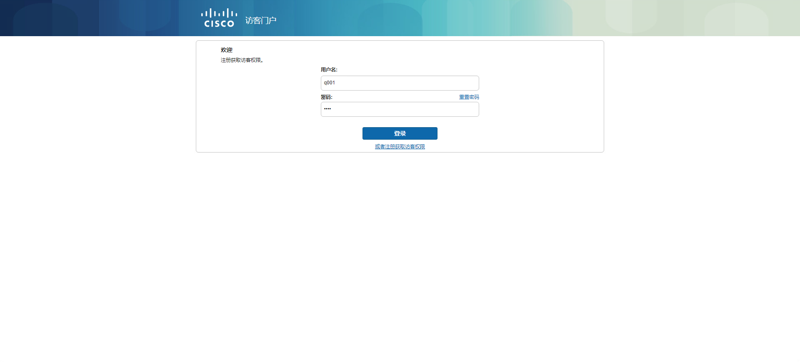


> ### 8.接受条款和条件
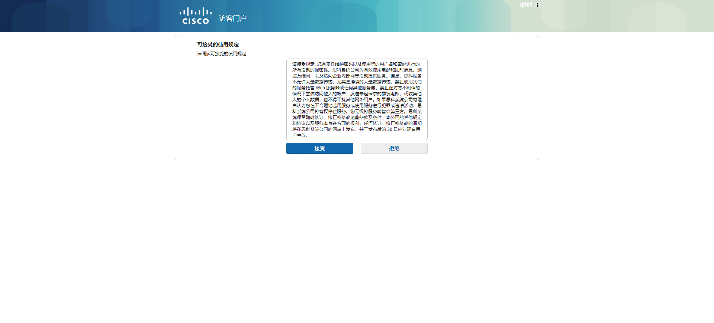
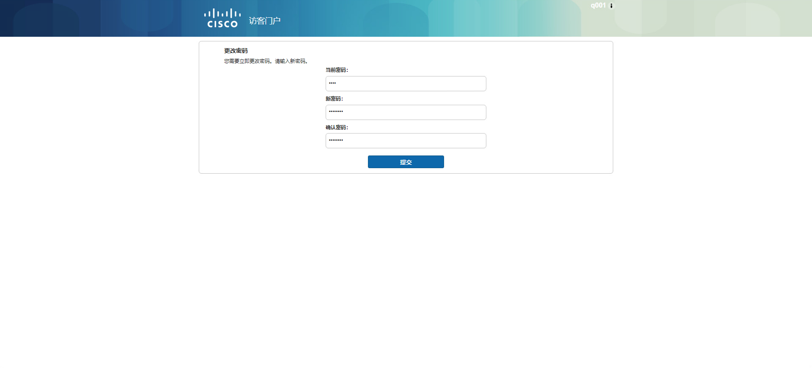
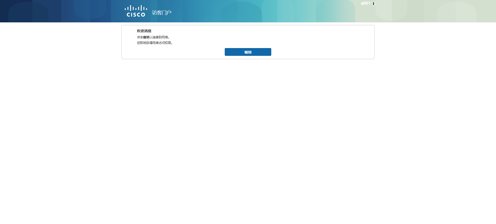
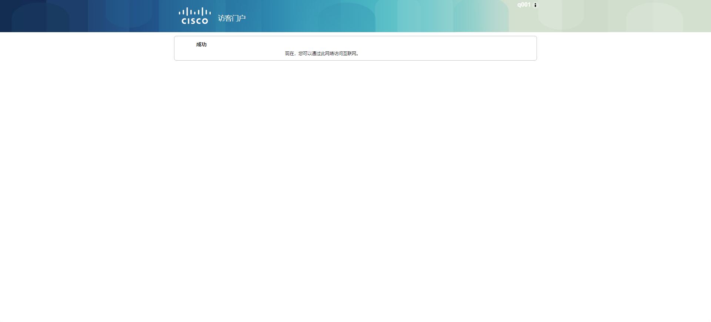


> ### 9.有线Guest认证成功后接口授权结果
```shell
Site2-SW#show authentication sessions int g1/0/6 details 
            Interface:  GigabitEthernet1/0/6
               IIF-ID:  0x18C779B4
          MAC Address:  0050.56a1.bcc5
         IPv6 Address:  fe80::6513:6c1d:f6a9:79ea
         IPv4 Address:  10.1.102.1
            User-Name:  q001
               Status:  Authorized
               Domain:  DATA
       Oper host mode:  multi-auth
     Oper control dir:  both
      Session timeout:  N/A
    Common Session ID:  0A0114FE0000009CE34791FF
      Acct Session ID:  0x000000cb
               Handle:  0x2b000076
       Current Policy:  POLICY_Gi1/0/6


Server Policies:
              ACS ACL: xACSACLx-IP-Guest-can-not-ping-63cfa560
```

> ### 10.ISE上查看日志
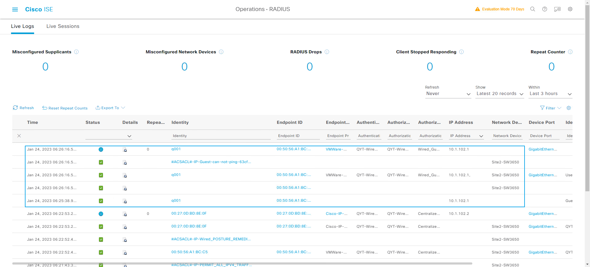


> ### 11.Site2-WIN10上测试ACL授权
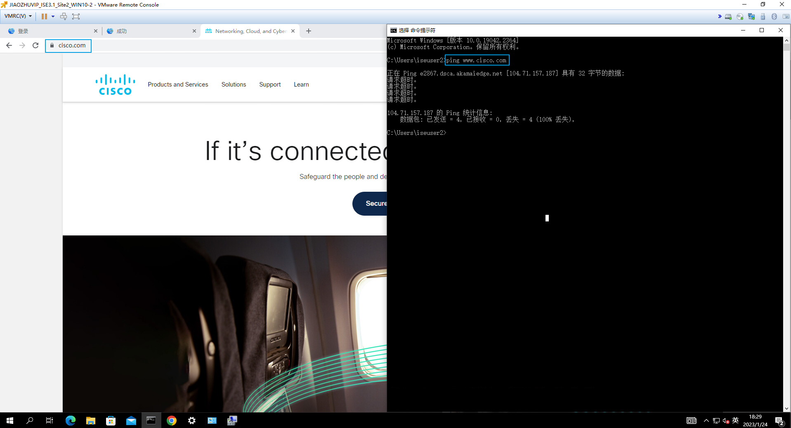