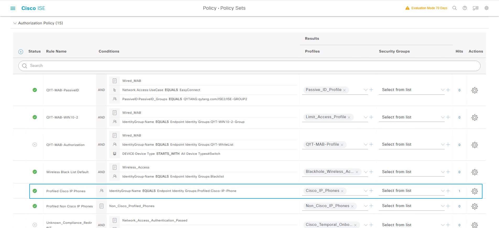

## Profiling Configuration
> ###  [三] --- Administration --- System --- Deployment
> ### Deployment --- PSN-2 --- Profiling Configuration
>> ### [勾选] DHCP
>> ### [勾选] DHCPSPAN
>> ### [勾选] HTTP
>> ### [勾选] RADIUS
>> ### [勾选] DNS
>> ### [勾选] SNMPQUERY
>> ### [勾选] SNMPTRAP
>> ### Save


## 配置Profiler CoA Type
> ###  [三] --- Administration --- System --- Settings
> ### Profiling --- Profiler Settings --- CoA Type: Reauth
> ### Save


## Site2-SW3650 DHCP配置
> ### 增加ISE接口地址为“helper-address”
```shell
interface Vlan102
 ip address 10.1.102.254 255.255.255.0
 ip helper-address 10.1.100.200
 ip helper-address 10.1.20.241
```

## Site2-SW Device-Sensor
> ### 激活Site2-SW的设备识别功能
```shell
device-sensor accounting 
device-sensor notify all-changes 
```

## 删除已有的Endpoints
> ###  [三] --- Work Centers --- Network Access --- Identities
> ### Endpoints --- Delete --- All


## 修改Site2-SW的SNMP Poll interval
> ###  [三] --- Administration --- Network Resources --- Network Devices
> ### [勾选] Site2-SW3650 --- Edit
>> ### [勾选]SNMP Settings --- Polling Interval: 600 


## 禁用“QYT-Wired-Web-Policy”策略(他会截获所有的MAB, 默认的授权无法生效)


## 删除或禁用已有的授权策略(课程初期, 手工为电话做的授权)
> ###  [三] --- Policy --- Policy Sets
> ### Default --- >
> ### Authorization --- QYT-MAB-Authorization --- Disable


## 删除QYT-WhiteList终端组里Mac Address (课程初期, 手工为电话放入的组)
> ###  [三] --- Administrator --- Identity Management
> ### Groups --- Endpoint Identity Groups --- QYT-WhiteList --- Remove All


## Voice VLAN相关配置
> ### 1.配置G1/0/6此接口连接IP Phone, voice vlan 99
```shell
vlan 99
 
interface GigabitEthernet1/0/6
 description ISE-MAB-DOT1X-WEBAUTH
 switchport mode access
 switchport voice vlan 99
 device-tracking attach-policy IPDT_MAX_10
 ip access-group ACL-DEFAULT in
 authentication event fail action next-method
 authentication event server dead action authorize vlan 102
 authentication event server alive action reinitialize 
 authentication host-mode multi-auth
 authentication open
 authentication order mab dot1x
 authentication priority dot1x mab
 authentication port-control auto
 authentication violation restrict
 mab
 dot1x pae authenticator
 spanning-tree portfast
 ```
> ### 2.创建VLAN9，并且配置IP地址
```shell
interface Vlan99
 ip address 10.1.99.254 255.255.255.0
 ```

> ### 3.配置helper-address
```shell
interface Vlan99
 ip address 10.1.99.254 255.255.255.0
 ip helper-address 10.1.100.200
 ip helper-address 10.1.20.241
```
## 配置DHCP服务器
> ### 名称: Site2_IPPHONE
> ### 范围: 10.1.99.1-10.1.99.100
> ### 掩码: /24
> ### 网关: 10.1.99.254


## 自动识别IP电话
> ###  [三] --- Work Centers --- Network Access --- Identities
> ### Endpoints


## 电话被自动放入“Cisco-IP-Phone”
> ###  [三] --- Administrator --- Identity Management --- Groups
> ### Endpoint Identity Groups --- Profiled --- Cisco-IP-Phone


## 匹配系统默认策略



## 查看授权结果“Cisco_IP_Phones”


## 查看Site2-SW3650的G1/0/6接口授权状态
```shell
Site2-SW#show authentication sessions int g1/0/6 details 
            Interface:  GigabitEthernet1/0/6
               IIF-ID:  0x1D1BF92C
          MAC Address:  0027.0dbd.8e0f
         IPv6 Address:  Unknown
         IPv4 Address:  10.1.99.1
            User-Name:  00-27-0D-BD-8E-0F
               Status:  Authorized
               Domain:  VOICE
       Oper host mode:  multi-auth
     Oper control dir:  both
      Session timeout:  N/A
    Common Session ID:  0A0114FE0000000EE6CED127
      Acct Session ID:  0x00000006
               Handle:  0x00000004
       Current Policy:  POLICY_Gi1/0/6


Server Policies:
              ACS ACL: xACSACLx-IP-PERMIT_ALL_IPV4_TRAFFIC-57f6b0d3


Method status list:
       Method           State
          mab           Authc Success
```


