## Cisco 1841 配置
```shell
interface FastEthernet0/0
 ip address dhcp
 no shutdown
```

## Site2-SW3650配置(不许刷这个配置Radius的探针才能生效)
```shell
interface GigabitEthernet1/0/1
 description QYT-Router
 switchport access vlan 102
 switchport mode access
 device-tracking attach-policy IPDT_MAX_10
 ip access-group ACL-DEFAULT in
 authentication event fail action next-method
 authentication event server dead action authorize vlan 102
 authentication event server alive action reinitialize 
 authentication host-mode multi-auth
 authentication open
 authentication order mab dot1x
 authentication priority dot1x mab
 authentication port-control auto
 authentication violation restrict
 mab
 dot1x pae authenticator
 spanning-tree portfast
```

## Cisco 1841路由器被识别为了"Cisco-Switch"
> ###  [三] --- Work Centers --- Network Access --- Identities
> ### Endpoints
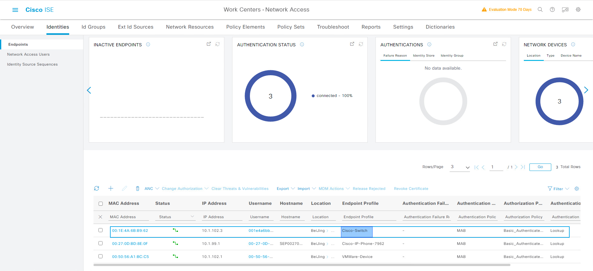


## 查看Endpoint的详细属性
> ### 关键属性如下
```shell
EndPointPolicy 	        Cisco-Switch
EndPointProfilerServer 	PSN-2.qytang.com
EndPointSource 	        SNMPQuery Probe (使用SNMP探针)
Total Certainty Factor 	45 (总分数)
cdpCacheAddress         10.1.102.3
cdpCacheCapabilities 	R;S;I
cdpCacheDeviceId        C1841
cdpCachePlatform        Cisco 1841
```
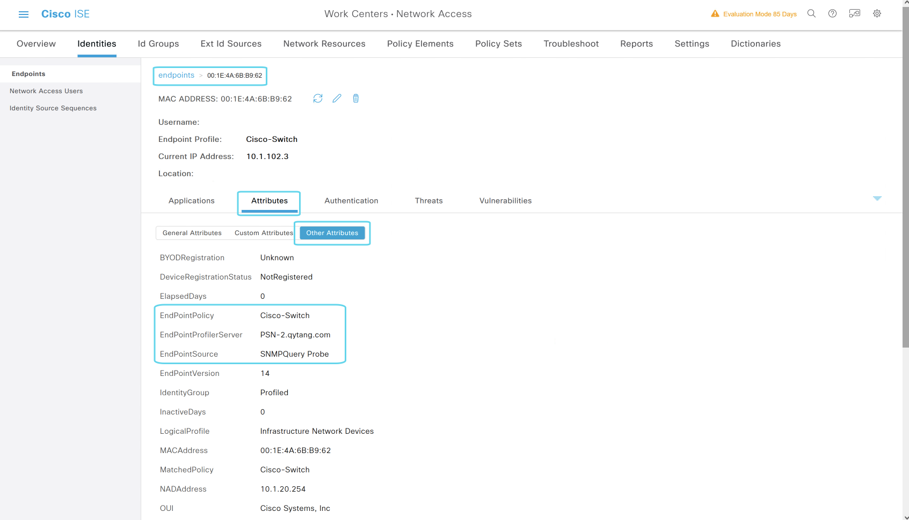
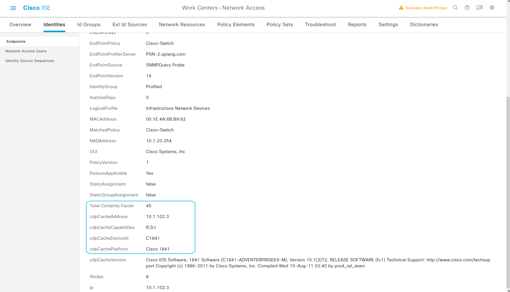

## 查看默认的路由器和交换机识别策略
> ###  [三] --- Policy --- Profiling
> ### Profiling Policies
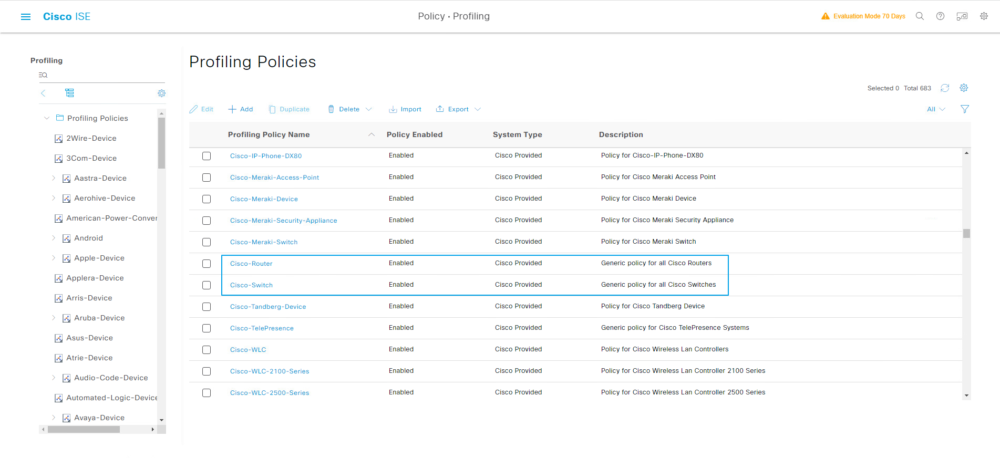


## 路由器的识别策略
> ###  [三] --- Policy --- Profiling
> ### Profiling Policies --- Cisco Router
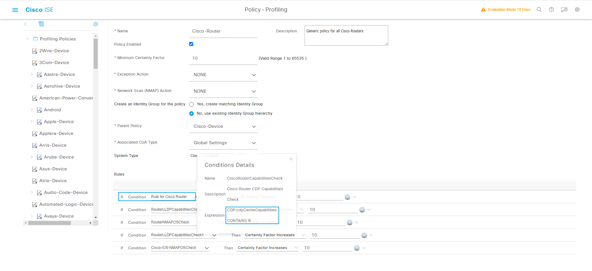

## 交换机的识别策略
> ###  [三] --- Policy --- Profiling
> ### Profiling Policies --- Cisco Switch
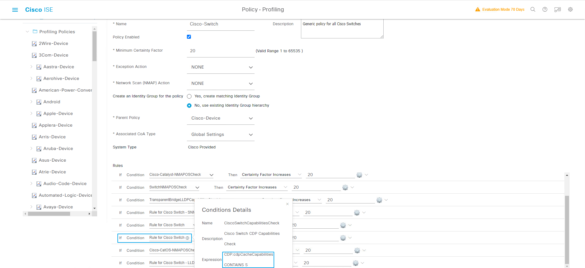


## 创建识别Cisco 1841的条件
> ###  [三] --- Policy --- Policy Elements --- Conditions
> ### Profiling --- Add
>> ### Name: QYT-Router
>> ### Type: CDP
>> ### Attribute Name: cdpCachePlatform
>> ### Operator: EQUALS
>> ### Attribute Value: Cisco 1841
>> ### Submit
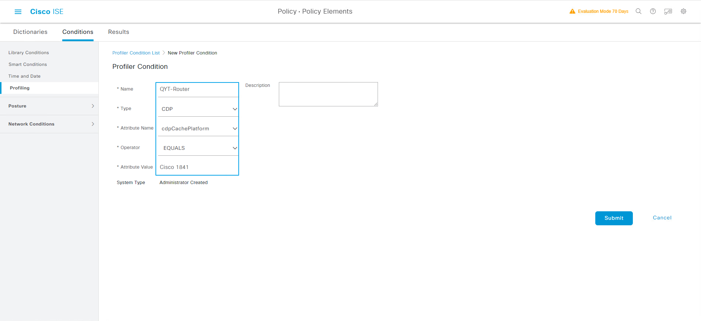

```shell
Site2-SW#show cdp neighbors gigabitEthernet 1/0/1 detail 
-------------------------
Device ID: C1841
Entry address(es): 
  IP address: 10.1.102.3
Platform: Cisco 1841,  Capabilities: Router Switch IGMP 
Interface: GigabitEthernet1/0/1,  Port ID (outgoing port): FastEthernet0/0
Holdtime : 170 sec

Version :
Cisco IOS Software, 1841 Software (C1841-ADVENTERPRISEK9-M), Version 15.1(3)T2, RELEASE SOFTWARE (fc1)
Technical Support: http://www.cisco.com/techsupport
Copyright (c) 1986-2011 by Cisco Systems, Inc.
Compiled Wed 10-Aug-11 03:45 by prod_rel_team

advertisement version: 2
VTP Management Domain: ''
Duplex: full


Total cdp entries displayed : 1
```


## 创建识别QYT-Router的策略(分数要高于识别为Cisco-Switch的分数)
> ###  [三] --- Policy --- Profiling
> ### Profiling Policies --- Add
>> ### Nmae: QYT-Router
>> ### Minimum Certainty Factor: 70
>> ### If Condition: QYT-Router Then Certainty Factor Increases: 70
>> ### Submit
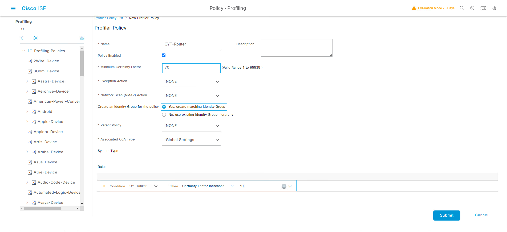

## 系统识别到了QYT-Router
> ###  [三] --- Work Centers --- Network Access --- Identities
> ### Endpoints
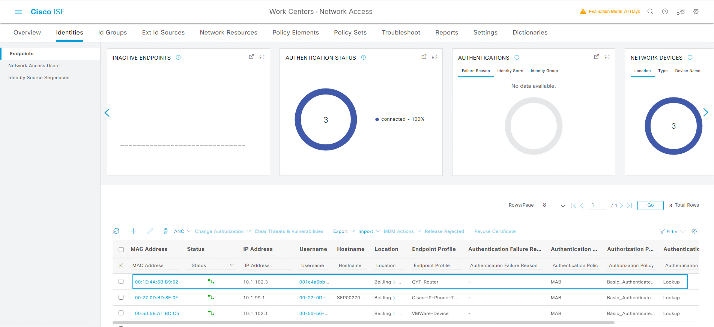


## 系统产生了QYT-Router组
> ###  [三] --- Administrator --- Identity Management --- Groups
> ### Endpoint Identity Groups --- Profiled --- QYT-Router
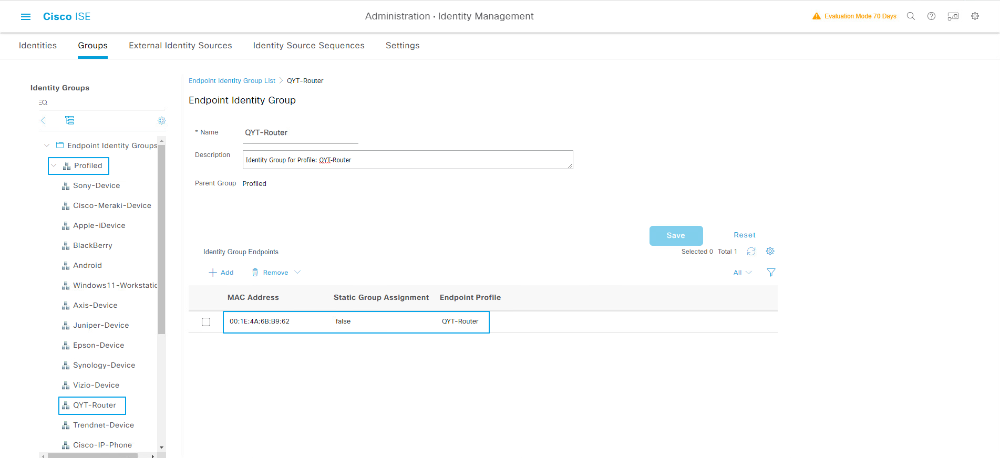

## 配置Authorization Profile
> ###  [三] --- Policy --- Policy Elements --- Results
>> ### Authorization --- Authorization Profiles --- Add
>>> ### *Name: QYT-Router-Profile
>>> ### Common Tasks
>>>> ### [勾选] DACL Name: PERMIT_ALL_IPv4_TRAFFIC
>>>> ### [勾选] VLAN  Tag ID: 1 --- ID/Name: 102
>>> ### Submit


## 配置授权策略
> ###  [三] --- Policy --- Policy Sets 
> ### Default --- > View
> ### Authorization Policy --- +
>> ### Rule: QYT-Router
>> ### Conditions: DEVICE-Device Type EQUALS All Device Types#Switch#Site2-SW3650
>> ### Conditions: IdentityGroup-Name EQUALS Endpoint Identity Group:Profiled: QYT-Router
>> ### Results Profiles: QYT-Router-Profile
>> ### Save

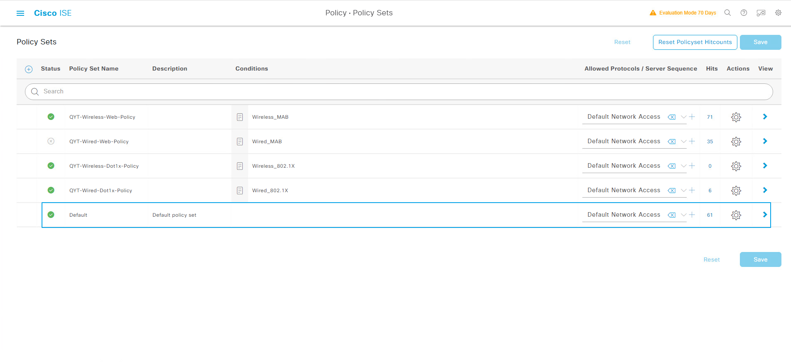
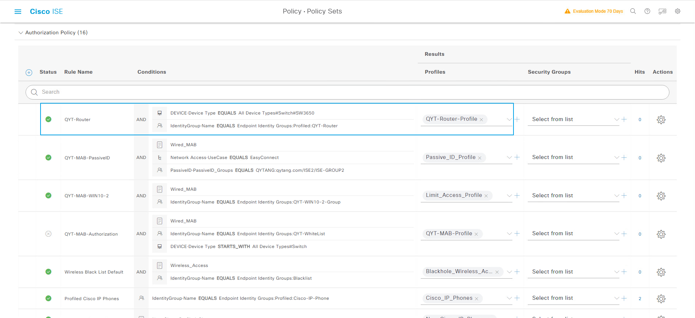


## 查看ISE上Live Logs
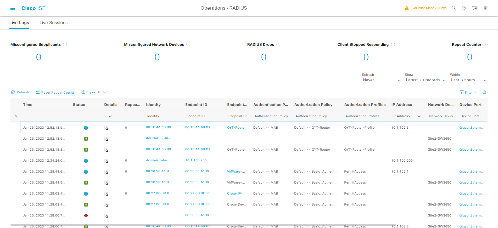


## 查看Site2-SW3650的G1/0/6接口授权状态
```shell
Site2-SW#show authentication sessions int g1/0/1 details 
            Interface:  GigabitEthernet1/0/1
               IIF-ID:  0x10A1FB7A
          MAC Address:  001e.4a6b.b962
         IPv6 Address:  Unknown
         IPv4 Address:  10.1.102.3
            User-Name:  00-1E-4A-6B-B9-62
               Status:  Authorized
               Domain:  DATA
       Oper host mode:  multi-auth
     Oper control dir:  both
      Session timeout:  N/A
    Common Session ID:  0A0114FE00000015E73F4DF3
      Acct Session ID:  0x00000010
               Handle:  0x9d00000b
       Current Policy:  POLICY_Gi1/0/1


Server Policies:
           Vlan Group:  Vlan: 102
              ACS ACL: xACSACLx-IP-PERMIT_ALL_IPV4_TRAFFIC-57f6b0d3


Method status list:
       Method           State
          mab           Authc Success
```