## Posture Updates Web
> ###  [三] --- Work Centers --- Posture --- Setting
> ### Software Updates --- Posture Updates --- Web --- Update Now
> ### 在线升级大概所需30分钟左右
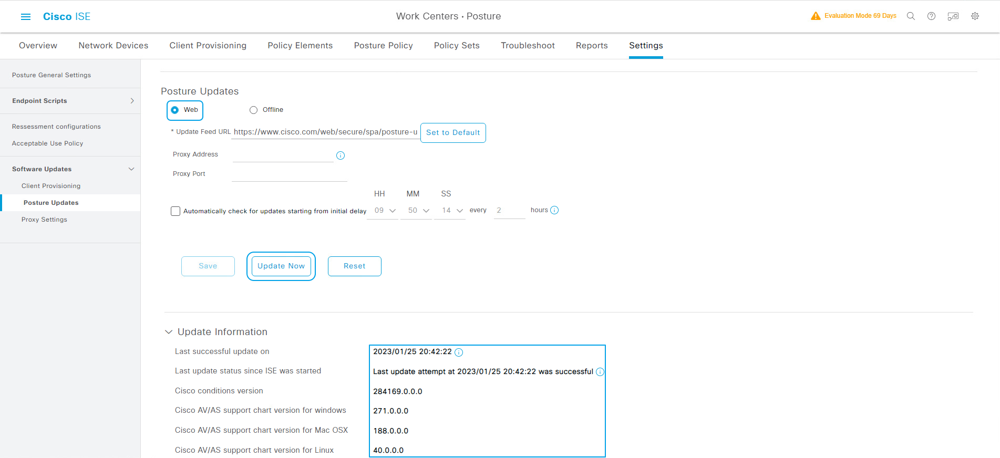


## Posture Updates Offline
> ###  [三] --- Work Centers --- Posture --- Setting
> ### Software Updates --- Posture Updates --- Offline --- Choose File [posture-offline] --- Update Now
> ### 若无法在线升级，可以通过离线文件升级
> ### 离线文件下载地址 https://www.cisco.com/web/secure/pmbu/posture-offline.html 
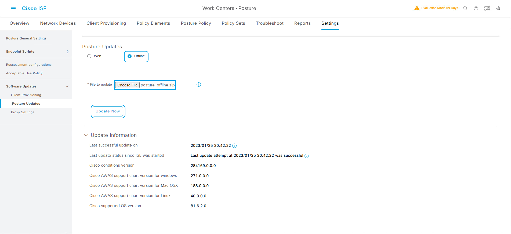

## 从Cisco站点加载Agent资源 
> ###  [三] --- Policy --- Policy Elements --- Results
> ### Client Provisioning --- Resources -- Add --- Agent resources from Cisco Site
> ### 可以通过Cisco站点在线下载Agent资源 [anyconnect镜像只能本地硬盘加载]
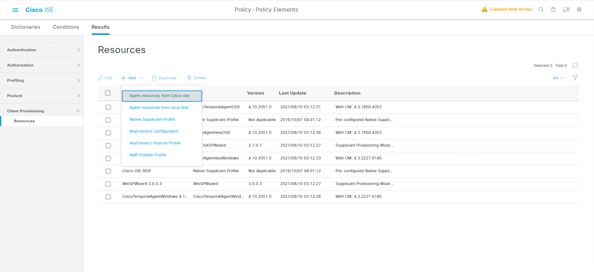
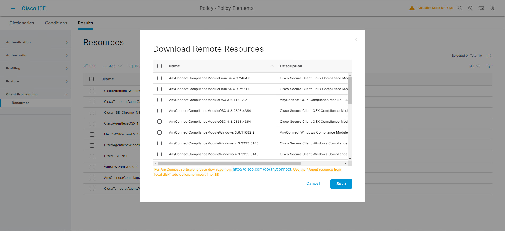


## 从本地硬盘加载Agent资源 
> ###  [三] --- Policy --- Policy Elements --- Results
> ### Client Provisioning --- Resources -- Add --- Agent resources from local disk
> ### 文件路径: C:\ISE-Anyconnect-ALL
> ### 需要加载的文件名称如下:
```shell
anyconnect-win-4.2.1538.0-isecompliance-webdeploy-k9.pkg
anyconnect-win-4.5.05030-webdeploy-k9.pkg
```
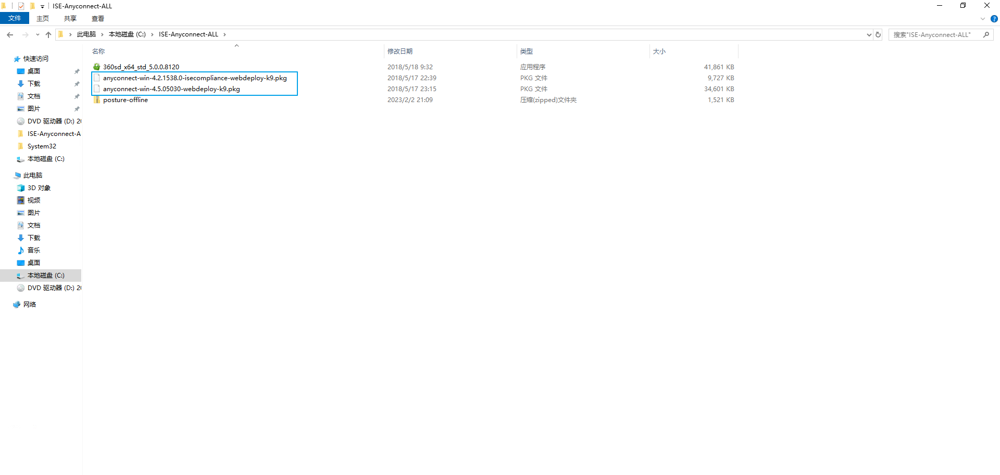
> ### 从本地硬盘加载Agent资源
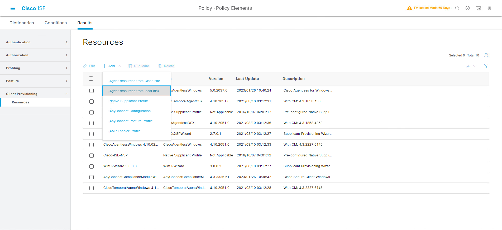
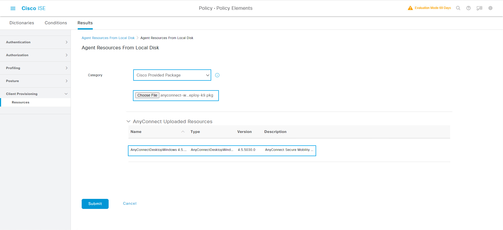
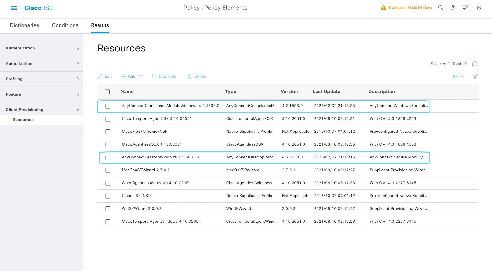
> ### 系统自带的Agent资源
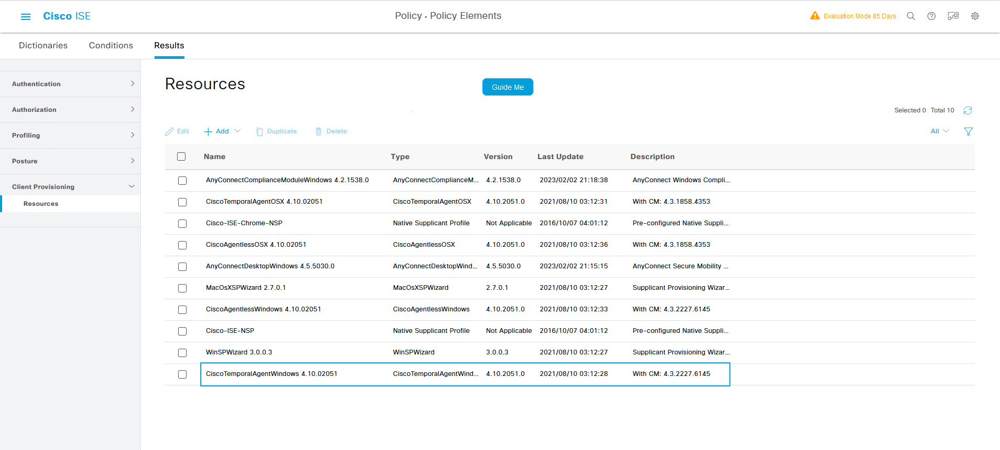
> ### 实验所需最终Agent资源
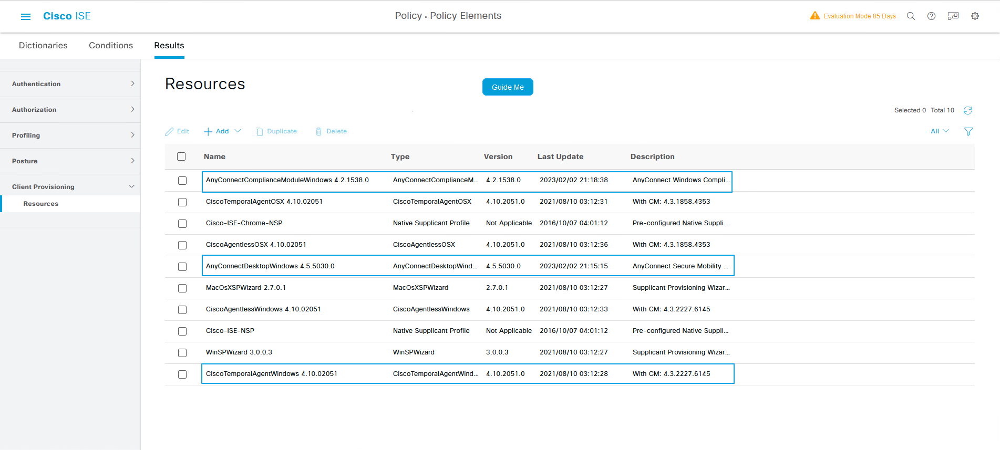


## 创建Anyconnect Posture Profile
> ###  [三] --- Policy --- Policy Elements --- Results
> ### Client Provisioning --- Resources -- Add --- AnyConnect Posture Profile
>> ### Name: Anyconnect-Posture-Profile
>> ### IP Address Change --- VLAN detection interval: 5
>> ### Posture Protocol --- Discovery host: psn-2.qytang.com
>> ### Posture Protocol --- Server name rules: *.qytang.com, *.cisco.com
>> ### Save
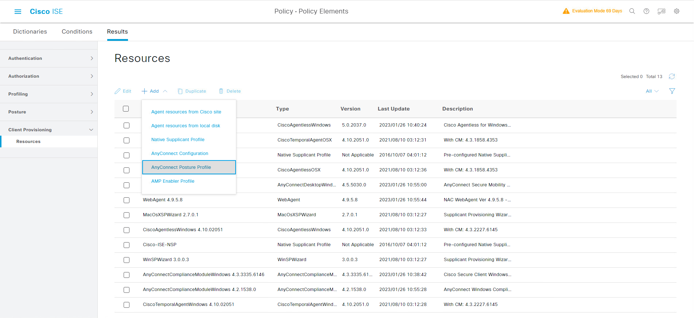
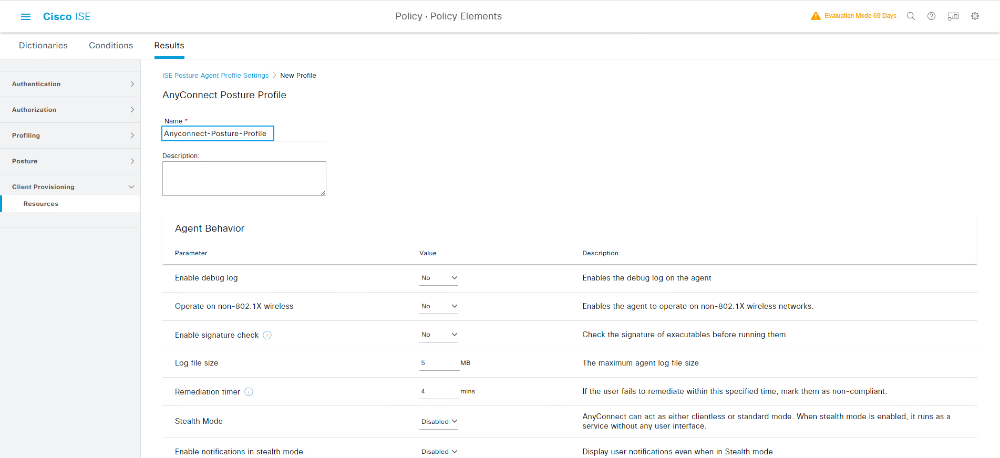
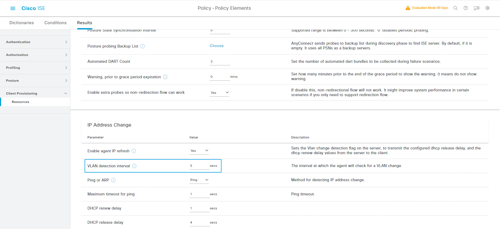
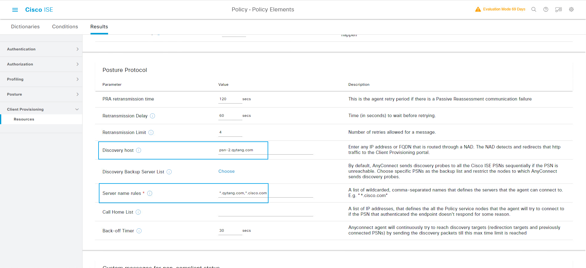


## 创建Anyconnect Configuration 
> ###  [三] --- Policy --- Policy Elements --- Results
> ### Client Provisioning --- Resources -- Add --- AnyConnect Configuration
>> ### Select AnyConnect Package: AnyconnectDesktopWindows 4.5.5030.0
>> ### Compliance Module: AnyconnectComplianceModuleWindows 4.2.1538.0
>> ### AnyConnect Module Selection --- ISE Posture[勾选]
>> ### AnyConnect Module Selection --- VPN[勾选]
>> ### AnyConnect Module Selection --- Network Access Manager[勾选]
>> ### Profile Selection --- ISE Posture: Anyconnect-Posture-Profile
>> ### Submit
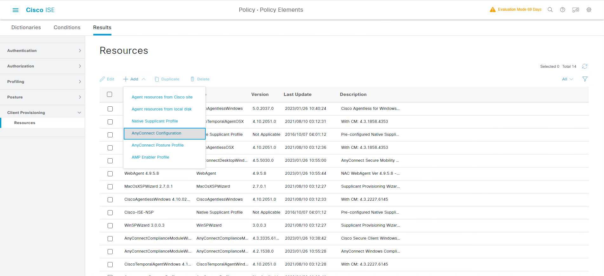
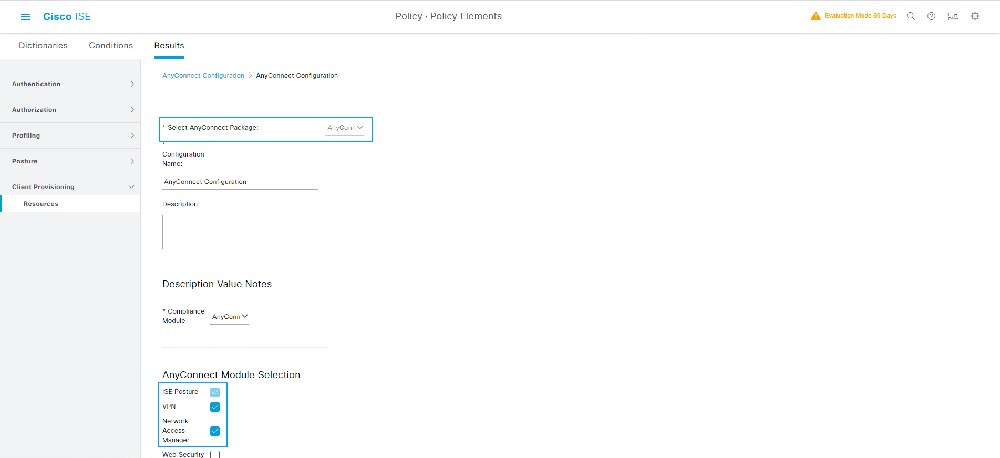
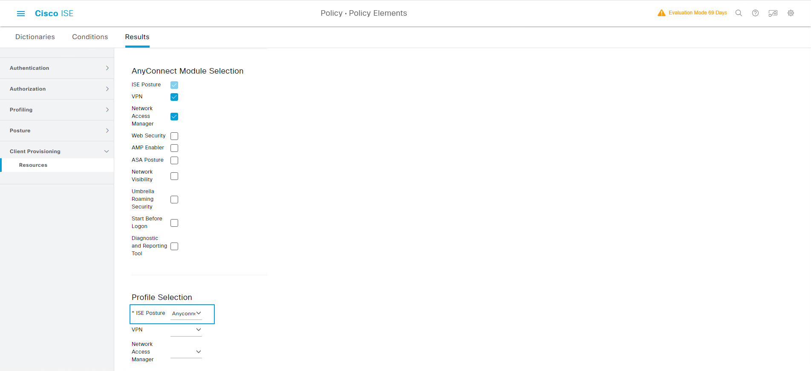


## Client Provisioning策略
> ###  [三] --- Policy --- Client Provisioning
> #### 选择任何一个策略右边的"Edit"旁边的"V", "Insert new policy above"
>> ### Rule Name: QYT_Employee 
>>> ### Operating Systems: Windows All
>>> ### Other Conditions: QYTNAG:ExternalGroups EQUALS qytang.com/ISE2/ISE-GROUP2
>>> ### Results: AnyConnect Configuration
>> ### Rule Name: QYT_Guest
>>> ### Identity Groups: GuestType_guest-8hour
>>> ### Operating Systems: Windows All
>>> ### Results: CiscoTemporalAgentWindows 4.10.02051
>> ### Save
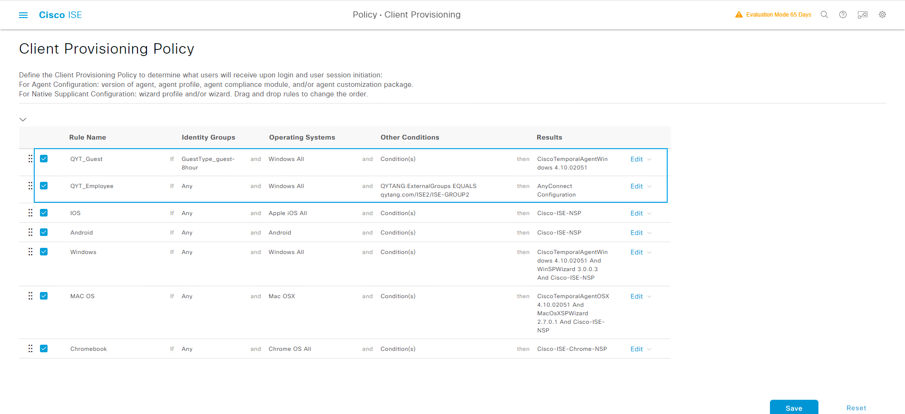

## 修改Guest Portals
> ###  [三] --- Work Centers --- Guest Access --- Portals & Components
> ### Guest Portals --- Self-Registered Guest Portal(default)
>> ### Guest Device Compliance Settings --- [勾选] Require guest device compliance
>> ### Save
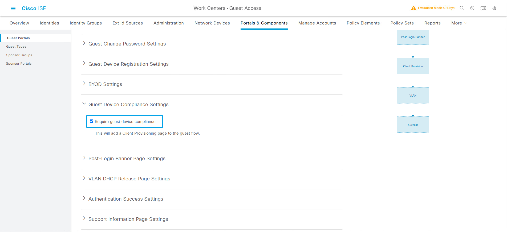


## 配置Posture用Authorization Profile
> ###  [三] --- Policy --- Policy Elements --- Results
> ### Authorization --- Authorization Profiles --- Add
>> ### *Name: Posture_Remediation
>> ### Common Tasks
>>> ### [勾选] DACL Name: Wired_POSTURE_REMEDIATION
>>> ### [勾选] Web Redirection (CWA, MDM, NSP, CPP) 
>>> ### Client Provisioning(Posture) --- ACL: WEB-REDIRECT  --- Value: Client Provisioning Posture(default)
>> ### Submit
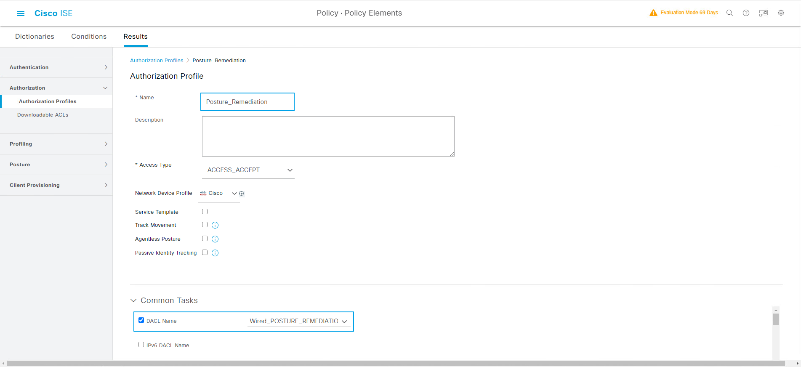
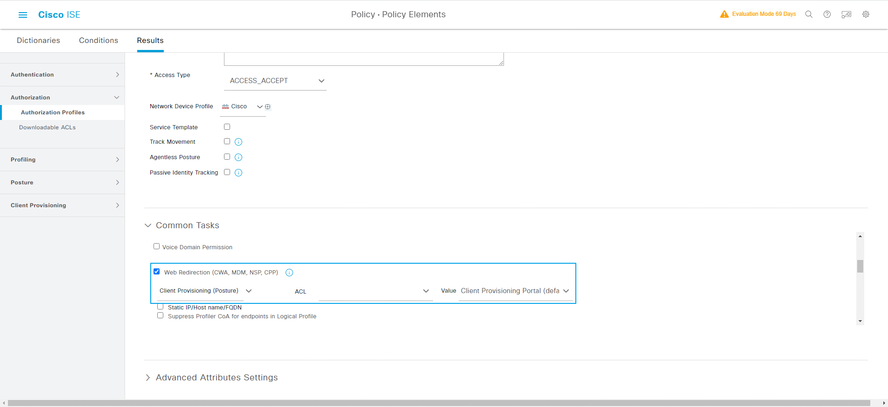


## 配置DOT1X授权策略 
>> ###  [三] --- Policy --- Policy Sets --- QYT-Wired-Dot1x-Policy --- > View
> ### Authorization Policy --- +
>> ### Rule Name: QYT-Dot1x-Compliant
>>> ### Conditions: DEVICE-Device Type EQUALS All Device Types#Switch#Site2-SW3650
>>> ### Conditions: Device-Location EQUALS All Location#BeiJing#YCGJ516
>>> ### Conditions: QYTANG-ExternalGroups EQUALS qytang.com/ISE2/ISE-GROUP2
>>> ### Conditions: Session-PostureStatus EQUALS Compliant
>>> ### Results Profiles: QYT-Dot1x-Profile

>> ### Rule Name: QYT-Dot1x-NonCompliant
>>> ### Conditions: DEVICE-Device Type EQUALS All Device Types#Switch#Site2-SW3650
>>> ### Conditions: Device-Location EQUALS All Location#BeiJing#YCGJ516
>>> ### Conditions: QYTANG-ExternalGroups EQUALS qytang.com/ISE2/ISE-GROUP2
>>> ### Conditions: Session-PostureStatus EQUALS NonCompliant
>>> ### Results Profiles: Posture_Remediation

>> ### Rule Name: QYT-Dot1x-Unknown
>>> ### Conditions: DEVICE-Device Type EQUALS All Device Types#Switch#Site2-SW3650
>>> ### Conditions: Device-Location EQUALS All Location#BeiJing#YCGJ516
>>> ### Conditions: QYTANG-ExternalGroups EQUALS qytang.com/ISE2/ISE-GROUP2
>>> ### Conditions: Session-PostureStatus EQUALS Unknown
>>> ### Results Profiles: Posture_Remediation

>> ### Rule: QYT-Dot1x-Authorization --- Disabled
>> ### Save
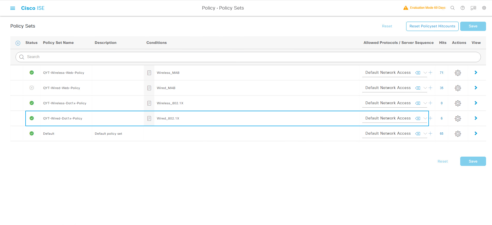
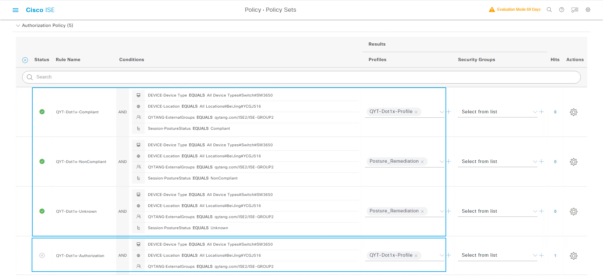


## 配置Guest-Wired认证策略
>> ###  [三] --- Policy --- Policy Sets --- QYT-Wired-Web-Policy --- > View
> ### Authorization Policy --- +
>> ### Rule Name: QYT-Wired-Guest_Compliant
>>> ### Conditions: DEVICE-Device Type EQUALS All Device Types#Switch#Site2-SW3650
>>> ### Conditions: Device-Location EQUALS All Location#BeiJing#YCGJ516
>>> ### Conditions: IdentityGroup-Name EQUALS User Identity Groups: GuestType_guest-8hour
>>> ### Conditions: Session-PostureStatus EQUALS Compliant
>>> ### Results Profiles: Wired_Guest_Profile

>> ### Rule Name: QYT-Wired-Guest --- Disabled

>> ### Rule Name: Profiled Cisco IP Phones (确保IP电话的授权)
>>> ### Conditions: IdentityGroup-Name EQUALS Endpoint Identity Groups:Profiled:Cisco-IP-Phone
>>> ### Results Profiles: Cisco_IP_Phones
> ### Save
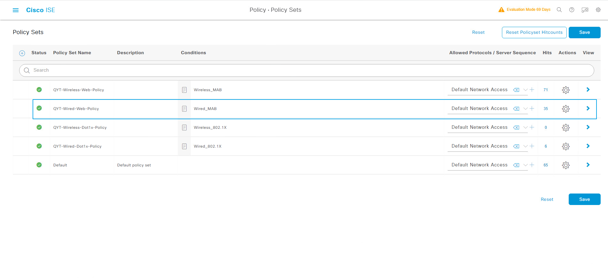
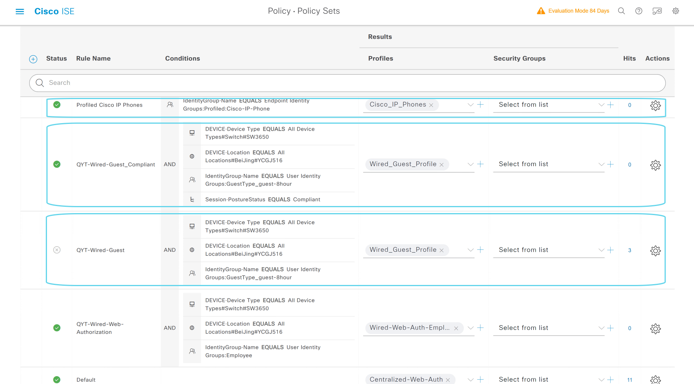


