## Site2-SW3650接口配置
```shell
interface GigabitEthernet1/0/6
 description ISE-MAB-DOT1X-WEBAUTH
 switchport access vlan 102
 switchport mode access
 switchport voice vlan 99
 device-tracking attach-policy IPDT_MAX_10
 ip access-group ACL-DEFAULT in
 authentication event fail action next-method
 authentication event server dead action authorize vlan 102
 authentication event server alive action reinitialize 
 authentication host-mode multi-auth
 authentication open
 authentication order mab dot1x
 authentication priority dot1x mab
 authentication port-control auto
 authentication violation restrict
 mab
 dot1x pae authenticator
 spanning-tree portfast
```
      

## Site2-WIN10配置系统内置Dot1x
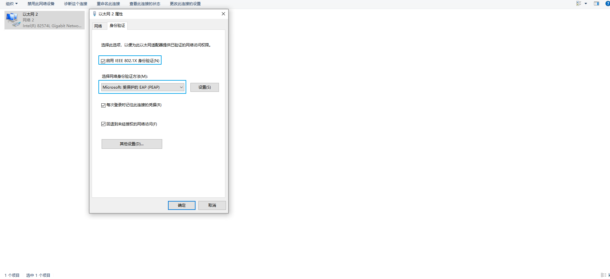


## 查看ISE上Live Logs
> ### 由于客户端没有NAC客户端，安全检测不通过，给修复的授权
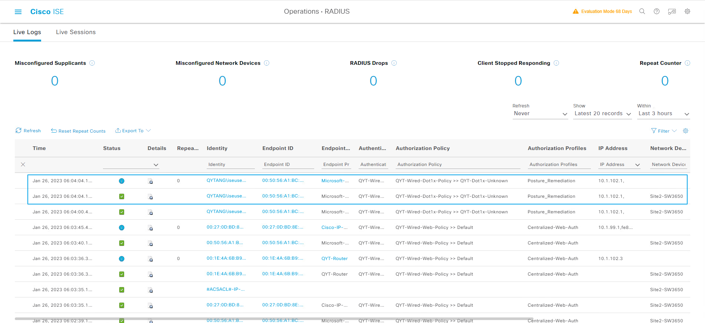
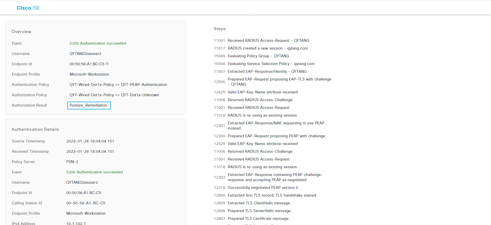


## Site2-WIN10测试Anyconnect安装
> ### 如果WEB认证超时：
>> ### 1.Site2-SW3650上清除认证session
>> ### 2.Site2-WIN10上重新DOT1X拨号
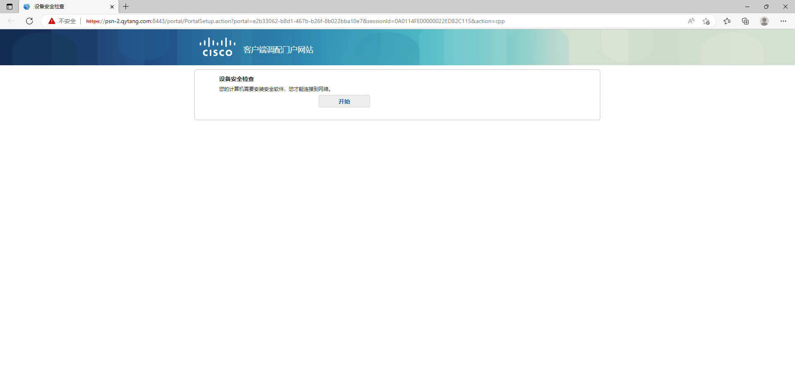
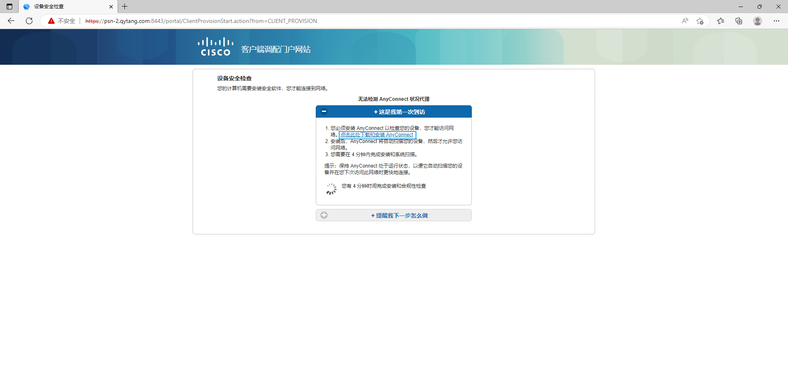
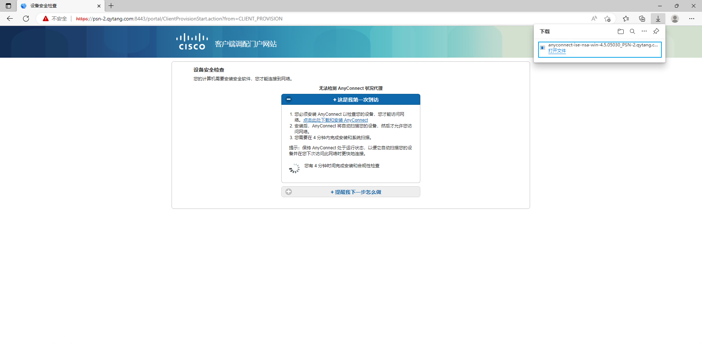
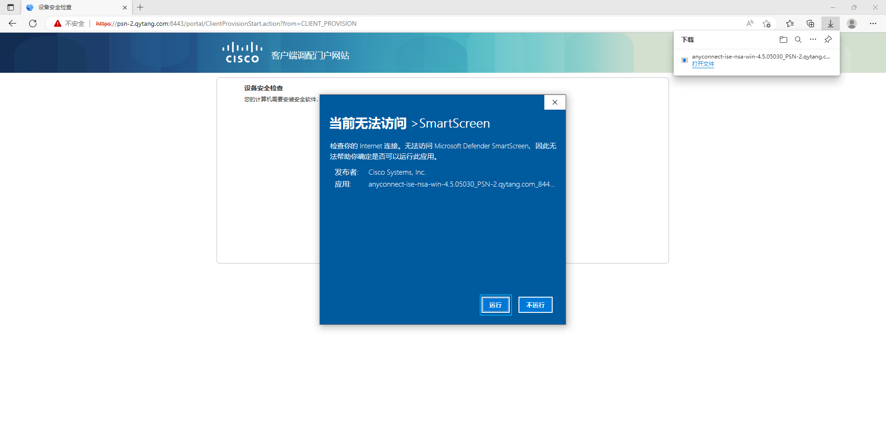
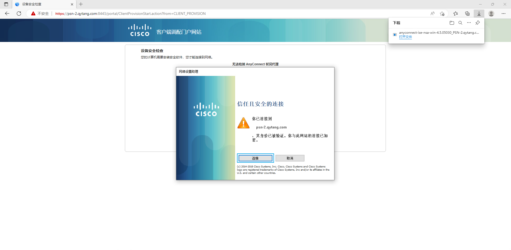
> ### 安装完毕后需要重启系统
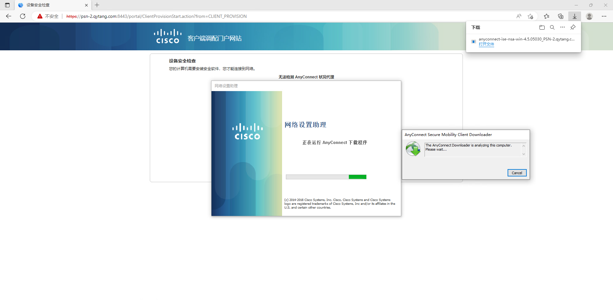
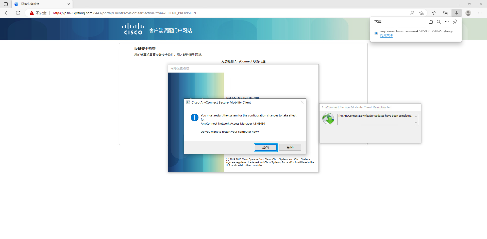
> ### 如果扫描问题,可以清除认证信息,重新触发一次
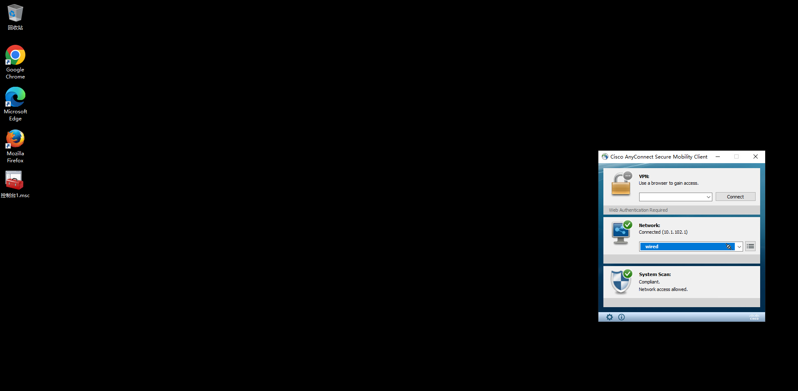
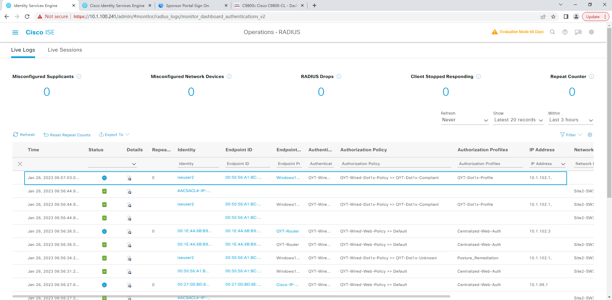
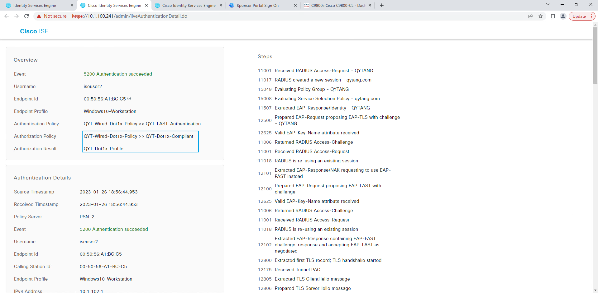
> ### Site2-SW3650上查看接口授权状态
```shell
Site2-SW#show authentication sessions int g1/0/6 details

            Interface:  GigabitEthernet1/0/6
               IIF-ID:  0x1E6924C1
          MAC Address:  0050.56a1.bcc5
         IPv6 Address:  fe80::6513:6c1d:f6a9:79ea
                        fe00::
         IPv4 Address:  10.1.102.1
            User-Name:  iseuser2
               Status:  Authorized
               Domain:  DATA
       Oper host mode:  multi-auth
     Oper control dir:  both
      Session timeout:  N/A
    Common Session ID:  0A0114FE00000068EDB3242B
      Acct Session ID:  0x00000023
               Handle:  0x6800001a
       Current Policy:  POLICY_Gi1/0/6


Server Policies:
              ACS ACL: xACSACLx-IP-PERMIT_ALL_IPV4_TRAFFIC-57f6b0d3
      Security Policy:  None
      Security Status:  Link Unsecured
           Vlan Group:  Vlan: 102


Method status list:
       Method           State
          mab           Stopped
        dot1x           Authc Success
```