## Site2-WIN10测试WEB客户端安装 

> ### Site2-WIN10 创建 "Open" (不认证)
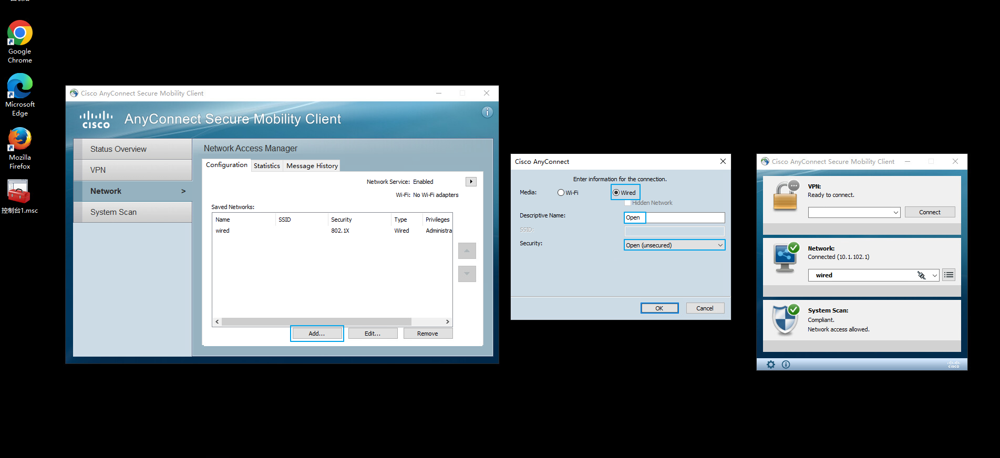

> ### Site2-WIN10 使用 "Open" 连接网络
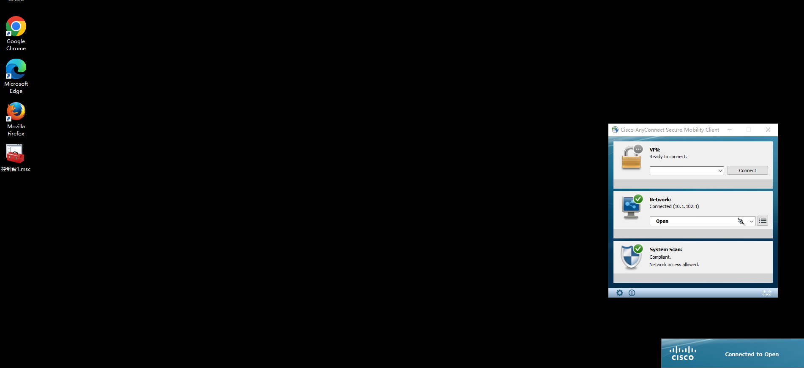

> ### Site2-SW3650上清除dot1x auth session(也可以shutdown/no shutdown)，匹配"Centralized-Web-Auth"
```shell
Site2-SW#clear authentication sessions
Site2-SW#show authentication sessions                    
Interface                MAC Address    Method  Domain  Status Fg  Session ID
--------------------------------------------------------------------------------------------
Gi1/0/6                  0050.56a1.bcc5 mab     DATA    Auth        0A0114FE0000006AEDC4113F
```
```shell
Site2-SW#show authentication sessions int g1/0/6 details 
            Interface:  GigabitEthernet1/0/6
               IIF-ID:  0x1FDB6661
          MAC Address:  0050.56a1.bcc5
         IPv6 Address:  fe80::6513:6c1d:f6a9:79ea
                        fe00::
         IPv4 Address:  10.1.102.1
            User-Name:  00-50-56-A1-BC-C5
               Status:  Authorized
               Domain:  DATA
       Oper host mode:  multi-auth
     Oper control dir:  both
      Session timeout:  N/A
    Common Session ID:  0A0114FE0000006AEDC4113F
      Acct Session ID:  0x00000025
               Handle:  0xef00001c
       Current Policy:  POLICY_Gi1/0/6


Server Policies:
     URL Redirect ACL: WEB-REDIRECT
         URL Redirect: https://PSN-2.qytang.com:8443/portal/gateway?sessionId=0A0114FE0000006AEDC4113F&portal=d06bc251-f644-4fc3-b09f-dae9bd8a86d5&action=cwa&token=18ab968070d0010fd30695c47f2868fe
              ACS ACL: xACSACLx-IP-Wired_POSTURE_REMEDIATION-63ba9863


Method status list:
       Method           State
          mab           Authc Success
```


> ### Site2-WIN10客户端测试访问认证(如果出现故障清空游览器历史记录)
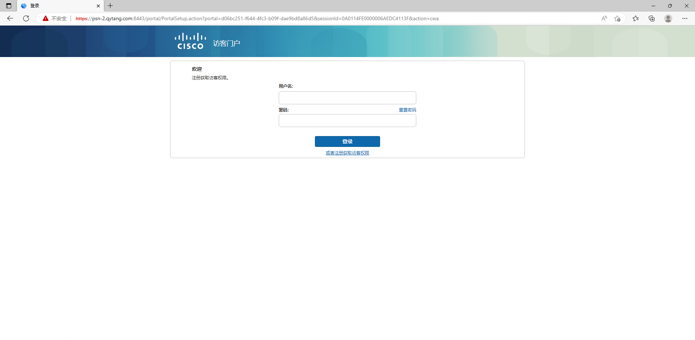
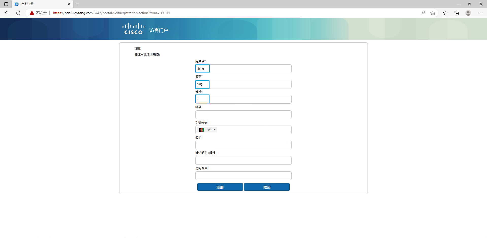
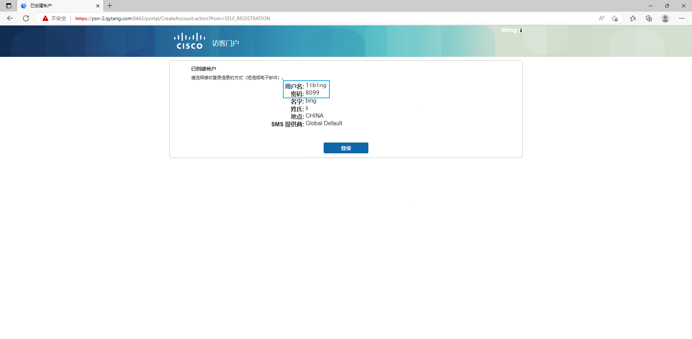

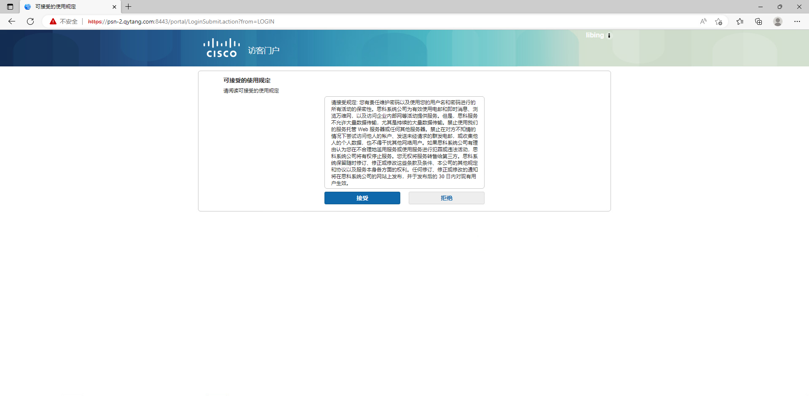

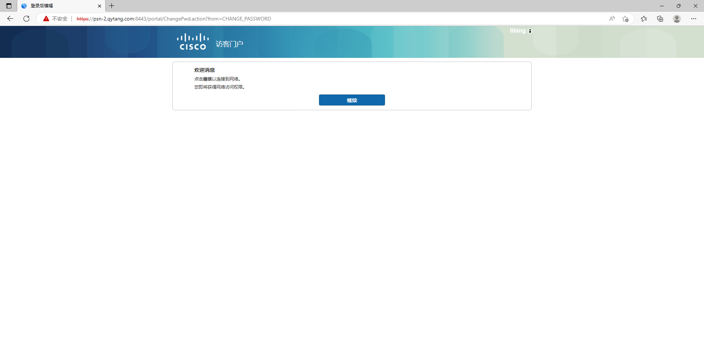
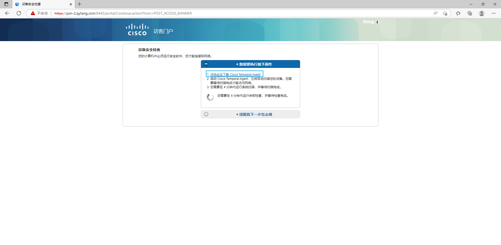
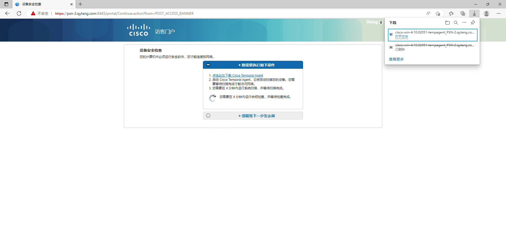
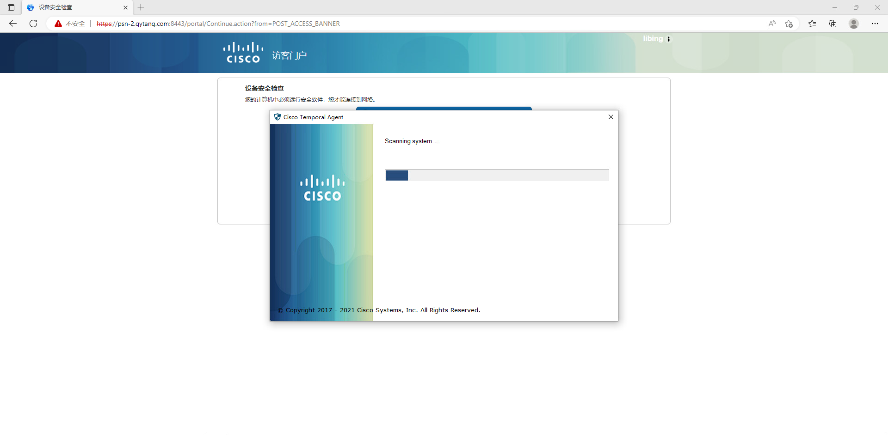


> ### Site2-WIN10客户端测试访问互联网网站
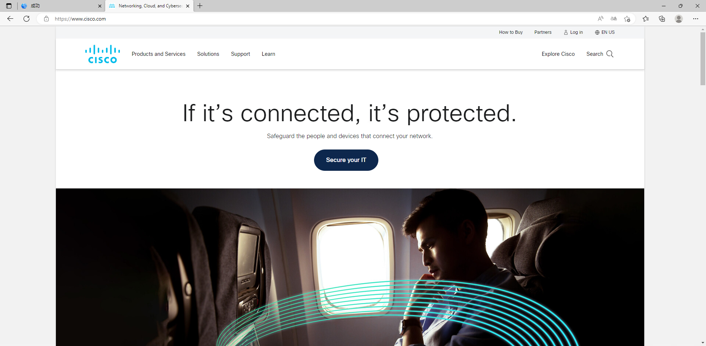

> ### Site2-WIN10客户端测试icmp
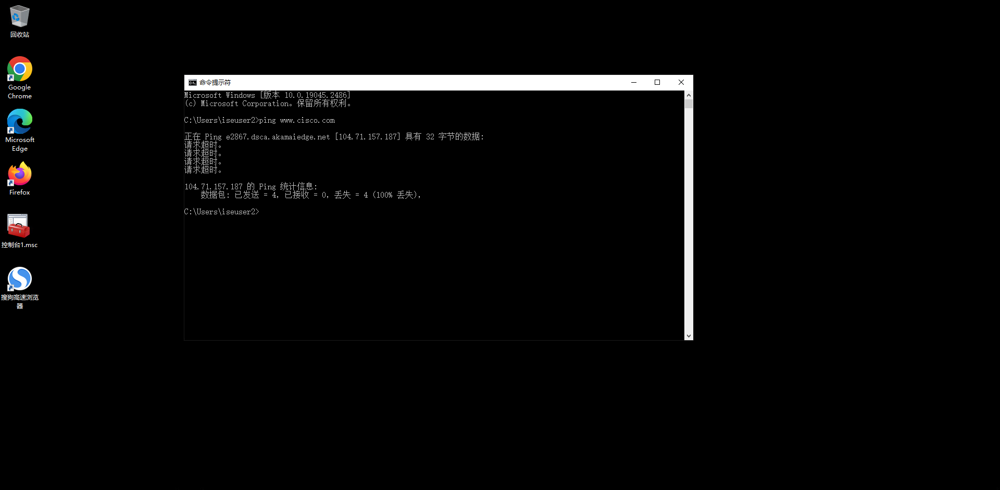

## 查看Site2-SW3650接口状态
```shell
Site2-SW#show authentication sessions int g1/0/6 details 
            Interface:  GigabitEthernet1/0/6
               IIF-ID:  0x1AA5F231
          MAC Address:  0050.56a1.bcc5
         IPv6 Address:  Unknown
         IPv4 Address:  10.1.102.1
            User-Name:  libing
               Status:  Authorized
               Domain:  DATA
       Oper host mode:  multi-auth
     Oper control dir:  both
      Session timeout:  N/A
    Common Session ID:  0A0114FE000000AA01947EAA
      Acct Session ID:  0x00000083
               Handle:  0xd800005c
       Current Policy:  POLICY_Gi1/0/6
          

Server Policies:
              ACS ACL: xACSACLx-IP-Guest-can-not-ping-63cfa560


Method status list:
       Method           State
          mab           Authc Success
```

## 查看ISE Radius Logs


