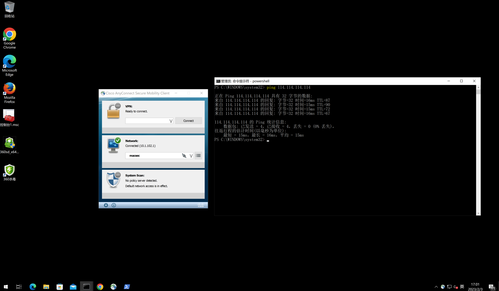

### 1.Center-SW下联Site1-SW和Site2-SW的接口, 激活MACSec
```shell
interface range g1/0/1-2
  cts manual
    sap pmk 123456 mode-list gcm-encrypt
```


### 2. Site1-SW, 上联Center-SW的接口, 激活MACSec 
```shell
interface g1/0/1
  cts manual 
    sap pmk 123456 mode-list gcm-encrypt 
```


### 3. Site2-SW, 上联Center-SW的接口, 激活MACSec 
```shell
interface g1/0/2
  cts manual 
    sap pmk 123456 mode-list gcm-encrypt 
```

### 4.Site2-SW交换机查看MACSec状态
```shell
Site2-SW#show macsec interface gigabitEthernet 1/0/2
 MACsec is enabled
  Replay protect : enabled
  Replay window : 0
  Include SCI : yes
  Use ES Enable : no
  Use SCB Enable : no
  Admin Pt2Pt MAC : forceTrue(1)
  Pt2Pt MAC Operational : no
  Cipher : GCM-AES-128
  Confidentiality Offset : 0
~~~省略后续大量信息~~~~

Site2-SW#show macsec summary 
Interface                     Transmit SC         Receive SC
GigabitEthernet1/0/2               1                   1   
GigabitEthernet1/0/6               1                   1  
```

### 5.Center-SW查看接口MACSec Summary
```shell
Center-SW#show macsec summary 
Interface                     Transmit SC         Receive SC
GigabitEthernet1/0/1               1                   1   
GigabitEthernet1/0/2               1                   1  
```


### 6.Site2-WIN10计算机PING测试



### 7.Center-SW交换机查看加密包数量
```shell
Center-SW#show macsec interface gi1/0/2
 MACsec is enabled
  Replay protect : enabled
  Replay window : 0
  Include SCI : yes
  Use ES Enable : no
  Use SCB Enable : no
  Admin Pt2Pt MAC : forceTrue(1)
  Pt2Pt MAC Operational : no
  Cipher : GCM-AES-128
  Confidentiality Offset : 0

 Capabilities
  ICV length : 16
  Data length change supported: yes
  Max. Rx SA : 16
  Max. Tx SA : 16
  Max. Rx SC : 8
  Max. Tx SC : 8
  Validate Frames : strict
  PN threshold notification support : Yes
  Ciphers supported : GCM-AES-128
                      GCM-AES-256

 Transmit Secure Channels
  SCI : 2CD02D022E020000
  SC state : notInUse(2)
   Elapsed time : 00:07:52
   Start time : 7w0d
   Current AN: 0
   Previous AN: -
   Next PN: 0
   SA State: notInUse(2)
   Confidentiality : no
   SAK Unchanged : no
   SA Create time : 5w1d
   SA Start time : 7w0d
   SC Statistics
    Auth-only Pkts : 0
    Auth-only Bytes : 0
    Encrypt Pkts : 0
    Encrypt Bytes : 0
   SA Statistics
    Auth-only Pkts : 0
    Encrypt Pkts : 4319

  Port Statistics
   Egress untag pkts  0
   Egress long pkts  1098241977368

 Receive Secure Channels
  SCI : CC46D6E17C820000
  SC state : notInUse(2)
   Elapsed time : 00:07:57
   Start time : 7w0d
   Current AN: 0
   Previous AN: -
   Next PN: 0
   RX SA Count: 0
   SA State: notInUse(2)
   SAK Unchanged : no
   SA Create time : 5w1d
   SA Start time : 7w0d
   SC Statistics
    Notvalid pkts 0
    Invalid pkts 0
    Valid pkts 0
    Valid bytes 0
    Late pkts 0
    Uncheck pkts 0
    Delay pkts 0
    UnusedSA pkts 0
    NousingSA pkts 0
    Decrypt bytes 0
   SA Statistics
    Notvalid pkts 0
    Invalid pkts 0
    Valid pkts 4949
    UnusedSA pkts 0
    NousingSA pkts 0

  Port Statistics
   Ingress untag pkts  1099004729432
   Ingress notag pkts  144
   Ingress badtag pkts  0
   Ingress unknownSCI pkts  0
   Ingress noSCI pkts  0
   Ingress overrun pkts  1098345806416
```