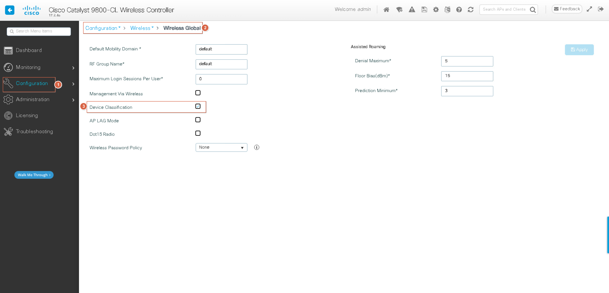

### 全局激活，设备识别 CLI
```shell
device classifier

```

### 全局激活，设备识别 GUI


### Policy Profile中激活设备识别 CLI
```shell
wireless profile policy qyt-flex-wir-profile-policy
 shutdown
 dhcp-tlv-caching
 http-tlv-caching
 radius-profiling
 no shutdown

wireless profile policy qyt-central-wir-profile-policy
 shutdown
 dhcp-tlv-caching
 http-tlv-caching
 radius-profiling
 no shutdown

```

### Policy Profile中激活设备识别 GUI


### 激活统计信息，gRPC获得更多的统计信息
```shell
ap profile qyt-ap-profile
 bssid-neighbor-stats
 bssid-neighbor-stats interval 60
 bssid-stats
 bssid-stats bssid-stats-frequency 60
 no statistics traffic-distribution

```