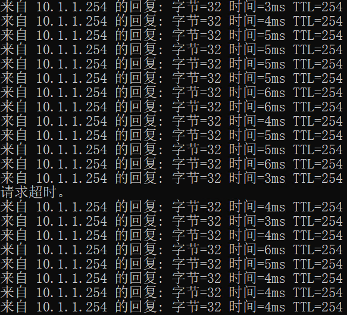

### 参考资料
https://www.cisco.com/c/en/us/support/docs/wireless/catalyst-9800-series-wireless-controllers/220277-configure-high-availability-sso-on-catal.html

### C9800-1 基本配置
```shell
hostname qytwlc1
ip name-server 10.1.1.102
ip domain name qytwireless.com
clock timezone GMT +8
clock calendar-valid
ntp server ntp.aliyun.com
ntp server 10.1.1.102
!
interface gigabitEthernet 1
  ip address 10.1.1.50 255.255.255.0
  no shutdown
!
interface gigabitEthernet 2
  switchport mode trunk
!
vlan 100
  name MGMT_VLAN_100
!
inter vlan 100
  ip address 100.1.1.101 255.255.255.0
!
username admin privilege 15 secret Cisc0123
!
wireless management interface Vlan 100
!
ip route 0.0.0.0 0.0.0.0 100.1.1.254
!
ip http timeout-policy idle 600 life 86400 requests 25
ip http session-idle-timeout 1200
!
ap tri-radio

```

### C9800-2 基本配置
```shell
hostname qytwlc2
ip name-server 10.1.1.102
ip domain name qytwireless.com
clock timezone GMT +8
clock calendar-valid
ntp server ntp.aliyun.com
ntp server 10.1.1.102
!
interface gigabitEthernet 1
  ip address 10.1.1.51 255.255.255.0
  no shutdown
!
interface gigabitEthernet 2
  switchport mode trunk
!
vlan 100
  name MGMT_VLAN_100
!
inter vlan 100
  ip address 100.1.1.102 255.255.255.0
!
username admin privilege 15 secret Cisc0123
!
wireless management interface Vlan 100
!
ip route 0.0.0.0 0.0.0.0 100.1.1.254
!
ip http timeout-policy idle 600 life 86400 requests 25
ip http session-idle-timeout 1200
!
ap tri-radio

```
### C9800-1 手动设置时间

### C9800-2 手动设置时间

### C9800-1 shutdown/no shutdown GigabitEthernet 2
```shell
qytwlc1(config)#interface gigabitEthernet 2
qytwlc1(config-if)#shutdown
qytwlc1(config-if)#no shutdown
```

### C9800-2 shutdown/no shutdown GigabitEthernet 2
```shell
qytwlc2(config)#interface gigabitEthernet 2
qytwlc2(config-if)#shutdown
qytwlc2(config-if)#no shutdown
```

### C9800-1配置secondary地址
```shell
qytwlc1(config)#inter vlan 100
qytwlc1(config-if)#ip address 100.1.1.201 255.255.255.0 secondary

```
### C9800-2配置secondary地址
```shell
qytwlc2(config)#inter vlan 100
qytwlc2(config-if)#ip address 100.1.1.202 255.255.255.0 secondary

```

### C9800-1 查路由，ping网关，ping对端
```shell
qytwlc1#show ip route
~~~忽略其他~~~
S*    0.0.0.0/0 [1/0] via 100.1.1.254
      10.0.0.0/8 is variably subnetted, 2 subnets, 2 masks
C        10.1.1.0/24 is directly connected, GigabitEthernet1
L        10.1.1.50/32 is directly connected, GigabitEthernet1
      100.0.0.0/8 is variably subnetted, 2 subnets, 2 masks
C        100.1.1.0/24 is directly connected, Vlan100
L        100.1.1.101/32 is directly connected, Vlan100

qytwlc1#ping 100.1.1.254
Type escape sequence to abort.
Sending 5, 100-byte ICMP Echos to 100.1.1.254, timeout is 2 seconds:
!!!!!
Success rate is 100 percent (5/5), round-trip min/avg/max = 1/2/3 ms

qytwlc1#ping 100.1.1.102
Type escape sequence to abort.
Sending 5, 100-byte ICMP Echos to 100.1.1.102, timeout is 2 seconds:
!!!!!
Success rate is 100 percent (5/5), round-trip min/avg/max = 1/1/1 ms

qytwlc1#ping 100.1.1.202
Type escape sequence to abort.
Sending 5, 100-byte ICMP Echos to 100.1.1.202, timeout is 2 seconds:
!!!!!
Success rate is 100 percent (5/5), round-trip min/avg/max = 1/1/2 ms

```

### C9800-2 查路由，ping网关，ping对端
```shell
qytwlc2#show ip route
~~~忽略其他~~~

Gateway of last resort is 100.1.1.254 to network 0.0.0.0

S*    0.0.0.0/0 [1/0] via 100.1.1.254
      10.0.0.0/8 is variably subnetted, 2 subnets, 2 masks
C        10.1.1.0/24 is directly connected, GigabitEthernet1
L        10.1.1.51/32 is directly connected, GigabitEthernet1
      100.0.0.0/8 is variably subnetted, 2 subnets, 2 masks
C        100.1.1.0/24 is directly connected, Vlan100
L        100.1.1.102/32 is directly connected, Vlan100

qytwlc2#ping 100.1.1.254
Type escape sequence to abort.
Sending 5, 100-byte ICMP Echos to 100.1.1.254, timeout is 2 seconds:
!!!!!
Success rate is 100 percent (5/5), round-trip min/avg/max = 1/2/3 ms

qytwlc2#ping 100.1.1.101
Type escape sequence to abort.
Sending 5, 100-byte ICMP Echos to 100.1.1.101, timeout is 2 seconds:
!!!!!
Success rate is 100 percent (5/5), round-trip min/avg/max = 1/1/1 ms

qytwlc2#ping 100.1.1.201
Type escape sequence to abort.
Sending 5, 100-byte ICMP Echos to 100.1.1.201, timeout is 2 seconds:
!!!!!
Success rate is 100 percent (5/5), round-trip min/avg/max = 1/1/1 ms

```

### C9800-1激活冗余
```shell
qytwlc1(config)#redundancy
qytwlc1(config-red)#mode sso

```

### C9800-2激活冗余
```shell
qytwlc2(config)#redundancy
qytwlc2(config-red)#mode sso

```

### C9800-1 切换chassis优先级
```shell
qytwlc1#chassis 1 priority 2

qytwlc1#show chassis
Chassis/Stack Mac Address : 0001.0202.aabb - Local Mac Address
Mac persistency wait time: Indefinite
                                             H/W   Current
Chassis#   Role    Mac Address     Priority Version  State                 IP
-------------------------------------------------------------------------------------
*1       Active   0001.0202.aabb     2      V02     Ready                0.0.0.0

```

### C9800-2 切换chassis （重启后才能生效）
```shell
qytwlc2#chassis 1 renumber 2
WARNING: Changing the switch number may result in a configuration change for that switch.  The interface configuration associated with the old switch number will remain as a provisioned configuration. New Switch Number will be effective after next reboot. Do you want to continue?[y/n]? [yes]:


```

### C9800-1 配置RMI HA
```shell
qytwlc1#chassis redundancy ha-interface gigabitEthernet 3

qytwlc1(config)#redun-management interface vlan 100 chassis 1 address 100.1.1.201 chassis 2 address 100.1.1.202
```

### C9800-2 配置RMI HA
```shell
qytwlc2#chassis redundancy ha-interface gigabitEthernet 3

qytwlc2(config)#redun-management interface vlan 100 chassis 1 address 100.1.1.201 chassis 2 address 100.1.1.202
```

### C9800-1 保存重启

### C9800-2 保存重启

### C9800-1(现在的Active) 查看chassis状态
```shell
qytwlc1#show chassis rmi
Chassis/Stack Mac Address : 0050.56a1.873e - Local Mac Address
Mac persistency wait time: Indefinite
                                             H/W   Current
Chassis#   Role    Mac Address     Priority Version  State                 IP                RMI-IP
--------------------------------------------------------------------------------------------------------
*1       Active   0050.56a1.873e     2      V02     Ready                169.254.1.201      100.1.1.201
 2       Standby  0050.56a1.0f12     1      V02     Ready                169.254.1.202      100.1.1.202
```

### Gi3接口消失
```shell
qytwlc1#show ip interface brief
Interface              IP-Address      OK? Method Status                Protocol
GigabitEthernet1       10.1.1.50       YES NVRAM  up                    up
GigabitEthernet2       unassigned      YES unset  up                    up
Vlan1                  unassigned      YES NVRAM  administratively down down
Vlan100                100.1.1.101     YES NVRAM  up                    up

```

### 查看冗余详情
```shell
qytwlc1#show redundancy
Redundant System Information :
------------------------------
       Available system uptime = 5 minutes
Switchovers system experienced = 0
              Standby failures = 0
        Last switchover reason = none

                 Hardware Mode = Duplex
    Configured Redundancy Mode = sso
     Operating Redundancy Mode = sso
              Maintenance Mode = Disabled
                Communications = Up

Current Processor Information :
-------------------------------
               Active Location = slot 1
        Current Software state = ACTIVE
       Uptime in current state = 5 minutes
                 Image Version = Cisco IOS Software [Cupertino], C9800-CL Software (C9800-CL-K9_IOSXE), Version 17.9.4a, RELEASE SOFTWARE (fc3)
Technical Support: http://www.cisco.com/techsupport
Copyright (c) 1986-2023 by Cisco Systems, Inc.
Compiled Fri 20-Oct-23 10:29 by mcpre
        Configuration register = 0x2102
               Recovery mode   = Not Applicable
             Fast Switchover   = Enabled
                Initial Garp   = Enabled

Peer Processor Information :
----------------------------
              Standby Location = slot 2
        Current Software state = STANDBY HOT
       Uptime in current state = 3 minutes
                 Image Version = Cisco IOS Software [Cupertino], C9800-CL Software (C9800-CL-K9_IOSXE), Version 17.9.4a, RELEASE SOFTWARE (fc3)
Technical Support: http://www.cisco.com/techsupport
Copyright (c) 1986-2023 by Cisco Systems, Inc.
Compiled Fri 20-Oct-23 10:29 by mcpre
                          BOOT =
                   CONFIG_FILE =
        Configuration register = 0x2102

```

### 查看冗余状态
```shell
qytwlc1#show redundancy states
       my state = 13 -ACTIVE
     peer state = 8  -STANDBY HOT
           Mode = Duplex
           Unit = Primary
        Unit ID = 1

Redundancy Mode (Operational) = sso
Redundancy Mode (Configured)  = sso
Redundancy State              = sso
     Maintenance Mode = Disabled
    Manual Swact = enabled
 Communications = Up

   client count = 128
 client_notification_TMR = 30000 milliseconds
           RF debug mask = 0x0
Gateway Monitoring = Enabled
Gateway monitoring interval  = 8 secs
```

### 产生WLC用于AP注册的证书(EXEC模式)[一定要确认Vlan 100 up up]
```shell
wireless config vwlc-ssc key-size 2048 signature-algo sha256 password 0 Cisc0123

```

### 配置Virtual IP
```shell
parameter-map type webauth global
yes
virtual-ip ipv4 192.0.2.1
exit
access-session mac-move deny

```

### 导入WEB管理证书
```shell
crypto pki import WLC_TP pkcs12 terminal password Cisc0123

MIIRAQIBAzCCEMcGCSqGSIb3DQEHAaCCELgEghC0MIIQsDCCC2cGCSqGSIb3DQEHBqCCC1gwggtU
AgEAMIILTQYJKoZIhvcNAQcBMBwGCiqGSIb3DQEMAQMwDgQIEHTysPthzvACAggAgIILICfwajCk
B8FfkX5k9JW2XD0Qae22jdBizO4l4JvYqPJjshVJ4JJ3qK7ahtPpa1Oucd0tssfAhPse/0pIGV+2
L1KGLKbPIOAd47w8WAAOWsiKkxqFm6F61SqbGcWW/I4FDTg1fOezBTJP4R9+2cBeb8HQHw6WVGXu
H0i0yxC23qgU/ZTe4LBSTc1nPbHy2CFk1nigjY+GS5dBgF+Mrpbu8ziEItS4begClKAyKhI0vNK/
cyJc5RE60hQuVk2OjfLJf7Nd9fAIYXkR6PYq96L1qSpoJyCTkYE1MAAwB5v2hJAYYveeJ1zBh9Ws
QNl1+7D8wtWorqlgq64vWwdx7APJ97ZbV8jc6JxEd2egFhM7tJBW322fJkJ7y9tQpYNib/2DPU5t
uRckw9d9i7XdfKT75dte4mUqABQmbSPF95VI1yZXjpSuMqzuy3ZlYKelbQh9IEOhEXiInA/rVZ0x
z03di9U3sdtSMFYjXD7qtBJszEg68CJi0Mov9thQZdE+GfynyFyCCg9l1fKJj4PHyb+HwBDFx6uz
Zt4QDzU5KmVW33Q6zjvLAM/r+cOkjw5KYET6QabTmooIl70oseExz9D+DCpInckNJ6zy7KPKL7sh
7RNAx+lGt33XBf2W7hSEQArhOEJWsubGpoOIND690MHNzfr27o0nU8aGHTMBHtq84TTMawvEJysZ
I0E9kLG7PS9AGmJbIA4SHCZcNN4yNpJAEpdQnbnWglJYngkNncUgE0YFTxb/aqchG5NEp0zDitQi
eQkhqkwqWVo9ByaaJeDJ+87NVddCpYZvku3RI1/0bBBr5I5xU9gwSOqq4XYf1/2StlDAEB55D3tT
37Czw3tQVQB3os8cH79wN4dHDfpEjMqqJb4UhQsh7YxiQt0MBMQ2iPg418/HKLRn46qpbCRGk5+t
uzuQ5e4ezUCInB9sU8GdUYfUoPl5yHMDL++CBtw2Gvr5QyaLkd5xgRjO4qxkhMnqH9Lvw90uVu9u
9Mvrz40ctkd0FD5Gp4GNx7uAZqu8nKYSIgYHz1nOZZD2xIkfGjXD9MbcZiHyMukEf1dgpnS+g+8f
sx+KI3X72bheb0gwgX7tqiuBKsRQGYGYQ4L5ml+UwRtHMVNIPpuNWq/JtiO2pNdSg7FV5PzjYO1+
edVog1d9cYYPHir2UnRmoQ0VhsLBvRkHMU8Cx0JEDCBB2VHdvcHf47nw2xa1njZYymi6oRmpp/1i
O/7m4kN22iP7eAqVqMBpxZMXT9+8lC/CKXh3o5oz+iAYSnEaYvJwh8Lvts0566aYpr380sjsa8yC
YS+Yb4Hfp2jgmoUKs/q5gx2IDDLRSuSs0EklZAnuf4nwP/36UdfS2kQsgcLYyDX5O8zL8LqdUch3
Wu9TUeO9SqDtw69grhoKexcBtSsaMvGUWg5h4TESqBU29sZtzTwRLNiLshn8aJo3b++zSoqyTy7C
1eoVUtUsxhuAbb+B3W1a60rhFnQBNpkX9oNuLZuxanudK9GtBJf1Mq4+lyTZJO3Ane7h+GZcfrr7
Uvifvryf3RSiI6xNU3kV/ju/XIWo5YNCkJVxOiiG9dTpjjCYLCcgowthvM5+Geg7Scbld96hTX1Q
TlGOXCAwOt5NSlvzqaP/gG1m5jTssikyG9Ye94tYIYh5qtkbQfyEohLMa3m8KJzJv3qi/JiQDM+M
OXBF9KKWn46VzDRceeVmpGKafb08UvbLHE5AVc3XGExI9XNVaTBphgNyJ/g9S4DLaa3IR6zHhScf
X68t5MF9VZXYiAPeOZ+UUFWohT+gb1f9/HWAl0jdA0F7hS21Aj6rn5b/HxrNua7ujF3qFxwjCGNy
BPo/kEV8QkXUzFGN6WS0lqjWf05jsZbn9TsZAX3RSKqMcZd8yzS7PEOo8Hij+gVRtZLyuKW9jXSi
Hdx9hzWYI6nhNO+Xp3bOLiiQLCyn/4vsWUhlKDLCaev4LEekIK86m/OwZFMQ96WD3y7ge6y/sEjG
9jaVnaY8merhX+3L9stuLQ9ZWelTlYzVFlEO7s9nEQ6M6fdVbjepHL7m0miLqddFaL6m9xL4FAMI
oHk4iSoUcN0zW7kyEAtx5klJmWMBHsVi3vTQYpkxmFXeRqSxLG4LdRaXB5JVLxpVE98wOFIMCNUa
R8uE9fewdC4Y+3sDTFcLTFWiN2pJpAQXI2XGsiCTdX10WzAxKSaJUH/a3JWKOaXw/Y9bhYLS47It
u7KbeIq7BlGg+ONw3EkNzv/mtanNk1wyEPTdmRkOshlVd3tYaYVRDwo1KUvOowQeb56vhudciaoV
Qdo2hGHpc7hVezvUmZvbYEs6Cq0QfKnwweRzSnHgz4JsvaehWBXplquN4ezqtRke1R2ZF01s//0i
w78e1QCwgZUqLKt5I2dtT5Lmn/mbDTuuYZjWw6CiFJupqjgncheuY30/mhsQ+rsEiRBALd2mAvcN
QEK8ZUwkVo860eSTe9zJRDhyxUijZkD07CFdY467loSYQnQWUSmf8G4IGh9Vi2eBMjqW4SjsJce0
0azt/sIiDMWvCEHuXUpzI3BnVdDVndwEZIffdWnbVn9fEmEY+H6bacf1XYDdkGIHn4Z5nTj+8r/x
8YQpFwk6H7McSEXoBtEp0s+mztArrSq/mbXi7rGHuZlvLhhN7G0yWEHiSi4XxoKEA7ggtMLvYwd4
H73Cjgjp4NnjLLjX6zyXBdq6febc0a2molOE4ZFSrGuQV0yHHg8s/yLvMHTxj7oRqYt1AwShcyn1
JHKJOWHz0ORO/ChZ+XvR9iyDH1gE4Db1/kMpSIVaiJyLxAZ6xgRYkOTRPJYPIu7VA0aogCgkx61Y
U2GE6O3ZylCQ1jwVaEYYvB8sZdzHInKywpL0Ygozl5GeI1Qgb9mDT8ltwnLEkis4nXFpsZR2REBa
nBjyD3O844/FsQZMlyMTOehM4CuFvLa9xGWHpsFDA1DMy/sIadFOVXQTpzwMDDsqSX1T2ynDY8aS
5hyRgC5nK+xS/R8XMhLf6DXZbYEMXslJyfrkwOJKkcnLn2ivkdQPI/ozA+6hUilhPDYbnmgaWCXs
fIqRzuDw2xidVTfnnf53IGGdMCOGAMkKhAOdbflHG7prEbhOju+BsggEE28xsmsaufY4C7O6EoOT
WW3iTIP6whKjdixfCNCtrDlKSWEsg+9QZJGSPed2MSm5RmGp4bKGAfenkL7FhkQs9fLjd6bIxAMc
BVNyibWHBnX0Ih4qeFV4pleBp9G3J9qB2bAFpMC0KgmREj1lLGCQsBYMjwri1clAzJiadPsACqPH
MPuAufExgdfn1DfodAHfvv2LJ9PbSncOuZASAFwEOEScvzNUMpyHK4pP8hW7/1NoQehOBCrob04p
nvVgsY9k3XRKBxUDl7Vq2tBs+kVbKCsuwy3tIkXbrJdQRGIEMxY5CCiT7hxBv4KHhdBiooLUh9AV
5H0ddWzgXcwE/bptN2rp0AINibDjNZB8Q7TeYuV5vV4uuOLzcmiWJHEDDyPIPcThWte35olQgqfY
4rJWgGkOttbnXePc+SvAWls2grq0jin+PunwcEaOvZ2ykWBWx9NA2tq6QzjlgfPHb/KRg1rYm4X2
wIVls+W70fnOm5GNu4NcBv87+2lOSkXJNndBxDmDhILwXU0ez5dLUl6RIDLEWC6MkfPux4rBswsw
oDRsGxobYsicenP2OH+7gH+dFEk6Ic38PPuwceKeRR97uFkk2x05gC32Y1yYYpj4IQbOCzQ5N7UF
sXsNpANQzAo/1xbH1zA5UP1CuIlglk/WMAqPVHNcrXFBzDQ72ANEvoND5HWPOSQ+xWUwggVBBgkq
hkiG9w0BBwGgggUyBIIFLjCCBSowggUmBgsqhkiG9w0BDAoBAqCCBO4wggTqMBwGCiqGSIb3DQEM
AQMwDgQIZiXrrXtN/NECAggABIIEyDML/RGaivg9LRa/d0jy6Tig2jpHDeHUkNNxPDrbFyjWWJoi
Stf8arxb1swwd1PiMbZdR3Wm+/YeH4Ja25LkBhVTqvg0JetL2e/TL7ui0P5yzNsyI7y5AthSehYx
r0VTIf0hwTMVAVvAQ05qlVRTkq+drbKkaohp4dWK2S+o3RIl72iN42RNQZkWOepHKXVGE+QxqvXo
cG8ro0ezrvtdjRLD36vDCpqD5eflSx2oXIaipZxXh2K/s9xSQAr+urpH9YFPpal9sTEGdakwwYAN
b5lNf9F0lV028pYxoakjqatc1PXkD/PlPwV0u+RCWwIgSR0EeRMieNEwlTlYPP0x6tFDHe4T8wiy
j3jnlPcNgJ8mtFdsvRk4D1GqeZNh3WARd3/HIPcJpuAo8/i+pESjkAG5O3giEMo26v8hXt7BJmfM
qe5/KOulDI9a+PYEnao/lDzzikpDQB4agECds4X+yK7pf1qR1J5OqtzaGKCm+wD2zB2vBRuCLcLL
+zLnMKSvPDEC9tnN7KYRSbDZO7V7D+fX21E050Nlmg1gg88hyV39OwWf69Y4hr4LmLFXhH2NcriA
QgJQq2hXMhBwv0z7yWp3vkCMce86pvBY4PizTcPOzFZyrGf0WJbdLegMb1n39DSMRMcSVdkpDFml
1s4uySBfpVRL+KfWBwaTmx0d84B6J5B5u+lvskWZaC6Am5KCs51rxKaz5ocih5ijpFiFkP2MgVHx
C+aae/oIJjq50YJM4Wy4UmWcfPcyQnHVxXee4K/jwiXb5OmcwZCXw+PjPdbqwwD8Hy/cYeVOLp7g
DSws65Vutdg+i5FaFKkgyzsaCcU2/TAFJJPrlzWJYQBPgs22xugkh9Dck1NMx5z+S7+l+4W4ENfY
hYmrOoDxs4FUielBnx5uImTfAj8M2mn2JjpsfBEKNczpk+6QRJ6bj2oXGlRFUn72Fy322JLwupKq
faFy/cxP4vNS6xQrhPO5Sj2LclgA4lEyQUESagurONgIXEYtXRDO4WdLgTuCiXmavu60yo6I2sey
+g7TL5glk+47kmdDKCa3ZWIY6Vcxqmj6J0O3DKj4o3b3uiQq3nnyOfRI7ZiLJthRtlc3eYg1dpuU
BsQI+8Hv4PL+LERXHmhpwuU5CkXtFp8G+0R2IkqxEDR/f2qvdnWbAsze8V4HOh84jRH/8ilkzp7Q
ZYKS079kVWoLUKzcbPMiuBHVVU7nitBIOM82o8WWMHYtaULosLNiGqivmCoHCS20ZH76tbY6hg9L
WMkLppNdDNe3HwSBGwKYjcBP/hhOLsEyWMdy463Zam89gb39oAjv6t11GHmKZ0BAa0dIk+t7QmpO
CvBGo4y86gIjfPilVZEuF9Lv0DuQVLHUJmixE4B2WisWdaPIO1tezkyyp5RZDspLNhw0v2C258Gk
pYUCGYsFYhScDLAsiQknE6VayrgXk5Ld6EWS8MNdGL+s6RGoVNN0WzecHfQ1/vLqCqaMManfOML8
nKXgNr4ZCdNUdkkkIxMH5SW3+r9aEvIXncrgHJXmqVimiFzwiYtqPu2yVWyiRX5dOUj3f7E9sL7g
6q2nCQz2vh99A1aNf1FGRAs4ucRutsSG8pM3g85nOKNI5mt1xaBINuhoDt4ZEtR57jElMCMGCSqG
SIb3DQEJFTEWBBSr8G9lC2IlxWB36kAe/HdLLXhuPTAxMCEwCQYFKw4DAhoFAAQUTaf14hY5ZVNL
ea0O24y/X1XeuIsECHCpjAkrMUVOAgIIAA==

ip http secure-trustpoint WLC_TP

```

### 修改国家代码
```shell
ap dot11 24ghz shutdown

ap dot11 5ghz shutdown

ap dot11 6ghz shutdown

wireless country GB
ap dot11 24ghz cac voice acm
ap dot11 5ghz cac voice acm
ap dot11 6ghz cac voice acm

no ap dot11 24ghz shutdown
no ap dot11 5ghz shutdown
no ap dot11 6ghz shutdown

```

### 刷WLAN配置（DOT1X或者PSK）

### 测试客户端连接

### 查看AP uptime （切换后，AP依然保持连接）
```shell
qytwlc1#show ap uptime
Number of APs: 2


AP Name                          Ethernet MAC    Radio MAC       AP Up Time                                          Association Up Time
---------------------------------------------------------------------------------------------------------------------------------------------------
AP2                              5486.bc48.09e8  5486.bc48.8e00  2 hours 3 minutes 29 seconds                        3 minutes 7 seconds
AP1                              0c75.bdb5.fcd0  0c75.bdb3.b8a0  3 hours 9 minutes 36 seconds                        2 minutes 29 seconds
```

### 查看客户详情 （切换后，客户依然保持连接）
```shell
qytwlc1#show wireless client summary detail
Number of Clients: 1

MAC Address    SSID                             AP Name                          State         IP Address                                 Device-type                      VLAN  BSSID          Auth Method                    Created          Connected        Protocol Channel Width   SGI NSS Rate   CAP   Username                                                         Rx packets      Tx packets      Rx bytes        Tx bytes      6E capability
--------------------------------------------------------------------------------------------------------------------------------------------------------------------------------------------------------------------------------------------------------------------------------------------------------------------------------------------------------------------------------------------------------------------------------------------------------------------------------------------------------------------
44af.2865.4096 qyt-wpa3-dot1x                   AP1                              Run           20.1.1.3                                                                    20    0c75.bdb3.b8af [FT-802.1x]                    02:32            02:38            11ax(5)  100      40/160 Y/Y 2/2 m10 ss2 EVRKW iseuser                                                          781              266              87761            105706           N
```

### C9800-1 保持配置，然后关闭电源

### 切换过程几乎不丢包


### 查看切换历史
```shell
qytwlc1#show redundancy switchover history
Index  Previous  Current  Switchover             Switchover
       active    active   reason                 time
-----  --------  -------  ----------             ----------
   1       1        2     active unit removed    17:30:48 GMT Fri Jun 7 2024
```

### 查看Chassis当前状态
```shell
qytwlc1#show chassis
Chassis/Stack Mac Address : 0050.56a1.873e - Foreign Mac Address
Mac persistency wait time: Indefinite
                                             H/W   Current
Chassis#   Role    Mac Address     Priority Version  State                 IP
-------------------------------------------------------------------------------------
 1       Member   0000.0000.0000     0      V02     Removed              169.254.1.201
*2       Active   0050.56a1.0f12     1      V02     Ready                169.254.1.202
```

### 查看Chassis当前状态 (打开C9800-1电源一段时候后)
```shell
qytwlc1#show chassis
Chassis/Stack Mac Address : 0050.56a1.873e - Local Mac Address
Mac persistency wait time: Indefinite
                                             H/W   Current
Chassis#   Role    Mac Address     Priority Version  State                 IP
-------------------------------------------------------------------------------------
 1       Standby  0050.56a1.873e     2      V02     HA sync in progress  169.254.1.201
*2       Active   0050.56a1.0f12     1      V02     Ready                169.254.1.202

~~~ 再等一会儿 ~~~

qytwlc1#show chassis
Chassis/Stack Mac Address : 0050.56a1.873e - Local Mac Address
Mac persistency wait time: Indefinite
                                             H/W   Current
Chassis#   Role    Mac Address     Priority Version  State                 IP
-------------------------------------------------------------------------------------
 1       Standby  0050.56a1.873e     2      V02     Ready                169.254.1.201
*2       Active   0050.56a1.0f12     1      V02     Ready                169.254.1.202

```

### 手工切换
```shell
qytwlc1#redundancy force-switchover
Proceed with switchover to standby RP? [confirm]
    Manual Swact = enabled
```

### 查看切换历史
```shell
qytwlc1#show redundancy switchover history
Index  Previous  Current  Switchover             Switchover
       active    active   reason                 time
-----  --------  -------  ----------             ----------
   1       1        2     active unit removed    18:08:46 GMT Fri Jun 7 2024
   2       2        1     user forced            18:24:32 GMT Fri Jun 7 2024
```
