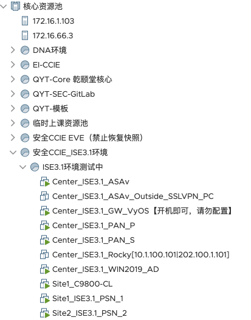
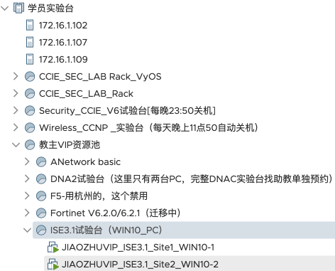

# 集群"核心资源池" --- "安全CCIE_ISE3.1环境" 资源池

## <Center_ISE3.1_WIN2019_AD>恢复快照
> #### 恢复到"推荐快照"
> #### 网卡: DNAC---SW3560-F0/22
>> #### username: administrator
>> #### password: Cisc0123

## <Center_ISE3.1_PAN_P>恢复快照
> #### 恢复到"推荐快照"
> #### 网卡: DNAC---SW3560-F0/22
>> #### username: admin
>> #### password: Cisc0123

## <Center_ISE3.1_PAN_S>恢复快照
> #### 恢复到"推荐快照"
> #### 网卡: DNAC---SW3560-F0/22
>> #### username: admin
>> #### password: Cisc0123

## <Site1_ISE3.1_PSN_1>恢复快照
> #### 恢复到"推荐快照"
> #### 网卡: ISE31_Site1_PSN_1
>> #### username: admin
>> #### password: Cisc0123

## <Site2_ISE3.1_PSN_2>恢复快照
>  #### 恢复到"推荐快照"
>  #### 网卡: ISE31_Site2_PSN_2
>> #### username: admin
>> #### password: Cisc0123

---

### "安全CCIE_ISE3.1环境" 资源池

---

# 集群"学员试验台" --- "教主VIP资源池" 资源池 --- "ISE3.1试验台(WIN10_PC)"

## <JIAOZHUVIP_ISE3.1_Site1_WIN10-1>恢复快照
>  #### 恢复到"推荐快照"
>>  #### username: qytuser
>> #### password: Cisc0123

## <JIAOZHUVIP_ISE3.1_Site2_WIN10-2>恢复快照
> #### 恢复到"推荐快照"
>> #### username: qytuser
>> #### password: Cisc0123

---

### "WIN10资源池" 资源池

---
