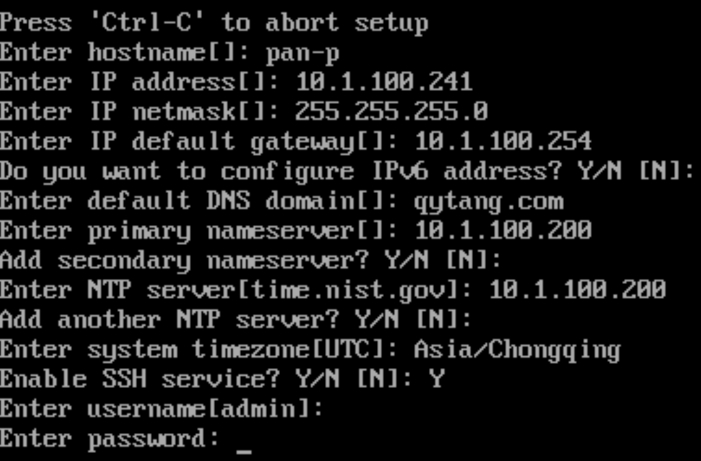

#### <Center_ISE3.1_PAN_P>初始化
##### local host login : setup
> ###### Press 'Ctrl-C' to abort setup
> ###### Enter hostname [ ]: PAN-P
> ###### Enter IP address [ ]: 10.1.100.241
> ###### Enter IP netmask [ ]: 255.255.255.0
> ###### Enter IP default gateway [ ]：10.1.100.254
> ###### Enter default DNS domain [ ]: qytang.com
> ###### Enter primary nameserver [ ]: 10.1.100.200
> ###### Enter secondary nameserver ? Y/N [ N ]:
> ###### Enter NTP server [time.nist.gov]: 10.1.100.200
> ###### Add another NTP server ? Y/N [ N ]:
> ###### Enter system timezone [UTC]: Asia/Chongqing
> ###### Enable SSH Service ? Y/N [ N ]: Y
> ###### Enter username[admin]:
> ###### Enter password: Cisc0123
> ###### Enter password again: Cisc0123

#### <Center_ISE3.1_PAN_S>初始化
##### local host login : setup
> ###### Press 'Ctrl-C' to abort setup
> ###### Enter hostname [ ]: PAN-S
> ###### Enter IP address [ ]: 10.1.100.242
> ###### Enter IP netmask [ ]: 255.255.255.0
> ###### Enter IP default gateway [ ]：10.1.100.254
> ###### Enter default DNS domain [ ]: qytang.com
> ###### Enter primary nameserver [ ]: 10.1.100.200
> ###### Enter secondary nameserver ? Y/N [ N ]:
> ###### Enter NTP server [time.nist.gov]: 10.1.100.200
> ###### Add another NTP server ? Y/N [ N ]:
> ###### Enter system timezone [UTC]: Asia/Chongqing
> ###### Enable SSH Service ? Y/N [ N ]: Y
> ###### Enter username[admin]:
> ###### Enter password: Cisc0123
> ###### Enter password again: Cisc0123

#### <Site1_ISE3.1_PSN_1>初始化
##### local host login : setup
> ###### Press 'Ctrl-C' to abort setup
> ###### Enter hostname [ ]: PAN-1
> ###### Enter IP address [ ]: 10.1.10.241
> ###### Enter IP netmask [ ]: 255.255.255.0
> ###### Enter IP default gateway [ ]：10.1.10.254
> ###### Enter default DNS domain [ ]: qytang.com
> ###### Enter primary nameserver [ ]: 10.1.100.200
> ###### Enter secondary nameserver ? Y/N [ N ]:
> ###### Enter NTP server [time.nist.gov]: 10.1.100.200
> ###### Add another NTP server ? Y/N [ N ]:
> ###### Enter system timezone [UTC]: Asia/Chongqing
> ###### Enable SSH Service ? Y/N [ N ]: Y
> ###### Enter username[admin]:
> ###### Enter password: Cisc0123
> ###### Enter password again: Cisc0123

#### <Site2_ISE3.1_PSN_2>初始化
##### local host login : setup
> ###### Press 'Ctrl-C' to abort setup
> ###### Enter hostname [ ]: PAN-2
> ###### Enter IP address [ ]: 10.1.20.241
> ###### Enter IP netmask [ ]: 255.255.255.0
> ###### Enter IP default gateway [ ]：10.1.20.254
> ###### Enter default DNS domain [ ]: qytang.com
> ###### Enter primary nameserver [ ]: 10.1.100.200
> ###### Enter secondary nameserver ? Y/N [ N ]:
> ###### Enter NTP server [time.nist.gov]: 10.1.100.200
> ###### Add another NTP server ? Y/N [ N ]:
> ###### Enter system timezone [UTC]: Asia/Chongqing
> ###### Enable SSH Service ? Y/N [ N ]: Y
> ###### Enter username[admin]:
> ###### Enter password: Cisc0123
> ###### Enter password again: Cisc0123