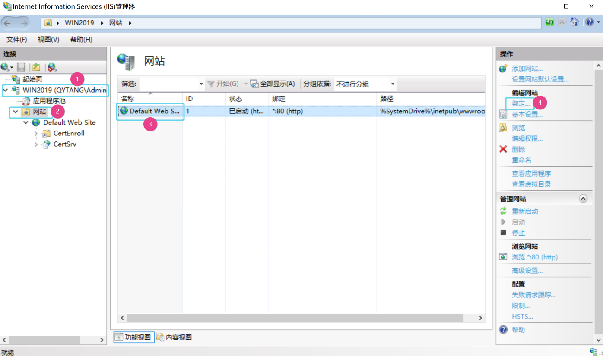
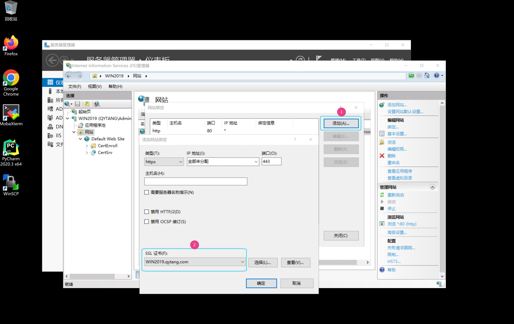

## WIN2019的IIS服务启用https

---

#### 服务器管理器 --- 仪表板 ---- 工具 --- Interface Information Services(IIS)管理器
>  ##### WIN2019(QYTANG\administrator) --- 网站 --- Default Web Site
>  ##### 编辑网站 --- 绑定 --- 添加 --- 类型: https  ---- SSL证书(F): WIN2019.qytang.com ---- 确定

---

#### 网站绑定

#### 选择证书
