# PAN-P申请个人证书

---

## 步骤一：ISE产生CSR证书签名请求
> ### 登陆WIN2019 --- 打开chrome浏览器 --- 输入 https://pan-p.qytang.com
>>> ### username: admin
>>> ### password: Cisc0123
>> ### login

>  ###  [三] --- Administration --- System --- Certificates
>>  ### Certificate Management --- Certificate Signing Requests --- Generate Certificate Signing Requests(CSR)
>>> ### Usage --- Certificate(s) will be used for [Multi-USE]
>>> ### Nodes --- [勾选] PAN-P
>>> ### Subject --- Organizational Unit (OU): ISE
>>> ### Subject --- * Key Length: 2048
>>> ### Subject --- * Digest to Sign With: SHA-256
>> ### Generate
>>> ### Export --- PANPMultiUse.pem --- 右键 --- 打开方式 --- 写字板 --- Ctrl+A[全先] --- Ctrl+C[复制]

## 产生CSR
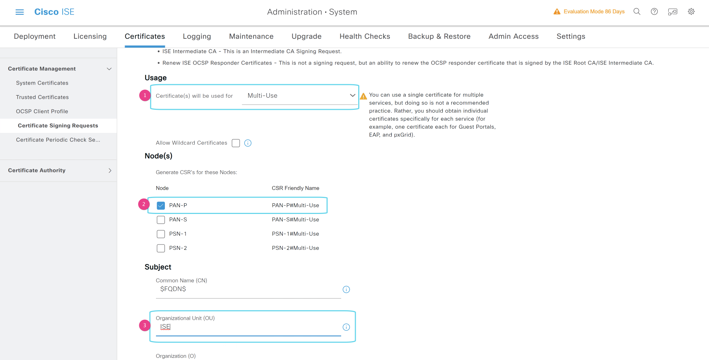
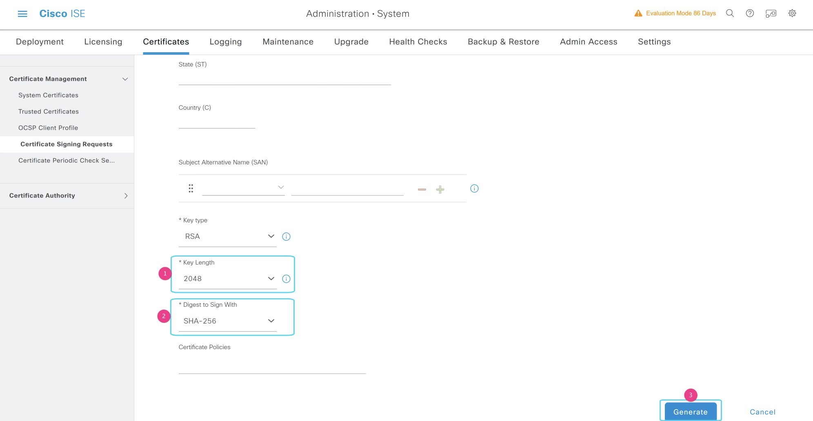
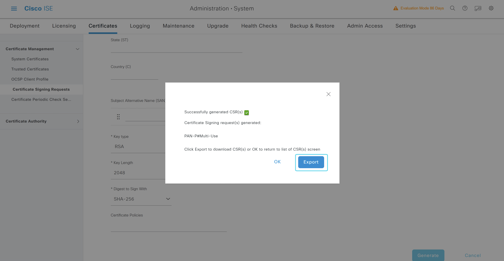
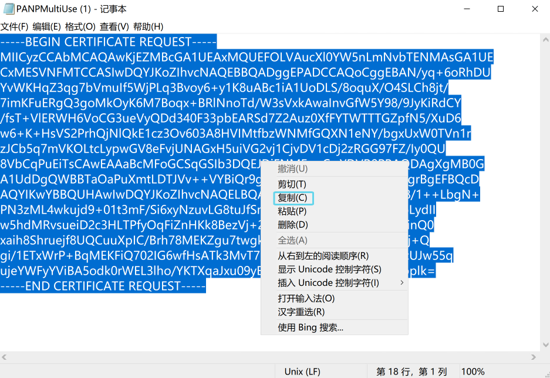

## 步骤二：证书服务器颁发签名证书
>  ### 打开chrome浏览器 --- 输入 https://win2019.qytang.com/certsrv
>>  ### 选择一个任务 --- 申请证书
>>  ### 申请一个证书 --- 选择一个证书类型: 高级证书申请
>>  ### 提交一个证书申请或续订申请
>>>>  ### 保存的申请: Ctrl+V[粘贴]
>>>>  ### 证书模板: Web服务器
>>>  ### 提交
>>  ### 证书已颁发 --- (勾选)Base 64编码 --- 下载证书 --- certnew --- 右键 --- 重命名 --- PAN-P --- 剪切 --- 放在桌面

## 申请证书
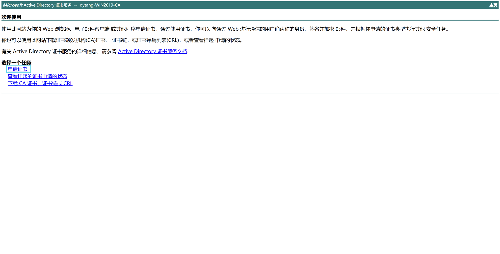
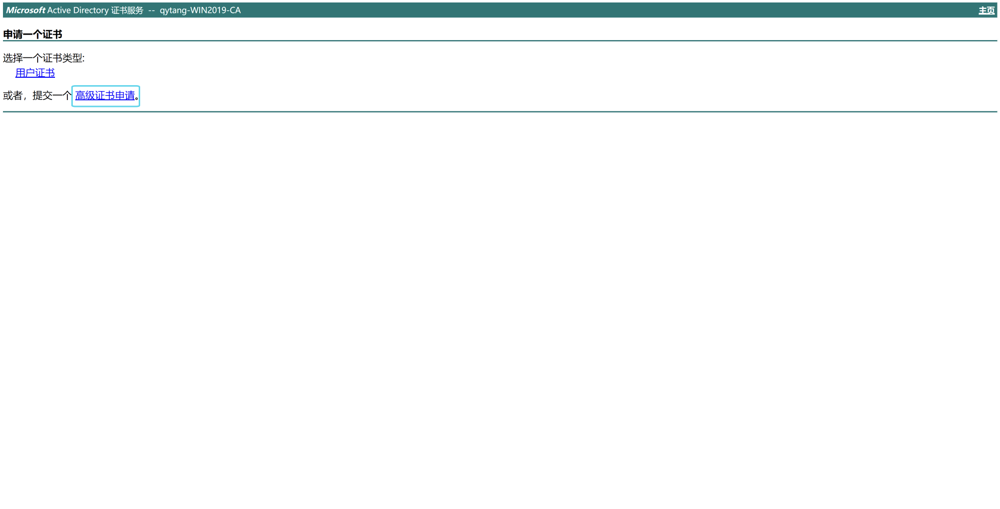
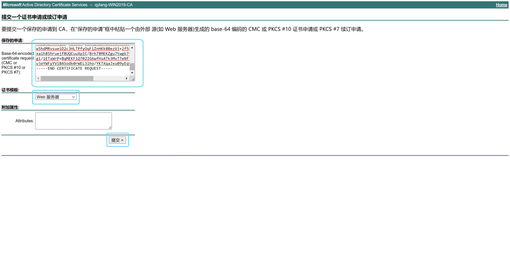
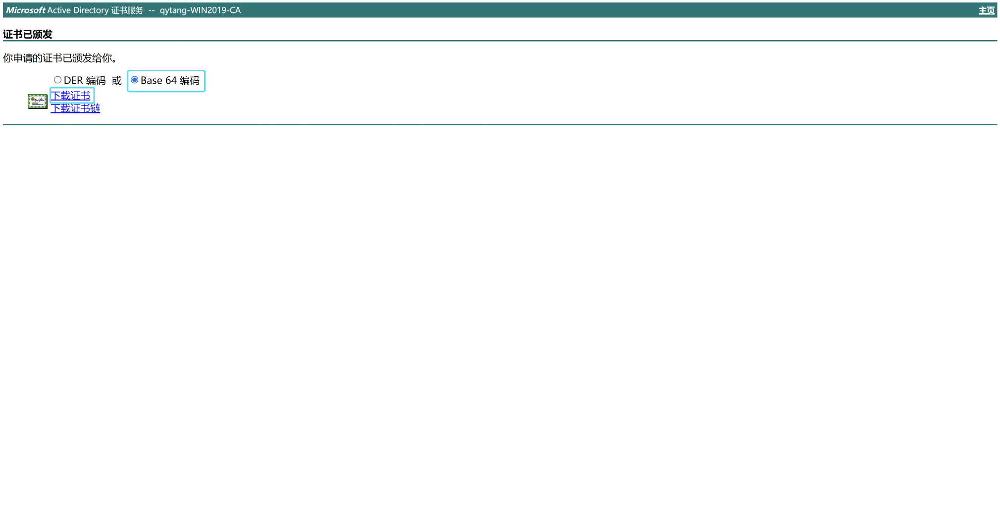

---

## 把pan-p的证书放到桌面
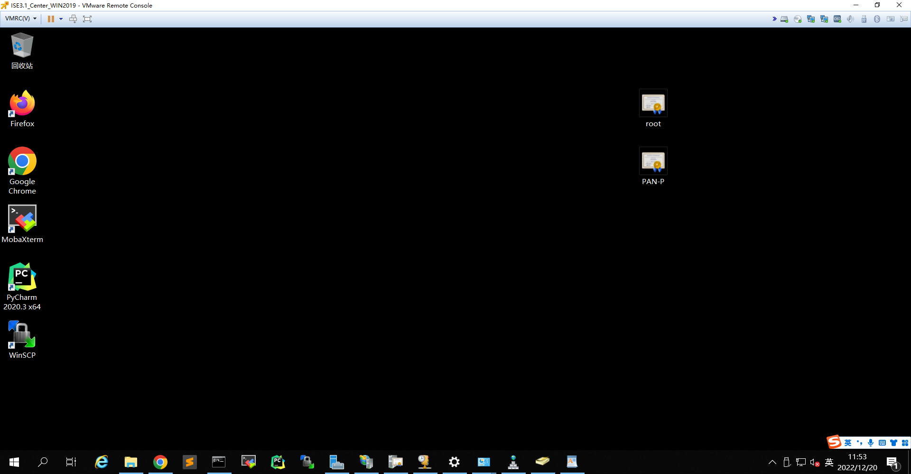

---

## PAN-S申请个人证书

---

## 步骤一：ISE产生CSR证书签名请求
> ### 登陆WIN2019 --- 打开chrome浏览器 --- 输入 https://pan-s.qytang.com
>>> ### username: admin
>>> ### password: Cisc0123
>> ### login

>  ###  [三] --- Administration --- System --- Certificates
>>  ### Certificate Management --- Certificate Signing Requests --- Generate Certificate Signing Requests(CSR)
>>> ### Usage --- Certificate(s) will be used for [Multi-USE]
>>> ### Nodes --- [勾选] PAN-S
>>> ### Subject --- Organizational Unit (OU): ISE
>>> ### Subject --- * Key Length: 2048
>>> ### Subject --- * Digest to Sign With: SHA-256
>> ### Generate
>>> ### Export --- PANSMultiUse.pem --- 右键 --- 打开方式 --- 写字板 --- Ctrl+A[全先] --- Ctrl+C[复制]

## 步骤二：证书服务器颁发签名证书
>  ### 打开chrome浏览器 --- 输入 https://win2019.qytang.com/certsrv
>> ### 选择一个任务 --- 申请证书
>> ### 申请一个证书 --- 选择一个证书类型: 高级证书申请
>> ### 提交一个证书申请或续订申请
>>>> ### 保存的申请: Ctrl+V[粘贴]
>>>> ### 证书模板: Web服务器
>>> ### 提交
>> ### 证书已颁发 --- (勾选)Base 64编码 --- 下载证书 --- certnew --- 右键 --- 重命名 --- PAN-S --- 剪切 --- 放在桌面

---

## 把pan-s的证书放到桌面
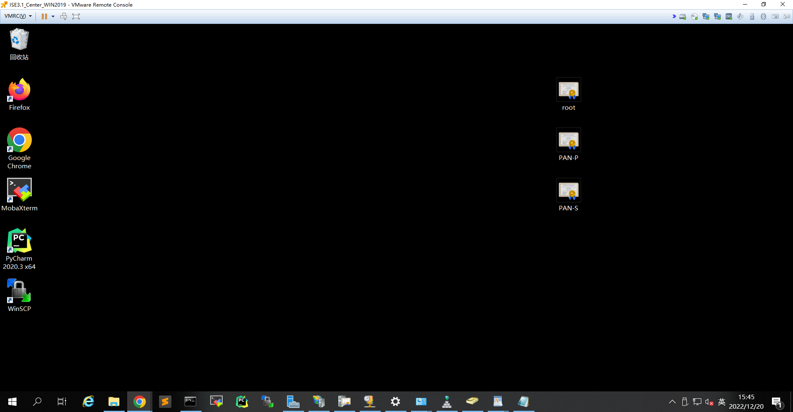

---

## PSN-1申请个人证书

---

## 步骤一：ISE产生CSR证书签名请求
> ### 登陆WIN2019 --- 打开chrome浏览器 --- 输入 https://psn-1.qytang.com
>>> ### username: admin
>>> ### password: Cisc0123
>> ### login
> 
>  ###  [三] --- Administration --- System --- Certificates
>> ### Certificate Management --- Certificate Signing Requests --- Generate Certificate Signing Requests(CSR)
>>> ### Usage --- Certificate(s) will be used for [Multi-USE]
>>> ### Nodes --- [勾选] PSN-1
>>> ### Subject --- Organizational Unit (OU): ISE
>>> ### Subject --- * Key Length: 2048
>>> ### Subject --- * Digest to Sign With: SHA-256
>> ### Generate
>>> ### Export --- PSN1MultiUse.pem --- 右键 --- 打开方式 --- 写字板 --- Ctrl+A[全先] --- Ctrl+C[复制]

## 步骤二：证书服务器颁发签名证书
>  ### 打开chrome浏览器 --- 输入 https://win2019.qytang.com/certsrv
>> ### 选择一个任务 --- 申请证书
>> ### 申请一个证书 --- 选择一个证书类型: 高级证书申请
>> ### 提交一个证书申请或续订申请
>>>> ### 保存的申请: Ctrl+V[粘贴]
>>>> ### 证书模板: Web服务器
>>> ### 提交
>> ### 证书已颁发 --- (勾选)Base 64编码 --- 下载证书 --- certnew --- 右键 --- 重命名 --- PSN-1 --- 剪切 --- 放在桌面

---

## 把psn-1的证书放到桌面
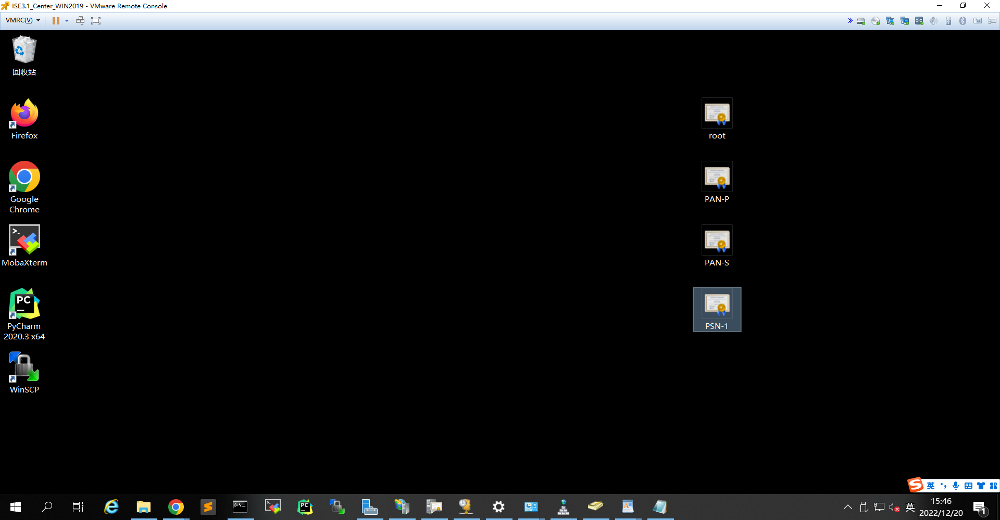

---

## PSN-2申请个人证书

---------------------------------------------------------------------------------------------------
## 步骤一：ISE产生CSR证书签名请求
> ### 登陆WIN2019 --- 打开chrome浏览器 --- 输入 https://psn-2.qytang.com
>>> ### username: admin
>>> ### password: Cisc0123
>> ### login
 
>  ###  [三] --- Administration --- System --- Certificates
>>  ### Certificate Management --- Certificate Signing Requests --- Generate Certificate Signing Requests(CSR)
>>> ### Usage --- Certificate(s) will be used for [Multi-USE]
>>> ### Nodes --- [勾选] PSN-2
>>> ### Subject --- Organizational Unit (OU): ISE
>>> ### Subject --- * Key Length: 2048
>>> ### Subject --- * Digest to Sign With: SHA-256
>> ### Generate
>>> ### Export --- PSN2MultiUse.pem --- 右键 --- 打开方式 --- 写字板 --- Ctrl+A[全先] --- Ctrl+C[复制]

## 步骤二：证书服务器颁发签名证书
>  ### 打开chrome浏览器 --- 输入 https://win2019.qytang.com/certsrv
>> ### 选择一个任务 --- 申请证书
>> ### 申请一个证书 --- 选择一个证书类型: 高级证书申请
>> ### 提交一个证书申请或续订申请
>>>> ### 保存的申请: Ctrl+V[粘贴]
>>>> ### 证书模板: Web服务器
>>> ### 提交
>> ### 证书已颁发 --- (勾选)Base 64编码 --- 下载证书 --- certnew --- 右键 --- 重命名 --- PSN-2 --- 剪切 --- 放在桌面

---

## 把psn-2的证书放到桌面
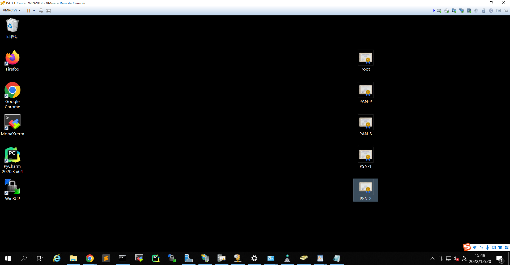

---