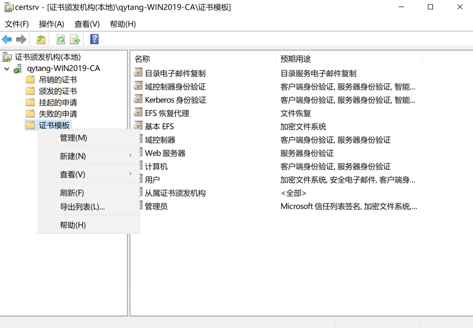
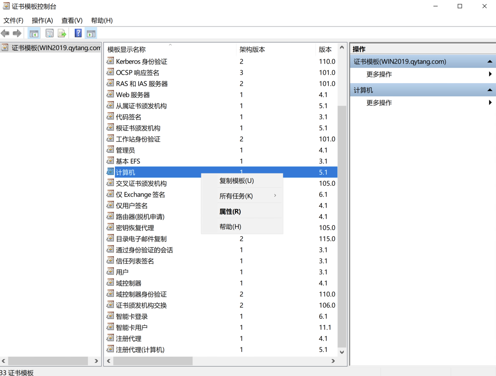
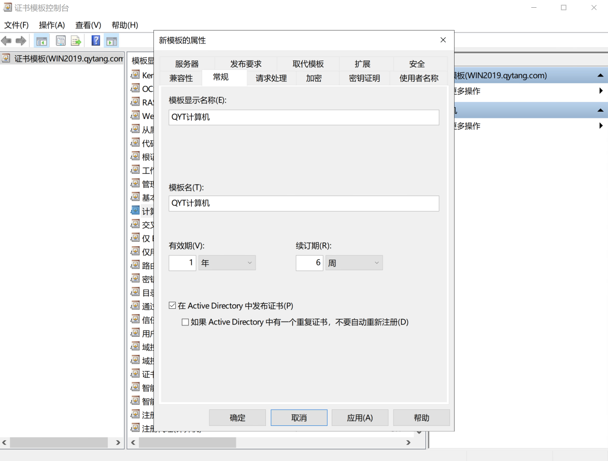
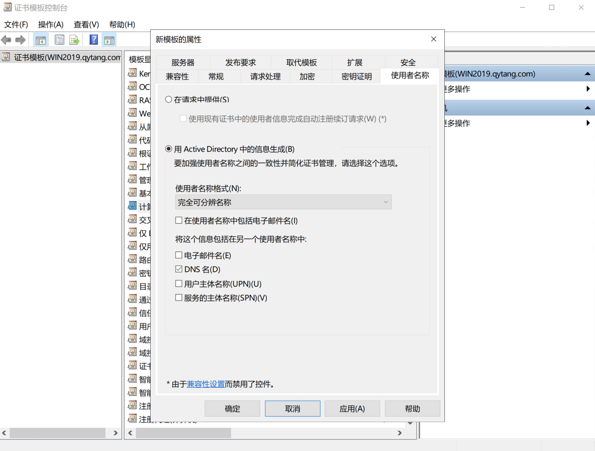
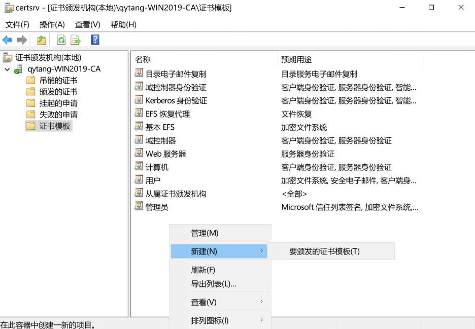
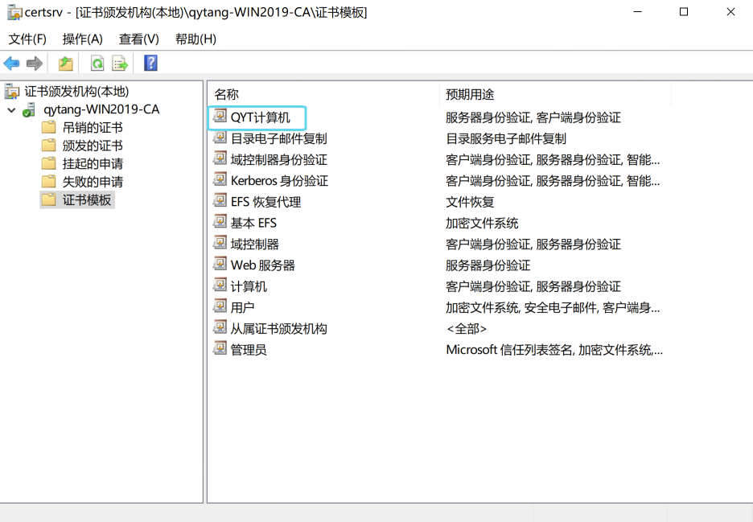

# WIN2019证书颁发机构配置证书模板

## 创建证书模板：

---

## 服务器管理器 --- 仪表板 ---- 工具 --- 证书颁发机构
>  ### 证书颁发机构[本地] --- qytang-WIN2019-CA --- 证书模板[右键] --- 管理[M]
>>  ### 模板显示名称 --- 计算机 --- [右键]复制模板(U) 
>>>  #### 常规 --- 模板显示名称(E): QYT计算机
>>>  #### 常规 --- [勾选] 在Active Directory中发布证书(P)
>>>  #### 使用者名称 --- 用Active Directory中的信息生成(B): --- 使用者名称格式(N): 完全可分辨名称
>>  #### 确定

---

## 管理证书模板

## 复制模板

## 模板设置_常规

## 模板设置_使用者名称

---

## 颁发证书模板：

---

## 服务器管理器 --- 仪表板 ---- 工具 --- 证书颁发机构
>  ### 证书颁发机构[本地] --- qytang-WIN2019-CA --- 证书模板 --- [右键] 新建(N): 要颁发的证书模板(T) --- 名称: QYT计算机 --- 确定

---

## 要颁发的证书模板

## 选择"QYT计算机"模板

## 模板最终

