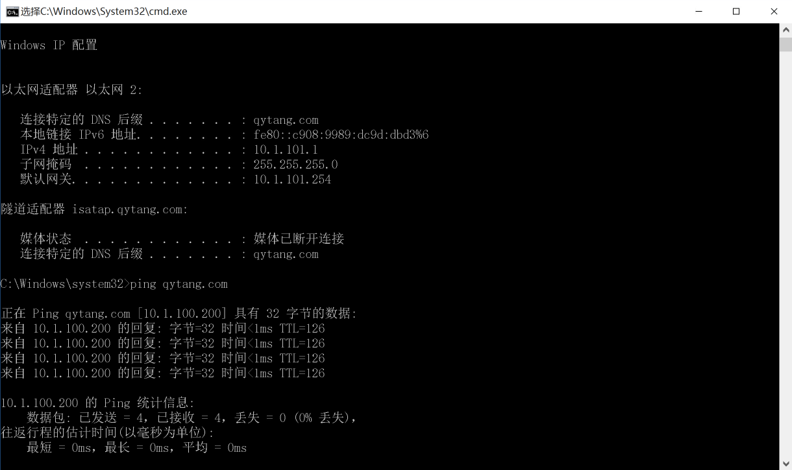
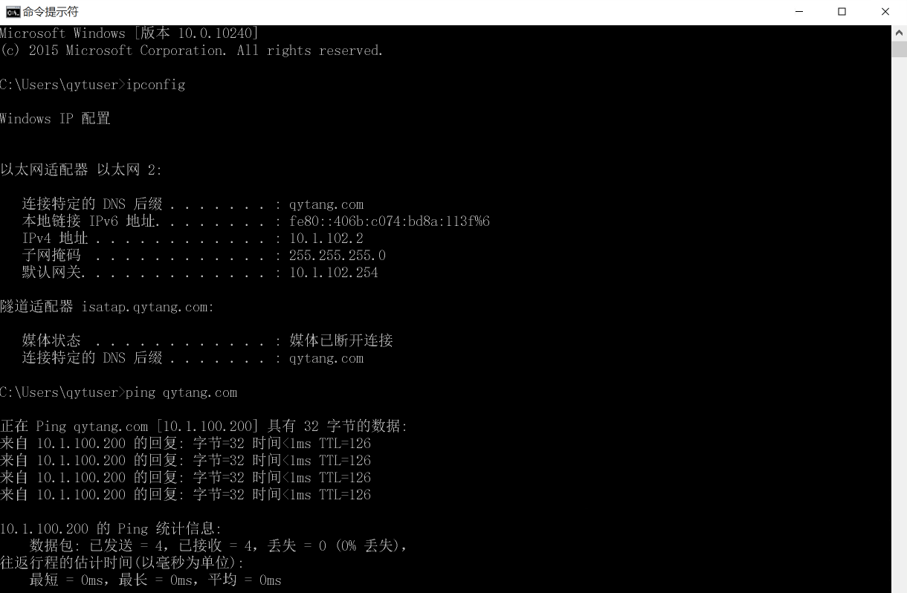
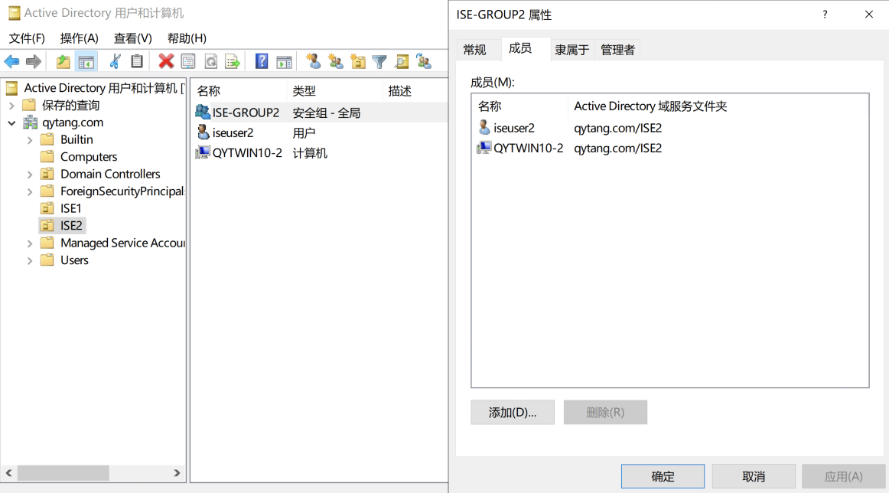

# Site1和Site2的WIN10计算机加入域

## Site1-SW配置
```
interface GigabitEthernet1/0/6
 description to WIN10-1
 switchport access vlan 101
 switchport mode access
 spanning-tree portfast
 no shutdown
 
```

## Site2-SW配置
```
interface GigabitEthernet1/0/6
 description to WIN10-2
 switchport access vlan 102
 switchport mode access
 spanning-tree portfast
 no shutdown
 
```


## Site1-SW区域WIN10加域

---

> ### 登陆系统 
>> ### 用户名: qytuser
>> ### 密码: Cisc0123

> ### ipconfig/all 查看获取IP地址(DHCP获取)


> ### 右键桌面的"此电脑" --- 属性 --- 系统 --- 更改设置 --- 计算机名 --- 更改 --- 隶属于 --- 域(D): qytang.com --- 确定
>> ### 用户名: iseuser1
>> ### 密码: Cisc0123
>### 确定

>### 欢迎加入qytang.com域

##  WIN10系统重启
> ### 登陆系统 --- 其他用户
>> ### 用户名: iseuser1
>> ### 密码: Cisc0123

---

## Site2-SW区域WIN10加域

---

> ### 登陆系统 
>> ### 用户名: qytuser
>> ### 密码: Cisc0123
 
> ### ipconfig/all 查看获取IP地址


> ### 右键桌面的"此电脑" --- 属性 --- 系统 --- 更改设置 --- 计算机名 --- 更改 --- 隶属于 --- 域(D): qytang.com --- 确定
>>> ### 用户名: iseuser2
>>> ### 密码: Cisc0123
>> ### 确定

> ### 欢迎加入qytang.com域

## WIN10系统重启
> ### 登陆系统 --- 其他用户
>> ### 用户名: iseuser2
>> ### 密码: Cisc0123

---

## 加入域后WIN10计算机放入对应OU和GROUP

---

## Site1区域WIN10-1计算机放到OU=ISE1，隶属于GROUP=ISE-GROUP1
> ### 服务器管理器 --- 仪表板 ---- 工具 --- Active Directory用户和计算机
>> ### qytang.com --- Computers --- QYTWIN10-1计算机 --- 右键 --- 移动(V) --- ISE1
>> ### qytang.com --- ISE1 --- QYTWIN10-1计算机 --- 右键 --- 属性 --- 隶属于 --- 添加 ---- ISE-GROUP1 --- 确定


## Site2区域WIN10-2计算机放到OU=ISE2，隶属于GROUP=ISE-GROUP2
> ### 服务器管理器 --- 仪表板 ---- 工具 --- Active Directory用户和计算机
>> ### qytang.com --- Computers --- QYTWIN10-2计算机 --- 右键 --- 移动(V) --- ISE2
>> ### qytang.com --- ISE2 --- QYTWIN10-2计算机 --- 右键 --- 属性 --- 隶属于 --- 添加 ---- ISE-GROUP2 --- 确定

