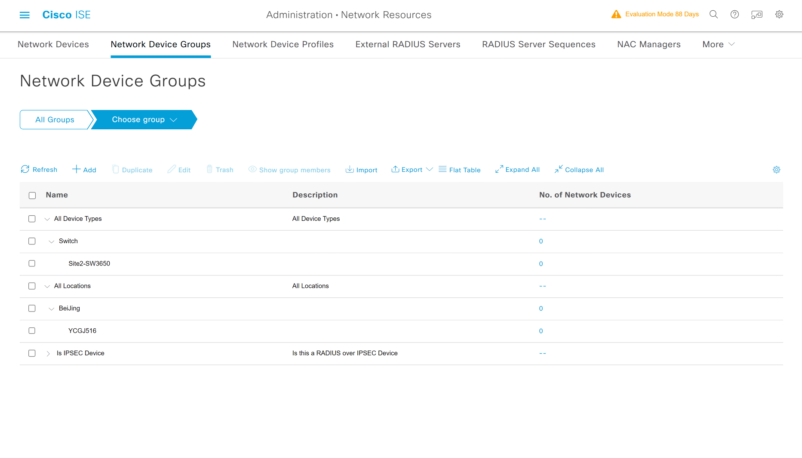
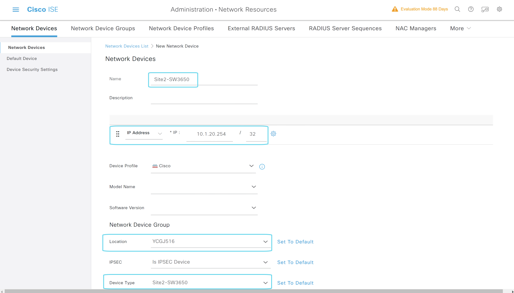
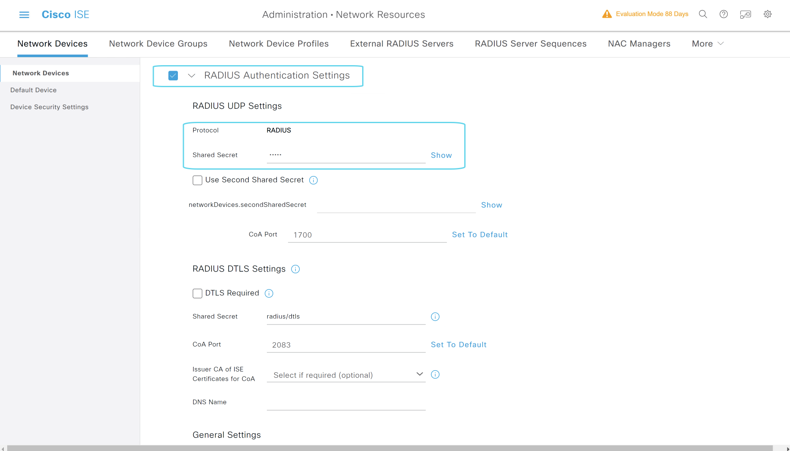
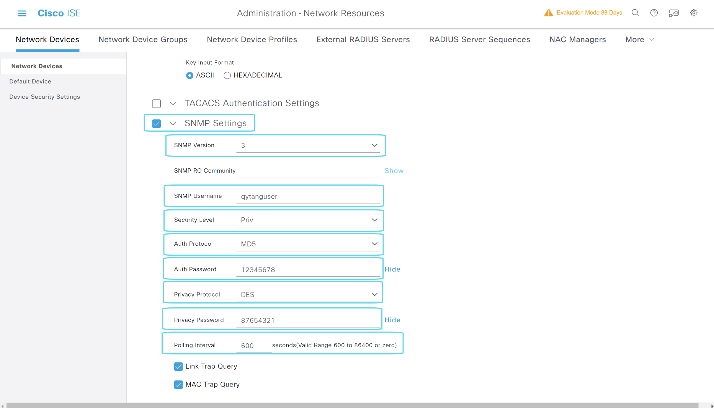

# 配置NDG(Network Device Groups)

---

> ### 登陆WIN2019 --- 打开chrome浏览器 --- 输入 https://pan-p.qytang.com
>>> ### username: admin
>>> ### password: Cisc0123
>> ### login
---
>  ###  [三] --- Administration --- Network Resources --- Network Device Groups
>  ###  Add
>>>  ### Name* : Switch
>>>  ### Parent Groups* : All Device Types
>>   ### Save
>   ##  Add
>>> ### Name* : Site2-SW3650
>>> ### Parent Groups* : All Device Types > Switch
>> ### Save
> ## Add
>>> ### Name* : BeiJing
>>> ### Parent Groups* : All Locations
>> ### Save
> ## Add
>>> ### Name* : YCGJ516
>>> ### Parent Groups* : All Locations > BeiJing
>> ### Save

---

## NDG最终效果

---

## 配置ND(Network Devices)

---

> ###  [三] --- Administration --- Network Resources --- Network Devices
> ###  Add
>>  ### Name: Site2-SW3650
>> ### IP Address *IP: 10.1.20.254 / 32
>> ### Network Device Group
>>> ### Location: BeiJing > YCGJ516
>>> ### Device Type: Switch > Site2-SW3650
>> ### [勾选] RADIUS Authentication Settings
>>> ### Shared Secret: cisco
>> ### [勾选]  SNMP Settings
>>> ### SNMP Version: 3
>>> ### SNMP Username: qytanguser
>>> ### Security Level: Priv
>>> ### Auth Protocol: MD5
>>> ### Auth Password: 12345678
>>> ### Privacy Protocol: DES
>>> ### Privacy Password: 87654321
>>> ### Polling Interval: 600 seconds(Valid Range 600 to 86400 or zero)
>> ### Submit

---

## ND配置

