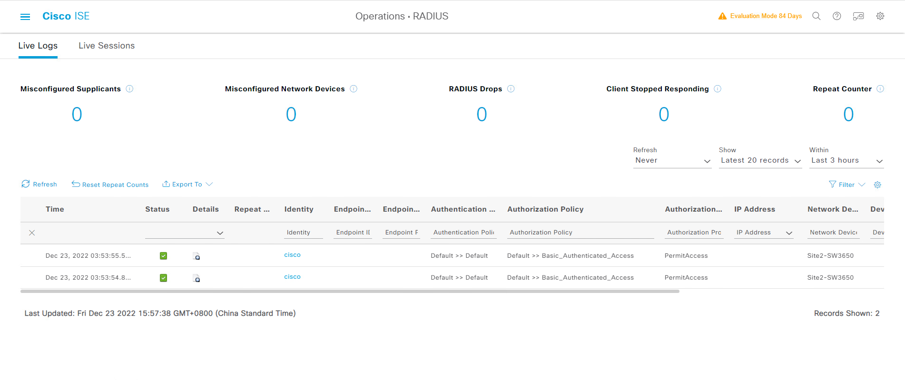
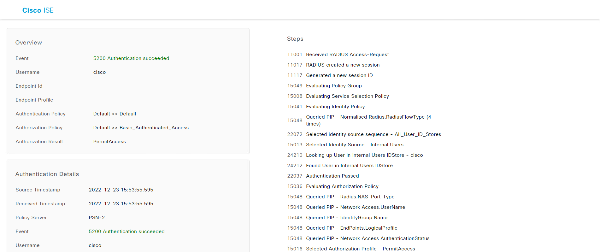

# 测试

---

```
Site2-SW#test aaa group ISE cisco Cisc0123 new-code 
User successfully authenticated

USER ATTRIBUTES

username             0   "cisco"

```

---


# 查看Live logs

---

> ##  [三] --- Operations --- RADIUS --- Live Logs
> ### 测试PASS
> 
> ### 测试详情
> 
