# ISE配置认证与授权策略

## 创建TACACS Profiles

---

> ### 登陆WIN2019 --- 打开chrome浏览器 --- 输入 https://pan-p.qytang.com
>>> ### username: admin
>>> ### password: Cisc0123
>> ### login

> ##  [三] --- Work Center --- Device Administration --- Policy Elements
>> ###  Results --- TACACS Profiles --- Add
>>>> ### Name: Priv15
>>>> ### Task Attribute View --- Common Tasks Type: Shell
>>>>> ### Default Privilege: 15 (Select 0 to 15)
>>> ### Submit

---

## 创建TACACS Profile --- Priv15
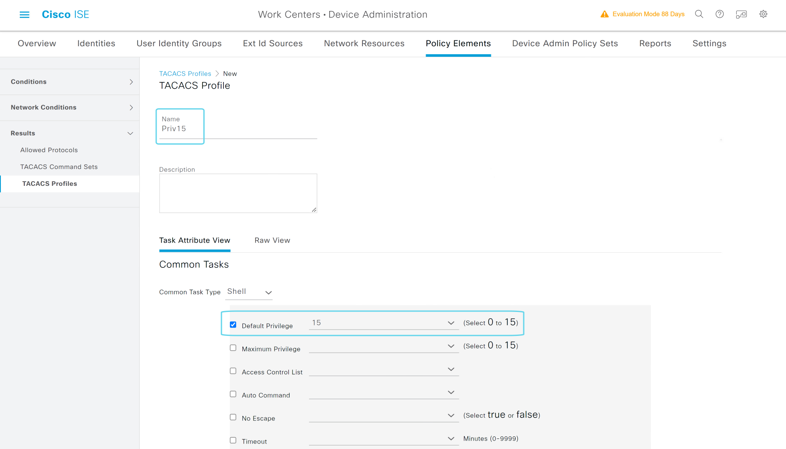

---

## 配置Policy Sets

---

>  ##  [三] --- Work Center --- Device Administration --- Device Admin Policy Sets
>> ###  Policy Sets --- + (新建)
>>> ### Policy Set Name: QYT-TACACS-Policy
>>> ### Conditions: Network Access Protocol EQUALS: TACACS+
>>> ### Allowed Protocols: Default Device Admin
>> ### Save

---

## 添加Policy Set

## 选择条件Network Access Protocol
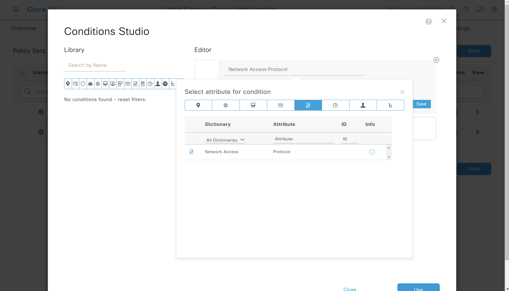

## Network Access Protocol等于TACACS+
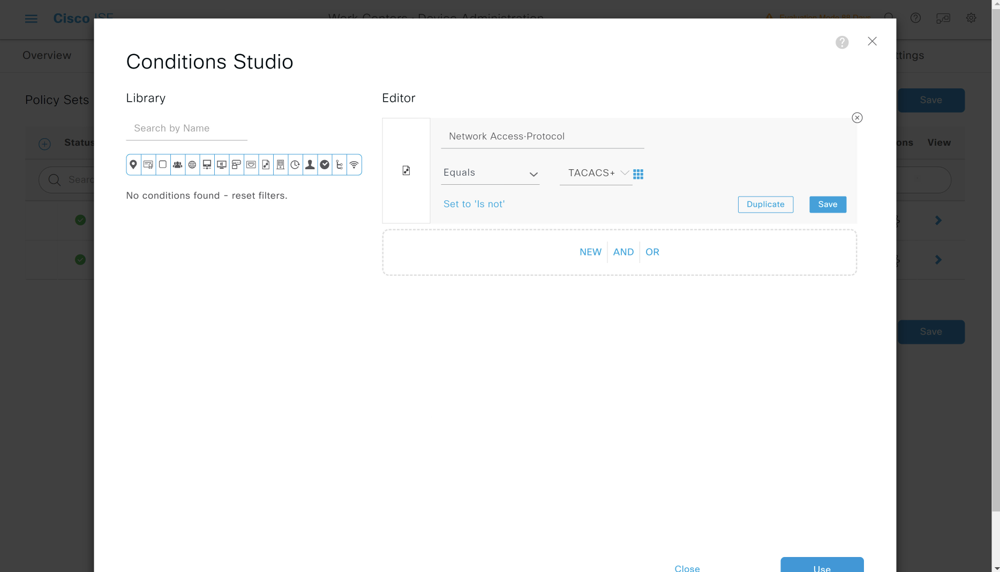

## Allow Protocols选择Default Device Admin
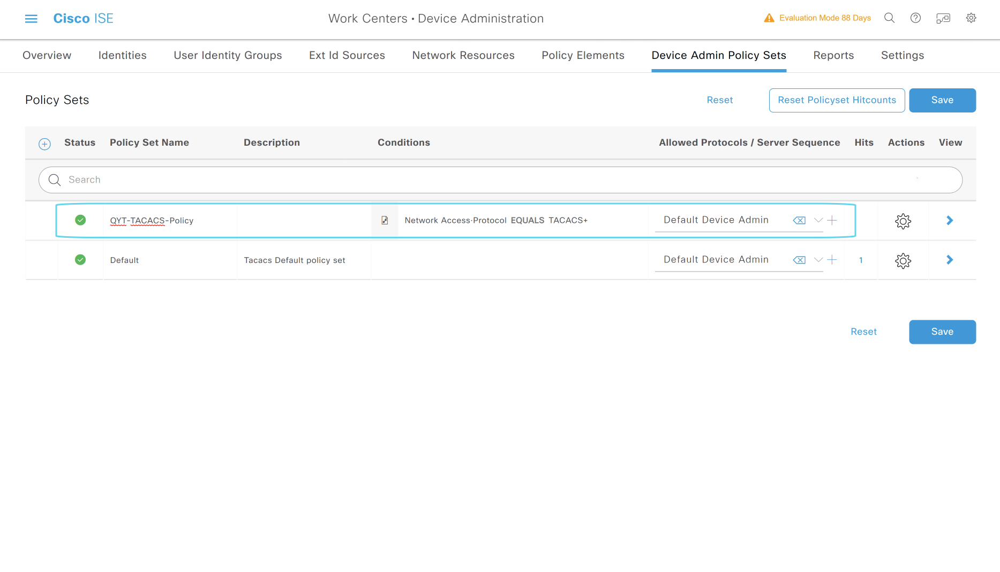

## 配置Policy Sets --- Authentication Policy

---

>  ##  [三] --- Work Center --- Device Administration --- Device Admin Policy Sets
>> ###  Policy Sets --- QYT-TACACS-Policy --- 最右边的 ">" 展开策略
>>> ### Authentication Policy(1) --- + (新建)
>>>> ### Rule Name: TACACS Authentication Rule 1
>>>> ### Conditions: 
>>>>> ### DEVICE-Device Type EQUALS All Device Types# Switch#Site2-SW3650
>>>>> ### DEVICE-Location EQUALS All Locations# BeiJing#YCGJ516
>>>> ### Use: Internal Users
>>> ### Save

---

## Allow Protocols选择Default Device Admin

## 添加认证策略
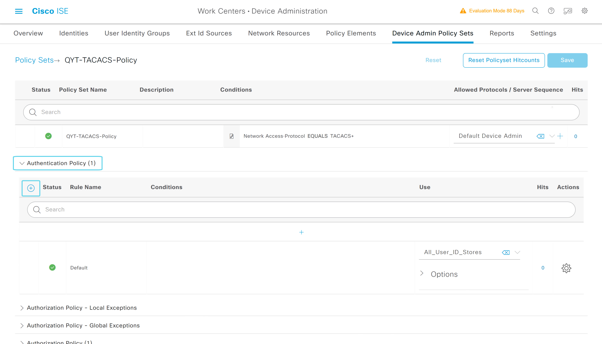

## 条件 Device Type
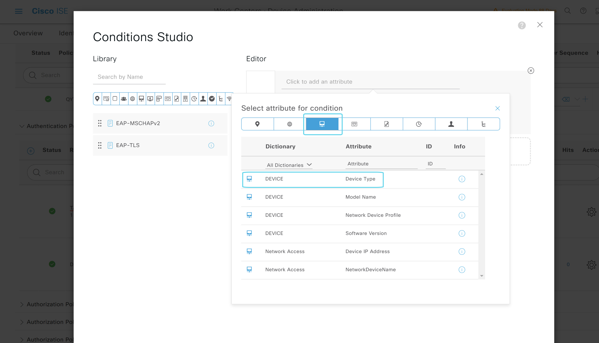

## 条件 Device Location
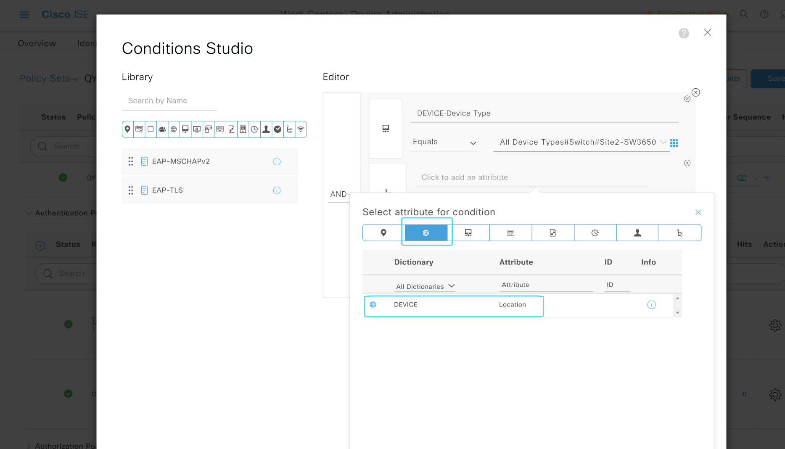

## 认证策略最终
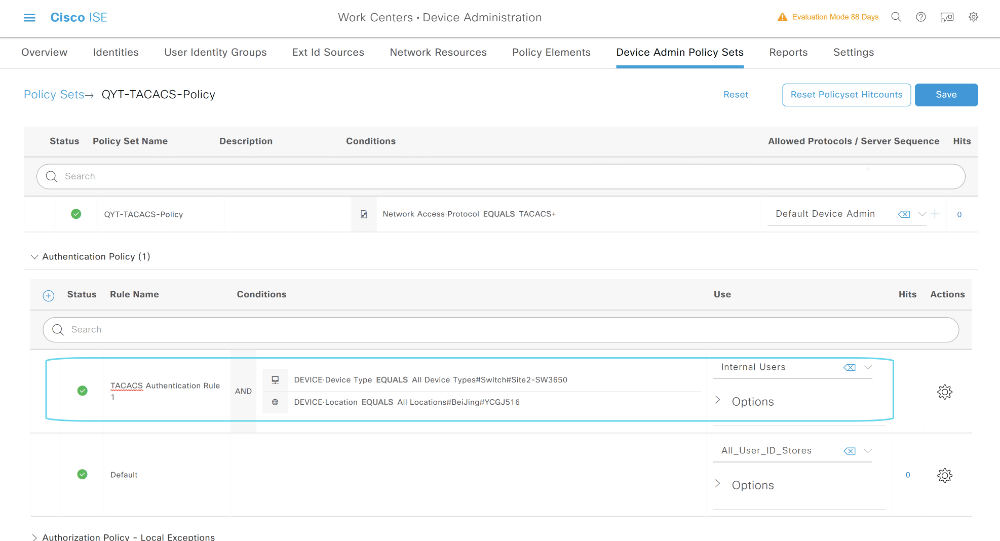

## 配置Policy Sets --- Authorization Policy

---
> ##  [三] --- Work Center --- Device Administration --- Device Admin Policy Sets
>> ###  Policy Sets --- QYT-TACACS-Policy --- >
>>> ### Authorization Policy(1) --- + (新建)
>>>> ### Rule Name:  TACACS Authorization Rule 1
>>>> ### Conditions: InternalUser-IdentityGroup EQUALS User Identity Groups: admingroup
>>>> ### Results --- Shell Profiles: Priv15
>>> ### Save

---

## 添加授权策略
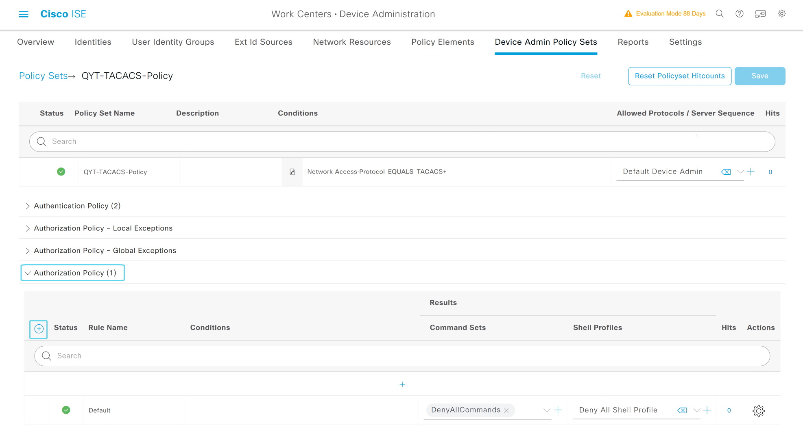

## 条件IdentityGroup
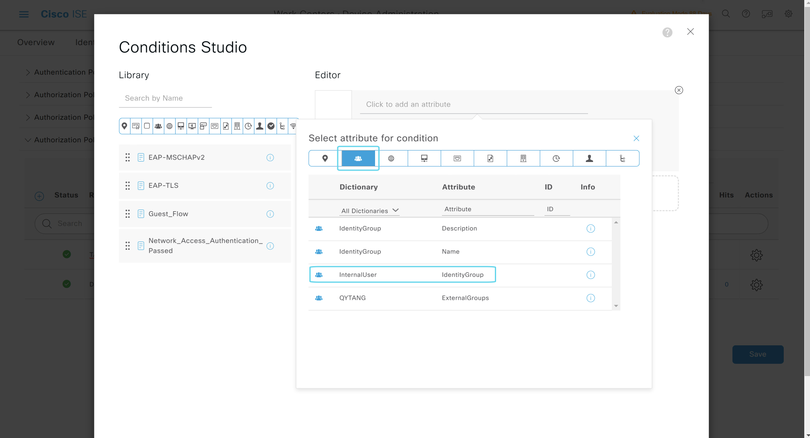

## IdentityGroup为admingroup
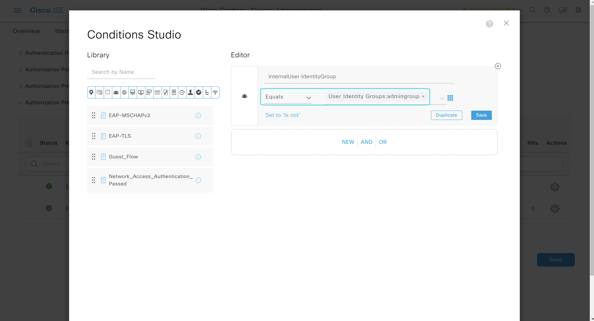

## 授权策略最终
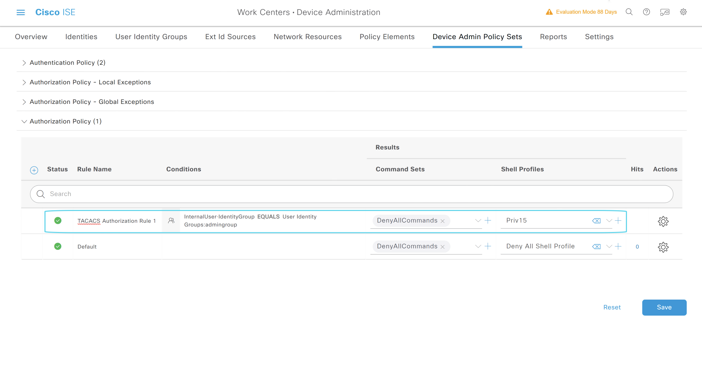