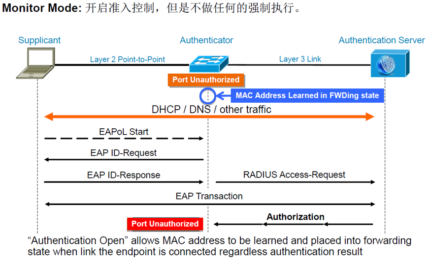
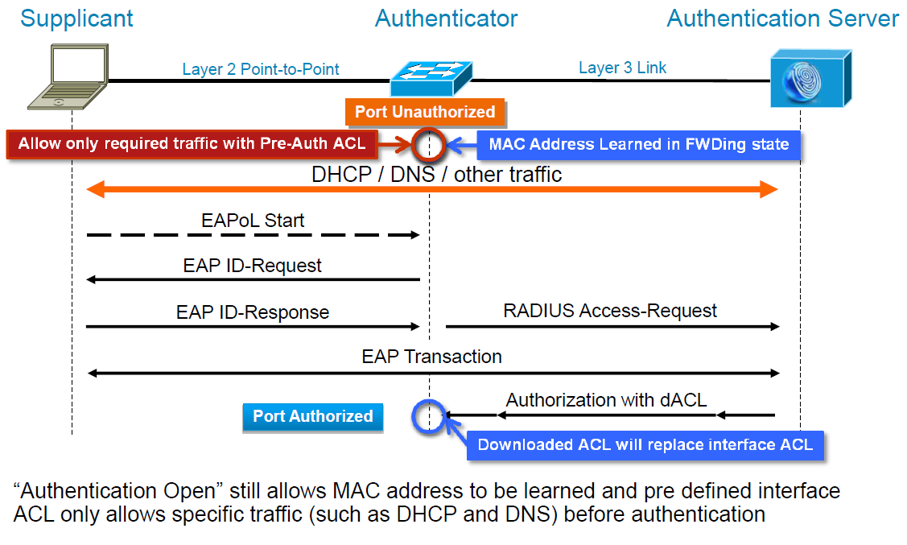
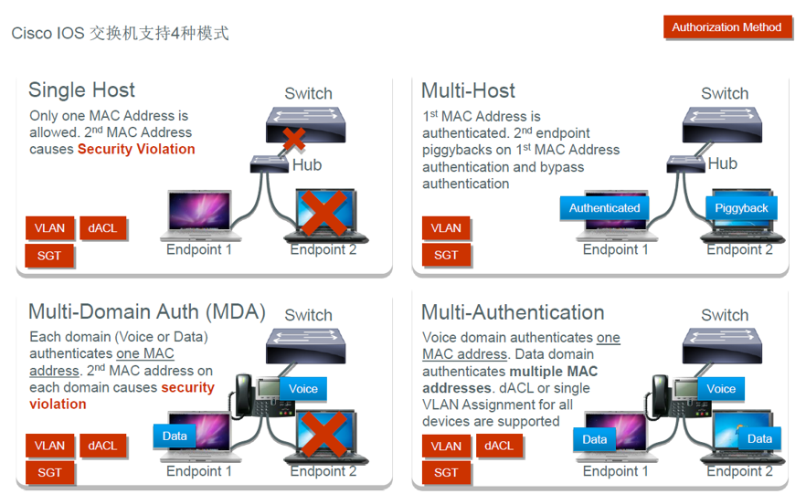

# SW3650交换机配置介绍

## 官方推荐交换机配置

### 启用Dot1x认证，授权与审计
```shell
aaa new-model
aaa authentication dot1x default group ISE
aaa authorization network default group ISE
aaa accounting dot1x default start-stop group ISE

```

### 启用CoA
```shell
aaa server radius dynamic-author
 client 10.1.20.241 server-key cisco

```

### 全局启用Dot1x
```shell
dot1x system-auth-control

```

### 跟踪设备的IP地址
```shell
device-tracking tracking 

```

### Radius服务调优
```shell
! ---Sends the Service-Type attribute in access requests
radius-server attribute 6 on-for-login-auth

! ---Sends the Framed-IP-Address attribute in access requests
radius-server attribute 8 include-in-access-req

! ---Wait 3 x 5 seconds before marking RADIUS server as dead
radius-server dead-criteria time 5 tries 3

! ---Enables vendor-specific attributes to be sent in RADIUS accounting messages
radius-server vsa send accounting

! ---In order to enable dACLs, you must first configure your access switch to allow communications using the cisco-av-pair attribute with the value aaa:event=acl-download. Enter the command shown here in the global configuration of the switch. If you fail to add this command, will result in failed authentication/authorization requests
radius-server vsa send authentication

```

### ACL-DEFAULT放行基本流量
```shell
ip access-list extended ACL-DEFAULT
  remark DHCP
  permit udp any eq bootpc any eq bootps
  remark DNS
  permit udp any any eq domain
  remark Ping
  permit icmp any any
  remark TFTP
  permit udp any any eq tftp
  remark Drop all the rest
  deny   ip any any

```

### WEB-REDIRECT匹配需要重定向的流量
```shell
ip access-list extended WEB-REDIRECT
 deny   udp any any eq domain
 deny   udp any host 10.1.20.241 eq 8905
 deny   udp any host 10.1.20.241 eq 8906
 deny   udp any host 10.1.20.241 eq 8909
 deny   tcp any host 10.1.20.241 eq 8905
 deny   tcp any host 10.1.20.241 eq 8909
 deny   tcp any host 10.1.20.241 eq 8443
 deny   udp any host 10.1.20.254 eq 8905
 deny   tcp any host 10.1.20.254 eq 8905
 permit ip any any

```

### device tracking 策略
```shell
device-tracking policy IPDT_MAX_10
 limit address-count 10
 tracking enable
 
```

### 接口下完整配置
```shell
interface GigabitEthernet1/0/6
 description ISE-MAB-DOT1X-WEBAUTH
 switchport access vlan 102
 switchport mode access
 device-tracking attach-policy IPDT_MAX_10
 ip access-group ACL-DEFAULT in
 authentication event fail action next-method
 authentication event server dead action authorize vlan 102
 authentication event server alive action reinitialize 
 authentication host-mode multi-auth
 authentication open
 authentication order mab dot1x
 authentication priority dot1x mab
 authentication port-control auto
 authentication violation restrict
 mab
 dot1x pae authenticator
 spanning-tree portfast

```

## Authentication Open（监听模式）


## Authentication Open（低风险模式）


## 4种Host-Mode介绍



