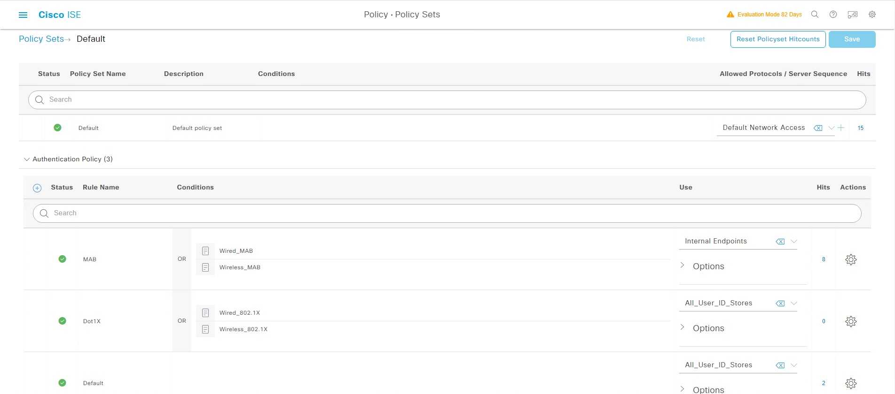

## 什么是MAC Authentication Bypass？
> + ### MAC认证旁路（MAB），也叫做静态MAC认证，使用MAC地址作为用户名和密码
> + ### MAB是一种最基本形式的认证，因为很多设备并不支持802.1x
> + ### MAB使用PAP/ASCII或者可选的EAP-MD5来hash密码，RADIUS包是明文的，并且用户名也是MAC地址。
> + ### 这些限制让基于MAC地址的认证相对于其它形式的认证，在安全性上比较薄弱，但却是设备认证很好的第一步


## MAB的优势与局限


## MAB的操作
> + ### 在MAB之前，终端的身份是未知的，所有的流量都将被阻止
> + ### 交换机检查一个数据包，以学习和认证源MAC地址
> + ### MAB认证成功之后，终端的身份已知了，并且所有的源自于这个终端的流量都将被允许，或者被接口访问控制列表或者DACL所控制


## MAB认证过程介绍


## 禁用黑名单功能
> ### [三] --- Administration --- System --- Settings --- Protocols --- RADIUS


## 禁用默认的设备识别功能
> ### [三] --- Administration --- System --- Deployment --- Deployment --- PSN-2 --- Profiling Configuration


## 清除所有Endpoint
> ### [三] --- Work Centers --- Network Access --- Identities --- Endpoints 


## Site2-SW打开接口:
```shell
Site2-SW(config)#interface gigabitEthernet 1/0/6
Site2-SW(config-if)#shutdown 
Site2-SW(config-if)#no shutdown 

```

## MAC地址会被自动添加到Endpoints数据库(默认行为, 与设备识别无关, 确实也识别出来设备类型)


## 认证总是可以通过的(Radius总是会把MAC加入Endpoint数据库),只是只能获取PermitAccess的授权(倒数第二个授权策略)


## SW3650授权
> PC和IP Phone在SW3650上都能看到mab Authc Success的结果,虽然觉得很牛逼,但是其实并没有任何用,因为没有任何额外的授权,所以流量依然受到接口下的ACL ACL-DEFAULT的控制
```shell
Site2-SW# show authentication sessions 
Interface                MAC Address    Method  Domain  Status Fg  Session ID
--------------------------------------------------------------------------------------------
Gi1/0/6                  0050.56a1.bcc5 mab     DATA    Auth        0A0114FE0000001044157675
Gi1/0/6                  0027.0dbd.8e0f mab     DATA    Auth        0A0114FE0000000F44157495

Session count = 2

Key to Session Events Blocked Status Flags:

  A - Applying Policy (multi-line status for details)
  D - Awaiting Deletion
  F - Final Removal in progress
  I - Awaiting IIF ID allocation
  P - Pushed Session
  R - Removing User Profile (multi-line status for details)
  U - Applying User Profile (multi-line status for details)
  X - Unknown Blocker
```

```shell
Site2-SW#show authentication sessions int g1/0/6 details             
            Interface:  GigabitEthernet1/0/6
               IIF-ID:  0x17BC8B75
          MAC Address:  0050.56a1.bcc5
         IPv6 Address:  Unknown
         IPv4 Address:  10.1.102.2
            User-Name:  00-50-56-A1-BC-C5
               Status:  Authorized
               Domain:  DATA
       Oper host mode:  multi-auth
     Oper control dir:  both
      Session timeout:  N/A
    Common Session ID:  0A0114FE0000001044157675
      Acct Session ID:  0x00000003
               Handle:  0x3d000006
       Current Policy:  POLICY_Gi1/0/6


Server Policies:


Method status list:
       Method           State
          mab           Authc Success
          
----------------------------------------

            Interface:  GigabitEthernet1/0/6
               IIF-ID:  0x1EEB3810
          MAC Address:  0027.0dbd.8e0f
         IPv6 Address:  Unknown
         IPv4 Address:  10.1.102.1
            User-Name:  00-27-0D-BD-8E-0F
               Status:  Authorized
               Domain:  DATA
       Oper host mode:  multi-auth
     Oper control dir:  both
      Session timeout:  N/A
    Common Session ID:  0A0114FE0000000F44157495
      Acct Session ID:  0x00000002
               Handle:  0xba000005
       Current Policy:  POLICY_Gi1/0/6


Server Policies:


Method status list:
       Method           State
          mab           Authc Success
```


## 创建Endpoint ID Groups
>  ### [三] --- Administration --- Identity Management --- Groups
>> ### Identity Groups --- Endpoint Identity Groups --- Add
>>>> ### *Name: QYT-WhiteList
>>> ### Submit

## 创建Endpoints
> ### [三] --- Work Centers --- Network Access --- Identities
>> ### Endpoints --- [勾选] 00:27:0D:BD:8E:0F --- Edit Endpoint
>>>> ### [勾选] Static Assignment --- Policy Assignment --- Cisco-IP-Phone-7962
>>>> ### [勾选] Static Group Assignment --- Identity Groups Assignment --- QYT-WhiteList
>>> ### Save

## Cisco-IP-Phone匹配的系统认证策略"MAB"



## 创建MAB的Authorization Profile
>  ### [三] --- Policy --- Policy Elements --- Results --- Authorization --- Authorization Profile --- Add
>> ### *Name: QYT-MAB-Profile
>> ### Common Tasks 
>>> ### [勾选] DACL Name: PERMIT_ALL_IPV4_TRAFFIC
>>> ### [勾选] VLAN  Tag ID: 1 --- ID/Name: 102
>> ### Submit


## 创建MAB用授权策略(调整到第一个策略)
>  ### [三] --- Policy --- Policy Sets --- default --- > --- Authorization Policy(12) --- +
>>> ### Rule name: QYT-MAB-Authorization
>>> ### Conditions
>>>> + #### Wired_MAB
>>>> + #### IdentityGroup-Name EQUALS Endpoint Identity Group: QYT-WhiteList
>>> ### Results Profiles: QYT-MAB-Profile
>> ### Save


## 测试

### 第1步: Shutdown, No Shutdown接口
```
Site2-SW#(config)#inter g1/0/6
Site2-SW#(config-if)#shutdown
Site2-SW#(config-if)#no shutdown
```


### 第2步: 查看接口认证状态(关注授权的ACL)
```
Site2-SW#show authentication sessions     
Interface                MAC Address    Method  Domain  Status Fg  Session ID
--------------------------------------------------------------------------------------------
Gi1/0/6                  0027.0dbd.8e0f mab     DATA    Auth        0A0114FE000000114441CE70

Session count = 2

Key to Session Events Blocked Status Flags:

  A - Applying Policy (multi-line status for details)
  D - Awaiting Deletion
  F - Final Removal in progress
  I - Awaiting IIF ID allocation
  P - Pushed Session
  R - Removing User Profile (multi-line status for details)
  U - Applying User Profile (multi-line status for details)
  X - Unknown Blocker
```
```
Site2-SW#show authentication sessions int g1/0/6 details 
            Interface:  GigabitEthernet1/0/6
               IIF-ID:  0x1EA62D6C
          MAC Address:  0027.0dbd.8e0f
         IPv6 Address:  Unknown
         IPv4 Address:  10.1.102.1
            User-Name:  00-27-0D-BD-8E-0F
               Status:  Authorized
               Domain:  DATA
       Oper host mode:  multi-auth
     Oper control dir:  both
      Session timeout:  N/A
    Common Session ID:  0A0114FE000000114441CE70
      Acct Session ID:  0x00000004
               Handle:  0xd1000007
       Current Policy:  POLICY_Gi1/0/6


Server Policies:
           Vlan Group:  Vlan: 102
              ACS ACL: xACSACLx-IP-PERMIT_ALL_IPV4_TRAFFIC-57f6b0d3


Method status list:
       Method           State
          mab           Authc Success
```

## 第3步: 查看ISE RADIUS Live logs


