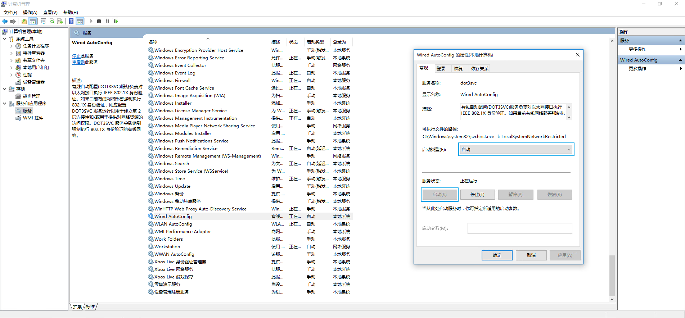
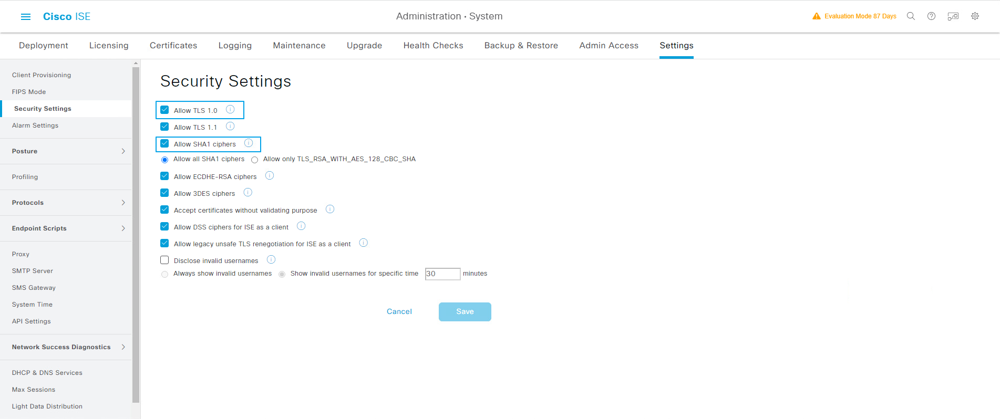
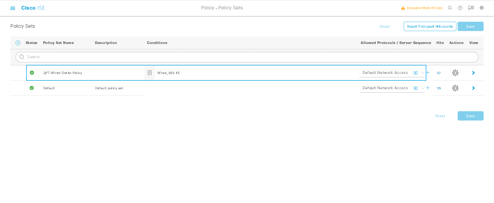
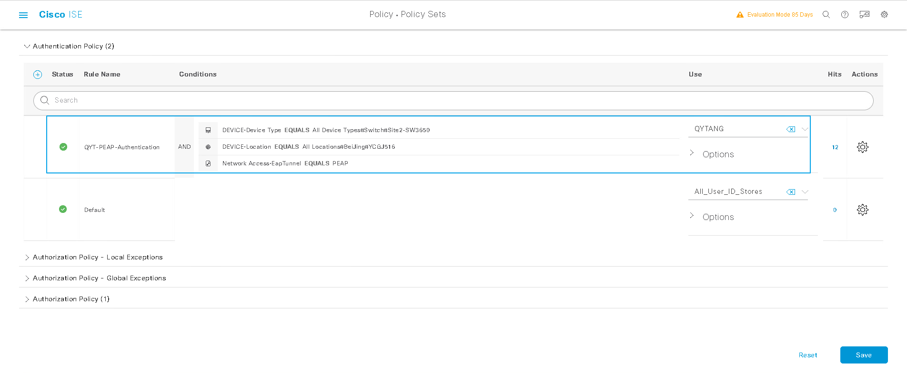
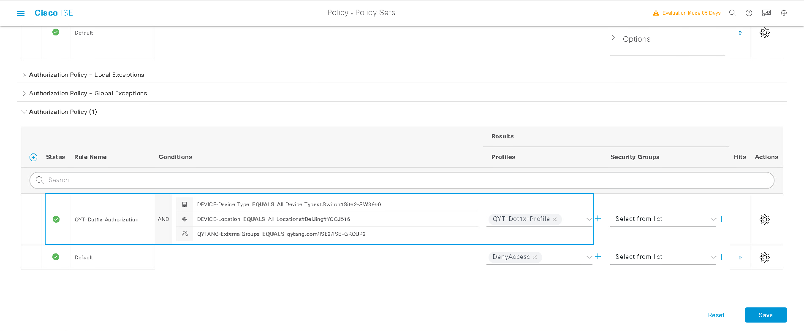
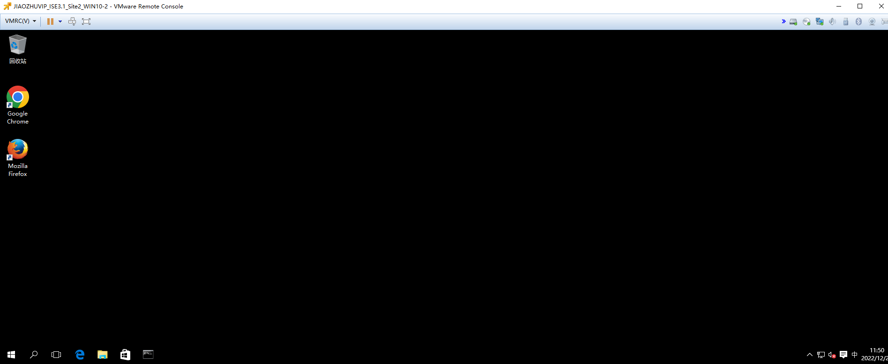
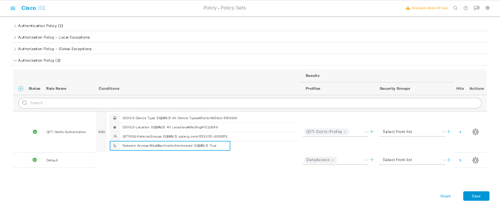

# 检查Site2-SW连接WIN10-2的G1/0/6接口配置
> ### MAB/DOT1X 是二层认证接口下不需要配置VLAN，通过授权获取VLAN
```shell
interface GigabitEthernet1/0/6
 description ISE-MAB-DOT1X-WEBAUTH
 switchport mode access
 device-tracking attach-policy IPDT_MAX_10
 ip access-group ACL-DEFAULT in
 authentication event fail action next-method
 authentication event server dead action authorize vlan 102
 authentication event server alive action reinitialize 
 authentication host-mode multi-auth
 authentication open
 authentication order mab dot1x
 authentication priority dot1x mab
 authentication port-control auto
 authentication violation restrict
 mab
 dot1x pae authenticator
 spanning-tree portfast
```

# 开启WIN10-2计算机Wired AutoConfig服务
> ## 计算机管理 --- 服务和应用程序 --- 服务(cmd.exe敲"services.msc") --- 扩展 --- Wired AutoConfig  
> ### 常规 --- 服务状态: 启动
> ### 常规 --- 启动类型(E): 自动
> ### 常规 --- 确定


# 配置WIN10-2计算机网卡身份验证
> ### 身份验证 --- 其他设置(D)... --- [勾选] 指定身份验证模式(P) --- 用户或计算机身份验证 --- 确定
> ### 身份验证 --- 设置 --- 受信任的根证书颁发机构(R) --- [勾选] qytang-WIN2019-CA --- 配置 --- [勾选] 自动使用Windows登陆名和密码(以及域,如果有的话)(A) --- 确定
.png)
.png)


# ISE Security Settings
> ### [三] --- Administration --- System --- Settings --- Security Setting
> ### [勾选] Allow SHA1 ciphers
> ### [勾选] Allow TLS 1.0    //严重注意，系统会重启，建议上课前提前勾选或ISE集成AD章节勾选



# 配置Authorization Profile
## 配置QYT-Dot1x-Porfile
> ###  [三] --- Policy --- Policy Elements --- Results
>> ### Authorization --- Authorization Profiles --- Add
>>> ### *Name: QYT-Dot1x-Profile
>>> ### Common Tasks
>>>> ### [勾选] DACL Name: PERMIT_ALL_IPv4_TRAFFIC
>>>> ### [勾选] VLAN  Tag ID: 1 --- ID/Name: 102
>>> ### Submit


# 配置Policy Sets
> ###  [三] --- Policy --- Policy Sets --- +
>> ### Policy Set Name: QYT-Wired-Dot1x-Policy
>> ### Conditions: Wired_802.1X
>> ### Allowed Protocols: Default Network Access
>> ### Save



# 配置Authentication Policy
> ###  [三] --- Policy --- Policy Sets --- QYT-Wired-Dot1x-Policy --- > View
> ### Authentication Policy(1) --- +
>> ### Rule: QYT-PEAP-Authentication
>> ### Conditions: DEVICE-Device Type EQUALS All Device Types#Switch#Site2-SW3650
>> ### Conditions: Device-Location EQUALS All Location#BeiJing#YCGJ516
>> ### Conditions: Network Access-EapTunnel EQUALS PEAP
>> ### Use: QYTANG
>> ### Save



# 配置Authorization Policy
> ###  [三] --- Policy --- Policy Sets --- QYT-Wired-Dot1x-Policy --- > View
> ### Authorization Policy(1) --- +
>> ### Rule: QYT-Dot1x-Authorization
>> ### Conditions: DEVICE-Device Type EQUALS All Device Types#Switch#Site2-SW3650
>> ### Conditions: Device-Location EQUALS All Location#BeiJing#YCGJ516
>> ### Conditions: QYTANG-ExternalGroups EQUALS qytang.com/ISE2/ISE-GROUP2
>> ### Results Profiles: QYT-Dot1x-Profile
>> ### Save



# 测试WIN10-2机器认证
> ## WIN10-2计算机注销，不登陆


> ## 查看交换机认证状态
```shell
Site2-SW#show authentication sessions int g1/0/6 details 
            Interface:  GigabitEthernet1/0/6
               IIF-ID:  0x14C97FA9
          MAC Address:  0050.56a1.bcc5
         IPv6 Address:  fe80::406b:c074:bd8a:113f
         IPv4 Address:  10.1.102.2
            User-Name:  host/QYTWIN10-2.qytang.com
               Status:  Authorized
               Domain:  DATA
       Oper host mode:  multi-auth
     Oper control dir:  both
      Session timeout:  N/A
    Common Session ID:  0A0114FE00000024510EE386
      Acct Session ID:  0x00000020
               Handle:  0x5a00001a
       Current Policy:  POLICY_Gi1/0/6


Server Policies:
           Vlan Group:  Vlan: 102
      Security Policy:  None
      Security Status:  Link Unsecured
              ACS ACL: xACSACLx-IP-PERMIT_ALL_IPV4_TRAFFIC-57f6b0d3

          
Method status list:
       Method           State
          mab           Stopped
        dot1x           Authc Success
```

> # 查看ISE RADIUS Live logs
.png)
.png)
.png)


# 测试用户认证
> ### WIN10-2计算机用户登陆


> ### 查看交换机认证状态
```shell
Site2-SW#show authentication sessions int g1/0/6 details 
            Interface:  GigabitEthernet1/0/6
               IIF-ID:  0x14C97FA9
          MAC Address:  0050.56a1.bcc5
         IPv6 Address:  fe80::406b:c074:bd8a:113f
         IPv4 Address:  10.1.102.2
            User-Name:  QYTANG\iseuser2
               Status:  Authorized
               Domain:  DATA
       Oper host mode:  multi-auth
     Oper control dir:  both
      Session timeout:  N/A
    Common Session ID:  0A0114FE00000024510EE386
      Acct Session ID:  0x00000021
               Handle:  0x5a00001a
       Current Policy:  POLICY_Gi1/0/6


Server Policies:
           Vlan Group:  Vlan: 102
      Security Policy:  None
      Security Status:  Link Unsecured
              ACS ACL: xACSACLx-IP-PERMIT_ALL_IPV4_TRAFFIC-57f6b0d3

          
Method status list:
       Method           State
          mab           Stopped
        dot1x           Authc Success
```

> ## 查看ISE RADIUS Live logs
.png)
.png)
.png)


## 配置PEAP机器访问限制
### 修改原有“QYT-Dot1x-Authorization”授权策略的Conditions，激活机器访问限制
> ###  [三] --- Policy --- Policy Sets --- QYT-Wired-Dot1x-Policy --- > View
> ### Authorization Policy(2) --- QYT-Dot1x-Authorization
>> ### Conditions: Network Access-WasMachineAuthenticated EQUALS True 
>> ### Save



> ## 注销WIN10-2计算机并重新登陆测试


> ## 查看ISE RADIUS Live logs
.png)
.png)