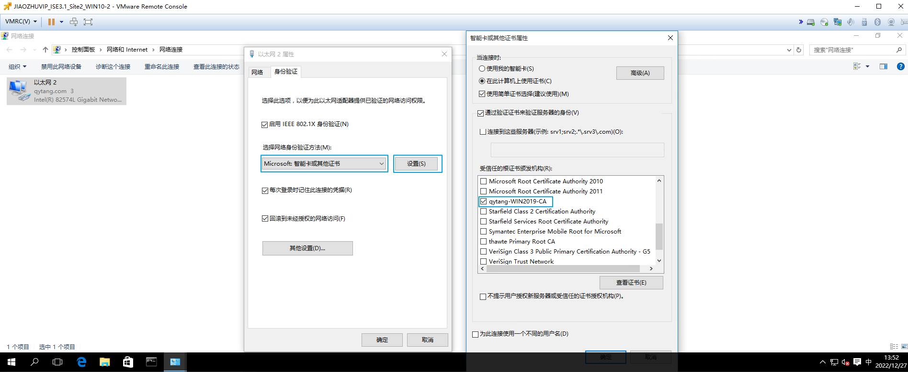
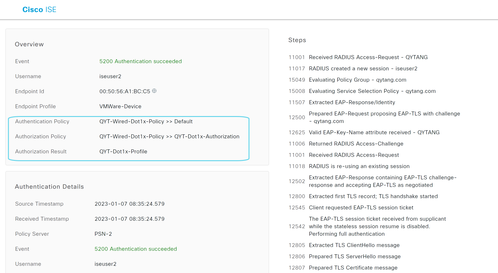
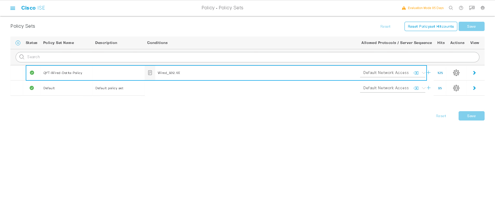
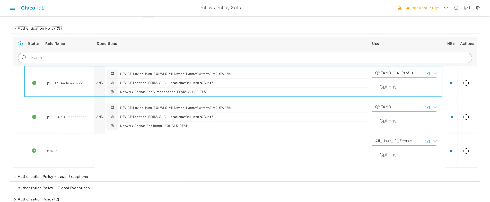
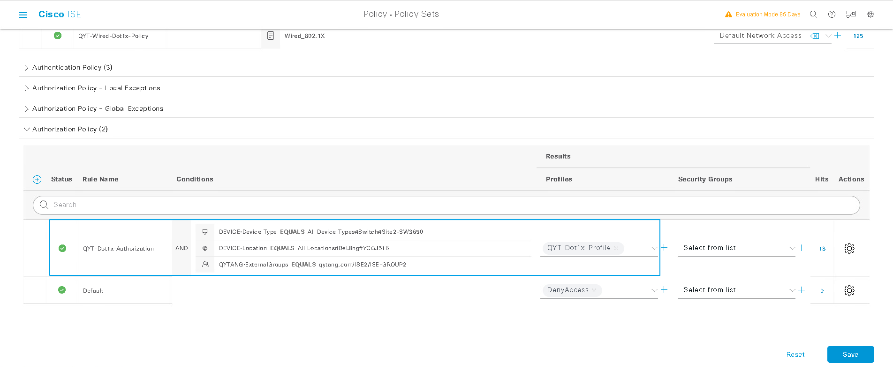
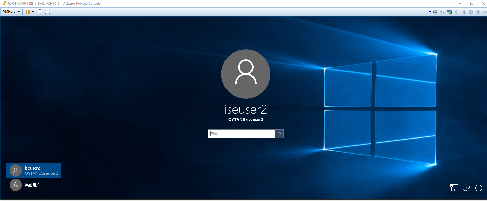
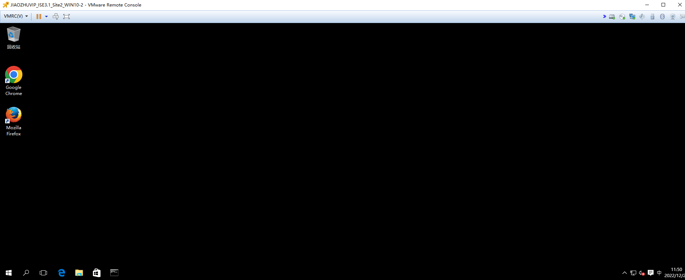

# 修改WIN10-2网卡身份验证方式
> ### 身份验证 --- 选择网络身份验证方法(M): Microsoft:智能卡或其他证书 --- 设置 --- 受新人的根证书颁发机构(R):  [勾选] qytang-QYTWIN2019-CA


# 注意这个时候是可以通过认证与授权的
> ### 说明All_User_ID_Stores包含证书认证


# 配置Certificate Authentication Profile
> ###  [三] --- Administration --- Identity Management --- External Identity Sources
>> ### Certificate Authentication Profile --- Add
>>> ### *Name: QYTANG_CA_Profile
>>> ### Identity Store: QYTANG
>>> ### Use Identity From  (勾选)  Certificate Attribute: Subject - Common Name
>>> ### Match Client Certificate Against Certificate In Identity Store: (勾选) Always perform binary comparison 
>>> ### Submit


# 配置Policy Sets
> ## 原有"QYT-Wired-Dot1x-Policy"策略保持不变



# 配置Authentication Policy
> ###  [三] --- Policy --- Policy Sets --- QYT-Wired-Dot1x-Policy --- > View
> ### Authentication Policy(2) --- +
>> ### Rule: QYT-TLS-Authentication
>> ### Conditions: DEVICE-Device Type EQUALS All Device Types#Switch#Site2-SW3650
>> ### Conditions: Device-Location EQUALS All Location#BeiJing#YCGJ516
>> ### Conditions: Network Access-EapAuthentication EQUALS EAP-TLS
>> ### Use: QYTANG_CA_Profile
>> ### Save



# 配置Authorization Policy
### 修改原有“QYT-Dot1x-Authorization”授权策略的Conditions，删除机器访问限制
> ###  [三] --- Policy --- Policy Sets --- QYT-Wired-Dot1x-Policy --- > View
> ### Authorization Policy(2) --- QYT-Dot1x-Authorization
>> ### Conditions: Network Access-WasMachineAuthenticated EQUALS True  [删除此条件]
>> ### Save



# 测试WIN10-2机器认证
> ### WIN10-2计算机注销，不登陆


> ### 查看交换机认证状态
```shell
Site2-SW#show authentication sessions int g1/0/6 details 
            Interface:  GigabitEthernet1/0/6
               IIF-ID:  0x14C97FA9
          MAC Address:  0050.56a1.bcc5
         IPv6 Address:  fe80::406b:c074:bd8a:113f
         IPv4 Address:  10.1.102.2
            User-Name:  QYTWIN10-2
               Status:  Authorized
               Domain:  DATA
       Oper host mode:  multi-auth
     Oper control dir:  both
      Session timeout:  N/A
    Common Session ID:  0A0114FE00000024510EE386
      Acct Session ID:  0x00000025
               Handle:  0x5a00001a
       Current Policy:  POLICY_Gi1/0/6


Server Policies:
           Vlan Group:  Vlan: 102
      Security Policy:  None
      Security Status:  Link Unsecured
              ACS ACL: xACSACLx-IP-PERMIT_ALL_IPV4_TRAFFIC-57f6b0d3

          
Method status list:
       Method           State
          mab           Stopped
        dot1x           Authc Success
```

> ### 查看ISE RADIUS Live logs
.png)
.png)
.png)

# 测试用户认证
> ### WIN10-2计算机用户登陆


> ### 查看交换机认证状态
```shell
Site2-SW#show authentication sessions int g1/0/6 details 
            Interface:  GigabitEthernet1/0/6
               IIF-ID:  0x14C97FA9
          MAC Address:  0050.56a1.bcc5
         IPv6 Address:  fe80::406b:c074:bd8a:113f
         IPv4 Address:  10.1.102.2
            User-Name:  iseuser2
               Status:  Authorized
               Domain:  DATA
       Oper host mode:  multi-auth
     Oper control dir:  both
      Session timeout:  N/A
    Common Session ID:  0A0114FE00000024510EE386
      Acct Session ID:  0x00000026
               Handle:  0x5a00001a
       Current Policy:  POLICY_Gi1/0/6


Server Policies:
           Vlan Group:  Vlan: 102
      Security Policy:  None
      Security Status:  Link Unsecured
              ACS ACL: xACSACLx-IP-PERMIT_ALL_IPV4_TRAFFIC-57f6b0d3

          
Method status list:
       Method           State
          mab           Stopped
        dot1x           Authc Success
```

> ### 查看ISE RADIUS Live logs
.png)
.png)
.png)

