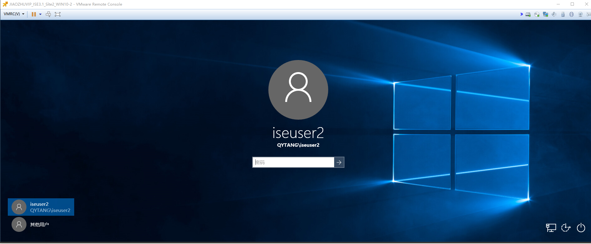

# WIN10-2计算机安装Anyconnect
> ### 文件在C盘根目录《软件安装包》
> ### C:\软件安装包\anyconnect-win-4.4.03034-predeploy-k9\setup.exe
.png)
.png)
.png)
.png)
.png)


# 配置Policy Sets
> ### 原有"QYT-Wired-Dot1x-Policy"策略保持不变


# 配置Authentication Policy
> ###  [三] --- Policy --- Policy Sets --- QYT-Wired-Dot1x-Policy --- > View
> ### Authentication Policy(3) --- +
>> ### Rule: QYT-FAST-Authentication
>> ### Conditions: DEVICE-Device Type EQUALS All Device Types#Switch#Site2-SW3650
>> ### Conditions: Device-Location EQUALS All Location#BeiJing#YCGJ516
>> ### Conditions: Network Access-EapTunnel EQUALS EAP-FAST
>> ### Use: QYTANG
>> ### Save


# 配置Authorization Policy
### 原有“QYT-Dot1x-Authorization”策略保持不变
> ###  [三] --- Policy --- Policy Sets --- QYT-Wired-Dot1x-Policy --- > View
> ### Authorization Policy(2) --- QYT-Dot1x-Authorization


# 测试用户认证
> ### WIN10-2计算机通过Anyconnect客户端连接
> ### 使用内建的Wired策略实现EAP-FAST认证
.png)
.png)
.png)


> ### 查看交换机认证状态
```shell
Site2-SW#show authentication sessions int g1/0/6 details 
            Interface:  GigabitEthernet1/0/6
               IIF-ID:  0x14C97FA9
          MAC Address:  0050.56a1.bcc5
         IPv6 Address:  Unknown
         IPv4 Address:  10.1.102.2
            User-Name:  iseuser2
               Status:  Authorized
               Domain:  DATA
       Oper host mode:  multi-auth
     Oper control dir:  both
      Session timeout:  N/A
    Common Session ID:  0A0114FE00000024510EE386
      Acct Session ID:  0x00000026
               Handle:  0x5a00001a
       Current Policy:  POLICY_Gi1/0/6


Server Policies:
           Vlan Group:  Vlan: 102
      Security Policy:  None
      Security Status:  Link Unsecured
              ACS ACL: xACSACLx-IP-PERMIT_ALL_IPV4_TRAFFIC-57f6b0d3

          
Method status list:
       Method           State
          mab           Stopped
        dot1x           Authc Success
```


> ### 查看ISE RADIUS Live logs
.png)
.png)
.png)


# 测试WIN10-2机器认证
> ### WIN10-2计算机注销，不登陆



> ### 查看交换机认证状态
```shell
Site2-SW#show authentication sessions int g1/0/6 details 
            Interface:  GigabitEthernet1/0/6
               IIF-ID:  0x14C97FA9
          MAC Address:  0050.56a1.bcc5
         IPv6 Address:  fe80::406b:c074:bd8a:113f
         IPv4 Address:  10.1.102.2
            User-Name:  host/QYTWIN10-2
               Status:  Authorized
               Domain:  DATA
       Oper host mode:  multi-auth
     Oper control dir:  both
      Session timeout:  N/A
    Common Session ID:  0A0114FE00000024510EE386
      Acct Session ID:  0x00000027
               Handle:  0x5a00001a
       Current Policy:  POLICY_Gi1/0/6


Server Policies:
           Vlan Group:  Vlan: 102
      Security Policy:  None
      Security Status:  Link Unsecured
              ACS ACL: xACSACLx-IP-PERMIT_ALL_IPV4_TRAFFIC-57f6b0d3

          
Method status list:
       Method           State
          mab           Stopped
        dot1x           Authc Success
```


> ### 查看ISE RADIUS Live logs
.png)
.png)
.png)