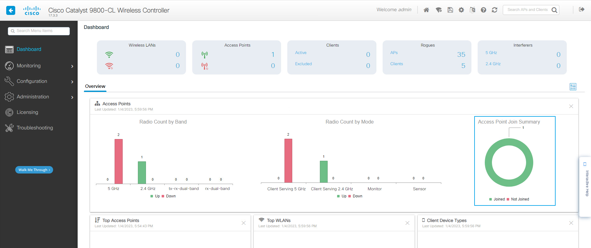
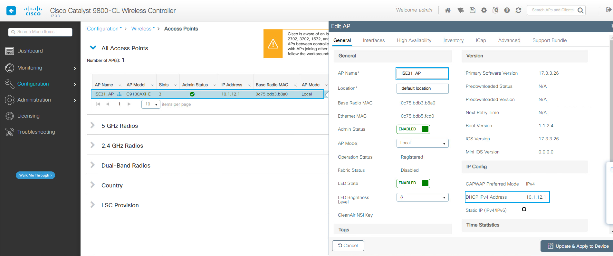
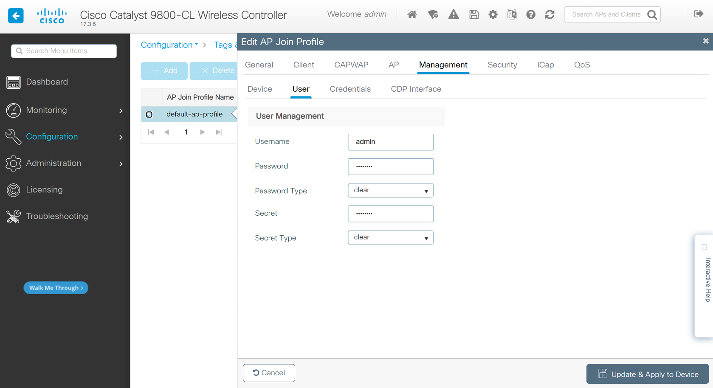

# WIN2019创建AP的DHCP Pool

## 服务器管理器 --- 仪表板 ---- 工具 --- DHCP
>  ### DHCP --- win2019.qytang.com --- IPV4 --- [右键]--- 新建作用域(P)
>>  ### 欢迎使用新建作用域向导 --- 下一步
>>  ### 名称(A): Site1-AP --- 下一步
>>  ### IP地址范围 --- DHCP服务器的配置设置
>>>  ### 输入此作用域分配的地址范围  
>>>>  ### 起始IP地址(S): 10.1.12.1
>>>>  ### 结束IP地址(E): 10.1.12.100
>>>  ### 传播到DHCP客户端的配置设置
>>>>  ### 长度(L): 24
>>>>  ### 子网掩码(U): 255.255.255.0
>>> ### 下一步
>>  ### 添加排除和延迟 --- 下一步
>>  ### 租用期限 --- 下一步
>>  ### 配置DHCP选项 --- (勾选) 是，我想现在配置这些选项(Y) --- 下一步
>>  ### 路由器(默认网关) --- IP地址 --- 10.1.12.254 --- 添加 --- 下一步
>>  ### 域名称和DNS服务器 --- 下一步
>>  ### WINS服务器 --- 下一步
>>  ### 激活作用域 --- (勾选) 是，我想现在激活此作用域(Y)  --- 下一步
>  ### 完成

## Site1-AP Pool增加Option 43
>  ### DHCP --- win2019.qytang.com --- IPV4 --- 作用域[10.1.12.0] Site1-AP
>>  ### 作用域选项 --- [右键] 配置选项 --- 043 供应商特点信息
>>  ### F1 04 0A 01 0B F1

### 无线控制器IP：10.1.11.241 --- 十六进制 --- 0A 01 0B F1


# Site1-SW 配置
```shell
interface GigabitEthernet1/0/2
 description to AP
 switchport trunk native vlan 12
 switchport mode trunk
 !
interface GigabitEthernet1/0/4
 description to C9800-CL
 switchport trunk native vlan 11
 switchport mode trunk
 !
interface Vlan12
 ip address 10.1.12.254 255.255.255.0
 ip helper-address 10.1.100.200
end
```


# 查看AP状态(如果一切没有问题, 只需等待即可)
```shell
CAPWAP State: Discovery
[*01/05/2023 13:16:12.3497] Got WLC address 10.1.11.241 from DHCP.
[*01/05/2023 13:16:12.3497] IP DNS query for CISCO-CAPWAP-CONTROLLER.qytang.com
[*01/05/2023 13:16:12.3526] Discovery Request sent to 10.1.11.241, discovery type STATIC_CONFIG(1)
[*01/05/2023 13:16:12.3542] Discovery Request sent to 255.255.255.255, discovery type UNKNOWN(0)
[*01/05/2023 13:16:12.3546] Discovery Response from 10.1.11.241
[*01/05/2023 13:16:22.0003] 
[*01/05/2023 13:16:22.0003] CAPWAP State: DTLS Setup
[*01/05/2023 13:16:22.3279] First connect to vWLC, accept vWLC by default
[*01/05/2023 13:16:22.3279] 
[*01/05/2023 13:16:22.3773] 
[*01/05/2023 13:16:22.3773] CAPWAP State: Join
[*01/05/2023 13:16:22.3922] Sending Join request to 10.1.11.241 through port 5264
[*01/05/2023 13:16:22.4672] Join Response from 10.1.11.241 
[*01/05/2023 13:16:22.4672] AC accepted join request with result code: 0
[*01/05/2023 13:16:22.4673] Received wlcType 0, timer 30
[*01/05/2023 13:16:22.5523] 
[*01/05/2023 13:16:22.5523] CAPWAP State: Image Data
[*01/05/2023 13:16:22.5528] AP image version 17.3.3.26 backup 8.10.105.0, Controller 17.3.3.26
[*01/05/2023 13:16:22.5529] Version is the same, do not need update.
[*01/05/2023 13:16:22.5942] upgrade.sh: Script called with args:[NO_UPGRADE]
[*01/05/2023 13:16:22.6258] do NO_UPGRADE, part1 is active part
[*01/05/2023 13:16:22.6313] 
[*01/05/2023 13:16:22.6313] CAPWAP State: Configure
[*01/05/2023 13:16:22.9332] DOT11_CFG[0]: Starting radio 0
[*01/05/2023 13:16:22.9338] DOT11_DRV[0]: Start Radio0 - Begin
[*01/05/2023 13:16:22.9350] DOT11_DRV[0]: Start Radio0 - End
[*01/05/2023 13:16:22.9568] wlan: [0:E:BSSCOLOR] Non-ap/non-sta mode of operation. No configuration required for BSS Color
[*01/05/2023 13:16:23.2518] Null cert id for TLV_AP_CACERTS_CONFIG_PAYLOAD
[*01/05/2023 13:16:23.3807] 
[*01/05/2023 13:16:23.3807] CAPWAP State: Run
[*01/05/2023 13:16:23.4932] AP has joined controller C9800
```


# 无线控制器查看AP已注册
> ### 登陆WIN2019 --- 打开chrome浏览器 --- 输入 https://10.1.11.241
>> ### username: admin
>> ### password: Cisc0123
>> ### login

> ### Dashboard --- Overview --- Access Point Join Summary

> ### Configuration --- Wireless --- Access Points



# 配置AP登录账户(最后配置完毕后会更换AP Join Profile, 需要重新配置)
> ## Configuration --- Tags & Profiles --- AP Join --- default-ap-profile
>> ### Management ---  User
>>> ### Username: admin
>>> ### Password: Cisc0123 
>>> ### Password Type: clear 
>>> ### Secret: Cisc0123 
>>> ### Secret Type: Cisc0123


> ### 配置AP登录账户截图


# 测试AP Console登录
```shell
User Access Verification
Username: admin
Password: 
ISE31_AP>en
Password: 
ISE31_AP#
```