# 802.1x---MAB---Guest Access
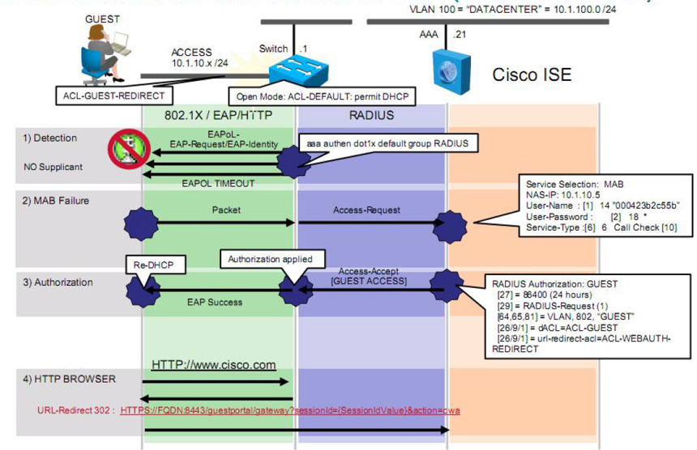


# Site2-SW配置
## Web认证是三层认证，接口下需要配置VLAN(注意必须配置switchport access vlan 102)
```shell
interface GigabitEthernet1/0/6
 description ISE-MAB-DOT1X-WEBAUTH
 switchport access vlan 102  # 注意必须配置
 switchport mode access
 device-tracking attach-policy IPDT_MAX_10
 ip access-group ACL-DEFAULT in
 authentication event fail action next-method
 authentication event server dead action authorize vlan 102
 authentication event server alive action reinitialize 
 authentication host-mode multi-auth
 authentication open
 authentication order mab dot1x
 authentication priority dot1x mab
 authentication port-control auto
 authentication violation restrict
 mab
 dot1x pae authenticator
 spanning-tree portfast
```


# ISE上配置DACL
> ###  [三] --- Policy --- Policy Elements --- Results
>> ### Authorization --- Downloadable ACLs --- Add
>>> ### *Name: Wired_POSTURE_REMEDIATION
>>> ### *DACL Content:
```shell
permit udp any any eq domain
permit icmp any any
permit tcp any any eq 80
permit tcp any any eq 443
permit tcp any host 10.1.20.241 eq 8443
permit tcp any host 10.1.20.241 eq 8905
permit tcp any host 10.1.20.241 eq 8909
permit udp any host 10.1.20.241 eq 8905
permit udp any host 10.1.20.241 eq 8906
permit udp any host 10.1.20.241 eq 8909
```

# ISE上配置Authorization Profile
##配置Web Authentication使用Authorization Profile
> ###  [三] --- Policy --- Policy Elements --- Results
>> ### Authorization --- Authorization Profiles --- Add
>>> ### *Name: Centralized-Web-Auth
>>> ### Common Tasks
>>>> ### [勾选] DACL Name: Wired_POSTURE_REMEDIATION
>>>> ### [勾选] Web Redirection(CWA,MDM,NSP,CPP)
>>>>> ### Centralized Web Auth --- ACL: WEB-REDIRECT --- Value: Self-Registered Guest Portal
>>> ### Submit

> ###  [三] --- Policy --- Policy Elements --- Results
>> ### Authorization --- Authorization Profiles --- Add
>>> ### *Name: Wired-Web-Auth-Employee
>>> ### Common Tasks
>>>> ### [勾选] DACL Name: PERMIT_ALL_IPV4_TRAFFIC
>>> ### Submit


# ISE上配置Policy Sets
> ###  [三] --- Policy --- Policy Sets --- +
>> ### Policy Set Name: QYT-Wired-Web-Policy
>> ### Conditions: Wired_MAB
>> ### Allowed Protocols: Default Network Access
>> ### Save
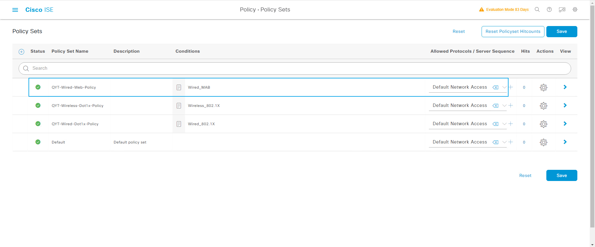


# ISE上配置Authentication Policy
> ###  [三] --- Policy --- Policy Sets --- QYT-Wired-Web-Policy --- > View
> ### Authentication Policy(1) --- +
>> ### Rule: QYT-Wired-Web-Authentication
>> ### Conditions: DEVICE-Device Type EQUALS All Device Types#Switch#Site2-SW3650
>> ### Conditions: Device-Location EQUALS All Location#BeiJing#YCGJ516
>> ### Use: Internal Endpoints
>>> ### If User not found: CONTINUE
>> ### Save
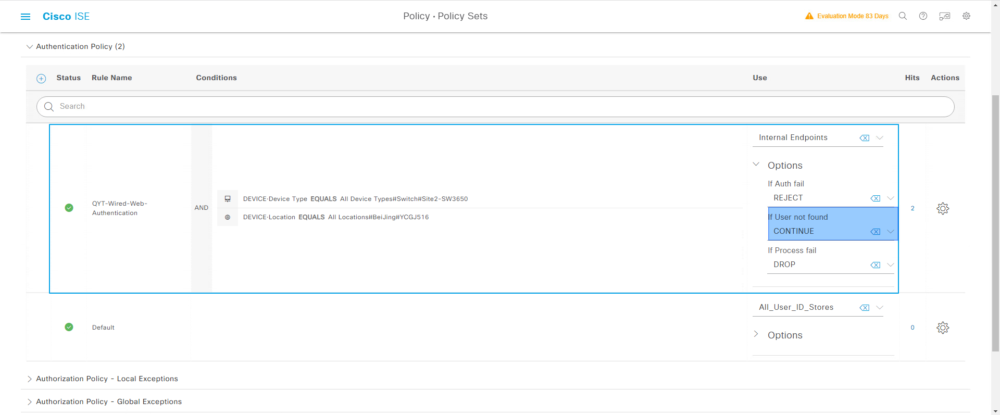


# ISE上配置Authorization Policy
> ###  [三] --- Policy --- Policy Sets --- QYT-Wired-Web-Policy --- > View
> ### Authorization Policy(1) --- +
>> ### Rule: QYT-Wired-Web-Authorization
>> ### Conditions: DEVICE-Device Type EQUALS All Device Types#Switch#Site2-SW3650
>> ### Conditions: Device-Location EQUALS All Location#BeiJing#YCGJ516
>> ### Conditions: InternalUser-IdentityGroup EQUALS User Identity Groups: Employee
>> ### Results Profiles: Wired-Web-Auth-Employee
---
>> ### Rule: Default --- Results Profiles: Centralized-Web-Auth
>> ### Save
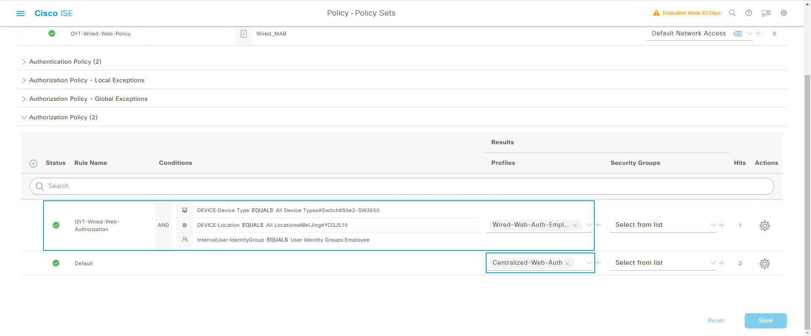


# ISE本地用户"cisco"用户加入"Employee"组
> ### [三] --- Administration --- Identity Management --- Identities
> ### [勾选] --- Usernname: cisco --- Edit --- User Groups: Employee
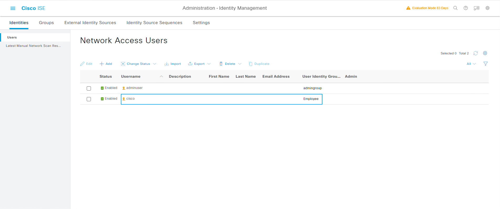


# ISE配置自注册访客门户[Self-Registered Guest Portal(deafult)]
> ### [三] --- Work Centers --- Guest Access --- Portals & Components
> ### Guest Portals --- Self-Registered Guest Portal(deafult) --- Edit
>> ### Portal Behavior and Flow Settings
>>> ### Guest Device Registration Settings --- [取消] Automatically register guest devices
>>> ### Guest Device Compliance Settings --- [取消] Require guest device compliance
>>> ### Portal Settings --- Allowed Interface: [勾选] Gigabit Ethernet 0
>>> ### Save

# WIN10-2计算机关闭Dot1x认证(提前需要卸载anyconnect然后重启)
> ### 关闭Dot1x认证
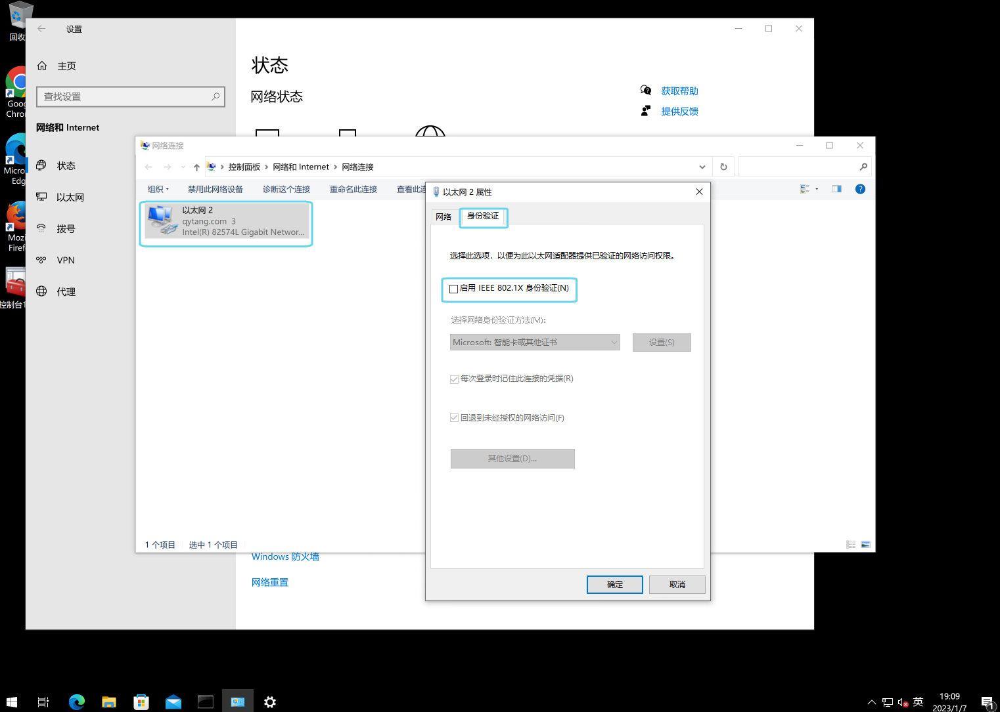

> ### Site2-SW接口关闭/开启
```shell
Site2-SW(config)#int g1/0/6
Site2-SW(config-if)#shutdown 
Site2-SW(config-if)#no shutdown
```

# 查看Site2-SW交换机认证状态
```shell
Site2-SW#show authentication sessions int g1/0/6 details 
            Interface:  GigabitEthernet1/0/6
               IIF-ID:  0x14E4A846
          MAC Address:  0050.56a1.bcc5
         IPv6 Address:  fe80::406b:c074:bd8a:113f
         IPv4 Address:  10.1.102.2
            User-Name:  00-50-56-A1-BC-C5
               Status:  Authorized
               Domain:  DATA
       Oper host mode:  multi-auth
     Oper control dir:  both
      Session timeout:  N/A
    Common Session ID:  0A0114FE000000618534E81C
      Acct Session ID:  0x00000067
               Handle:  0xef00003d
       Current Policy:  POLICY_Gi1/0/6


Server Policies:
     URL Redirect ACL: WEB-REDIRECT
         URL Redirect: https://PSN-2.qytang.com:8443/portal/gateway?sessionId=0A0114FE000000618534E81C&portal=d06bc251-f644-4fc3-b09f-dae9bd8a86d5&action=cwa&token=8dda2cc8c5084a6e74dc7e632e39de56
              ACS ACL: xACSACLx-IP-Wired_POSTURE_REMEDIATION-63b78b87
```

# 查看ISE RADIUS Logs
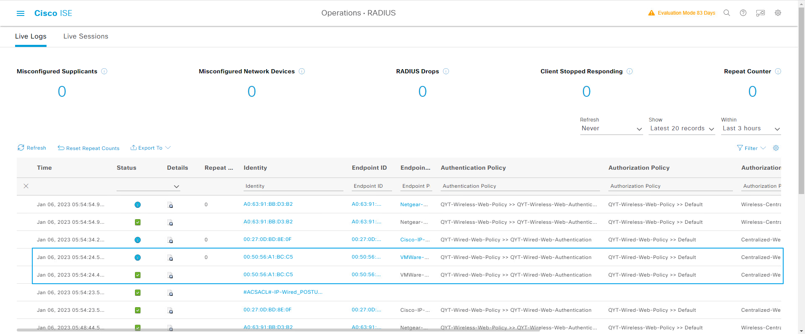
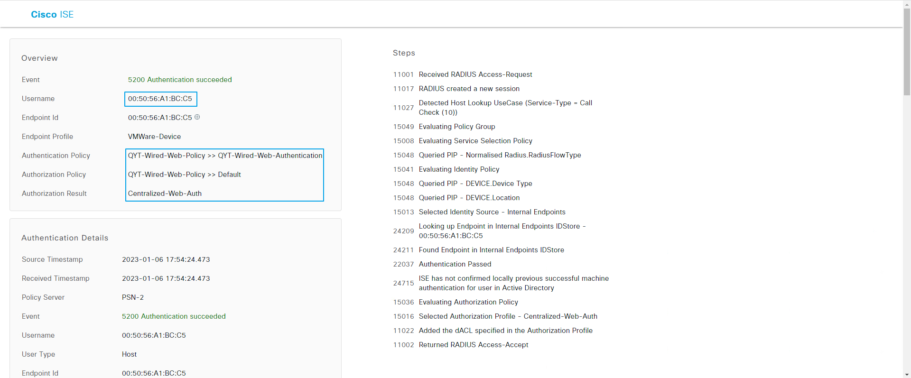


# WIN10-2计算机Web认证
## 任意产生HTTP流量触发重定向
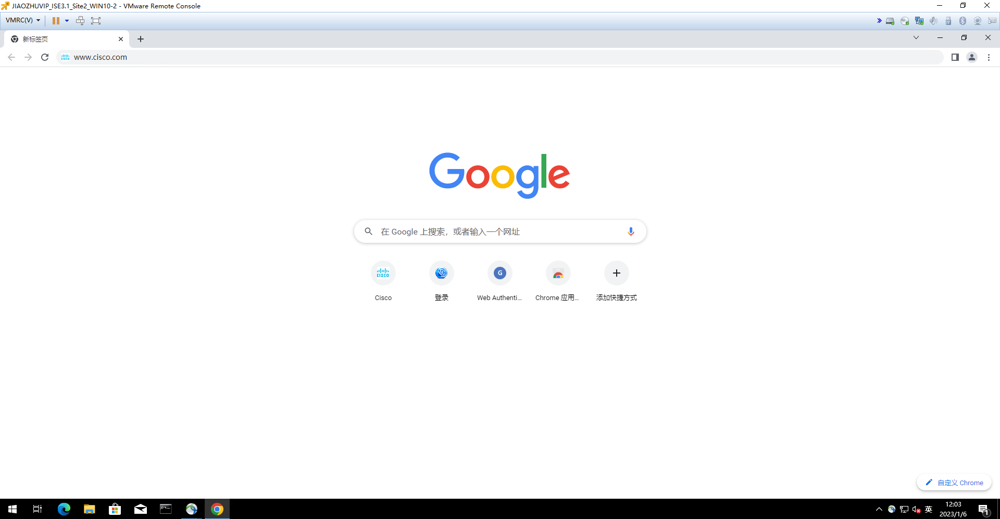
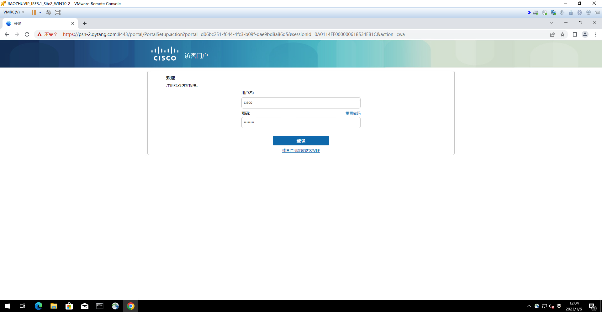
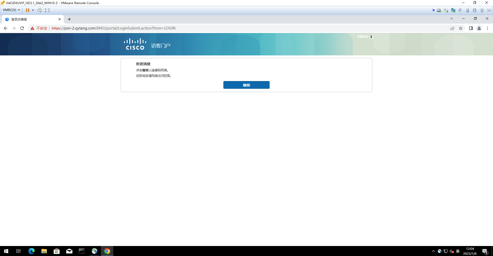
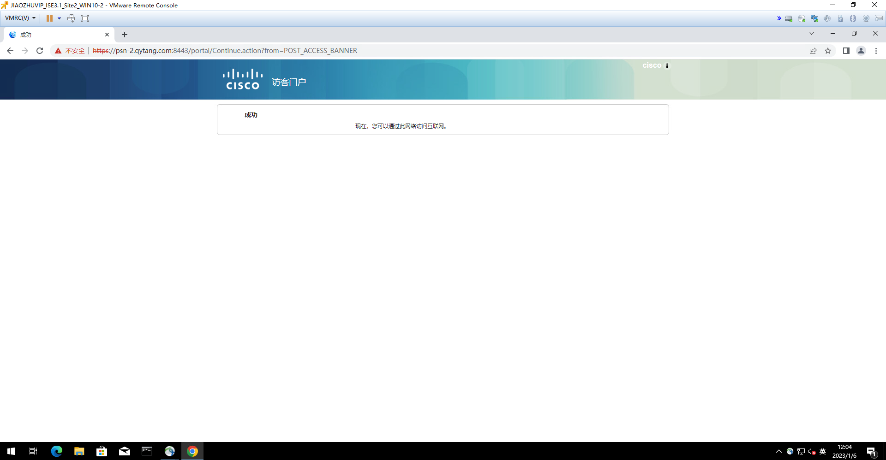
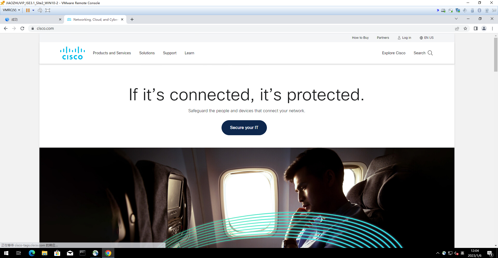


# 再次查看Site2-SW交换机认证状态
```shell
Site2-SW#show authentication sessions int g1/0/6 details 
            Interface:  GigabitEthernet1/0/6
               IIF-ID:  0x14E4A846
          MAC Address:  0050.56a1.bcc5
         IPv6 Address:  fe80::406b:c074:bd8a:113f
         IPv4 Address:  10.1.102.2
            User-Name:  cisco
               Status:  Authorized
               Domain:  DATA
       Oper host mode:  multi-auth
     Oper control dir:  both
      Session timeout:  N/A
    Common Session ID:  0A0114FE000000618534E81C
      Acct Session ID:  0x00000068
               Handle:  0xef00003d
       Current Policy:  POLICY_Gi1/0/6


Server Policies:
              ACS ACL: xACSACLx-IP-PERMIT_ALL_IPV4_TRAFFIC-57f6b0d3


Method status list:
       Method           State
          mab           Authc Success
```

# 查看ISE RADIUS Logs
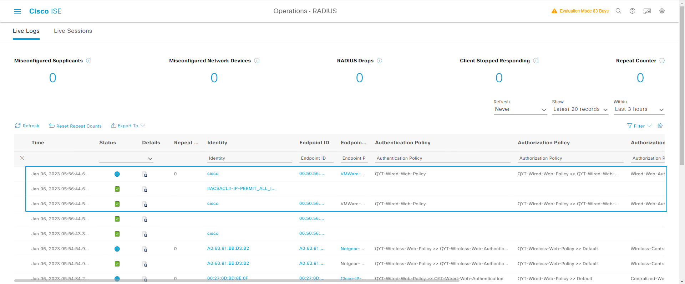
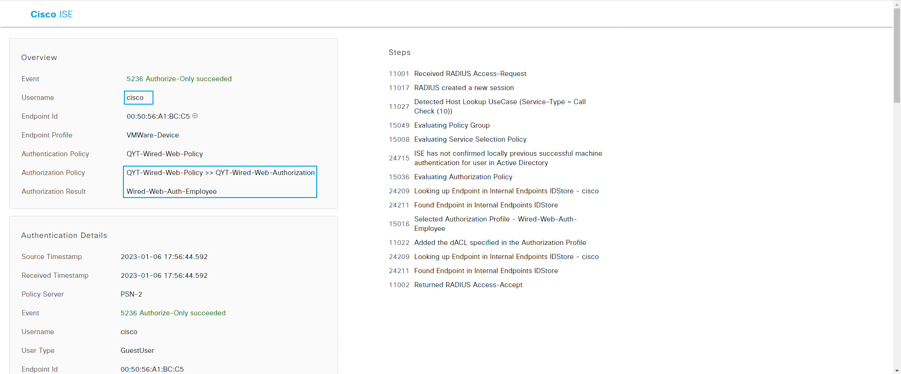
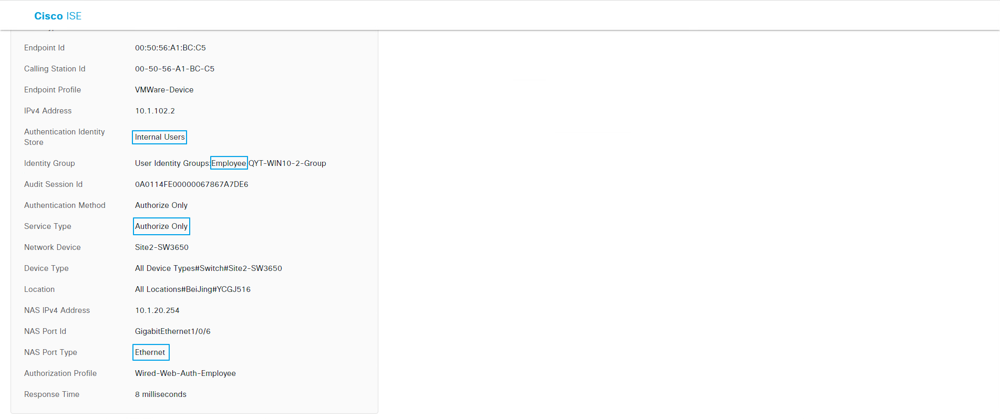


