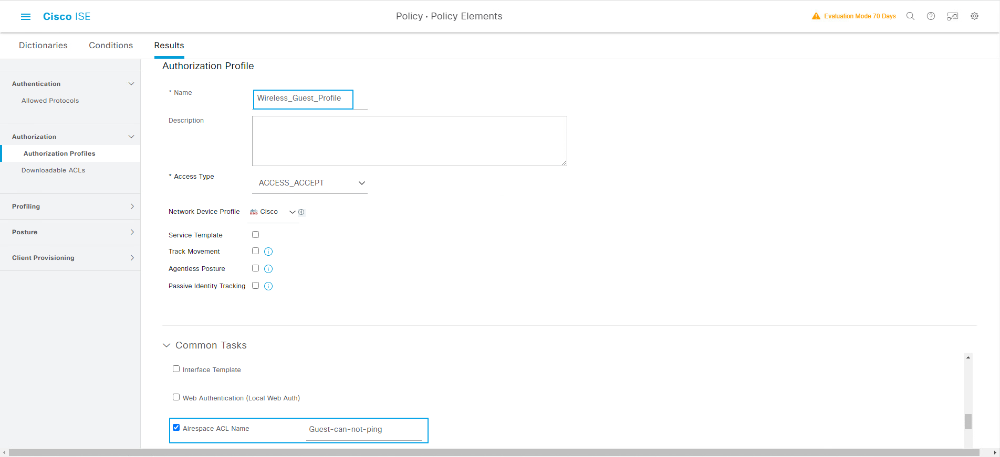
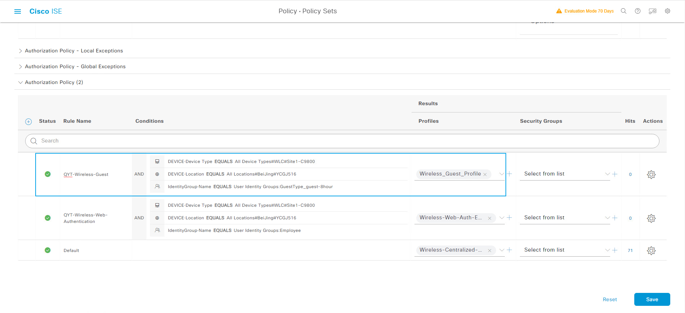

## 创建ID Source
> ## 创建ID Source用于后续的Guest认证
> ###  [三] --- Administration --- Identity Management --- Identity Source Sequences 
>>  ### Add
>>>  ### *Name:  Guest_Portal_ID
>>>  ### Authentication Search List --- Selected: QYTANG
>>>  ### Authentication Search List --- Selected: Internal Users
>>>  ### Authentication Search List --- Selected: Guest Users
>>>  ### Advanced Search List Settings 
>>>>  ### (勾选)Treat as if the user was not found and proceed to the next store in the sequence
>>>  ### Submit


> ## 创建ID Source用于后续的Sponsor认证
> ###  [三] --- Administration --- Identity Management --- Identity Source Sequences 
>>  ### Add
>>>  ### *Name:  Sponsor_Portal_ID
>>>  ### Authentication Search List --- Selected: QYTANG
>>>  ### Authentication Search List --- Selected: Internal Users
>>>  ### Advanced Search List Settings 
>>>>  ### (勾选)Treat as if the user was not found and proceed to the next store in the sequence
>>>  ### Submit


## 创建Location Time Zone
> ###  [三] --- Work Centers --- Guest Access --- Settings
>>  ### Guest Locations and SSIDs
>>> ### Guest Locations --- Location name: CHINA
>>> ### Guest Locations --- Time zone: Asia/Chongqing
>>> ### Add
>>> ### Save


## 激活客户自主服务
> ###  [三] --- Work Centers --- Guest Access --- Portals & Components
>> ### Guest Portals --- Self-Registered Guest Portal(default)
>>> ### Portal Settings --- Authentication method: Guest_Portal_ID
>>> ### Login Page Settings --- [勾选] Allow guests to create their own accounts
>>> ### Login Page Settings --- [勾选] Allow guests to reset the password
>>> ### Registration Form Settings --- Fields to include --- [勾选] User name --- Required [勾选]
>>> ### Registration Form Settings --- Fields to include --- [勾选] First name --- Required [勾选]	
>>> ### Registration Form Settings --- Fields to include --- [勾选] Last name --- Required [勾选]		
>>> ### Registration Form Settings --- [勾选] Location: CHINA
>>> ### Guest Device Registration Settings --- [取消] Automatically register guest devices
>>> ### Guest Device Registration Settings --- [取消] Allow guests to register devices


## 创建新的Guest Type
> ### [三] --- Work Centers --- Guest Access --- Portals & Components
> ### Guest Types --- Create
>> ### Guest type name: guest-8hour
>> ### Maximum Access Time --- Maximum account duration: 8 hours


## 定义客户自主注册账号的Type
> ### [三]--- Work Centers --- Guest Access --- Portals & Components
>> ### Guest Portals --- Self-Registered Guest Portal(default)
>>> ### Registration Form Settings --- Assign to guest type: guest-8hour


## Sponsor Portals
> ## (1) Sponsor Authentication Source
> ###  [三] --- Work Centers --- Guest Access --- Portals & Components
>> ###  Sponsor Portals --- Sponsor Portal(default)
>> ###  Portal Settings --- Identity source sequence: Sponsor_Portal_ID


## 创建group“Contractor”
> ###  [三] --- Administration --- Identity Management --- Groups
> ### User Identity Groups --- Add
>> ### Name: Contractor
>> ### Submit


## 创建user“qytang”
> ###  [三] --- Administration --- Identity Management --- Identities
> ### Users --- Add
>> ### Username: qytang
>> ### Login Password --- Password: Cisc0123
>> ### Login Password --- Re-Enter Password: Cisc0123
>> ### User Groups: Contractor


## 系统默认Sponsor Group介绍
> ### ALL_ACCOUNTS: 能够管理所有客户帐号
> ### GROUP_ACCOUNTS: 能够管理由这个组的用户所创建的所有客户帐号
> ### OWN_ACCOUNT: 能够管理由这个用户所创建的所有客户帐号


## 创建QYT_ALL_GROUP
> ###  [三] --- Work Centers --- Guest Access --- Portals & Components
> ### Sponsor Groups --- Create
>> ### Sponsor group name: QYT_ALL_GROUP
>> ### Match Criteria --- Members --- QYTNAG:qytang.com/ISE1/ISE-GROUP1
>> ### Match Criteria --- Members --- QYTNAG:qytang.com/ISE2/ISE-GROUP2
>> ### This sponsor group can create accounts using these guest types: Contractor(default) , Daily(default) , guest-8hour , Weekly(default)
>> ### Select the locations that guests will be visiting: CHINA
>> ### Sponsor Can Manage --- (勾选) All guest accounts
>> ### Sponsor Can --- 保存默认权限
>> ### Save


## 创建QYT_Employee_Group
> ###  [三] --- Work Centers --- Guest Access --- Portals & Components
> ### Sponsor Groups --- Create
>> ### Sponsor group name: QYT_Employee_Group
>> ### Match Criteria --- Members --- Employee
>> ### This sponsor group can create accounts using these guest types: Contractor(default) , guest-8hour
>> ### Select the locations that guests will be visiting: CHINA
>> ### Sponsor Can Manage --- (勾选) Accounts created by members of this sponsor group
>> ### Sponsor Can --- [取消] Reset guests' account passwords
>> ### Sponsor Can --- [取消] Delete guests' accounts
>> ### Save


## 创建QYT_OWN_Group
> ###  [三] --- Work Centers --- Guest Access --- Portals & Components
> ### Sponsor Groups --- Create
>> ### Sponsor group name: QYT_OWN_Group
>> ### Match Criteria --- Members --- Contractor
>> ### This sponsor group can create accounts using these guest types: guest-8hour
>> ### Select the locations that guests will be visiting: CHINA
>> ### Sponsor Can Manage --- (勾选) Only accounts sponsor has created
>> ### Sponsor Can --- [取消] Reset guests' account passwords
>> ### Sponsor Can --- [取消] Delete guests' accounts
>> ### Save


## 配置有线Guest使用的DACL
> ###  [三] --- Policy --- Policy Elements --- Results
> ### Authorization --- Downloadable ACLS --- Add
>> ### Name: Guest-can-not-ping
>> ### DACL Content
```shell
deny icmp any any
permit ip any any
```
>> ### Sunmit


## 配置无线Guest使用的ACL
> ### Configuration --- Security --- ACL
> ### + Add
>> ### ACL Name* : Guest-can-not-ping
>> ### ACL Type : IPv4 Extended
>> ### Sequence* : 1   
>> ### Action : deny
>> ### Source Type: any
>> ### Destination Type : any
>> ### Protocol : icmp
>> ### Log : [勾选]
>> ### + Add
>> ### Sequence* : 2  
>> ### Action : permit
>> ### Source Type: any
>> ### Destination Type : any
>> ### Protocol : ip
>> ### Log : [勾选]
>> ### + Add
>> ### Apply to Device

```shell
ip access-list extended Guest-can-not-ping
 1 deny   icmp any any log
 2 permit ip any any log

```


## 配置有线Guest使用的Authorization Profile
> ###  [三] --- Policy --- Policy Elements --- Results
> ### Authorization --- Authorization Profiles
>> ### Name: Wired_Guest_Profile
>> ### Common Tasks --- DACL Name: Guest-can-not-ping
>> ### Submit


## 配置无线Guest使用的Authorization Profile
> ###  [三] --- Policy --- Policy Elements --- Results
> ### Authorization --- Authorization Profiles
>> ### Name: Wireless_Guest_Profile
>> ### Common Tasks --- [勾选] Airespace ACL Name: Guest-can-not-ping



## 配置Guest有线授权策略
> ###  [三] --- Policy --- Policy Sets
> ### QYT-Wired-Web-Policy --- >
> ### Authentication Policy不变
> ### Authorization Policy --- +
>> ### Rule Name: QYT-Wired-Guest
>> ### Conditions: DEVICE-Device Type EQUALS All Device Types#Switch#Site2-SW3650
>> ### Conditions: Device-Location EQUALS All Location#BeiJing#YCGJ516
>> ### Conditions: IdentityGroup-Name EQUALS User Identity Groups:GuestType_guest_8hour
>> ### Results-Profiles： Wired_Guest_Profile
>> ### Save


## 配置Guest无线授权策略
> ###  [三] --- Policy --- Policy Sets
> ### QYT-Wireless-Web-Policy --- >
> ### Authentication Policy不变
> ### Authorization Policy --- +
>> ### Rule Name: QYT-Wireless-Guest
>> ### Conditions: DEVICE-Device Type EQUALS All Device Types#WLC#Site1-C9800
>> ### Conditions: Device-Location EQUALS All Location#BeiJing#YCGJ516
>> ### Conditions: IdentityGroup-Name EQUALS User Identity Groups:GuestType_guest_8hour
>> ### Results-Profiles： Wireless_Guest_Profile
>> ### Save





