## Guest Service无线测试 
> ### Site1-WIN10客户端无线连接
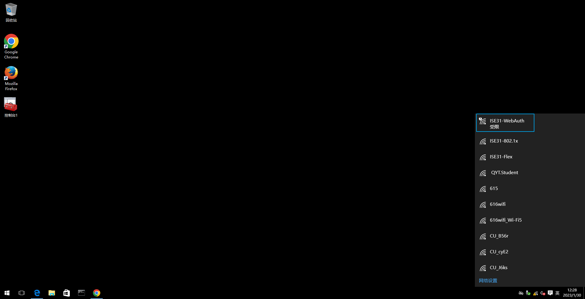

> ### C9800无线控制器上查看Site1-WIN10客户端连接
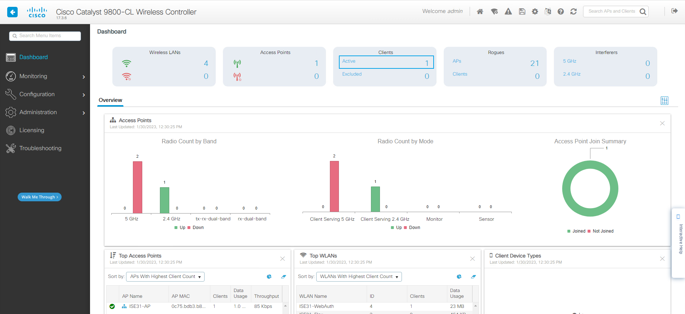
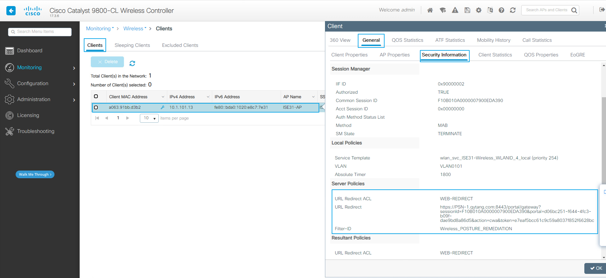

> ### 1.自注册
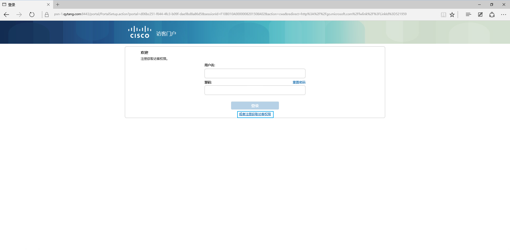

> ### 2.填写个人信息
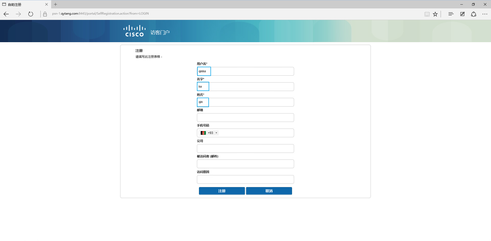

> ### 3.注册成功
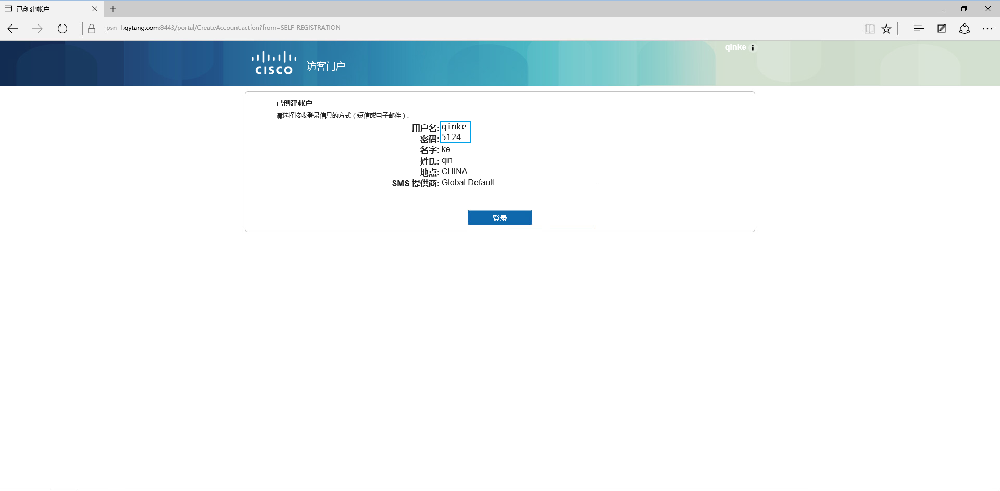

> ### 4.可接受的使用规定
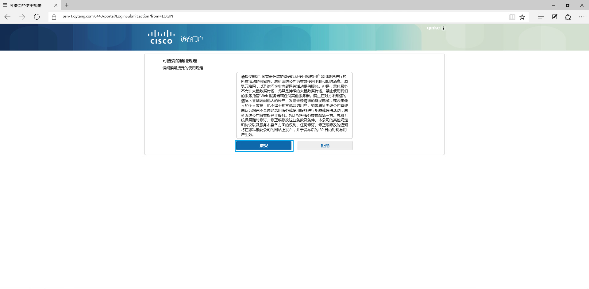

> ### 5.更改密码
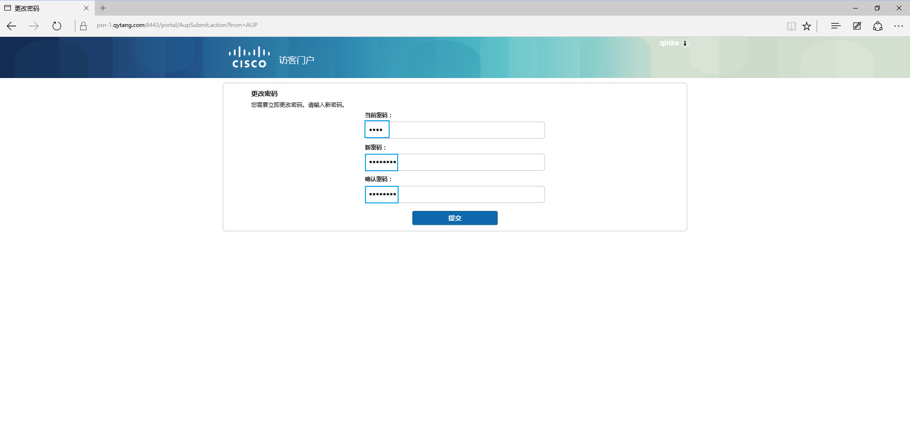

> ### 6.欢迎消息
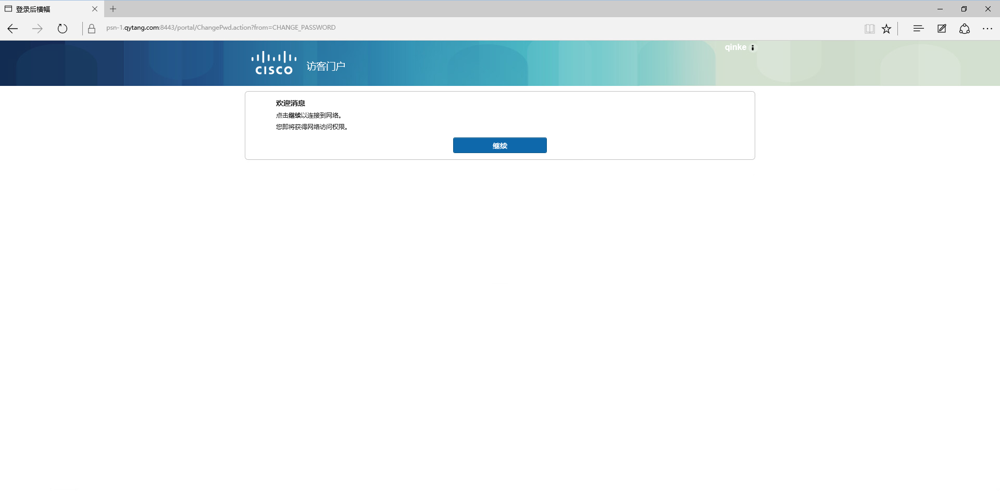

> ### 7.成功

> ### 可以正常访问互联网网站
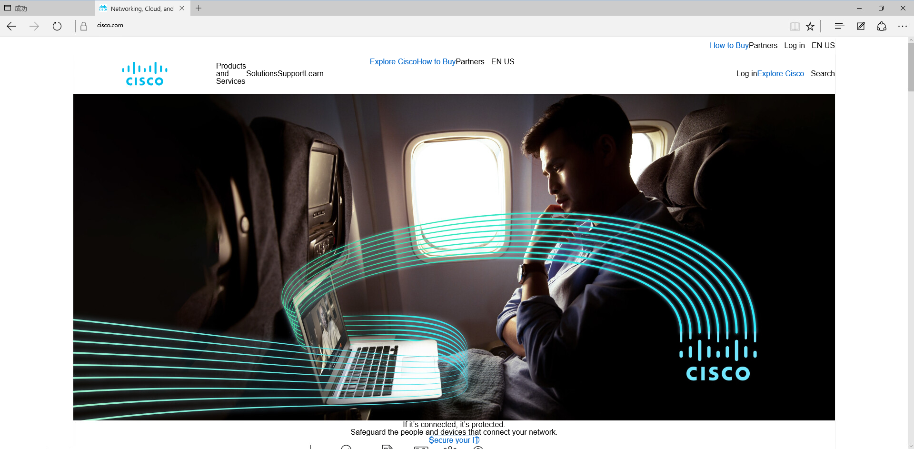

> ### 禁止icmp
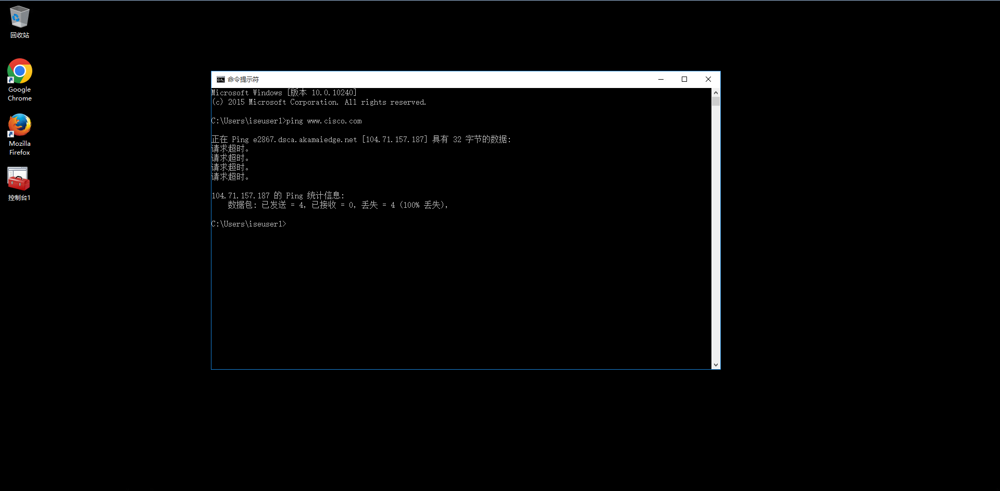

## C9800无线控制器上查看授权
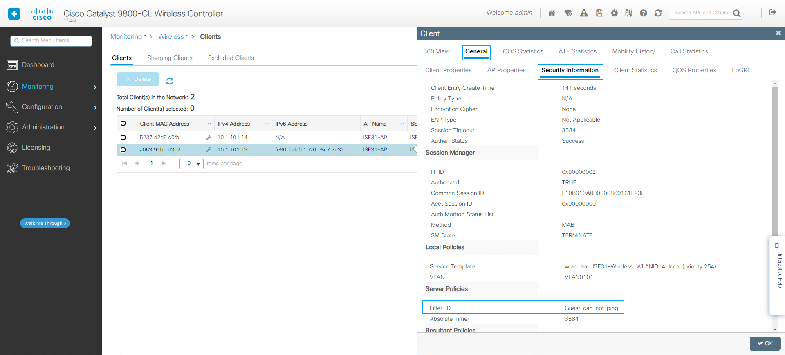

## ISE上查看Radius Logs

