## Posture策略(杀毒软件)
> ### 默认没有任何Posture策略激活
> ###  [三] --- Policy --- Posture 
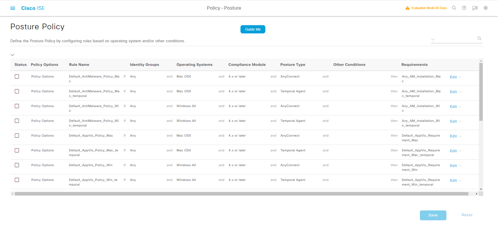


## 配置Anti-Malware策略
> ###  [三] --- Policy --- Policy Elements --- Conditions
> ### Posture --- Anti-Malware --- Add
>> ### Name: 360_AV_Installed
>> ### Description: Check 360 AV is installed
>> ### Operating System: Windows All
>> ### Vendor: Qihu 360 Software Co., Ltd.
>> ### Check Type: (勾选)  Installation
>>> ### Baseline Condition 
>>> ### Product Name: 360杀毒
>>> ### Minimum Version: 5.x
>>> ### Maximum Version: 7.x
>>> ### Minimum Compliance Module Version: 4.3.305.2048
>>> ### Submit

>> ### Name: 360_AV_Current
>> ### Description: Check 360 AV is current
>> ### Operating System: Windows All
>> ### Vendor: Qihu 360 Software Co., Ltd.
>> ### Check Type: (勾选)  Definition
>> ### (勾选)Allow virus definition file to be ： 7 days older than (勾选) latest file date
>>> ### Baseline Condition 
>>> ### Product Name: 360杀毒
>>> ### Minimum Version: 5.x
>>> ### Maximum Version: 7.x
>>> ### Minimum Compliance Module Version: 4.3.305.2048
>>> ### Submit
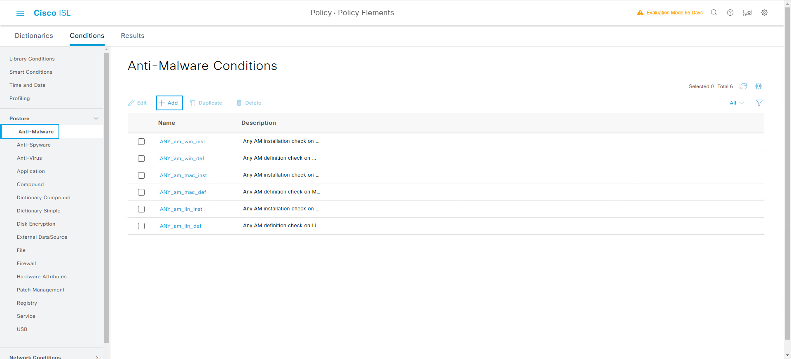
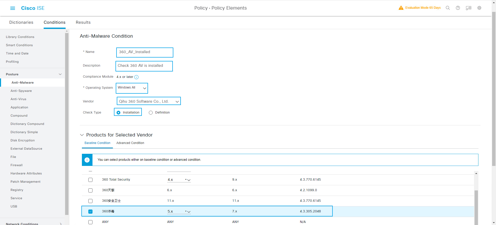
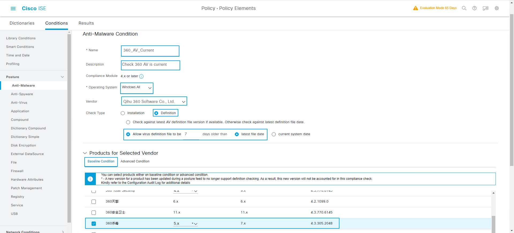


## 配置Remediation File
> ###  [三] --- Policy --- Policy Elements --- Results
> ### Posture --- Remediation Actions --- File --- Add
>> ### Name: Install_360_AV
>> ### Description: Use File Install 360 AV
>> ### Version: 360_AV
>> ### File Uploaded: 360sd_x64_std_5.0.0.8120.exe (文件目录: C:\ISE-Anyconnect-ALL)
>> ### Submit
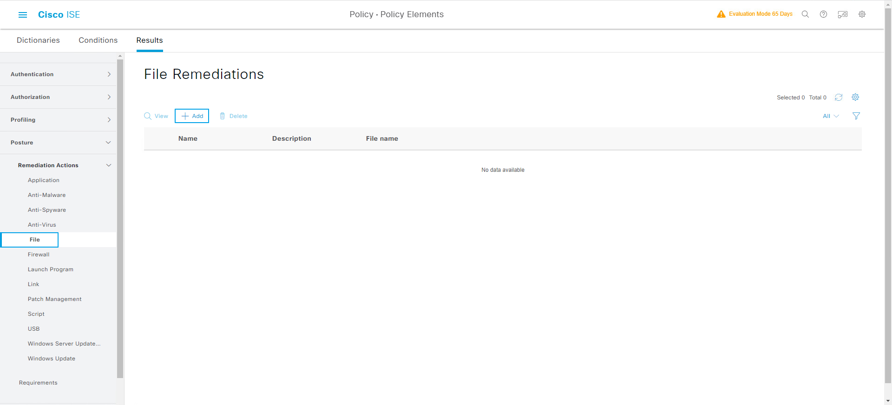
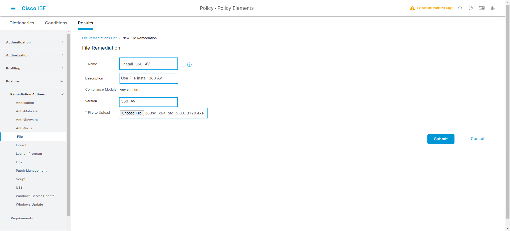


## 配置Remediation Anti-Malware
> ###  [三] --- Policy --- Policy Elements --- Results
> ### Posture --- Remediation Actions --- Anti-Malware --- Add
>> ### Name: Update_360_AV_Definitions
>> ### Description: Trigger Signature update for 360
>> ### Operating System: (勾选) Windows
>> ### Remediation Type: Automatic
>> ### Interval: 2 (in secs)  (Valid Range 0 to 9999)
>> ### Retry Count: 2 (Valid Range 0 to 99)
>> ### Anti-Malware Vendor Name: ANY
>> ### Submit
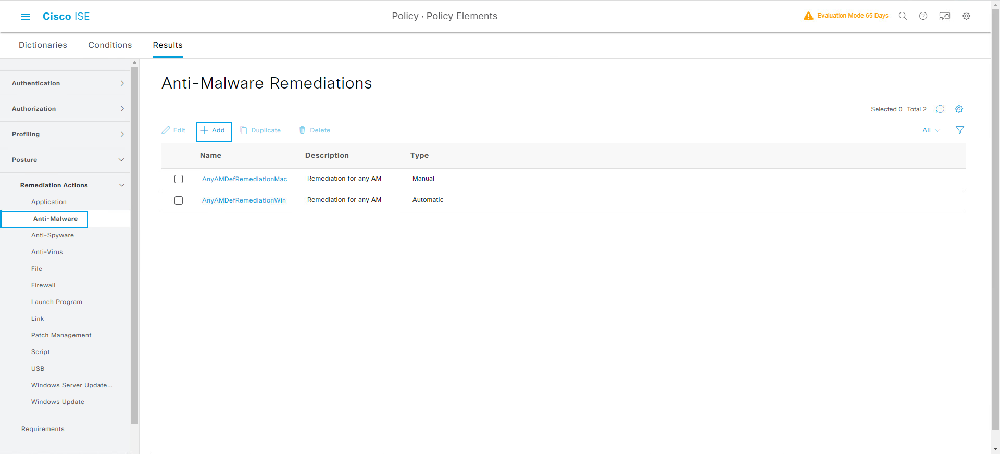
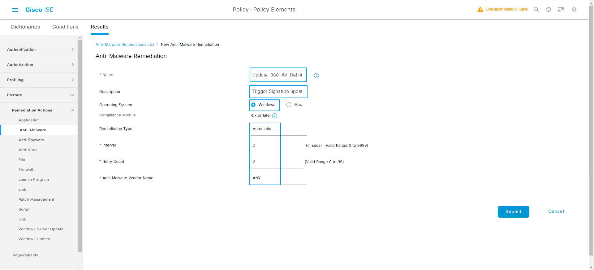


## 创建新的Requirement
> ###  [三] --- Policy --- Policy Elements --- Results
> ### Posture --- Requirements --- Insert new Requirement
>> ### Name: QYT-AV-Installed
>> ### Operating System: Windows All
>> ### Compliance Module: 4.x or later
>> ### Posture Type: AnyConnect
>> ### Conditions: 360_AV_Installed
>> ### Remediations Actions: Install_360_AV
>> ### Save

>> ### Name: QYT-AV-Current
>> ### Operating System: Windows All
>> ### Compliance Module: 4.x or later
>> ### Posture Type: AnyConnect
>> ### Conditions: 360_AV_Current
>> ### <下面两个行为, 虽然配置的时候只能同时看到一个, 但是你两个都做上就好了> 
>> ### Remediations Actions --- Message Text Only ： 您需要升级你的360的数据库，但是这个是可选的
>> ### Remediations Actions: Update_360_AV_Definitions
>> ### Save
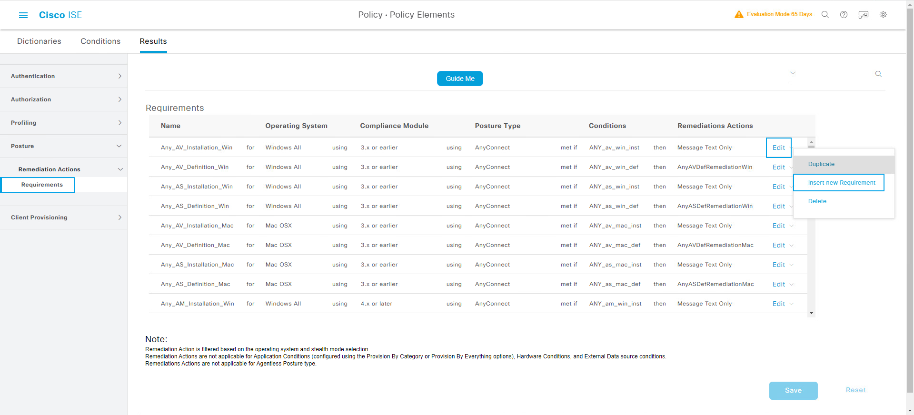
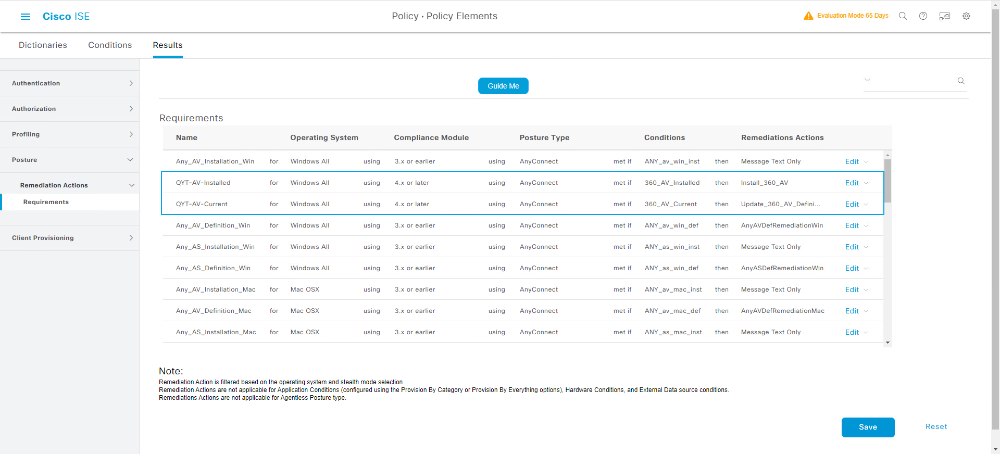


## 配置Posture Policy
> ###  [三] --- Policy --- Posture --- Insert new policy
>> ### Rule Name: QYT_Employee
>> ### Identity Groups: Any
>> ### Operating Systems: Windows All
>> ### Compliance Module: 4.x or later
>> ### Posture Type: AnyConnect
>> ### QYTANG:ExternalGroups EQUALS qytang.com/ISE2/ISE-GROUP2
>> ### Requirements: [Mandatory] QYT-AV-Installed
>> ### Requirements: [Opertional] QYT-AV-Current
>> ### Save
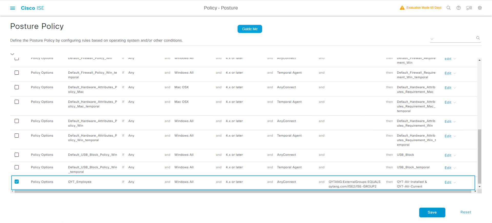
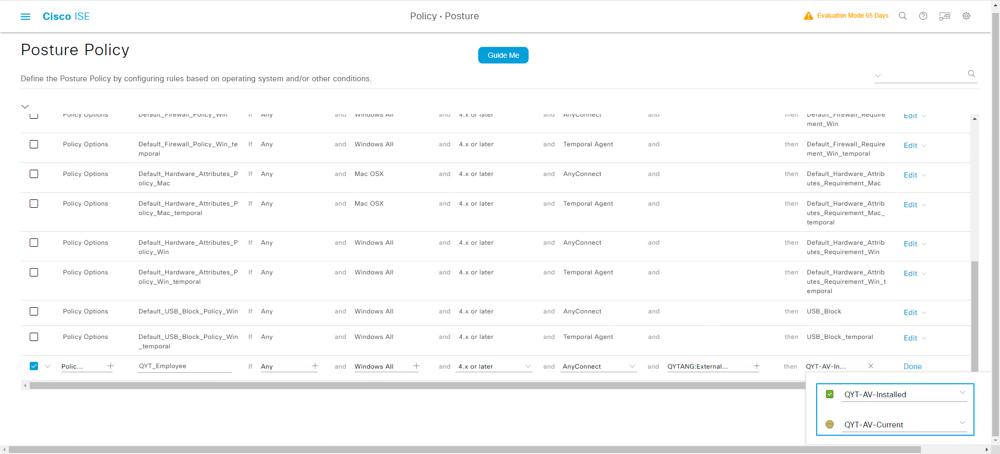


## Site2-WIN10客户端测试Posture策略(杀毒软件)
> ### Site2-SW3650上clear authentication session, WIN10客户端Dot1x认证
> ### Site2-WIN10客户端测试Posture策略(杀毒软件)
.png)
.png)
.png)
.png)
.png)
.png)
.png)
.png)


## 查看Site2-SW3650交换机接口状态
```shell
Site2-SW#show authentication sessions int g1/0/6 details 
            Interface:  GigabitEthernet1/0/6
               IIF-ID:  0x1FE8A828
          MAC Address:  0050.56a1.bcc5
         IPv6 Address:  fe00::
         IPv4 Address:  10.1.102.1
            User-Name:  iseuser2
               Status:  Authorized
               Domain:  DATA
       Oper host mode:  multi-auth
     Oper control dir:  both
      Session timeout:  N/A
    Common Session ID:  0A0114FE000000B802069E16
      Acct Session ID:  0x0000009b
               Handle:  0xee00006a
       Current Policy:  POLICY_Gi1/0/6
          

Server Policies:
              ACS ACL: xACSACLx-IP-PERMIT_ALL_IPV4_TRAFFIC-57f6b0d3
      Security Policy:  None
      Security Status:  Link Unsecured
           Vlan Group:  Vlan: 102


Method status list:
       Method           State
          mab           Stopped
        dot1x           Authc Success
```


## ISE查看Radius Logs
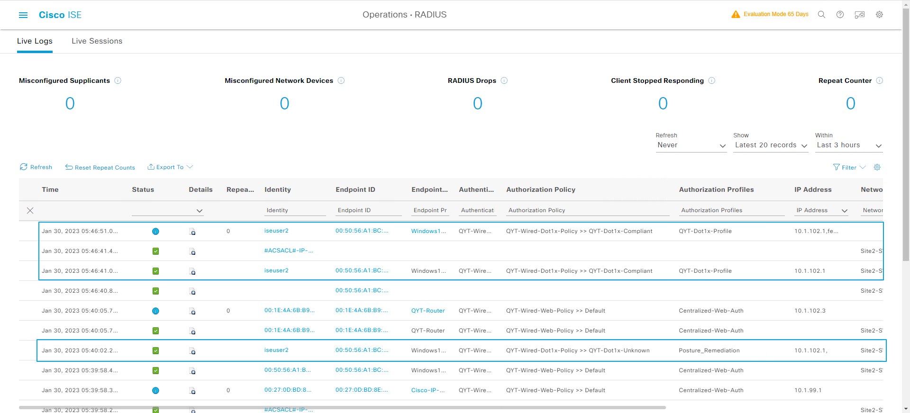
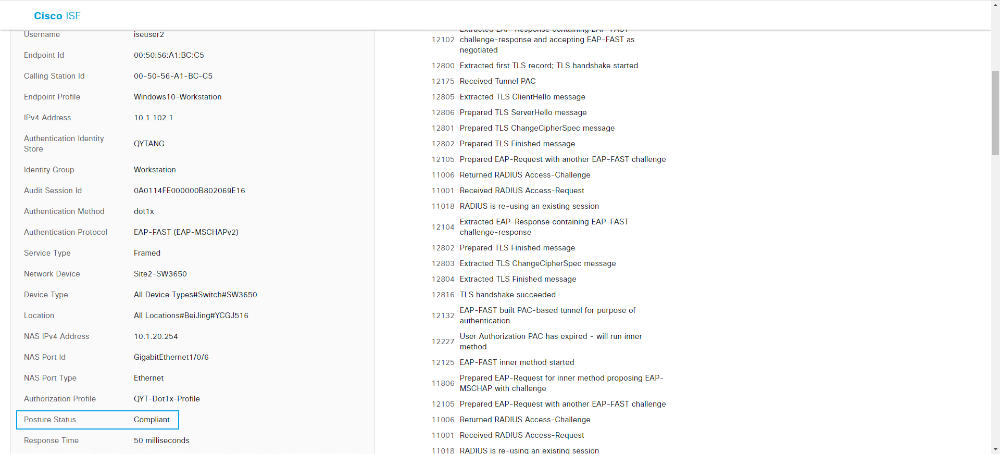