## Posture策略(检查注册表)

## 配置注册表检查策略
> ### 1.添加Registry Condition
> ###  [三] --- Policy --- Policy Elements --- Conditions
>> ### Posture --- Registry --- Add
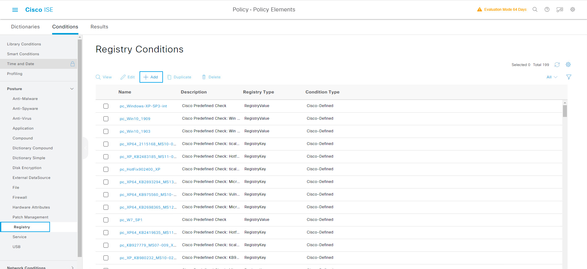


> ### 2.检查启用了屏幕保护
>> ### Name: ScreenSaver_On
>> ### Description: 检测是否开启屏保
>> ### Operating System: Windows All
>> ### Registry Type: RegistryValue
>> ### Registry Root Key: HKCU  Sub Key\ Control Panel\Desktop
>> ### Value Name: ScreenSaveActive
>> ### Value DataType: Number
>> ### Value Operator: equals
>> ### Value Data: 1
>> ### Submit
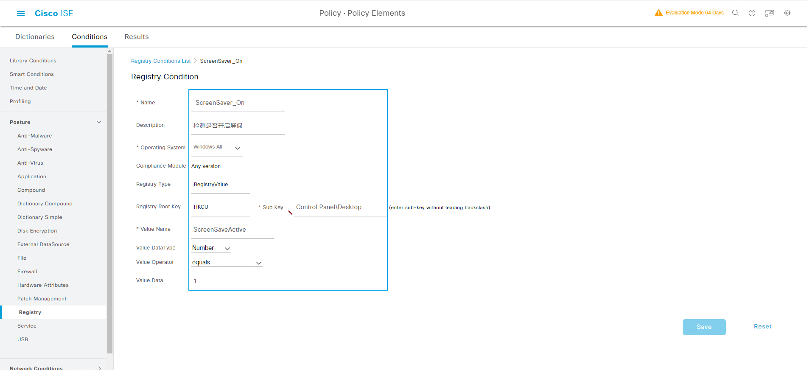

> ### 3.检查设置了“scr”为后缀的屏幕保护文件
>> ### Name: ScreenSaver_SCR
>> ### Description: 检测是否启用屏保文件
>> ### Operating System: Windows All
>> ### Registry Type: RegistryValue
>> ### Registry Root Key: HKCU  Sub Key\ Control Panel\Desktop
>> ### Value Name: SCRNSAVE.EXE
>> ### Value DataType: String
>> ### Value Operator: ends with
>> ### Value Data: scr
>> ### Submit


> ### 4.检查设置了“在恢复时显示登录屏幕”
>> ### Name: ScreenSaver_Secure
>> ### Description: 检测是否启用返回时登录
>> ### Operating System: Windows All
>> ### Registry Type: RegistryValue
>> ### Registry Root Key: HKCU  Sub Key\ Control Panel\Desktop
>> ### Value Name: ScreenSaverIsSecure
>> ### Value DataType: Number
>> ### Value Operator: equals
>> ### Value Data: 1
>> ### Submit
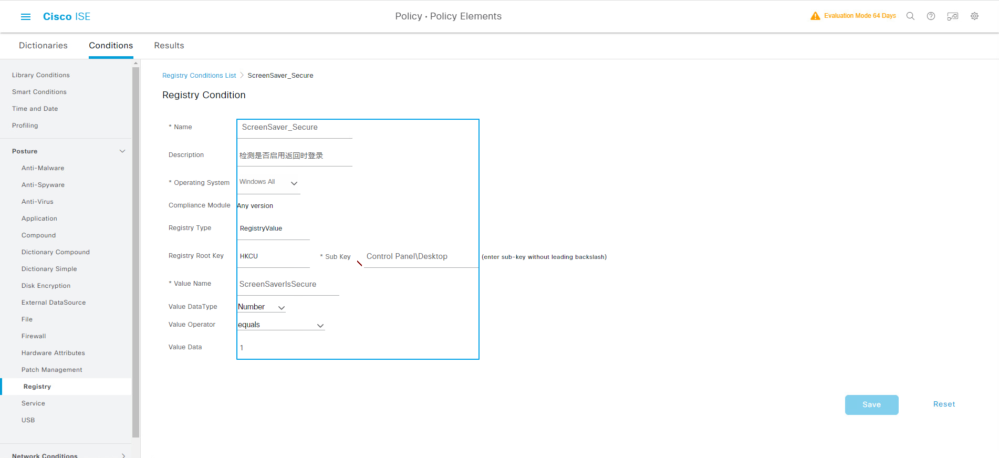


> ### 5.检查屏幕保护的等待时间小于300秒
>> ### Name: ScreenSaver_Timeout
>> ### Description: 检测屏保超时时间
>> ### Operating System: Windows All
>> ### Registry Type: RegistryValue
>> ### Registry Root Key: HKCU  Sub Key\ Control Panel\Desktop
>> ### Value Name: ScreenSaveTimeOut
>> ### Value DataType: Number
>> ### Value Operator: less than or equal to
>> ### Value Data: 300
>> ### Submit
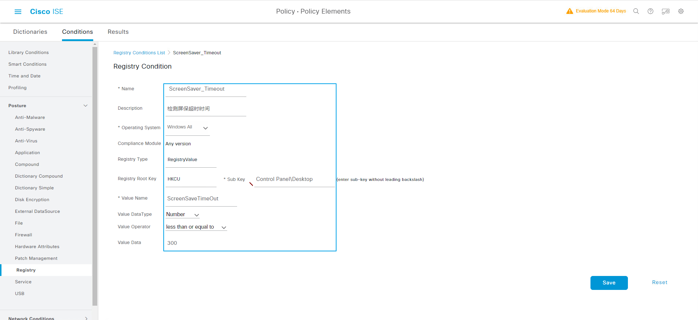


> ### 6.添加Compound Condition
> ###  [三] --- Policy --- Policy Elements --- Conditions
>> ### Posture --- Compound --- Add
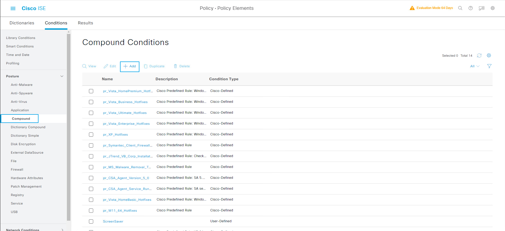


> ### 7.添加“ScreenSaver”Compound Condition
>> ### Name: ScreenSaver
>> ### Operating System: Windows All
>> ### Select a condition to insert below: ScreenSaver_On & ScreenSaver_Secure & ScreenSaver_SCR & ScreenSaver_Timeout
>> ### Submit
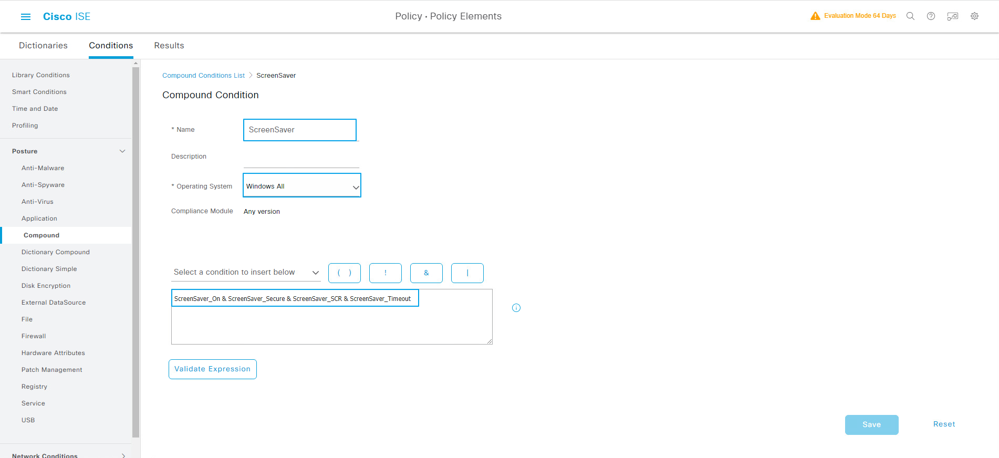

> ### 8.添加Requirements
> ###  [三] --- Policy --- Policy Elements --- Results
> ### Posture --- Requirements --- Insert new Requirement
>> ### Name: QYT-Screen-On
>> ### Operating System: Windows All
>> ### Compliance Module: Any version
>> ### Posture Type: Temporal Agent
>> ### Conditions: ScreenSaver
>> ### Remediations Actions: Action ---  Message Text Only
>> ### Remediations Actions: Message Shown to Agent User --- [Please turn on the screen saver]
>> ### Save
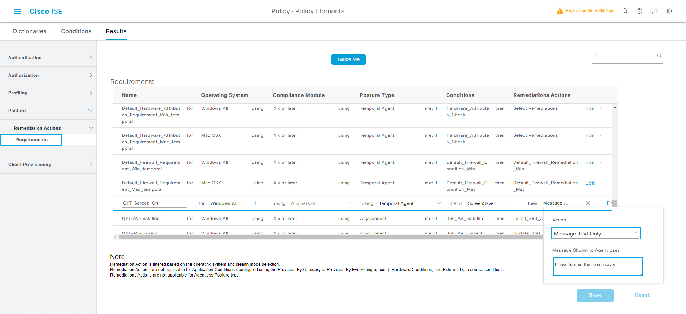
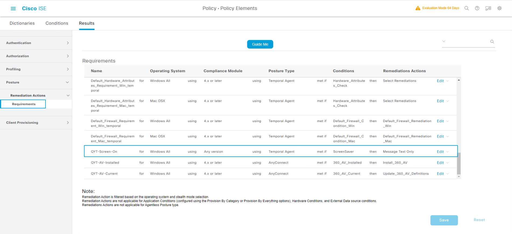


> ### 9.配置Posture Policy
> ###  [三] --- Policy --- Posture
>> ### Rule Name: QYT_Guest_Screen_On
>> ### Identity Groups: GuestType_guest-8hour
>> ### Operating Systems: Windows All
>> ### Compliance Module: Any version
>> ### Posture Type: Temporal Agent
>> ### Requirements: QYT-Screen-On
>> ### Save
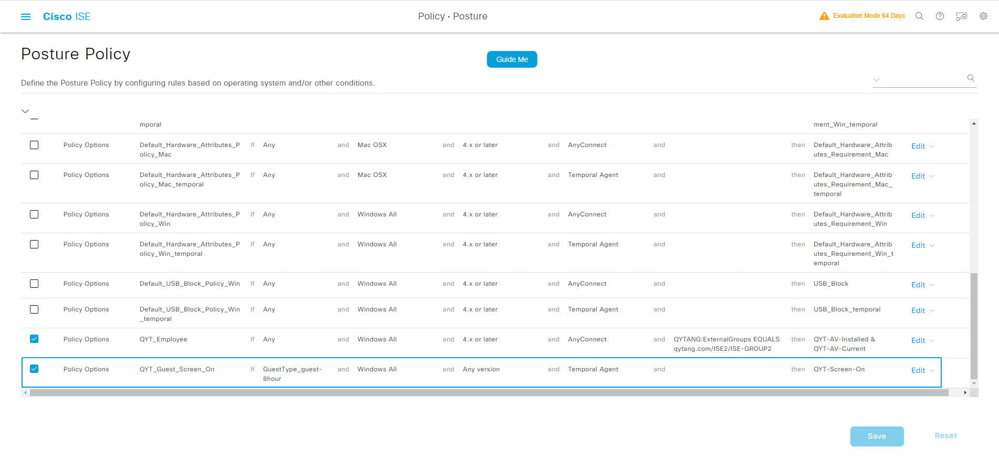


## Site2-WIN10计算机测试注册表检查策略
> ### 1.Site2-SW3650上清除认证Session
```shell
Site2-SW#clear authentication sessions 
```
> ### 2.Site2-WIN10计算机MAB认证
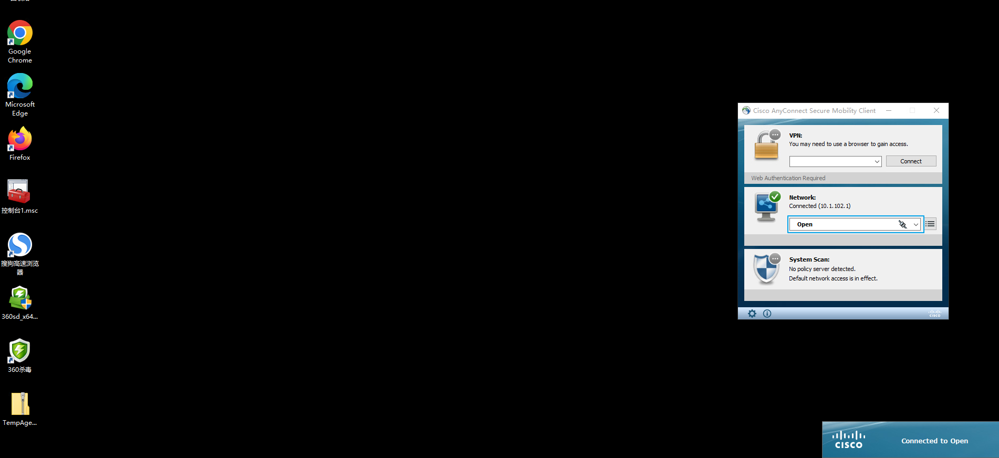

> ### 3.查看Site2-SW3650接口认证状态
```shell
Site2-SW#show authentication sessions int g1/0/6 details 

            Interface:  GigabitEthernet1/0/6
               IIF-ID:  0x1CDEC698
          MAC Address:  0050.56a1.bcc5
         IPv6 Address:  fe00::
         IPv4 Address:  10.1.102.1
            User-Name:  00-50-56-A1-BC-C5
               Status:  Authorized
               Domain:  DATA
       Oper host mode:  multi-auth
     Oper control dir:  both
      Session timeout:  N/A
    Common Session ID:  0A0114FE000000CE0664D22D
      Acct Session ID:  0x000000b8
               Handle:  0x67000080
       Current Policy:  POLICY_Gi1/0/6
          

Server Policies:
     URL Redirect ACL: WEB-REDIRECT
         URL Redirect: https://PSN-2.qytang.com:8443/portal/gateway?sessionId=0A0114FE000000CE0664D22D&portal=d06bc251-f644-4fc3-b09f-dae9bd8a86d5&action=cwa&token=4a46c5c0563c91af125da73d6e849960
              ACS ACL: xACSACLx-IP-Wired_POSTURE_REMEDIATION-63ba9863


Method status list:
       Method           State
          mab           Authc Success
```

> ### 4.Site2-WIN10计算机测试注册表检查策略
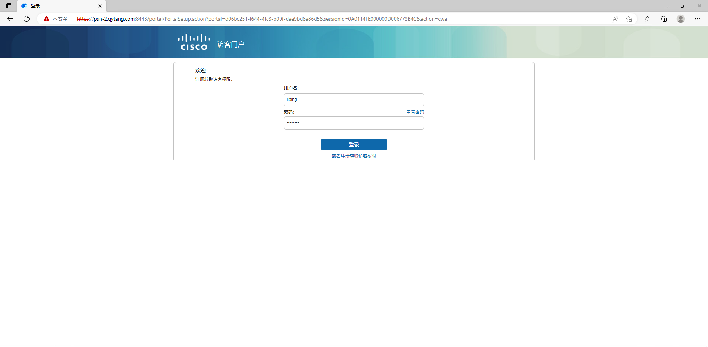
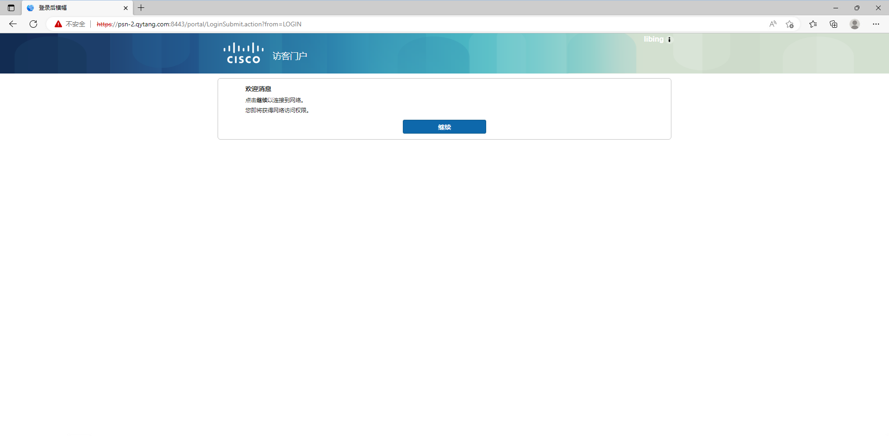
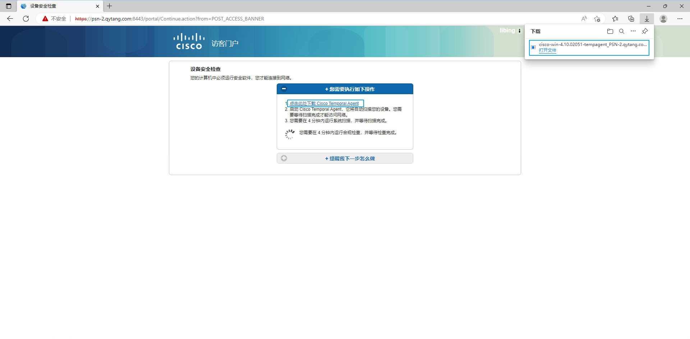
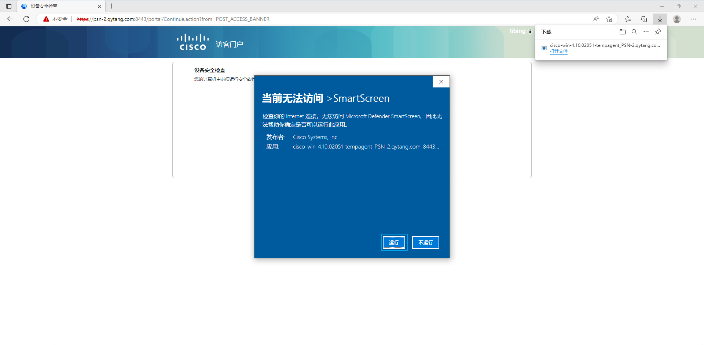
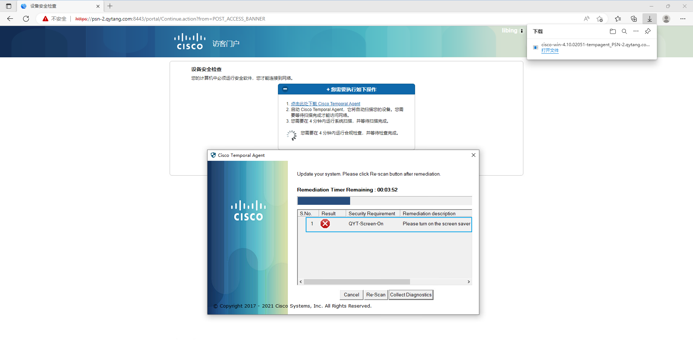
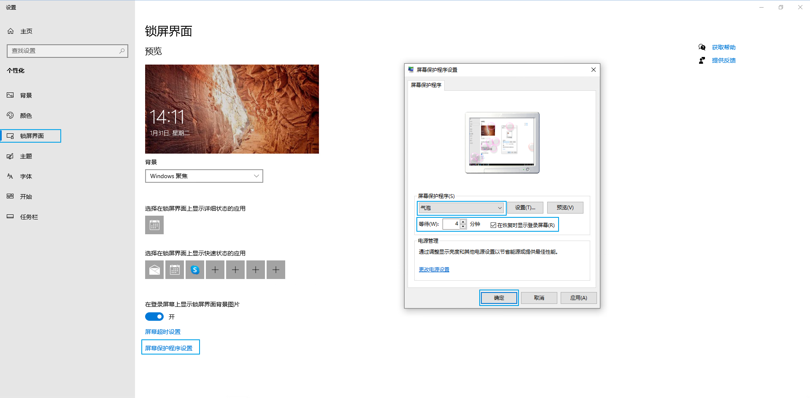
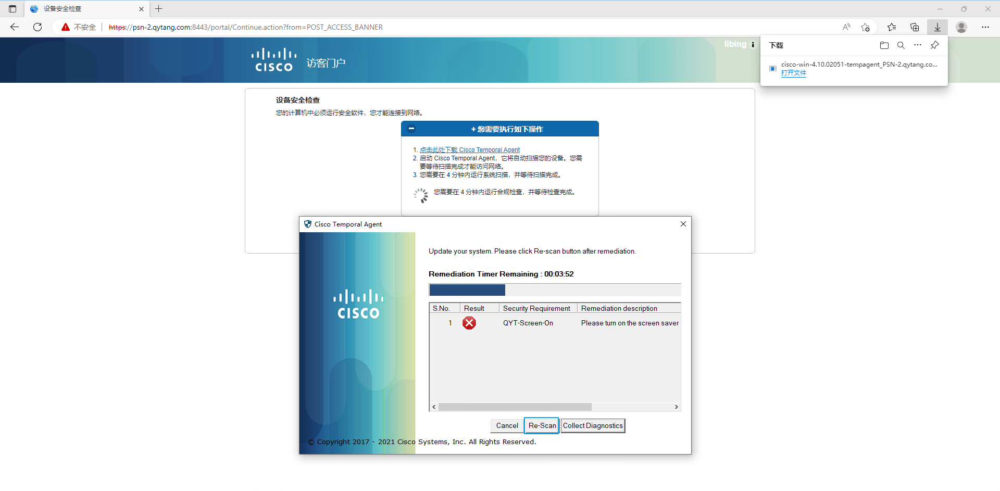

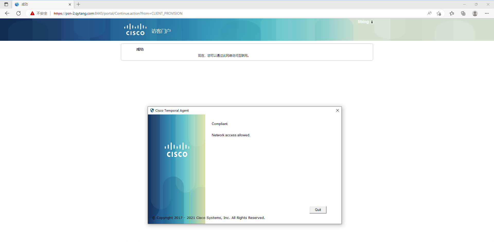

> ### 5.Site-WIN10计算机测试授权
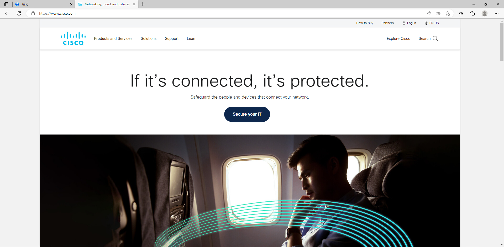
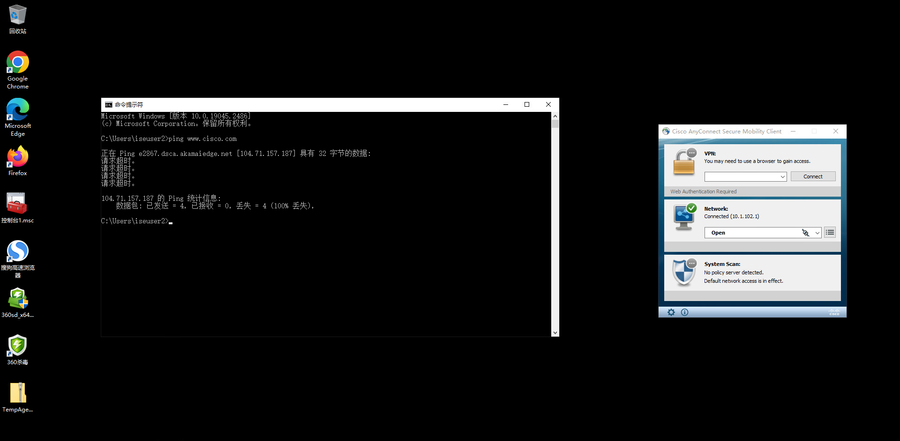

> ### 6.查看ISE Radius Logs


```shell
Site2-SW#show authentication sessions int g1/0/6 details 

            Interface:  GigabitEthernet1/0/6
               IIF-ID:  0x1CDEC698
          MAC Address:  0050.56a1.bcc5
         IPv6 Address:  Unknown
         IPv4 Address:  10.1.102.1
            User-Name:  libing
               Status:  Authorized
               Domain:  DATA
       Oper host mode:  multi-auth
     Oper control dir:  both
      Session timeout:  N/A
    Common Session ID:  0A0114FE000000CE0664D22D
      Acct Session ID:  0x000000ba
               Handle:  0x67000080
       Current Policy:  POLICY_Gi1/0/6
          

Server Policies:
              ACS ACL: xACSACLx-IP-Guest-can-not-ping-63cfa560


Method status list:
       Method           State
          mab           Authc Success
```