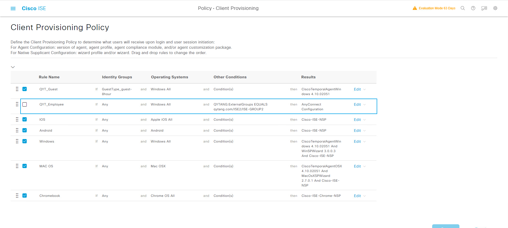
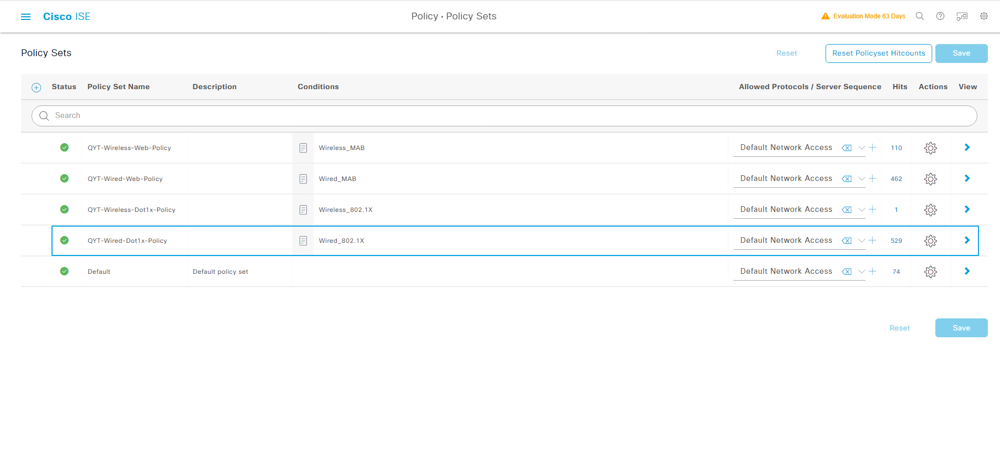
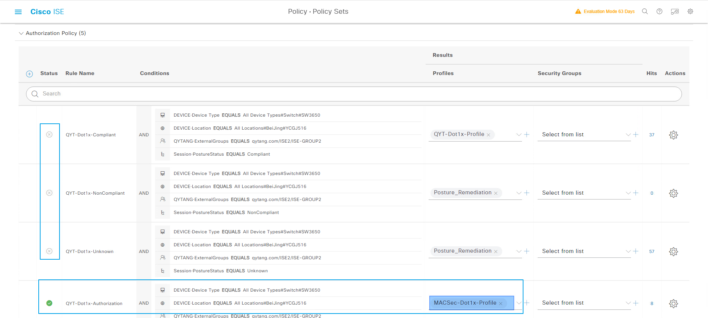
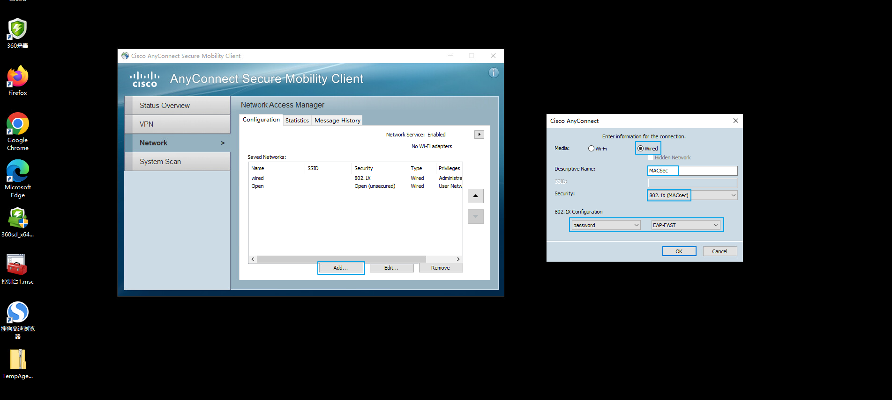
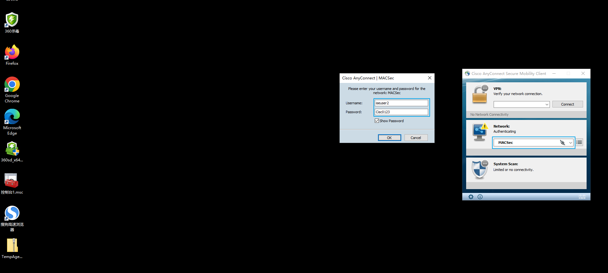
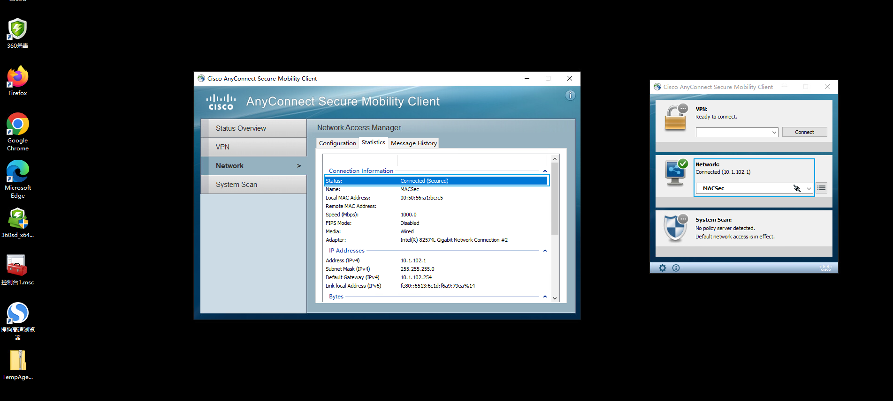
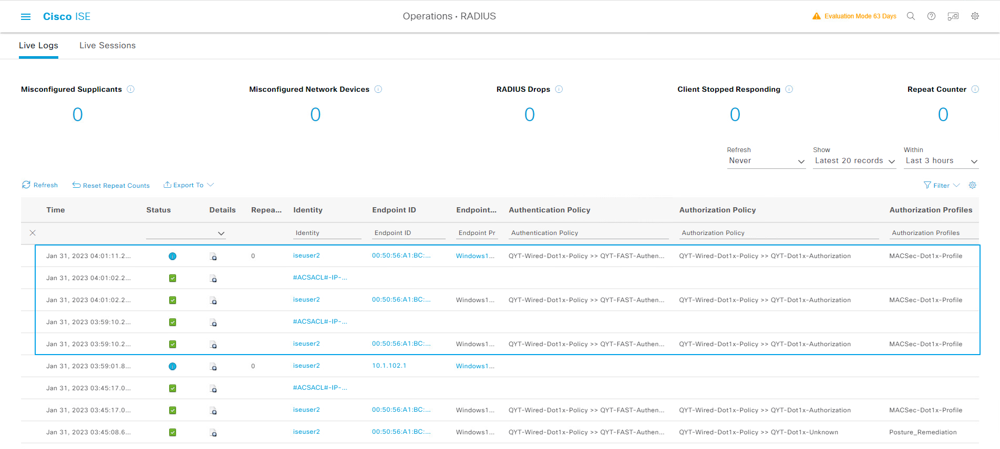
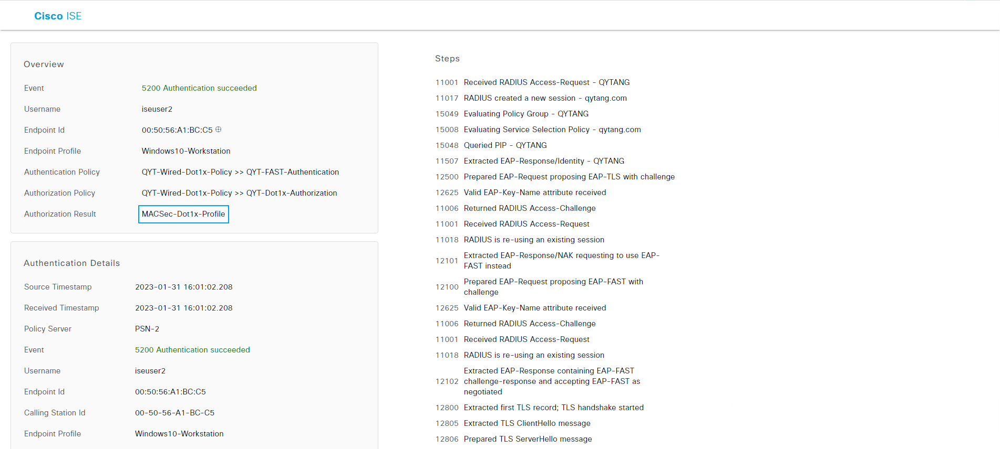

## MACSec配置实例
> ### 注意MACSec只能使用Single-Host，不能启用MAB

> ### 1.Site2-SW3650交换机接口配置
```shell
interface GigabitEthernet1/0/6
 switchport access vlan 102
 switchport mode access
 device-tracking
 macsec
 authentication port-control auto
 authentication violation protect
 dot1x pae authenticator
 spanning-tree portfast
```

> ### 2.创建Authorization Profile
> ###  [三] --- Policy --- Policy Elements --- Results
>> ### Authorization --- Authorization Profiles --- Add
>>> ### *Name: MACSec-Dot1x-Profile
>>> ### Common Tasks
>>>> ### [勾选] DACL Name: PERMIT_ALL_IPv4_TRAFFIC
>>>> ### [勾选] VLAN  Tag ID: 1 --- ID/Name: 102
>>>> ### [勾选] MACSec Policy: should-secure
>>> ### Submit


> ### 3.禁用"QYT_Employee" Client Provisioning Policy
> ###  [三] --- Policy --- Client Provisioning
>> ### Rule Name: QYT_Employee --- Disable


> ### 4.修改授权策略
> ###  [三] --- Policy --- Policy Sets
> ### QYT-Wired-Dot1x-Policy --- > view
>> ### Authorization Policy 
>>> ### Rule Name: QYT-Dot1x-Compliant --- Disabled
>>> ### Rule Name: QYT-Dot1x-NonCompliant --- Disabled
>>> ### Rule Name: QYT-Dot1x-Unknown --- Disabled
>>> ### Rule Name: QYT-Dot1x-Authorization --- Results Profiles: MACSec-Dot1x-Profile
>>> ### Save




> ### 5.Site2-WIN10计算机创建MACSec策略





> ### 6.Site2-SW3650交换机接口状态
```shell
Site2-SW#show authentication sessions int g1/0/6 details 
            Interface:  GigabitEthernet1/0/6
               IIF-ID:  0x15B64CB7
          MAC Address:  0050.56a1.bcc5
         IPv6 Address:  fe80::6513:6c1d:f6a9:79ea
                        fe00::
         IPv4 Address:  10.1.102.1
            User-Name:  iseuser2
               Status:  Authorized
               Domain:  DATA
       Oper host mode:  single-host
     Oper control dir:  both
      Session timeout:  N/A
    Common Session ID:  0A0114FE000000E106D0D38F
      Acct Session ID:  0x000000ca
               Handle:  0x78000093
       Current Policy:  POLICY_Gi1/0/6


Server Policies:
           Vlan Group:  Vlan: 102
      Security Policy:  Should Secure
      Security Status:  Link Secured
              ACS ACL: xACSACLx-IP-PERMIT_ALL_IPV4_TRAFFIC-57f6b0d3
          

Method status list:
       Method           State
        dot1x           Authc Success
```

> ### 7.Site2-SW3650交换机查看MACSec状态
```shell
Site2-SW#show macsec summary 
Interface                     Transmit SC         Receive SC
GigabitEthernet1/0/6               1                   1   

Site2-SW#show macsec interface g1/0/6 
 MACsec is enabled
  Replay protect : enabled
  Replay window : 0
  Include SCI : yes
  Use ES Enable : no
  Use SCB Enable : no
  Admin Pt2Pt MAC : forceTrue(1)
  Pt2Pt MAC Operational : no
  Cipher : GCM-AES-128
  Confidentiality Offset : 0
~~~省略后续大量信息~~~~
```

> ### 8.查看ISE Radius Logs



> ### 9.测试总结
```shell
SW MACSEC ------PC NoMACSEC ----- ISE no config ----------dot1x OK (nomacsec)
SW MACSEC ------PC MACSEC --------ISE no config ----------dot1x OK | macsec failed
SW MACSEC ------PC MACSEC --------ISE should secure ------dot1x OK | macsec OK
```
