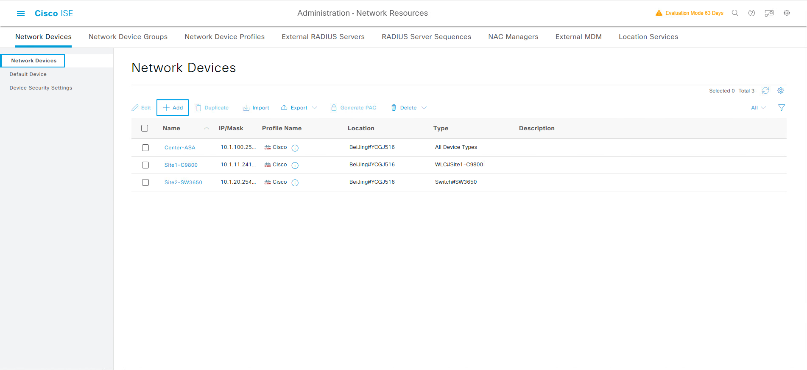
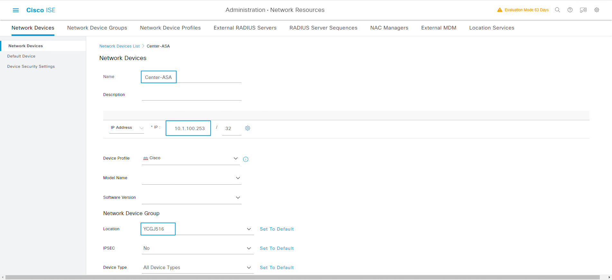
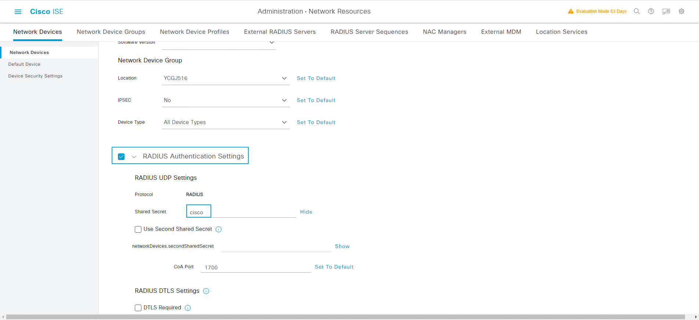
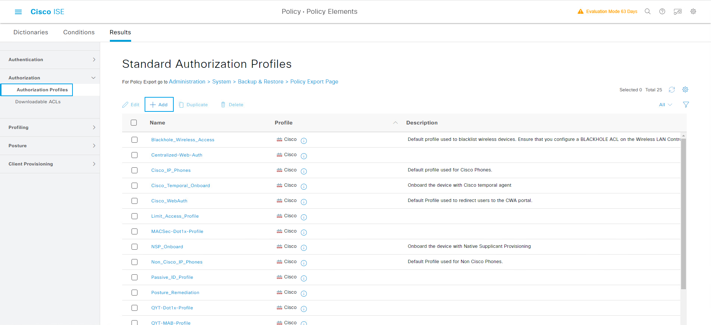
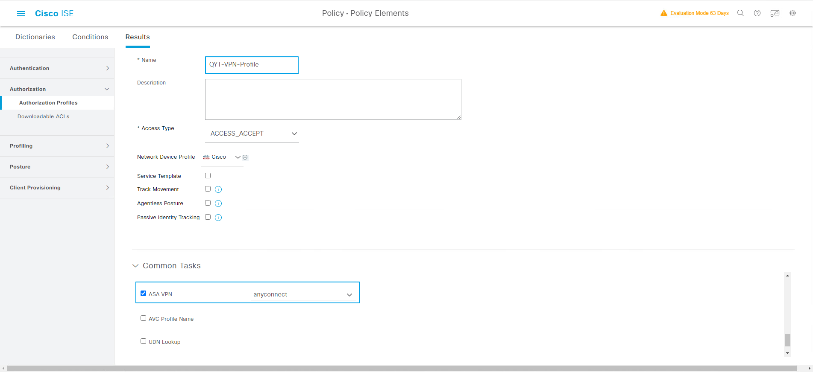
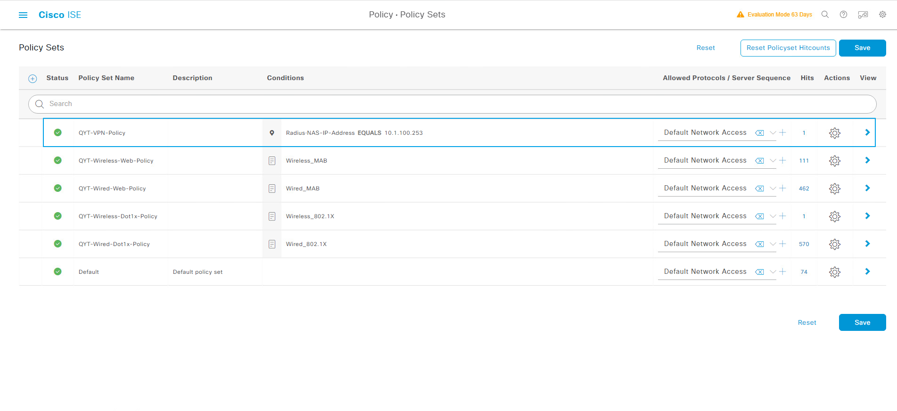
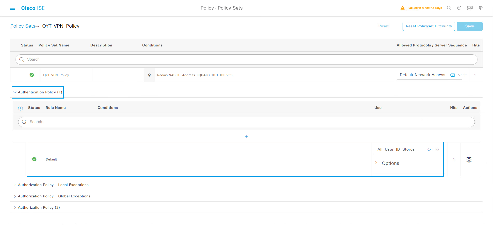
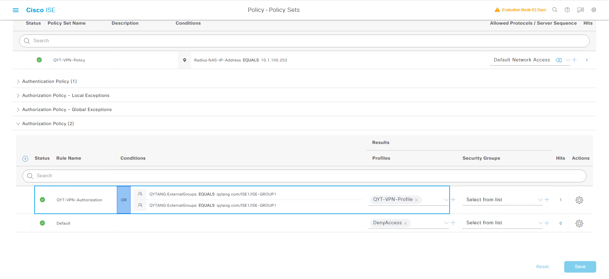
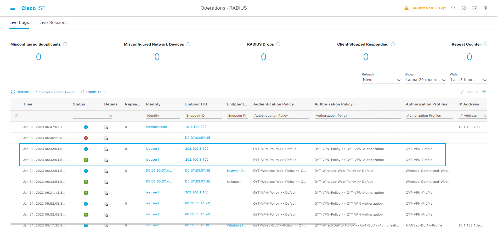
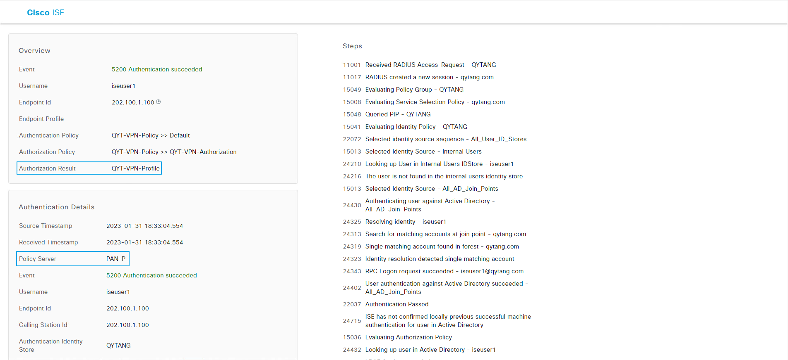

## 查看ASA接口和nameif
```shell
ASA# show interface ip brief
Interface                  IP-Address      OK? Method Status                Protocol
GigabitEthernet0/0         202.100.1.10    YES CONFIG up                    up
GigabitEthernet0/1         10.1.100.253    YES CONFIG up                    up
GigabitEthernet0/2         unassigned      YES unset  administratively down down
GigabitEthernet0/3         unassigned      YES unset  administratively down down
GigabitEthernet0/4         unassigned      YES unset  administratively down down
GigabitEthernet0/5         unassigned      YES unset  administratively down down
GigabitEthernet0/6         unassigned      YES unset  administratively down down
GigabitEthernet0/7         unassigned      YES unset  administratively down down
GigabitEthernet0/8         unassigned      YES unset  administratively down down
Management0/0              unassigned      YES unset  administratively down up

ASA# show nameif
Interface                Name                     Security
GigabitEthernet0/0       Outside                    0
GigabitEthernet0/1       Inside                   100
```


## BGP路由配置
> ### 1.Center-SW的BGP路由配置
```shell
router bgp 100
 neighbor 10.1.100.253 remote-as 100
```

> ### 2.Center-ASA的BGP路由配置
```shell
router bgp 100
 bgp log-neighbor-changes
 address-family ipv4 unicast
  neighbor 10.1.100.254 remote-as 100
  neighbor 10.1.100.254 activate
  network 172.16.1.0 mask 255.255.255.0
  no auto-summary
  no synchronization
 exit-address-family
```

> ### 3.查看Center-ASA路由表
```shell
ASA# show route

Codes: L - local, C - connected, S - static, R - RIP, M - mobile, B - BGP
       D - EIGRP, EX - EIGRP external, O - OSPF, IA - OSPF inter area
       N1 - OSPF NSSA external type 1, N2 - OSPF NSSA external type 2
       E1 - OSPF external type 1, E2 - OSPF external type 2
       i - IS-IS, su - IS-IS summary, L1 - IS-IS level-1, L2 - IS-IS level-2
       ia - IS-IS inter area, * - candidate default, U - per-user static route
       o - ODR, P - periodic downloaded static route, + - replicated route

Gateway of last resort is 202.100.1.254 to network 0.0.0.0

S*    0.0.0.0 0.0.0.0 [1/0] via 202.100.1.254, Outside
S        10.1.0.0 255.255.0.0 [1/0] via 10.1.100.254, Inside
B        10.1.10.0 255.255.255.0 [200/0] via 192.168.1.2, 16:55:12
B        10.1.11.0 255.255.255.0 [200/0] via 192.168.1.2, 16:55:12
B        10.1.12.0 255.255.255.0 [200/0] via 192.168.1.2, 16:55:12
B        10.1.20.0 255.255.255.0 [200/0] via 192.168.2.2, 16:55:12
C        10.1.100.0 255.255.255.0 is directly connected, Inside
L        10.1.100.253 255.255.255.255 is directly connected, Inside
B        10.1.101.0 255.255.255.0 [200/0] via 192.168.1.2, 16:55:12
B        10.1.102.0 255.255.255.0 [200/0] via 192.168.2.2, 16:55:12
B     192.168.1.0 255.255.255.0 [200/0] via 10.1.100.254, 16:55:12
B     192.168.2.0 255.255.255.0 [200/0] via 10.1.100.254, 16:55:12
C        202.100.1.0 255.255.255.0 is directly connected, Outside
L        202.100.1.10 255.255.255.255 is directly connected, Outside
```


## ASA SSLVPN配置
```shell
webvpn
 enable Outside
 anyconnect image disk0:/anyconnect-win-4.5.05030-webdeploy-k9.pkg 1
 anyconnect enable
!
ip local pool sslpool 172.16.1.100-172.16.1.200
!
access-list split standard permit 10.1.100.0 255.255.255.0
access-list split standard permit 10.1.101.0 255.255.255.0
access-list split standard permit 10.1.102.0 255.255.255.0
!
group-policy anyconnect internal
group-policy anyconnect attributes
 vpn-tunnel-protocol ssl-client ssl-clientless
 split-tunnel-policy tunnelspecified
 split-tunnel-network-list value split
 address-pools value sslpool
!
aaa-server ISE protocol radius
aaa-server ISE (Inside) host 10.1.100.241
 key cisco
!
tunnel-group DefaultWEBVPNGroup general-attributes
 authentication-server-group ISE
```


## ISE配置
> ### 1.配置Network Device
> ###  [三] --- Administration --- Network Resources --- Network Devices
> ### Network Devices --- Add
>> ### Name: Center-ASA
>> ### IP: 10.1.100.253
>> ### Network Device Group --- Location: YCGJ516
>> ### [勾选] RADIUS Authentication Settings --- Shared Secret: cisco
>> ### Submit




> ### 2.ASA测试AAA
```shell
ASA# test aaa authentication ISE
Server IP Address or name: 10.1.100.241
Username: iseuser1
Password: Cisc0123
INFO: Attempting Authentication test to IP address <10.1.100.241> (timeout: 12 seconds)
INFO: Authentication Successful

```
> ### 3.配置Authorization Profile
> ###  [三] --- Policy --- Policy Elements --- Results
>> ### Authorization --- Authorization Profiles --- Add
>>> ### *Name: QYT-VPN-Profile
>>> ### Common Tasks
>>>> ### [勾选] ASA VPN: anyconnect
>>> ### Submit




> ### 4.配置Policy Sets
> ###  [三] --- Policy --- Policy Sets --- +
>> ### Policy Set Name: QYT-VPN-Policy
>> ### Conditions: Radius-NAS-IP-Address EQUALS 10.1.100.253
>> ### Allowed Protocols: Default Network Access
>> ### Save



> ### 5.配置Authentication Policy[保持默认]



> ### 6.配置Authorization Policy
> ###  [三] --- Policy --- Policy Sets --- QYT-VPN-Policy --- > View
> ### Authorization Policy(1) --- +
>> ### Rule: QYT-VPN-Authorization
>> ### Conditions: QYTANG-ExternalGroups EQUALS qytang.com/ISE1/ISE-GROUP1
>> ### OR
>> ### Conditions: QYTANG-ExternalGroups EQUALS qytang.com/ISE2/ISE-GROUP2
>> ### Results Profiles: QYT-VPN-Profile
>> ### Save



## SSLVPN_PC测试Anyconnect VPN拨号


## 查看ISE Radius Logs

