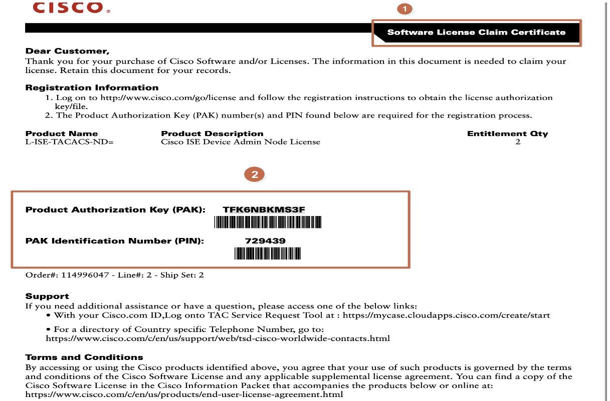
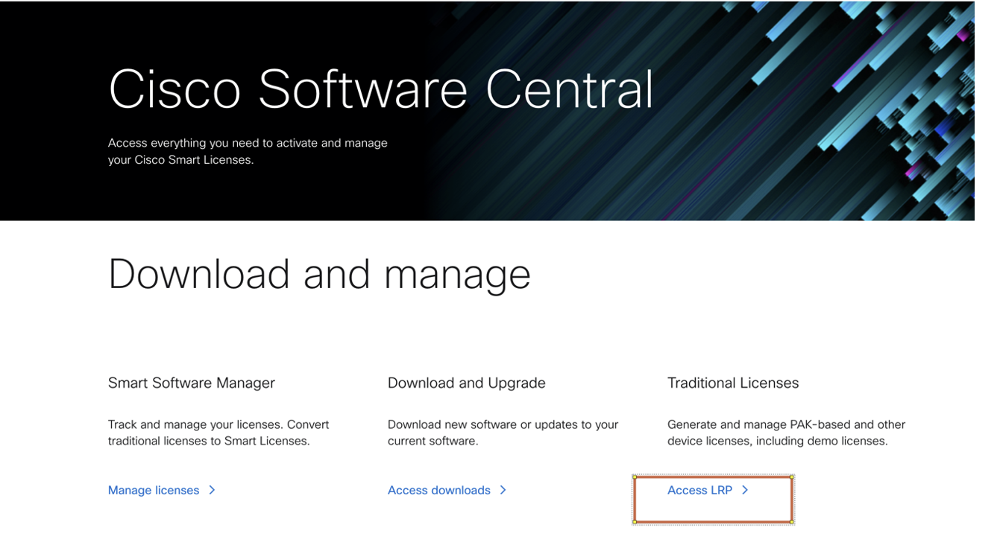
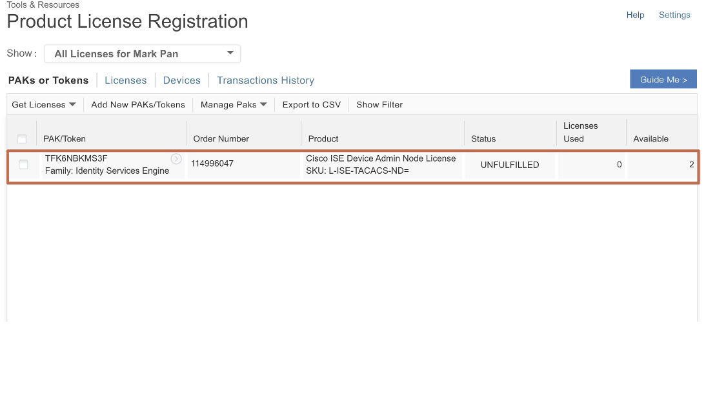
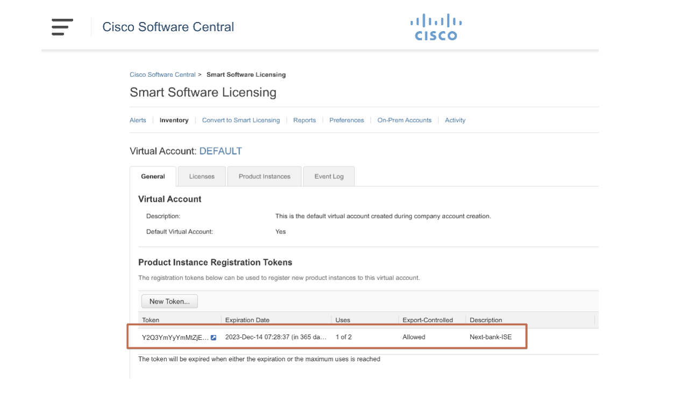

# 參考Cisco License 文件

# 點選傳統License

# Add New PAKs

# Add New PAKs

# Add  PAKs Number

# 加入完成

# 點選Smart License

# 點選Inventory 查看License

# 點選Inventory 查看License

# 轉換Smart License(1)
%20%20.png)

# 轉換Smart License(2)
.png)

# 轉換Smart License(3)
.png)

# 查看Smart License 狀態

# 查看Smart License 狀態

# 產生token

# 產生token(2)
%20%20.png)

# 授權成功同步產生Token

# ISE 同步Smart License

# ISE 同步Smart License

# ISE License 與Smart Account 同步成功

# ISE License 與Smart Account 同步成功
